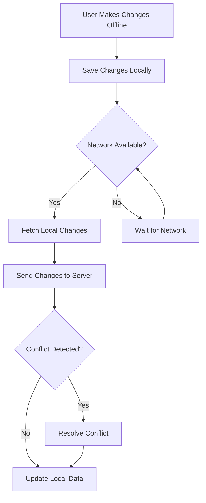

## 14.8 Offline Data Synchronization

In today's mobile-first world, users expect seamless experiences regardless of network connectivity. Offline data synchronization is a critical component in achieving this, ensuring that applications remain functional and data remains consistent across devices. In this section, we will delve into the challenges, strategies, and design considerations for implementing offline data synchronization in Swift.

### Challenges in Offline Data Synchronization

Offline data synchronization presents several challenges that developers must address to ensure a smooth user experience:

#### Conflict Resolution

When users make changes to data while offline, conflicts can arise when syncing with the server. These conflicts occur when the same data is modified in different ways on the server and the client. Effective conflict resolution strategies are essential to maintain data integrity.

#### Data Consistency

Ensuring data consistency across devices is crucial. This involves making sure that all devices have the latest data once they reconnect to the network. Inconsistent data can lead to a poor user experience and potential data loss.

### Strategies for Offline Data Synchronization

To tackle these challenges, developers can employ various strategies:

#### Local Data Stores

Using local data stores such as Core Data or SQLite allows applications to store data offline. This ensures that users can continue to interact with the app even when there is no network connectivity.

- **Core Data**: A powerful framework for managing the model layer in iOS applications. It provides an object graph and persistence framework that can be used to manage data locally.
- **SQLite**: A lightweight, disk-based database that doesn’t require a separate server process. It is useful for applications that need a simple, efficient way to store data locally.

#### Sync Mechanisms

Implementing sync mechanisms that trigger when the network becomes available is crucial. These mechanisms ensure that any changes made offline are synchronized with the server, maintaining data consistency.

- **Background Fetch**: Use this iOS feature to periodically fetch updates from the server and sync data.
- **Push Notifications**: Trigger a sync process when a push notification is received, indicating that new data is available.

### Design Considerations

When designing offline data synchronization, consider the following:

#### User Feedback

Providing user feedback on the sync status is important for transparency. Users should be informed when data is being synced, and notified of any issues that arise.

#### Error Handling

Robust error handling is essential to manage sync failures. Implement retry mechanisms and provide users with options to resolve conflicts manually if necessary.

### Implementing Offline Data Synchronization in Swift

Let's explore how to implement offline data synchronization in Swift using Core Data and a simple sync mechanism.

#### Setting Up Core Data

First, set up Core Data to manage local data storage:

```swift
import CoreData

class PersistenceController {
    static let shared = PersistenceController()

    let container: NSPersistentContainer

    init() {
        container = NSPersistentContainer(name: "MyAppModel")
        container.loadPersistentStores { (description, error) in
            if let error = error {
                fatalError("Failed to load Core Data stack: \\(error)")
            }
        }
    }
}
```

#### Saving Data Locally

Use Core Data to save data locally when offline:

```swift
func saveDataLocally(data: MyDataModel) {
    let context = PersistenceController.shared.container.viewContext
    let newData = MyDataEntity(context: context)
    newData.attribute = data.attribute

    do {
        try context.save()
    } catch {
        print("Failed to save data: \\(error)")
    }
}
```

#### Syncing Data with the Server

Implement a simple sync mechanism that triggers when the network becomes available:

```swift
func syncData() {
    guard let url = URL(string: "https://api.example.com/sync") else { return }
    var request = URLRequest(url: url)
    request.httpMethod = "POST"

    // Fetch local data to sync
    let context = PersistenceController.shared.container.viewContext
    let fetchRequest: NSFetchRequest<MyDataEntity> = MyDataEntity.fetchRequest()

    do {
        let localData = try context.fetch(fetchRequest)
        // Convert local data to JSON
        let jsonData = try JSONEncoder().encode(localData)

        // Set request body
        request.httpBody = jsonData

        // Perform network request
        URLSession.shared.dataTask(with: request) { data, response, error in
            if let error = error {
                print("Sync failed: \\(error)")
                return
            }

            // Handle server response
            if let data = data {
                // Update local data based on server response
                // Handle conflict resolution if needed
            }
        }.resume()
    } catch {
        print("Failed to fetch local data: \\(error)")
    }
}
```

### Conflict Resolution Strategies

Effective conflict resolution is key to maintaining data integrity. Consider the following strategies:

- **Last Write Wins**: The most recent change overwrites previous changes. This is simple but may lead to data loss.
- **Merge Changes**: Combine changes from both the client and server. This requires a more complex implementation but preserves more data.
- **User Intervention**: Allow users to manually resolve conflicts. Provide a user interface to review and choose which changes to keep.

### Visualizing Offline Data Synchronization

Below is a flowchart illustrating the offline data synchronization process:



### Swift Unique Features

Swift's features can enhance offline data synchronization:

- **Combine Framework**: Use Combine to handle asynchronous data streams, making it easier to manage sync operations.
- **Swift Concurrency**: Utilize async/await to simplify asynchronous code, improving readability and maintainability.

### Differences and Similarities

Offline data synchronization shares similarities with other data persistence patterns, such as caching. However, it focuses more on ensuring data consistency across devices and handling conflicts.

### Try It Yourself

Experiment with the provided code examples by modifying the data model or implementing a different sync mechanism. Try using the Combine framework to manage asynchronous operations.

### Knowledge Check

- Explain the challenges of offline data synchronization.
- Describe how Core Data can be used for offline data storage.
- Discuss different conflict resolution strategies.

### References and Links

- [Apple Developer Documentation on Core Data](https://developer.apple.com/documentation/coredata)
- [Swift.org - Swift Concurrency](https://swift.org/blog/swift-concurrency/)
- [Combine Framework Documentation](https://developer.apple.com/documentation/combine)

### Embrace the Journey

Remember, mastering offline data synchronization is just the beginning. As you progress, you'll build more robust applications that provide seamless user experiences. Keep experimenting, stay curious, and enjoy the journey!

## Quiz Time!



### What is a primary challenge in offline data synchronization?

- [x] Conflict Resolution
- [ ] Data Redundancy
- [ ] User Interface Design
- [ ] Code Optimization

> **Explanation:** Conflict resolution is a primary challenge because it involves handling data changes made offline that may conflict with server data.

### Which framework is commonly used for local data storage in offline data synchronization?

- [x] Core Data
- [ ] UIKit
- [ ] SwiftUI
- [ ] Combine

> **Explanation:** Core Data is commonly used for managing local data storage in iOS applications.

### What is a simple strategy for conflict resolution?

- [x] Last Write Wins
- [ ] First Write Wins
- [ ] User Interface Redesign
- [ ] Data Duplication

> **Explanation:** Last Write Wins is a simple conflict resolution strategy where the most recent change overwrites previous changes.

### What is the role of user feedback in offline data synchronization?

- [x] Indicating sync status
- [ ] Enhancing graphics
- [ ] Improving code efficiency
- [ ] Reducing data size

> **Explanation:** User feedback is important for indicating the sync status and informing users of any issues.

### What mechanism can be used to trigger data sync when the network becomes available?

- [x] Background Fetch
- [ ] Core Animation
- [ ] SwiftUI Views
- [ ] UIKit Components

> **Explanation:** Background Fetch is an iOS feature that can be used to trigger data sync when the network becomes available.

### Which Swift feature can be used to handle asynchronous data streams?

- [x] Combine Framework
- [ ] UIKit
- [ ] Core Graphics
- [ ] AVFoundation

> **Explanation:** The Combine framework is used to handle asynchronous data streams in Swift.

### What is a benefit of using Swift's async/await in offline data synchronization?

- [x] Simplifies asynchronous code
- [ ] Enhances UI design
- [ ] Increases data storage
- [ ] Reduces app size

> **Explanation:** Swift's async/await simplifies asynchronous code, improving readability and maintainability.

### Which local data store is lightweight and disk-based?

- [x] SQLite
- [ ] Core Data
- [ ] Realm
- [ ] Firebase

> **Explanation:** SQLite is a lightweight, disk-based database that doesn’t require a separate server process.

### What is a key consideration when designing offline data synchronization?

- [x] Error Handling
- [ ] Graphics Quality
- [ ] Animation Speed
- [ ] Code Length

> **Explanation:** Error handling is crucial to manage sync failures and ensure a smooth user experience.

### True or False: Offline data synchronization is only necessary for mobile applications.

- [ ] True
- [x] False

> **Explanation:** Offline data synchronization is important for any application that needs to function without constant network connectivity, including web and desktop applications.




