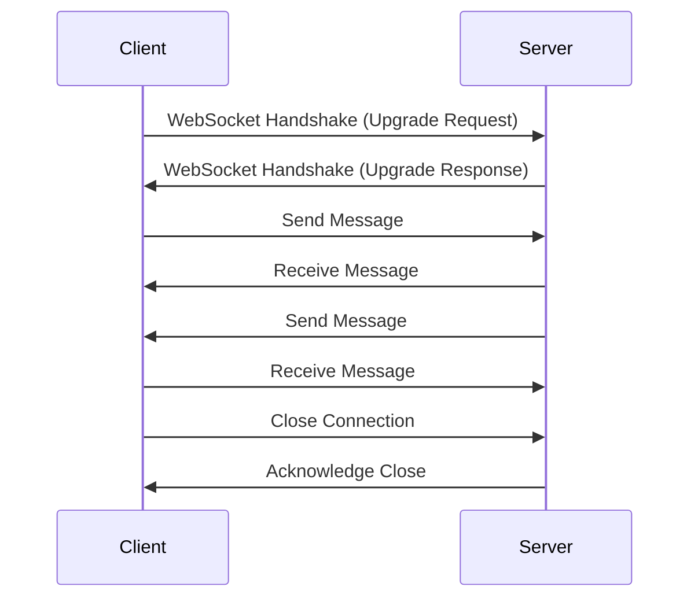

## 14.9 WebSocket Communication

In the realm of modern application development, real-time data exchange has become a cornerstone for creating dynamic and interactive user experiences. WebSocket communication is a powerful protocol that enables persistent, bidirectional communication channels between clients and servers. Unlike traditional HTTP communication, which follows a request-response model, WebSockets allow for continuous data exchange, making them ideal for applications requiring real-time updates, such as chat apps, live notifications, and collaborative platforms.

In this section, we'll delve into the intricacies of WebSocket communication in Swift, focusing on establishing connections using Apple's `URLSessionWebSocketTask`, exploring third-party libraries for extended functionality, and examining practical use cases for real-time data exchange.

### Establishing Connections

#### URLSessionWebSocketTask

Swift provides a robust API for WebSocket communication through the `URLSessionWebSocketTask` class, which is part of the `URLSession` framework. This class allows developers to create and manage WebSocket connections seamlessly. Let's explore how to establish a WebSocket connection using `URLSessionWebSocketTask`.

```swift
import Foundation

// Define the WebSocket URL
let url = URL(string: "wss://example.com/socket")!

// Create a URLSession with default configuration
let session = URLSession(configuration: .default)

// Create a WebSocket task
let webSocketTask = session.webSocketTask(with: url)

// Establish the connection
webSocketTask.resume()

// Function to send a message
func sendMessage(_ message: String) {
    let message = URLSessionWebSocketTask.Message.string(message)
    webSocketTask.send(message) { error in
        if let error = error {
            print("Error sending message: \\(error)")
        } else {
            print("Message sent successfully")
        }
    }
}

// Function to receive messages
func receiveMessage() {
    webSocketTask.receive { result in
        switch result {
        case .failure(let error):
            print("Error receiving message: \\(error)")
        case .success(let message):
            switch message {
            case .string(let text):
                print("Received text message: \\(text)")
            case .data(let data):
                print("Received binary message: \\(data)")
            @unknown default:
                fatalError()
            }
        }
    }
}

// Start receiving messages
receiveMessage()
```

In this example, we establish a WebSocket connection to a server at `wss://example.com/socket`. We define functions to send and receive messages, demonstrating the bidirectional nature of WebSocket communication.

#### Third-Party Libraries

While `URLSessionWebSocketTask` provides a native solution for WebSocket communication, third-party libraries can offer additional features and simplify the process. Popular libraries like Starscream and Socket.IO provide enhanced functionality, such as automatic reconnection, event handling, and more.

**Starscream Example:**

```swift
import Starscream

class WebSocketManager: WebSocketDelegate {
    var socket: WebSocket!

    init() {
        var request = URLRequest(url: URL(string: "wss://example.com/socket")!)
        request.timeoutInterval = 5
        socket = WebSocket(request: request)
        socket.delegate = self
        socket.connect()
    }

    func websocketDidConnect(socket: WebSocketClient) {
        print("WebSocket is connected")
    }

    func websocketDidDisconnect(socket: WebSocketClient, error: Error?) {
        print("WebSocket is disconnected: \\(error?.localizedDescription ?? "No error")")
    }

    func websocketDidReceiveMessage(socket: WebSocketClient, text: String) {
        print("Received text: \\(text)")
    }

    func websocketDidReceiveData(socket: WebSocketClient, data: Data) {
        print("Received data: \\(data.count) bytes")
    }

    func sendMessage(_ message: String) {
        socket.write(string: message)
    }
}
```

Starscream simplifies WebSocket management by providing a delegate-based approach for handling connection events and message reception. The library also supports SSL pinning, custom headers, and more.

### Real-Time Data

WebSocket communication is particularly effective for real-time data exchange. Let's explore how to handle incoming and outgoing messages effectively.

#### Receiving Messages

Receiving messages over a WebSocket connection involves listening for incoming data and processing it accordingly. With `URLSessionWebSocketTask`, you can continuously listen for messages by recursively calling the receive function.

```swift
func startReceivingMessages() {
    webSocketTask.receive { [weak self] result in
        switch result {
        case .failure(let error):
            print("Error receiving message: \\(error)")
        case .success(let message):
            switch message {
            case .string(let text):
                print("Received text message: \\(text)")
            case .data(let data):
                print("Received binary message: \\(data)")
            @unknown default:
                fatalError()
            }
            // Continue listening for messages
            self?.startReceivingMessages()
        }
    }
}

// Start the message receiving loop
startReceivingMessages()
```

By recursively calling `startReceivingMessages`, we ensure that the WebSocket connection remains open and ready to receive new messages continuously.

#### Sending Messages

Sending messages over a WebSocket connection is straightforward. You can send either text or binary data, depending on your application's requirements.

```swift
func sendTextMessage(_ text: String) {
    let message = URLSessionWebSocketTask.Message.string(text)
    webSocketTask.send(message) { error in
        if let error = error {
            print("Error sending message: \\(error)")
        } else {
            print("Text message sent successfully")
        }
    }
}

func sendBinaryMessage(_ data: Data) {
    let message = URLSessionWebSocketTask.Message.data(data)
    webSocketTask.send(message) { error in
        if let error = error {
            print("Error sending message: \\(error)")
        } else {
            print("Binary message sent successfully")
        }
    }
}
```

These functions demonstrate how to send both text and binary messages over a WebSocket connection, providing flexibility for different data types.

### Use Cases

WebSocket communication is ideal for applications that require real-time data exchange. Let's explore some common use cases.

#### Live Updates

WebSockets are perfect for delivering live updates, such as notifications or collaborative app changes. For example, a chat application can use WebSockets to update messages in real-time, ensuring users see new messages instantly.

#### Streaming Data

For applications that involve streaming data, such as video or audio streams, WebSockets provide a continuous data flow without the overhead of HTTP requests. This makes them suitable for live video feeds, online gaming, and IoT applications.

### Visualizing WebSocket Communication

To better understand the flow of WebSocket communication, let's visualize the process using a sequence diagram.



This sequence diagram illustrates the WebSocket handshake process, message exchange, and connection closure, highlighting the bidirectional nature of WebSocket communication.

### Knowledge Check

- **Question**: What is the primary advantage of using WebSockets over traditional HTTP communication?
- **Answer**: WebSockets allow for persistent, bidirectional communication, enabling real-time data exchange without the overhead of repeated HTTP requests.

- **Question**: How does `URLSessionWebSocketTask` handle incoming messages?
- **Answer**: By using the `receive` method, which can be recursively called to continuously listen for new messages.

### Try It Yourself

Experiment with the provided code examples by modifying the WebSocket URL to connect to different servers. Try sending different types of messages and observe how the server responds. This hands-on approach will deepen your understanding of WebSocket communication.

### References and Links

- [Apple Developer Documentation: URLSessionWebSocketTask](https://developer.apple.com/documentation/foundation/urlsessionwebsockettask)
- [Starscream GitHub Repository](https://github.com/daltoniam/Starscream)
- [MDN Web Docs: WebSockets](https://developer.mozilla.org/en-US/docs/Web/API/WebSockets_API)

### Embrace the Journey

As you explore WebSocket communication in Swift, remember that this is just the beginning. The ability to create real-time, interactive applications opens up a world of possibilities. Keep experimenting, stay curious, and enjoy the journey!

## Quiz Time!



### What is the primary advantage of using WebSockets over traditional HTTP communication?

- [x] Persistent, bidirectional communication
- [ ] Lower latency
- [ ] Easier to implement
- [ ] More secure

> **Explanation:** WebSockets allow for persistent, bidirectional communication, enabling real-time data exchange without the overhead of repeated HTTP requests.

### Which Swift class is used for WebSocket communication?

- [ ] URLSessionDataTask
- [x] URLSessionWebSocketTask
- [ ] URLSessionDownloadTask
- [ ] URLSessionUploadTask

> **Explanation:** `URLSessionWebSocketTask` is the class provided by Swift for managing WebSocket connections.

### What method is used to send a message using URLSessionWebSocketTask?

- [ ] sendData
- [x] send
- [ ] transmit
- [ ] dispatch

> **Explanation:** The `send` method is used to send messages over a WebSocket connection.

### How can you continuously receive messages using URLSessionWebSocketTask?

- [x] By recursively calling the receive method
- [ ] By using a loop
- [ ] By setting a timer
- [ ] By using a delegate

> **Explanation:** Recursively calling the `receive` method allows continuous listening for incoming messages.

### Which third-party library is popular for WebSocket communication in Swift?

- [ ] Alamofire
- [x] Starscream
- [ ] SwiftWebSocket
- [ ] Socket.IO

> **Explanation:** Starscream is a popular third-party library for WebSocket communication in Swift.

### What is the initial step in establishing a WebSocket connection?

- [x] WebSocket handshake
- [ ] Sending a message
- [ ] Opening a socket
- [ ] Authenticating the user

> **Explanation:** The WebSocket handshake is the initial step to establish a connection, involving an upgrade request and response.

### What type of data can be sent over a WebSocket connection?

- [x] Text and binary data
- [ ] Only text data
- [ ] Only binary data
- [ ] Only JSON data

> **Explanation:** WebSockets support sending both text and binary data.

### What is a common use case for WebSocket communication?

- [x] Real-time notifications
- [ ] Batch processing
- [ ] Static content delivery
- [ ] File uploads

> **Explanation:** Real-time notifications are a common use case for WebSocket communication due to its real-time data exchange capabilities.

### How does Starscream handle connection events?

- [x] Using a delegate-based approach
- [ ] Using closures
- [ ] Using notifications
- [ ] Using callbacks

> **Explanation:** Starscream uses a delegate-based approach to handle connection events and message reception.

### True or False: WebSockets can be used for streaming video data.

- [x] True
- [ ] False

> **Explanation:** WebSockets can be used for streaming video data, as they provide a continuous data flow without the overhead of HTTP requests.




