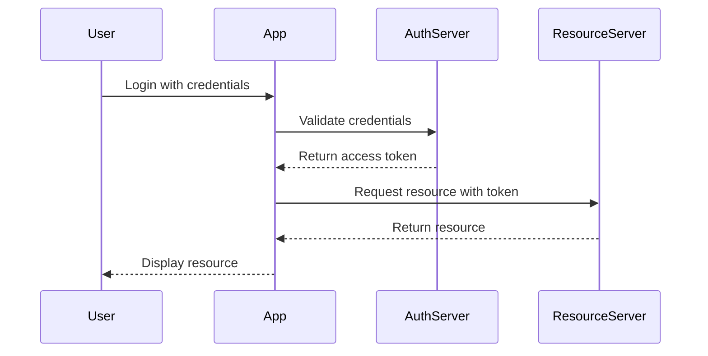

## 15.1 Authentication and Authorization Strategies

In today's digital landscape, ensuring secure access to applications is paramount. Authentication and authorization are two critical components of security that verify user identities and control access to resources. In this section, we'll explore various strategies for implementing authentication and authorization in Swift, focusing on best practices and design patterns that enhance security and usability.

### Authentication Methods

Authentication is the process of verifying the identity of a user or system. Let's delve into some common authentication methods used in Swift development.

#### Password-Based Authentication

Password-based authentication is one of the most straightforward methods, where users provide a username and password to gain access. While simple, it requires careful handling to ensure security.

- **Secure Password Storage**: Store passwords using strong hashing algorithms like bcrypt or Argon2. Avoid storing plain text passwords.
- **Salting**: Add a unique salt to each password before hashing to prevent rainbow table attacks.
- **Rate Limiting**: Implement rate limiting to prevent brute-force attacks.
- **Password Policies**: Enforce strong password policies, such as minimum length and complexity requirements.

**Example: Secure Password Handling in Swift**

```swift
import CryptoKit

func hashPassword(_ password: String, salt: String) -> String {
    let saltedPassword = password + salt
    let hashed = SHA256.hash(data: saltedPassword.data(using: .utf8)!)
    return hashed.compactMap { String(format: "%02x", $0) }.joined()
}

let password = "SecurePassword123!"
let salt = "UniqueSalt"
let hashedPassword = hashPassword(password, salt: salt)
print("Hashed Password: \\(hashedPassword)")
```

#### Multi-Factor Authentication (MFA)

Multi-factor authentication (MFA) adds an additional layer of security by requiring two or more verification factors. This could include something the user knows (password), something they have (a mobile device), or something they are (biometric verification).

- **Time-Based One-Time Passwords (TOTP)**: Generate time-sensitive codes using apps like Google Authenticator.
- **SMS or Email Verification**: Send a verification code to the user's phone or email.
- **Biometrics**: Use Face ID or Touch ID for authentication.

**Example: Implementing TOTP in Swift**

```swift
import Foundation
import CryptoKit

func generateTOTP(secret: String, timeInterval: TimeInterval = 30) -> String {
    let counter = UInt64(Date().timeIntervalSince1970 / timeInterval)
    let counterData = withUnsafeBytes(of: counter.bigEndian, Array.init)
    let key = SymmetricKey(data: Data(secret.utf8))
    let hmac = HMAC<SHA256>.authenticationCode(for: counterData, using: key)
    let truncatedHash = hmac.withUnsafeBytes { ptr -> UInt32 in
        let offset = Int(ptr[ptr.count - 1] & 0x0f)
        let hashPart = ptr.load(fromByteOffset: offset, as: UInt32.self)
        return UInt32(bigEndian: hashPart) & 0x7fffffff
    }
    return String(truncatedHash % 1000000)
}

let secret = "YourSecretKey"
let totp = generateTOTP(secret: secret)
print("TOTP: \\(totp)")
```

### Authorization Techniques

Authorization determines what an authenticated user is allowed to do. It is crucial for enforcing access control and protecting sensitive resources.

#### Role-Based Access Control (RBAC)

RBAC assigns permissions to users based on their roles within an organization. This model simplifies management by grouping permissions under roles.

- **Define Roles**: Identify roles relevant to your application (e.g., Admin, User, Guest).
- **Assign Permissions**: Map specific permissions to each role.
- **Role Assignment**: Assign roles to users based on their responsibilities.

**Example: Implementing RBAC in Swift**

```swift
enum Role {
    case admin, user, guest
}

struct User {
    let username: String
    let role: Role
}

func canAccessResource(user: User, resource: String) -> Bool {
    switch user.role {
    case .admin:
        return true
    case .user:
        return resource != "AdminPanel"
    case .guest:
        return resource == "PublicPage"
    }
}

let user = User(username: "JohnDoe", role: .user)
print("Can access AdminPanel: \\(canAccessResource(user: user, resource: "AdminPanel"))")
```

#### Attribute-Based Access Control (ABAC)

ABAC uses attributes of users, resources, and the environment to determine access. It provides greater flexibility compared to RBAC.

- **Define Attributes**: Identify attributes relevant to your application (e.g., user department, resource sensitivity).
- **Policy Rules**: Create rules that evaluate attributes to grant or deny access.
- **Dynamic Evaluation**: Evaluate access requests dynamically based on current attribute values.

**Example: Implementing ABAC in Swift**

```swift
struct UserAttributes {
    let department: String
    let clearanceLevel: Int
}

struct ResourceAttributes {
    let sensitivityLevel: Int
}

func canAccessResource(userAttributes: UserAttributes, resourceAttributes: ResourceAttributes) -> Bool {
    return userAttributes.clearanceLevel >= resourceAttributes.sensitivityLevel
}

let userAttributes = UserAttributes(department: "Engineering", clearanceLevel: 3)
let resourceAttributes = ResourceAttributes(sensitivityLevel: 2)
print("Can access resource: \\(canAccessResource(userAttributes: userAttributes, resourceAttributes: resourceAttributes))")
```

### Implementing Secure Authentication

Implementing secure authentication involves leveraging secure APIs and ensuring credentials are stored safely.

#### Using Secure APIs

Utilize secure APIs like OAuth2 to handle authentication and authorization. OAuth2 provides a framework for token-based authentication, allowing third-party applications to access user data without exposing credentials.

- **Authorization Code Flow**: Suitable for server-side applications, where the client exchanges an authorization code for an access token.
- **Implicit Flow**: Used for client-side applications, where the access token is obtained directly.
- **Client Credentials Flow**: Used for machine-to-machine communication, where the client authenticates using its credentials.

**Example: OAuth2 Authorization Code Flow**

```swift
import Foundation

func exchangeAuthorizationCodeForToken(code: String, clientId: String, clientSecret: String, redirectUri: String) {
    let url = URL(string: "https://example.com/oauth/token")!
    var request = URLRequest(url: url)
    request.httpMethod = "POST"
    let body = "grant_type=authorization_code&code=\\(code)&redirect_uri=\\(redirectUri)&client_id=\\(clientId)&client_secret=\\(clientSecret)"
    request.httpBody = body.data(using: .utf8)
    request.setValue("application/x-www-form-urlencoded", forHTTPHeaderField: "Content-Type")

    let task = URLSession.shared.dataTask(with: request) { data, response, error in
        guard let data = data else { return }
        if let json = try? JSONSerialization.jsonObject(with: data, options: []) {
            print("Token Response: \\(json)")
        }
    }
    task.resume()
}

exchangeAuthorizationCodeForToken(code: "authCode", clientId: "yourClientId", clientSecret: "yourClientSecret", redirectUri: "yourRedirectUri")
```

#### Storing Credentials

Securely storing credentials is vital to prevent unauthorized access. Avoid storing sensitive information in plain text or insecure locations.

- **Keychain Services**: Use the Keychain to store sensitive data securely on iOS devices.
- **Encrypted Storage**: Encrypt sensitive data before storing it in local storage or databases.
- **Environment Variables**: Store sensitive configuration data in environment variables, especially for server-side applications.

**Example: Storing Credentials in Keychain**

```swift
import Security

func storeCredentials(username: String, password: String) {
    let account = username
    let service = "com.example.myapp"
    let passwordData = password.data(using: .utf8)!

    let query: [String: Any] = [
        kSecClass as String: kSecClassGenericPassword,
        kSecAttrAccount as String: account,
        kSecAttrService as String: service,
        kSecValueData as String: passwordData
    ]

    SecItemAdd(query as CFDictionary, nil)
}

storeCredentials(username: "user@example.com", password: "SecurePassword123!")
```

### Visualizing Authentication and Authorization Flow

To better understand the authentication and authorization process, let's visualize the flow using a sequence diagram.



This diagram illustrates the typical flow of authentication and authorization, where a user logs in, the app validates credentials with an authentication server, and then uses an access token to request resources from a resource server.

### Knowledge Check

- **Question**: What is the primary purpose of salting passwords before hashing?
- **Question**: How does multi-factor authentication enhance security?
- **Question**: Describe the difference between RBAC and ABAC.
- **Question**: Why is it important to use secure APIs like OAuth2 for authentication?
- **Question**: What is the benefit of using the Keychain for storing credentials?

### Try It Yourself

Experiment with the code examples provided by modifying parameters or adding new features. For instance, try implementing a new role in the RBAC example or adding a new attribute in the ABAC example. This hands-on approach will deepen your understanding of authentication and authorization strategies in Swift.

### Embrace the Journey

Remember, mastering authentication and authorization strategies is an ongoing journey. As you continue to build secure applications, stay curious and explore new security patterns and technologies. The skills you develop will be invaluable in creating robust and secure Swift applications.

## Quiz Time!



### What is the primary purpose of salting passwords before hashing?

- [x] To prevent rainbow table attacks
- [ ] To add complexity to the password
- [ ] To make passwords longer
- [ ] To store passwords in plain text

> **Explanation:** Salting passwords before hashing adds a unique value to each password, preventing the use of precomputed rainbow tables for cracking hashes.

### How does multi-factor authentication enhance security?

- [x] By requiring multiple forms of verification
- [ ] By using longer passwords
- [ ] By encrypting passwords
- [ ] By storing passwords in plain text

> **Explanation:** Multi-factor authentication enhances security by requiring multiple forms of verification, making it harder for attackers to gain unauthorized access.

### Describe the difference between RBAC and ABAC.

- [x] RBAC assigns permissions based on roles; ABAC uses attributes.
- [ ] RBAC uses attributes; ABAC assigns permissions based on roles.
- [ ] Both use roles to assign permissions.
- [ ] Both use attributes to assign permissions.

> **Explanation:** RBAC assigns permissions based on predefined roles, while ABAC uses attributes of users, resources, and the environment to determine access.

### Why is it important to use secure APIs like OAuth2 for authentication?

- [x] To handle authentication without exposing credentials
- [ ] To store passwords in plain text
- [ ] To use longer passwords
- [ ] To encrypt passwords

> **Explanation:** Secure APIs like OAuth2 allow applications to authenticate users without exposing their credentials, enhancing security.

### What is the benefit of using the Keychain for storing credentials?

- [x] It securely stores sensitive data on iOS devices.
- [ ] It stores data in plain text.
- [ ] It makes passwords longer.
- [ ] It encrypts passwords.

> **Explanation:** The Keychain securely stores sensitive data on iOS devices, protecting it from unauthorized access.

### What is a common method to prevent brute-force attacks?

- [x] Implementing rate limiting
- [ ] Using longer passwords
- [ ] Storing passwords in plain text
- [ ] Encrypting passwords

> **Explanation:** Rate limiting helps prevent brute-force attacks by limiting the number of login attempts in a given period.

### Which flow is suitable for server-side applications in OAuth2?

- [x] Authorization Code Flow
- [ ] Implicit Flow
- [ ] Client Credentials Flow
- [ ] Password Flow

> **Explanation:** The Authorization Code Flow is suitable for server-side applications as it allows the client to exchange an authorization code for an access token securely.

### What is a key advantage of using ABAC over RBAC?

- [x] Greater flexibility in access control
- [ ] Simplicity in assigning roles
- [ ] Predefined roles
- [ ] Fixed permissions

> **Explanation:** ABAC provides greater flexibility by using attributes to determine access, allowing for more dynamic and fine-grained control compared to RBAC.

### What is the purpose of using HMAC in TOTP?

- [x] To generate a time-sensitive code
- [ ] To store passwords in plain text
- [ ] To encrypt passwords
- [ ] To make passwords longer

> **Explanation:** HMAC is used in TOTP to generate a time-sensitive code based on a secret key and the current time, providing an additional layer of security.

### True or False: OAuth2 is a framework for token-based authentication.

- [x] True
- [ ] False

> **Explanation:** OAuth2 is indeed a framework for token-based authentication, allowing secure access to user data without exposing credentials.




