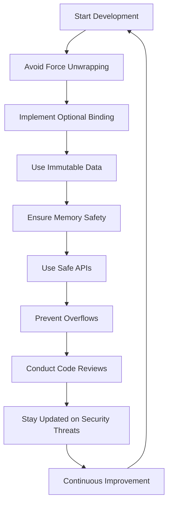

## 15.10 Secure Coding Practices in Swift

In today's rapidly evolving technological landscape, ensuring the security of applications is more crucial than ever. Swift, with its modern features and safety-oriented design, provides developers with robust tools to write secure code. This section explores various secure coding practices in Swift, emphasizing the importance of avoiding force unwrapping, maintaining memory safety, and fostering a culture of continuous learning and vigilance against security threats.

### General Practices

#### Avoiding Force Unwrapping

Force unwrapping is a common source of runtime crashes in Swift applications. It occurs when you use the exclamation mark (`!`) to forcibly extract a value from an optional that might be `nil`. This practice can lead to unexpected crashes if the optional is indeed `nil`.

**Best Practice: Use Optional Binding**

Optional binding with `if let` or `guard let` is a safer alternative to force unwrapping. It allows you to safely extract values from optionals and handle the `nil` case gracefully.

```swift
// Avoid force unwrapping
let userName: String? = fetchUserName()
print(userName!) // Risky: Can crash if userName is nil

// Use optional binding
if let userName = fetchUserName() {
    print(userName) // Safe: Only executes if userName is not nil
} else {
    print("User name is not available.")
}
```

**Try It Yourself:** Modify the code to introduce a `nil` value and observe how the optional binding handles it without crashing.

#### Immutable Data

Immutability is a cornerstone of secure coding. By making data immutable, you reduce the risk of unintended changes that can lead to security vulnerabilities or bugs.

**Best Practice: Use `let` for Constants**

Swift encourages the use of `let` to declare constants. This ensures that once a value is set, it cannot be altered.

```swift
// Using let for immutable data
let apiEndpoint = "https://api.example.com/data"
// apiEndpoint = "https://api.example.com/other" // Error: Cannot assign to 'let' constant
```

### Memory Safety

Swift's design inherently promotes memory safety, but developers must still be vigilant to ensure their code is secure.

#### Using Safe APIs

Swift provides a range of safe APIs that help prevent common programming errors. Leveraging these APIs can significantly enhance the security of your code.

**Best Practice: Use Swift's Built-in Safety Features**

Swift's type system, optionals, and error handling mechanisms are designed to prevent unsafe operations.

```swift
// Using safe APIs
let numbers = [1, 2, 3, 4, 5]
if numbers.indices.contains(5) {
    print(numbers[5]) // Safe: Checks if index is within bounds
} else {
    print("Index out of bounds.")
}
```

#### Preventing Overflows

Integer and buffer overflows can lead to serious security vulnerabilities. Swift provides built-in mechanisms to prevent these issues.

**Best Practice: Use Overflow Operators**

Swift offers overflow operators (`&+`, `&-`, `&*`) that handle overflows safely by wrapping around the value.

```swift
// Preventing integer overflow
let maxInt = Int.max
let result = maxInt &+ 1 // Safe: Wraps around instead of crashing
print(result) // Outputs: -9223372036854775808
```

### Continuous Learning

Security is an ever-evolving field. Developers must stay informed about the latest threats and best practices.

#### Staying Updated

Keeping abreast of new security threats and updates to the Swift language is essential for maintaining secure code.

**Best Practice: Follow Security News and Updates**

Regularly check reputable sources like the [Swift.org](https://swift.org) and security-focused blogs to stay informed.

#### Code Reviews

Peer reviews are a powerful tool for identifying security issues in code. They provide an opportunity for developers to learn from each other and catch potential vulnerabilities early.

**Best Practice: Implement Regular Code Reviews**

Establish a culture of regular code reviews within your team to ensure security best practices are followed.

```swift
// Example of a code review checklist
/*
- [ ] Are all optionals safely unwrapped?
- [ ] Are there any force unwraps?
- [ ] Is sensitive data properly protected?
- [ ] Are error cases handled appropriately?
*/
```

### Visualizing Secure Coding Practices

To better understand how these practices integrate into your development workflow, consider the following diagram illustrating the flow of secure coding practices in Swift.



**Diagram Explanation:** This flowchart depicts the cyclical nature of secure coding practices, emphasizing continuous improvement and vigilance.

### References and Links

- [Swift.org](https://swift.org) - Official Swift language site for updates and documentation.
- [OWASP](https://owasp.org) - Open Web Application Security Project, a resource for security best practices.
- [Apple Developer Documentation](https://developer.apple.com/documentation/swift) - Comprehensive guide to Swift features and APIs.

### Knowledge Check

- What is the risk of force unwrapping optionals?
- How can immutability contribute to secure coding?
- What are overflow operators, and how do they enhance security?
- Why are code reviews important in maintaining secure code?

### Embrace the Journey

Remember, mastering secure coding practices in Swift is a journey, not a destination. As you continue to develop your skills, you'll find new ways to enhance the security and reliability of your applications. Keep experimenting, stay curious, and enjoy the process of learning and growing as a developer.

### Formatting and Structure

Organize your code with clear comments and consistent formatting to make it easier for others (and your future self) to understand and maintain. Highlight important concepts and best practices to reinforce learning.

### Writing Style

Use first-person plural to create a collaborative feel. Avoid gender-specific pronouns and define acronyms upon first use to ensure clarity and inclusivity.

## Quiz Time!



### What is the main risk associated with force unwrapping optionals in Swift?

- [x] It can lead to runtime crashes if the optional is `nil`.
- [ ] It can cause compile-time errors.
- [ ] It improves performance but reduces readability.
- [ ] It is deprecated in the latest Swift version.

> **Explanation:** Force unwrapping an optional that is `nil` will cause a runtime crash, making it a risky practice.

### Which keyword is used to declare immutable data in Swift?

- [x] `let`
- [ ] `var`
- [ ] `const`
- [ ] `immutable`

> **Explanation:** The `let` keyword is used to declare constants, ensuring that the value cannot be changed after it is set.

### What is the purpose of overflow operators in Swift?

- [x] To handle integer overflows safely by wrapping around the value.
- [ ] To prevent division by zero errors.
- [ ] To enhance the performance of arithmetic operations.
- [ ] To convert integers to floating-point numbers.

> **Explanation:** Overflow operators like `&+` handle integer overflows by wrapping around the value, preventing crashes.

### Why is it important to stay updated on security threats?

- [x] To protect applications from new vulnerabilities and attacks.
- [ ] To reduce the size of your application.
- [ ] To comply with Swift coding standards.
- [ ] To improve application performance.

> **Explanation:** Staying informed about security threats helps developers protect their applications from emerging vulnerabilities.

### What is a key benefit of conducting regular code reviews?

- [x] Identifying security issues and learning from peers.
- [ ] Reducing the need for documentation.
- [ ] Increasing the speed of development.
- [ ] Eliminating the need for testing.

> **Explanation:** Code reviews help identify security issues early and provide opportunities for team members to learn from each other.

### How can optional binding improve code safety?

- [x] By safely extracting values from optionals and handling `nil` cases.
- [ ] By improving the performance of optional handling.
- [ ] By enforcing strict type checks at compile time.
- [ ] By allowing optionals to be used as non-optional values.

> **Explanation:** Optional binding with `if let` or `guard let` safely extracts values from optionals, preventing crashes due to `nil` values.

### What is the role of `guard let` in Swift?

- [x] To safely unwrap optionals and exit the scope if the optional is `nil`.
- [ ] To enforce type safety at compile time.
- [ ] To improve the performance of loops.
- [ ] To declare constants that cannot be changed.

> **Explanation:** `guard let` is used to safely unwrap optionals and exit the current scope if the optional is `nil`, ensuring safe execution.

### What is an example of a safe API in Swift?

- [x] Checking if an index is within bounds before accessing an array element.
- [ ] Using force unwrapping to access optional values.
- [ ] Declaring variables with `var` for flexibility.
- [ ] Ignoring error handling in function calls.

> **Explanation:** Checking if an index is within bounds before accessing an array element is an example of using a safe API to prevent runtime errors.

### What is the primary purpose of using `let` in Swift?

- [x] To declare constants that cannot be changed.
- [ ] To declare variables that can change.
- [ ] To improve the performance of arithmetic operations.
- [ ] To handle errors in Swift code.

> **Explanation:** The `let` keyword is used to declare constants, ensuring that the value cannot be changed after it is set.

### True or False: Code reviews are only necessary for detecting syntax errors.

- [ ] True
- [x] False

> **Explanation:** Code reviews are not only for detecting syntax errors but also for identifying security issues, improving code quality, and fostering team collaboration.



By adopting these secure coding practices, you'll be well-equipped to develop robust and secure Swift applications. Keep pushing the boundaries of your knowledge, and remember, the journey of mastering secure coding is continuous and rewarding.
