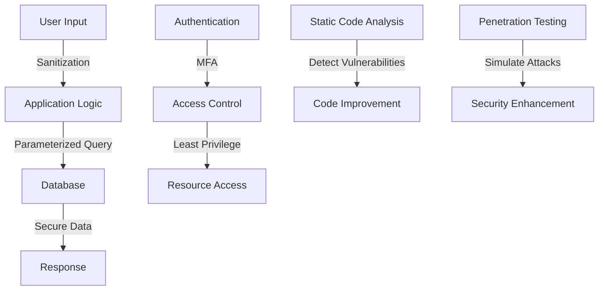

## 15.11 Common Vulnerabilities and Mitigation Strategies

In the realm of software development, security is paramount. As Swift developers, we must be vigilant against vulnerabilities that can compromise our applications. This section delves into common vulnerabilities, particularly those highlighted by the OWASP Top Ten, and explores effective mitigation strategies. Understanding these vulnerabilities and how to address them is crucial for building robust and secure Swift applications.

### Understanding OWASP Top Ten

The OWASP (Open Web Application Security Project) Top Ten is a standard awareness document for developers and web application security. It represents a broad consensus about the most critical security risks to web applications. Let's explore some of these vulnerabilities and how they manifest in Swift development.

#### Injection

**Injection vulnerabilities** occur when untrusted data is sent to an interpreter as part of a command or query. The most common type is SQL injection, but injection can also occur with other types of databases, LDAP queries, or even operating system commands.

**Mitigation Strategies:**
- **Input Validation**: Always validate and sanitize user inputs. Use whitelisting techniques to ensure that only expected data is processed.
- **Parameterized Queries**: Use parameterized queries or prepared statements to prevent SQL injection. This ensures that user inputs are treated as data rather than executable code.

**Code Example:**

```swift
import Foundation

func fetchUserData(userId: String) {
    let query = "SELECT * FROM users WHERE id = ?"
    // Use parameterized query to prevent SQL injection
    let statement = try? db.prepareStatement(query)
    try? statement?.bind(position: 1, to: userId)
    let result = try? statement?.executeQuery()
    // Process result
}
```

#### Broken Authentication

**Broken authentication** occurs when application functions related to authentication and session management are implemented incorrectly, allowing attackers to compromise passwords, keys, or session tokens.

**Mitigation Strategies:**
- **Strong Authentication Mechanisms**: Implement multi-factor authentication (MFA) to add an extra layer of security.
- **Secure Password Storage**: Use strong hashing algorithms like bcrypt or Argon2 to store passwords securely.

**Code Example:**

```swift
import CryptoKit

func hashPassword(password: String) -> String {
    let passwordData = Data(password.utf8)
    let hashed = SHA256.hash(data: passwordData)
    return hashed.compactMap { String(format: "%02x", $0) }.joined()
}

// Usage
let securePassword = hashPassword(password: "userPassword123")
```

### Mitigation Techniques

Beyond addressing specific vulnerabilities, adopting overarching security principles can significantly enhance the security posture of your Swift applications.

#### Least Privilege Principle

The **principle of least privilege** dictates that users and systems should have the minimum level of access necessary to perform their functions. This minimizes the potential damage from accidental or malicious actions.

**Implementation Tips:**
- **Role-Based Access Control (RBAC)**: Implement RBAC to ensure users have access only to the resources necessary for their roles.
- **Audit and Review Permissions**: Regularly audit and review permissions to ensure they align with current user roles and responsibilities.

#### Defense in Depth

**Defense in depth** is a layered security approach that employs multiple security measures to protect information. If one layer fails, others provide backup protection.

**Implementation Tips:**
- **Network Segmentation**: Divide your network into segments to limit the spread of an attack.
- **Multiple Authentication Layers**: Use multiple authentication mechanisms, such as MFA, to enhance security.

### Security Testing

Regular security testing is vital to identify and address vulnerabilities before they can be exploited.

#### Static Code Analysis

**Static code analysis** involves examining the source code for vulnerabilities without executing it. Tools like SonarQube and SwiftLint can help detect potential security issues.

**Benefits:**
- **Early Detection**: Identify vulnerabilities early in the development process.
- **Code Quality Improvement**: Improve overall code quality by adhering to best practices.

#### Penetration Testing

**Penetration testing** simulates real-world attacks to identify vulnerabilities in your application. It provides insights into how an attacker might exploit vulnerabilities.

**Benefits:**
- **Comprehensive Security Assessment**: Gain a thorough understanding of your application's security posture.
- **Proactive Vulnerability Identification**: Identify and address vulnerabilities before they can be exploited.

### Code Example: Implementing Secure Coding Practices

Let's explore a practical example of implementing secure coding practices in Swift to mitigate common vulnerabilities.

```swift
import Foundation
import CryptoKit

struct User {
    let username: String
    private(set) var passwordHash: String

    init(username: String, password: String) {
        self.username = username
        self.passwordHash = User.hashPassword(password: password)
    }

    static func hashPassword(password: String) -> String {
        let passwordData = Data(password.utf8)
        let hashed = SHA256.hash(data: passwordData)
        return hashed.compactMap { String(format: "%02x", $0) }.joined()
    }
}

// Usage
let user = User(username: "john_doe", password: "securePassword123")
print("Username: \\(user.username), Password Hash: \\(user.passwordHash)")
```

### Try It Yourself

To deepen your understanding, try modifying the code examples to:
- Implement additional security measures, such as salting passwords before hashing.
- Use a different hashing algorithm, like bcrypt, for password storage.
- Simulate an injection attack and implement measures to prevent it.

### Visualizing Security Concepts

To better understand how these security concepts interrelate, let's visualize the flow of data and security measures using a Mermaid.js diagram.



### References and Links

For further reading and to supplement your understanding, consider exploring these resources:
- [OWASP Top Ten](https://owasp.org/www-project-top-ten/)
- [Swift.org Security Guidelines](https://swift.org/security/)
- [Apple's Secure Coding Guide](https://developer.apple.com/library/archive/documentation/Security/Conceptual/SecureCodingGuide/Introduction.html)

### Knowledge Check

As you progress, consider these questions to reinforce your understanding:
- How can parameterized queries prevent SQL injection?
- What are the benefits of using multi-factor authentication?
- How does the principle of least privilege enhance security?

### Embrace the Journey

Remember, mastering security in Swift development is an ongoing journey. Stay curious, keep experimenting, and continue learning to build secure and robust applications. As you progress, you'll gain the skills to protect your applications and users from evolving threats.

## Quiz Time!



### Which of the following is a common vulnerability in Swift applications?

- [x] Injection
- [ ] Buffer Overflow
- [ ] Cross-Site Scripting
- [ ] Phishing

> **Explanation:** Injection is a common vulnerability where untrusted data is sent to an interpreter as part of a command or query.

### What is the primary purpose of parameterized queries?

- [x] To prevent SQL injection
- [ ] To improve query performance
- [ ] To simplify query syntax
- [ ] To enhance database compatibility

> **Explanation:** Parameterized queries prevent SQL injection by ensuring user inputs are treated as data, not executable code.

### Which hashing algorithm is recommended for secure password storage?

- [ ] MD5
- [x] bcrypt
- [ ] SHA-1
- [ ] CRC32

> **Explanation:** bcrypt is recommended for secure password storage due to its strength and resistance to brute-force attacks.

### What principle dictates granting minimal necessary permissions?

- [ ] Defense in Depth
- [ ] Role-Based Access Control
- [x] Least Privilege Principle
- [ ] Multi-Factor Authentication

> **Explanation:** The Least Privilege Principle dictates granting minimal necessary permissions to users and systems.

### Which security testing method simulates real-world attacks?

- [ ] Static Code Analysis
- [x] Penetration Testing
- [ ] Code Review
- [ ] Unit Testing

> **Explanation:** Penetration Testing simulates real-world attacks to identify vulnerabilities.

### How does multi-factor authentication enhance security?

- [x] By adding an extra layer of security
- [ ] By improving password strength
- [ ] By simplifying user access
- [ ] By reducing login times

> **Explanation:** Multi-factor authentication enhances security by requiring additional verification beyond just a password.

### What is the benefit of using static code analysis?

- [x] Early detection of vulnerabilities
- [ ] Real-time attack simulation
- [ ] Improved runtime performance
- [ ] Simplified code syntax

> **Explanation:** Static code analysis allows for early detection of vulnerabilities during the development process.

### What does the Defense in Depth strategy involve?

- [x] Layering multiple security measures
- [ ] Granting all permissions
- [ ] Using a single authentication method
- [ ] Relying solely on encryption

> **Explanation:** Defense in Depth involves layering multiple security measures to protect information.

### Which of the following is a benefit of penetration testing?

- [x] Proactive vulnerability identification
- [ ] Improved code readability
- [ ] Faster code execution
- [ ] Simplified code maintenance

> **Explanation:** Penetration testing provides proactive identification of vulnerabilities before they can be exploited.

### True or False: The principle of least privilege enhances security by granting maximum permissions.

- [ ] True
- [x] False

> **Explanation:** False. The principle of least privilege enhances security by granting minimal necessary permissions.



By understanding and implementing these security strategies, you'll be well-equipped to build secure Swift applications that protect your users and data. Keep exploring, stay informed, and embrace the journey of secure software development!


