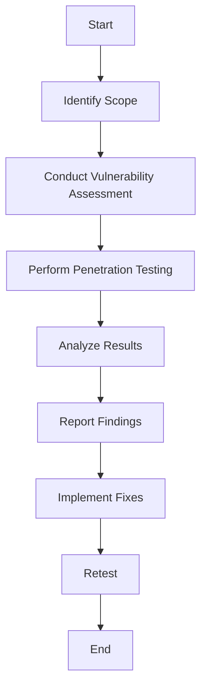

## 15.12 Security Testing and Ethical Hacking

In today's digital age, security is paramount. As Swift developers, understanding security testing and ethical hacking is crucial to building robust, secure applications. This section delves into the intricacies of security testing and ethical hacking, providing you with the knowledge and tools to safeguard your Swift applications.

### Introduction to Security Testing and Ethical Hacking

Security testing is the process of evaluating an application to identify vulnerabilities that could be exploited by malicious actors. Ethical hacking, often referred to as penetration testing, involves simulating attacks on a system to uncover and fix security flaws before they can be exploited.

#### Ethical Hacking

**Purpose**: The primary goal of ethical hacking is to identify and fix security issues before they are exploited by malicious hackers. Ethical hackers use the same techniques as cybercriminals but with the permission of the organization they are testing.

**Techniques**: Ethical hacking involves various techniques such as network scanning, vulnerability testing, and penetration testing. These techniques help uncover weaknesses in an application's security posture.

### Key Concepts in Security Testing

#### Vulnerability Assessment

A vulnerability assessment involves identifying, quantifying, and prioritizing vulnerabilities in a system. It is a crucial step in the security testing process, as it helps developers understand the potential risks associated with their applications.

#### Penetration Testing

Penetration testing, or pen testing, simulates an attack on a system to identify security weaknesses. It involves exploiting vulnerabilities to determine how an attacker might gain unauthorized access to a system.

### Tools and Frameworks for Security Testing

Several tools and frameworks can aid in security testing and ethical hacking. These tools help automate the process of identifying and fixing vulnerabilities in Swift applications.

#### Automated Scanners

- **OWASP ZAP**: The OWASP Zed Attack Proxy (ZAP) is an open-source tool used for finding vulnerabilities in web applications. It provides automated scanners and a set of tools to identify security issues.
  
- **Burp Suite**: Burp Suite is a popular security testing tool that offers a wide range of features for web application security testing. It includes tools for scanning, crawling, and exploiting vulnerabilities.

#### Custom Scripts

In addition to automated scanners, developers can write custom scripts to test specific scenarios unique to their applications. Custom scripts allow for more granular testing and can be tailored to the specific needs of a project.

### Legal and Ethical Considerations

Ethical hacking requires adherence to legal and ethical standards. It's essential to ensure that all security testing is conducted with proper authorization and that findings are reported responsibly.

#### Authorization

Before conducting any security testing, it's crucial to obtain permission from the organization or individual who owns the system. Unauthorized testing can lead to legal consequences.

#### Responsible Disclosure

Responsible disclosure involves reporting security vulnerabilities to the affected organization in a manner that allows them to address the issue before it is publicly disclosed. This approach helps protect users while ensuring that vulnerabilities are fixed.

### Implementing Security Testing in Swift

Let's explore how to implement security testing in Swift applications, focusing on secure coding practices and vulnerability assessment.

#### Secure Coding Practices

Secure coding practices are essential for building secure applications. These practices help prevent common vulnerabilities and ensure that applications are resilient against attacks.

- **Input Validation**: Validate all user inputs to prevent injection attacks. Use regular expressions and Swift's type system to enforce strict input validation.

- **Access Control**: Implement proper access control mechanisms to ensure that only authorized users can access sensitive data and functionality.

- **Encryption**: Use encryption to protect sensitive data both at rest and in transit. Swift provides robust libraries for implementing encryption, such as CryptoKit.

#### Vulnerability Assessment in Swift

Conducting a vulnerability assessment involves identifying potential security weaknesses in your Swift application. Use tools like OWASP ZAP and Burp Suite to automate the process and identify common vulnerabilities such as SQL injection, cross-site scripting (XSS), and insecure data storage.

### Code Example: Implementing Input Validation

Let's look at a Swift code example that demonstrates secure input validation using regular expressions.

```swift
import Foundation

// Function to validate email input
func isValidEmail(_ email: String) -> Bool {
    // Regular expression for validating email addresses
    let emailRegex = "^[A-Z0-9a-z._%+-]+@[A-Za-z0-9.-]+\\.[A-Za-z]{2,}$"
    let emailPredicate = NSPredicate(format: "SELF MATCHES %@", emailRegex)
    return emailPredicate.evaluate(with: email)
}

// Example usage
let email = "example@example.com"
if isValidEmail(email) {
    print("Valid email address")
} else {
    print("Invalid email address")
}
```

In this example, we use a regular expression to validate email addresses. This approach helps prevent injection attacks by ensuring that only valid email addresses are accepted.

### Visualizing the Security Testing Process

To better understand the security testing process, let's visualize it using a flowchart.



**Figure 1**: Security Testing Process Flowchart

This flowchart illustrates the typical steps involved in the security testing process, from identifying the scope to retesting after implementing fixes.

### Try It Yourself

To practice security testing in Swift, try modifying the input validation code to include additional checks, such as validating phone numbers or passwords. Experiment with different regular expressions to see how they affect the validation process.

### References and Links

- [OWASP ZAP](https://www.zaproxy.org/)
- [Burp Suite](https://portswigger.net/burp)
- [CryptoKit Documentation](https://developer.apple.com/documentation/cryptokit)

### Knowledge Check

- What is the primary goal of ethical hacking?
- Name two tools commonly used for automated security testing.
- Why is input validation important in secure coding practices?
- What is responsible disclosure, and why is it important?

### Embrace the Journey

Remember, security testing and ethical hacking are ongoing processes. As you continue to develop your Swift applications, stay vigilant and proactive in identifying and addressing security vulnerabilities. Keep experimenting, stay curious, and enjoy the journey of building secure, robust applications.

## Quiz Time!



### What is the primary goal of ethical hacking?

- [x] Identifying and fixing security issues before exploitation.
- [ ] Exploiting vulnerabilities for personal gain.
- [ ] Developing malware for testing purposes.
- [ ] Disclosing vulnerabilities to the public without permission.

> **Explanation:** Ethical hacking aims to identify and fix security issues before they are exploited by malicious actors.

### Which of the following tools is commonly used for automated security testing?

- [x] OWASP ZAP
- [x] Burp Suite
- [ ] Xcode
- [ ] SwiftLint

> **Explanation:** OWASP ZAP and Burp Suite are popular tools for automated security testing.

### Why is input validation important in secure coding practices?

- [x] It helps prevent injection attacks.
- [ ] It improves application performance.
- [ ] It simplifies code maintenance.
- [ ] It enhances user experience.

> **Explanation:** Input validation is crucial for preventing injection attacks by ensuring that only valid inputs are accepted.

### What is responsible disclosure?

- [x] Reporting security vulnerabilities to the affected organization before public disclosure.
- [ ] Publicly disclosing vulnerabilities without notifying the affected organization.
- [ ] Selling vulnerabilities to the highest bidder.
- [ ] Ignoring vulnerabilities to avoid legal issues.

> **Explanation:** Responsible disclosure involves reporting vulnerabilities to the affected organization, allowing them to fix the issue before public disclosure.

### Which of the following is a secure coding practice?

- [x] Input validation
- [x] Access control
- [ ] Hardcoding passwords
- [ ] Ignoring error handling

> **Explanation:** Input validation and access control are secure coding practices that help protect applications from attacks.

### What is a vulnerability assessment?

- [x] Identifying, quantifying, and prioritizing vulnerabilities in a system.
- [ ] Developing new features for an application.
- [ ] Writing documentation for a project.
- [ ] Conducting user experience testing.

> **Explanation:** A vulnerability assessment involves identifying, quantifying, and prioritizing vulnerabilities in a system.

### What is the purpose of penetration testing?

- [x] Simulating an attack on a system to identify security weaknesses.
- [ ] Improving application performance.
- [ ] Enhancing user interface design.
- [ ] Conducting market research.

> **Explanation:** Penetration testing simulates an attack on a system to identify security weaknesses.

### What is the first step in the security testing process?

- [x] Identify Scope
- [ ] Conduct Vulnerability Assessment
- [ ] Perform Penetration Testing
- [ ] Report Findings

> **Explanation:** The first step in the security testing process is to identify the scope of the testing.

### True or False: Authorization is not required for ethical hacking.

- [ ] True
- [x] False

> **Explanation:** Authorization is required for ethical hacking to ensure that testing is conducted legally and ethically.

### Which of the following is a legal consideration in ethical hacking?

- [x] Ensuring testing is permitted
- [ ] Selling vulnerabilities
- [ ] Ignoring security issues
- [ ] Publicly disclosing vulnerabilities without permission

> **Explanation:** Ensuring testing is permitted is a legal consideration in ethical hacking to avoid legal consequences.


