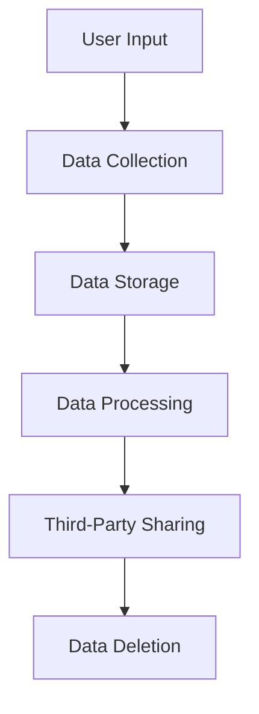
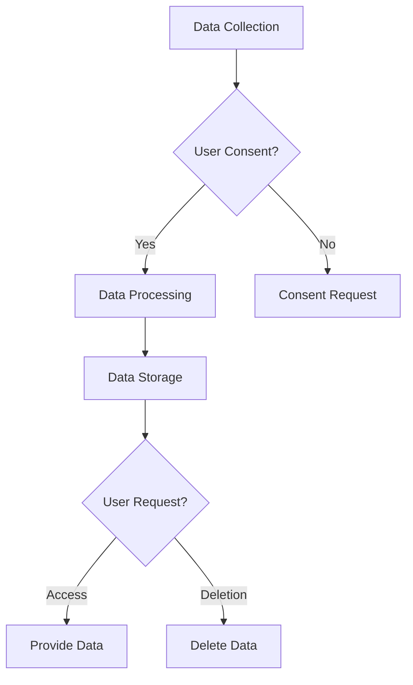

## 15.13 Compliance with Privacy Laws (GDPR, CCPA)

In today's digital age, data privacy has become a critical concern, and as Swift developers, it is essential to understand and implement privacy laws such as the General Data Protection Regulation (GDPR) and the California Consumer Privacy Act (CCPA). These regulations aim to protect user data and ensure that organizations handle personal information responsibly. This section will guide you through the key aspects of GDPR and CCPA compliance, focusing on practical implementation in Swift applications.

### Key Regulations

#### GDPR: General Data Protection Regulation

The GDPR is a comprehensive data protection law in the European Union (EU) that came into effect on May 25, 2018. It sets strict guidelines for collecting, storing, and processing personal data of EU citizens. Key elements include:

- **Data Protection Principles**: Lawfulness, fairness, transparency, purpose limitation, data minimization, accuracy, storage limitation, integrity, and confidentiality.
- **User Rights**: Right to access, rectification, erasure (right to be forgotten), restriction of processing, data portability, and objection.
- **Accountability and Governance**: Organizations must demonstrate compliance through documentation and appoint a Data Protection Officer (DPO) if necessary.

#### CCPA: California Consumer Privacy Act

The CCPA, effective January 1, 2020, is a state statute intended to enhance privacy rights and consumer protection for residents of California, USA. Key features include:

- **Consumer Rights**: Right to know about personal data collected, right to delete personal data, right to opt-out of data selling, and right to non-discrimination.
- **Business Obligations**: Providing clear privacy notices, implementing opt-out mechanisms, and ensuring data security.

### Compliance Steps

To comply with GDPR and CCPA, developers must take several steps to ensure that their applications respect user privacy and data protection laws. Here are some critical steps to achieve compliance:

#### Data Mapping

Data mapping is the process of identifying and documenting the flow of personal data within your application. It involves understanding what data is collected, where it is stored, how it is processed, and who has access to it.

1. **Identify Data Sources**: Determine all the points where personal data is collected, such as user inputs, sensors, or third-party services.
2. **Document Data Flow**: Create a comprehensive map of how data moves through your application, including storage locations, processing steps, and data sharing with third parties.
3. **Assess Data Sensitivity**: Classify data based on its sensitivity and the potential impact of a data breach.

#### User Rights

Implementing mechanisms to honor user rights is crucial for compliance. This includes providing users with access to their data, allowing them to request data deletion, and managing consent.

1. **Data Access Requests**: Implement features that allow users to view and download their personal data.
2. **Data Deletion Requests**: Provide users with the ability to request the deletion of their data, ensuring that it is permanently removed from your systems.
3. **Consent Management**: Obtain explicit consent from users before collecting their data and offer easy ways to withdraw consent.

### Privacy by Design

Privacy by Design is a proactive approach to embedding privacy into the design and architecture of systems and processes. It emphasizes minimizing data collection and ensuring robust consent management.

#### Minimization

Data minimization involves collecting only the data necessary for your application's functionality. This reduces the risk of data breaches and simplifies compliance efforts.

- **Evaluate Data Needs**: Regularly assess whether the data you collect is essential for your application's operation.
- **Anonymize Data**: Where possible, use anonymization techniques to remove personally identifiable information (PII) from your data sets.

#### Consent Management

Consent management is about obtaining and recording user consent for data collection and processing activities. This ensures transparency and builds trust with users.

- **Clear Consent Notices**: Provide users with clear and concise information about what data is being collected and for what purpose.
- **Granular Consent Options**: Allow users to choose which types of data they consent to share, offering separate consent for different data categories.
- **Audit Trails**: Maintain records of user consents and any changes to consent preferences.

### Implementing Compliance in Swift

Let's explore how to implement GDPR and CCPA compliance in Swift applications with practical examples.

#### Data Mapping Example

To map data within a Swift application, you can create a data flow diagram using Mermaid.js to visualize the data movement.



This diagram illustrates the flow of data from user input to data deletion, highlighting key stages where compliance measures should be implemented.

#### User Rights Implementation

Here's an example of how to implement a data access request feature in Swift:

```swift
import Foundation

class UserDataManager {
    private var userData: [String: Any] = [
        "name": "John Doe",
        "email": "john.doe@example.com",
        "preferences": ["newsletter": true]
    ]
    
    func requestUserData() -> [String: Any] {
        // Return a copy of the user data for access requests
        return userData
    }
    
    func deleteUserData() {
        // Delete user data to comply with data deletion requests
        userData.removeAll()
    }
}

// Usage
let userManager = UserDataManager()
print("User Data: \\(userManager.requestUserData())")
userManager.deleteUserData()
print("User Data after deletion: \\(userManager.requestUserData())")
```

In this example, we define a `UserDataManager` class that handles user data access and deletion requests, ensuring compliance with user rights.

#### Privacy by Design in Swift

To implement data minimization and consent management, consider the following Swift code snippet:

```swift
import Foundation

class ConsentManager {
    private var consents: [String: Bool] = [:]
    
    func requestConsent(for dataCategory: String) -> Bool {
        // Simulate obtaining user consent
        consents[dataCategory] = true
        return consents[dataCategory] ?? false
    }
    
    func withdrawConsent(for dataCategory: String) {
        // Simulate withdrawing user consent
        consents[dataCategory] = false
    }
    
    func isConsentGiven(for dataCategory: String) -> Bool {
        // Check if consent is given for a specific data category
        return consents[dataCategory] ?? false
    }
}

// Usage
let consentManager = ConsentManager()
consentManager.requestConsent(for: "location")
print("Consent for location: \\(consentManager.isConsentGiven(for: "location"))")
consentManager.withdrawConsent(for: "location")
print("Consent for location after withdrawal: \\(consentManager.isConsentGiven(for: "location"))")
```

This code demonstrates a basic consent management system, allowing users to grant or withdraw consent for specific data categories.

### Visualizing Compliance Workflow

To better understand the compliance workflow, let's visualize the process using a flowchart.



This flowchart outlines the steps involved in collecting data, obtaining user consent, processing data, and handling user requests for data access or deletion.

### References and Links

For further reading on GDPR and CCPA compliance, consider the following resources:

- [GDPR Overview by the European Commission](https://ec.europa.eu/info/law/law-topic/data-protection_en)
- [CCPA Compliance Guide by the State of California](https://oag.ca.gov/privacy/ccpa)
- [Apple's Privacy and Data Protection Resources](https://developer.apple.com/privacy/)

### Knowledge Check

To reinforce your understanding of GDPR and CCPA compliance, consider the following questions:

- What are the key differences between GDPR and CCPA?
- How can data mapping help in achieving compliance?
- What are some techniques for minimizing data collection?
- How can consent management be implemented in a Swift application?
- Why is Privacy by Design important for data protection?

### Embrace the Journey

Remember, achieving compliance with privacy laws is an ongoing process that requires continuous monitoring and adaptation. As you progress in your Swift development journey, keep exploring new techniques and best practices to enhance data privacy and security. Stay curious, and enjoy the journey of building privacy-conscious applications!

## Quiz Time!



### What is the primary purpose of GDPR?

- [x] To protect the personal data of EU citizens
- [ ] To regulate financial transactions
- [ ] To manage internet traffic
- [ ] To control software licensing

> **Explanation:** GDPR is designed to protect the personal data of EU citizens and ensure their privacy rights are respected.

### Which of the following is a key feature of CCPA?

- [x] Right to opt-out of data selling
- [ ] Mandatory data encryption
- [ ] Automatic data deletion
- [ ] User profiling

> **Explanation:** CCPA grants California residents the right to opt-out of the sale of their personal data.

### What is data mapping?

- [x] Identifying and documenting the flow of personal data
- [ ] Encrypting personal data
- [ ] Deleting unnecessary data
- [ ] Analyzing data trends

> **Explanation:** Data mapping involves identifying and documenting how personal data is collected, stored, and processed within an application.

### How can consent management be implemented in Swift?

- [x] By creating a system to obtain and record user consent
- [ ] By encrypting all user data
- [ ] By deleting user data regularly
- [ ] By using third-party libraries

> **Explanation:** Consent management involves obtaining and recording user consent for data collection and processing activities.

### What does Privacy by Design emphasize?

- [x] Minimizing data collection and ensuring robust consent management
- [ ] Maximizing data collection for analysis
- [ ] Sharing data with third parties
- [ ] Encrypting all data

> **Explanation:** Privacy by Design focuses on minimizing data collection and ensuring that user consent is obtained and managed effectively.

### Which regulation requires organizations to appoint a Data Protection Officer?

- [x] GDPR
- [ ] CCPA
- [ ] HIPAA
- [ ] PCI DSS

> **Explanation:** GDPR mandates that certain organizations appoint a Data Protection Officer to oversee data protection activities.

### What is a key difference between GDPR and CCPA?

- [x] GDPR applies to EU citizens, while CCPA applies to California residents
- [ ] GDPR focuses on financial data, while CCPA focuses on health data
- [ ] GDPR mandates encryption, while CCPA mandates data deletion
- [ ] GDPR is voluntary, while CCPA is mandatory

> **Explanation:** GDPR is a regulation for EU citizens, whereas CCPA is specific to residents of California, USA.

### What is the role of a Data Protection Officer?

- [x] To oversee data protection activities and ensure compliance
- [ ] To encrypt all user data
- [ ] To sell user data to third parties
- [ ] To develop marketing strategies

> **Explanation:** A Data Protection Officer is responsible for overseeing data protection activities and ensuring compliance with privacy laws.

### What is the right to be forgotten?

- [x] The right to request the deletion of personal data
- [ ] The right to access personal data
- [ ] The right to sell personal data
- [ ] The right to encrypt personal data

> **Explanation:** The right to be forgotten allows individuals to request the deletion of their personal data from an organization's records.

### True or False: Privacy by Design is a reactive approach to data protection.

- [ ] True
- [x] False

> **Explanation:** Privacy by Design is a proactive approach that integrates privacy into the design and architecture of systems and processes.




