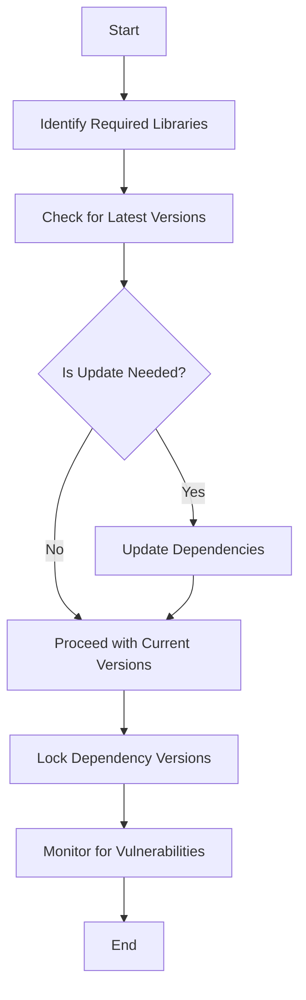

## 15.14 Best Practices for Third-Party Libraries in Swift Development

In the fast-paced world of software development, third-party libraries can be a boon for developers, providing ready-made solutions to common problems and accelerating the development process. However, integrating these libraries into your Swift projects requires careful consideration to ensure that your application remains secure, efficient, and legally compliant. This section will guide you through the best practices for using third-party libraries in Swift development, focusing on security considerations, risk assessment, and legal obligations.

### Security Considerations

#### Dependency Management

Managing dependencies is crucial in maintaining the security and stability of your application. Here are some best practices to follow:

- **Keep Libraries Up to Date**: Regularly update your third-party libraries to the latest versions. This practice ensures that you benefit from the latest security patches and improvements. Use tools like [CocoaPods](https://cocoapods.org/) or [Swift Package Manager](https://swift.org/package-manager/) to automate this process.

- **Lock Dependencies**: Use a lock file (e.g., `Podfile.lock` or `Package.resolved`) to ensure consistent dependency versions across different environments. This practice helps avoid unexpected behavior due to version mismatches.

- **Monitor for Vulnerabilities**: Employ tools like [Snyk](https://snyk.io/) or [Dependabot](https://dependabot.com/) to automatically scan your dependencies for known vulnerabilities and receive alerts when issues are found.

#### Source Verification

Ensuring that your libraries come from trusted sources is vital for preventing malicious code from entering your codebase.

- **Use Official Repositories**: Always download libraries from official repositories or trusted sources. Avoid using libraries from unknown or unofficial sources.

- **Verify Integrity**: Check the integrity of the library by comparing checksums or using digital signatures if available. This step ensures that the library has not been tampered with.

- **Review Code**: Whenever possible, review the source code of the libraries you intend to use. This practice is particularly important for smaller libraries or those with fewer contributors.

### Risk Assessment

#### Evaluating Libraries

Before integrating a third-party library, it's essential to evaluate its quality and reliability.

- **Review Code and Community Trust**: Examine the library's codebase for quality and maintainability. Check the community's trust by looking at the number of contributors, stars, and forks on platforms like GitHub.

- **Check for Active Maintenance**: Ensure that the library is actively maintained and supported. An inactive library may not receive timely updates or security patches.

- **Assess Performance Impact**: Consider the performance implications of adding a library to your project. Some libraries may introduce unnecessary bloat or slow down your application.

#### Alternatives

Sometimes, using native APIs or writing custom code can be a better alternative to integrating a third-party library.

- **Use Native APIs**: Whenever possible, prefer native APIs provided by Swift or iOS over third-party libraries. Native solutions are usually more reliable and better optimized for the platform.

- **Custom Implementation**: If a library offers functionality that is relatively simple to implement, consider writing your own code. This approach gives you full control over the implementation and reduces dependency on external code.

### Legal Considerations

#### Licensing

Understanding and complying with the license terms of third-party libraries is essential to avoid legal issues.

- **Read License Agreements**: Carefully read and understand the license agreements of the libraries you use. Common licenses include MIT, Apache, and GPL, each with different requirements and restrictions.

- **Comply with License Terms**: Ensure that your use of the library complies with its license terms. Some licenses may require attribution, while others might impose restrictions on commercial use.

#### Attribution

Providing proper credit to the authors of third-party libraries is not only a legal obligation but also a good practice.

- **Include Attributions**: If a library's license requires attribution, include the necessary credits in your application's documentation or about page.

- **Acknowledge Contributions**: Acknowledge the contributions of the library's authors in your project's documentation or release notes.

### Code Examples

To illustrate these best practices, let's look at a simple example of integrating a third-party library using Swift Package Manager.

```swift
// swift-tools-version:5.5
import PackageDescription

let package = Package(
    name: "MySwiftProject",
    dependencies: [
        // Add your third-party library dependency here
        .package(url: "https://github.com/Alamofire/Alamofire.git", from: "5.4.0")
    ],
    targets: [
        .target(
            name: "MySwiftProject",
            dependencies: ["Alamofire"]),
    ]
)
```

In this example, we are adding Alamofire, a popular networking library, to our Swift project. By specifying the version as `from: "5.4.0"`, we ensure that our project uses a stable version of the library.

### Try It Yourself

To practice integrating third-party libraries, try adding a different library to your project using Swift Package Manager. Experiment with different versions and observe how they affect your project's build and functionality.

### Visualizing Dependency Management

To better understand the flow of dependency management, let's visualize the process using a Mermaid.js diagram.



This diagram illustrates the steps involved in managing third-party dependencies, from identifying required libraries to monitoring for vulnerabilities.

### Knowledge Check

To reinforce your understanding, consider the following questions:

- What are the benefits of using a lock file for dependency management?
- Why is it important to verify the source of a third-party library?
- How can you assess the performance impact of a library on your project?
- What are some common licenses for third-party libraries, and what do they entail?

### Embrace the Journey

Remember, integrating third-party libraries is just one part of the software development journey. As you continue to build and refine your Swift applications, keep exploring new libraries and tools, but always prioritize security, performance, and legal compliance. Stay curious, keep learning, and enjoy the process of creating robust and efficient software.

### References and Links

- [CocoaPods](https://cocoapods.org/)
- [Swift Package Manager](https://swift.org/package-manager/)
- [Snyk](https://snyk.io/)
- [Dependabot](https://dependabot.com/)
- [Alamofire GitHub Repository](https://github.com/Alamofire/Alamofire)

## Quiz Time!



### What is a key benefit of using a lock file for dependency management?

- [x] Ensures consistent dependency versions across environments
- [ ] Automatically updates all dependencies
- [ ] Eliminates the need for manual updates
- [ ] Provides a backup of all dependencies

> **Explanation:** A lock file ensures that all environments use the same dependency versions, preventing version mismatches.

### Why is verifying the source of a third-party library important?

- [x] To prevent malicious code from entering the codebase
- [ ] To ensure the library is free
- [ ] To guarantee the library is popular
- [ ] To avoid license issues

> **Explanation:** Verifying the source prevents malicious code, ensuring the library is trustworthy.

### What should you consider when assessing the performance impact of a library?

- [x] Potential bloat and application slowdown
- [ ] The library's popularity
- [ ] The number of contributors
- [ ] The library's license

> **Explanation:** Consider the potential bloat and slowdown the library might introduce to your application.

### What are some common licenses for third-party libraries?

- [x] MIT, Apache, GPL
- [ ] BSD, Creative Commons, Public Domain
- [ ] LGPL, Proprietary, Shareware
- [ ] Freeware, Open Source, Commercial

> **Explanation:** MIT, Apache, and GPL are common licenses with specific terms and conditions.

### How can you ensure compliance with a library's license terms?

- [x] Read and understand the license agreement
- [ ] Ignore the license terms
- [x] Include required attributions
- [ ] Use the library without modifications

> **Explanation:** Reading the license agreement and including required attributions ensure compliance.

### What tool can you use to monitor third-party libraries for vulnerabilities?

- [x] Snyk
- [ ] GitHub
- [ ] Xcode
- [ ] SwiftLint

> **Explanation:** Snyk is a tool that scans for vulnerabilities in third-party libraries.

### What is a benefit of using native APIs over third-party libraries?

- [x] More reliable and optimized for the platform
- [ ] Easier to integrate
- [ ] Always free
- [ ] Automatically updated

> **Explanation:** Native APIs are typically more reliable and optimized for the platform.

### What should you do if a library's functionality is simple to implement?

- [x] Consider writing your own code
- [ ] Always use the library
- [ ] Ignore the functionality
- [ ] Wait for an official API

> **Explanation:** Writing your own code gives you full control and reduces dependency on external code.

### What is the purpose of using tools like CocoaPods or Swift Package Manager?

- [x] To automate dependency management
- [ ] To write Swift code
- [ ] To test applications
- [ ] To design user interfaces

> **Explanation:** CocoaPods and Swift Package Manager help automate dependency management in Swift projects.

### True or False: It's unnecessary to provide attribution for third-party libraries if they are free.

- [ ] True
- [x] False

> **Explanation:** Attribution may be required by the library's license, regardless of whether it is free.



---
