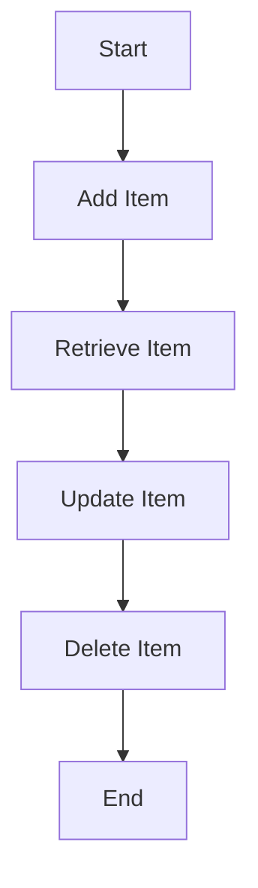

## 15.2 Secure Storage with Keychain Access

In the realm of iOS and macOS development, ensuring the security of sensitive data is paramount. The Keychain Services API provides a robust solution for securely storing small pieces of data, such as passwords, tokens, and certificates. This section will guide you through the intricacies of using Keychain Access in Swift, emphasizing best practices and providing practical code examples.

### Introduction to Keychain Services

Keychain Services is a secure storage mechanism provided by Apple for storing sensitive information. It is designed to store small data items securely, such as:

- **Passwords**: For applications or services.
- **Tokens**: Such as OAuth tokens.
- **Certificates**: For secure communications.

The Keychain is accessible only to the app that created it, ensuring a high level of security. Additionally, it can be configured to synchronize across devices using iCloud Keychain, providing a seamless user experience.

### Key Concepts of Keychain Access

#### Storing Secrets

The primary use of Keychain Access is to store secrets securely. This includes any data that should be kept confidential, such as user credentials and API keys. The Keychain encrypts this data, making it difficult for unauthorized parties to access.

#### Accessibility Levels

Keychain items can have different accessibility levels, which determine when the items can be accessed. These levels include:

- **`kSecAttrAccessibleWhenUnlocked`**: The item is accessible only while the device is unlocked.
- **`kSecAttrAccessibleAfterFirstUnlock`**: The item is accessible after the first unlock following a device restart.
- **`kSecAttrAccessibleAlways`**: The item is accessible at all times, which is less secure.
- **`kSecAttrAccessibleWhenPasscodeSetThisDeviceOnly`**: The item is accessible only when the device is unlocked and a passcode is set. It is not synchronized with iCloud.

Selecting the appropriate accessibility level is crucial for balancing security and usability.

### Best Practices for Keychain Access

#### Data Protection

When using Keychain Services, it is essential to apply appropriate data protection strategies. This includes:

- **Choosing the right accessibility level**: Opt for the most restrictive level that meets your needs.
- **Using device-specific attributes**: Use `ThisDeviceOnly` attributes to prevent synchronization and enhance security.

#### Synchronization

Decide whether to synchronize Keychain items across devices. While iCloud Keychain provides convenience, it may not be suitable for all types of data. Consider the following:

- **Synchronization is ideal for user credentials**: This allows users to access their accounts on multiple devices seamlessly.
- **Avoid synchronization for sensitive data**: Such as encryption keys, which should remain on a single device.

### Implementing Keychain Access in Swift

Let's dive into how to implement Keychain Access in Swift with practical examples.

#### Basic Keychain Operations

Here, we'll explore how to add, retrieve, update, and delete items in the Keychain.

**Adding an Item to the Keychain**

To add an item, such as a password, to the Keychain, use the following code:

```swift
import Security

func addPasswordToKeychain(account: String, password: String) -> Bool {
    let passwordData = password.data(using: .utf8)!
    
    let query: [String: Any] = [
        kSecClass as String: kSecClassGenericPassword,
        kSecAttrAccount as String: account,
        kSecValueData as String: passwordData,
        kSecAttrAccessible as String: kSecAttrAccessibleWhenUnlocked
    ]
    
    let status = SecItemAdd(query as CFDictionary, nil)
    return status == errSecSuccess
}
```

**Retrieving an Item from the Keychain**

To retrieve an item, such as a password, from the Keychain, use the following code:

```swift
func retrievePasswordFromKeychain(account: String) -> String? {
    let query: [String: Any] = [
        kSecClass as String: kSecClassGenericPassword,
        kSecAttrAccount as String: account,
        kSecReturnData as String: kCFBooleanTrue!,
        kSecMatchLimit as String: kSecMatchLimitOne
    ]
    
    var item: CFTypeRef?
    let status = SecItemCopyMatching(query as CFDictionary, &item)
    
    guard status == errSecSuccess, let passwordData = item as? Data else {
        return nil
    }
    
    return String(data: passwordData, encoding: .utf8)
}
```

**Updating an Item in the Keychain**

To update an existing item in the Keychain, you can use the following code:

```swift
func updatePasswordInKeychain(account: String, newPassword: String) -> Bool {
    let query: [String: Any] = [
        kSecClass as String: kSecClassGenericPassword,
        kSecAttrAccount as String: account
    ]
    
    let attributes: [String: Any] = [
        kSecValueData as String: newPassword.data(using: .utf8)!
    ]
    
    let status = SecItemUpdate(query as CFDictionary, attributes as CFDictionary)
    return status == errSecSuccess
}
```

**Deleting an Item from the Keychain**

To delete an item from the Keychain, use the following code:

```swift
func deletePasswordFromKeychain(account: String) -> Bool {
    let query: [String: Any] = [
        kSecClass as String: kSecClassGenericPassword,
        kSecAttrAccount as String: account
    ]
    
    let status = SecItemDelete(query as CFDictionary)
    return status == errSecSuccess
}
```

### Visualizing Keychain Access Workflow

To better understand the Keychain Access workflow, let's visualize the process of adding, retrieving, updating, and deleting items in the Keychain.



**Description**: This diagram illustrates the sequential steps involved in managing Keychain items in Swift, starting from adding an item to eventually deleting it.

### Advanced Keychain Topics

#### Keychain Synchronization

Keychain synchronization allows items to be shared across a user's devices via iCloud. This is useful for user credentials but should be used cautiously for sensitive data.

To enable synchronization, set the `kSecAttrSynchronizable` attribute to `kCFBooleanTrue`.

#### Handling Keychain Errors

When working with the Keychain, you may encounter various errors. Here are some common ones:

- **`errSecItemNotFound`**: The item was not found in the Keychain.
- **`errSecDuplicateItem`**: The item already exists in the Keychain.
- **`errSecAuthFailed`**: Authentication failed.

Handling these errors gracefully is essential for a robust application.

### Try It Yourself: Experiment with Keychain Access

Now that we've covered the basics, try modifying the code examples to:

- **Store additional data types**: Such as tokens or certificates.
- **Experiment with different accessibility levels**: See how they affect the availability of items.
- **Implement error handling**: To provide better feedback to users.

### References and Further Reading

- [Apple Developer Documentation: Keychain Services](https://developer.apple.com/documentation/security/keychain_services)
- [OWASP Mobile Security Testing Guide](https://owasp.org/www-project-mobile-security-testing-guide/)

### Knowledge Check

Let's reinforce what we've learned with some questions and challenges.

## Quiz Time!



### What is the primary use of Keychain Access in iOS development?

- [x] Securely storing small pieces of sensitive data
- [ ] Storing large files
- [ ] Managing app settings
- [ ] Caching images

> **Explanation:** Keychain Access is primarily used for securely storing small pieces of sensitive data like passwords and tokens.

### Which accessibility level is the most secure for Keychain items?

- [ ] kSecAttrAccessibleAlways
- [x] kSecAttrAccessibleWhenPasscodeSetThisDeviceOnly
- [ ] kSecAttrAccessibleAfterFirstUnlock
- [ ] kSecAttrAccessibleWhenUnlocked

> **Explanation:** `kSecAttrAccessibleWhenPasscodeSetThisDeviceOnly` is the most secure because it requires a passcode and does not synchronize with iCloud.

### What does the `kSecAttrSynchronizable` attribute do?

- [x] Enables Keychain item synchronization across devices
- [ ] Disables Keychain item synchronization
- [ ] Encrypts the Keychain item
- [ ] Deletes the Keychain item

> **Explanation:** The `kSecAttrSynchronizable` attribute enables synchronization of Keychain items across a user's devices via iCloud.

### What error code indicates that an item was not found in the Keychain?

- [ ] errSecDuplicateItem
- [x] errSecItemNotFound
- [ ] errSecAuthFailed
- [ ] errSecSuccess

> **Explanation:** `errSecItemNotFound` indicates that the requested item was not found in the Keychain.

### Which function is used to add an item to the Keychain?

- [ ] SecItemUpdate
- [ ] SecItemDelete
- [x] SecItemAdd
- [ ] SecItemCopyMatching

> **Explanation:** `SecItemAdd` is the function used to add an item to the Keychain.

### What should you do to handle Keychain errors gracefully?

- [x] Implement error handling to provide feedback to users
- [ ] Ignore the errors
- [ ] Log the errors without handling them
- [ ] Display a generic error message

> **Explanation:** Implementing error handling to provide feedback to users is essential for a robust application.

### What is the purpose of the `kSecAttrAccount` attribute in Keychain queries?

- [x] Identifies the account associated with the Keychain item
- [ ] Specifies the encryption method
- [ ] Sets the accessibility level
- [ ] Enables synchronization

> **Explanation:** The `kSecAttrAccount` attribute identifies the account associated with the Keychain item.

### Which Keychain function is used to retrieve an item?

- [ ] SecItemAdd
- [ ] SecItemDelete
- [x] SecItemCopyMatching
- [ ] SecItemUpdate

> **Explanation:** `SecItemCopyMatching` is the function used to retrieve an item from the Keychain.

### What does `errSecDuplicateItem` indicate?

- [x] The item already exists in the Keychain
- [ ] The item was not found in the Keychain
- [ ] Authentication failed
- [ ] The operation was successful

> **Explanation:** `errSecDuplicateItem` indicates that the item already exists in the Keychain.

### True or False: Keychain items can only be accessed by the app that created them.

- [x] True
- [ ] False

> **Explanation:** Keychain items are accessible only to the app that created them, ensuring a high level of security.



Remember, mastering Keychain Access is just a step towards building secure and reliable applications. Keep experimenting, stay curious, and enjoy the journey!
