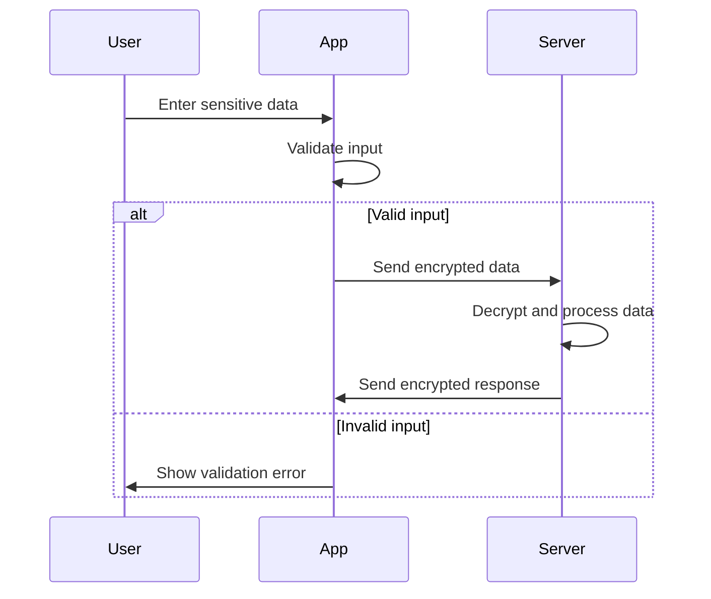

## 15.3 Protecting Sensitive Data

In today's digital age, protecting sensitive data is paramount. As Swift developers, we must ensure that our applications handle data securely, safeguarding it from unauthorized access and breaches. This section delves into various strategies for protecting sensitive data, focusing on encryption, anonymization, and secure data handling.

### Data Encryption

Encryption is a cornerstone of data security, transforming readable data into an unreadable format to prevent unauthorized access. Let's explore how we can encrypt data at rest and in transit in Swift applications.

#### Encrypting Data at Rest

Data at rest refers to data stored on a device or server. Encrypting this data ensures that even if unauthorized parties gain access to the storage medium, they cannot read the data without the decryption key.

**Steps to Encrypt Data at Rest:**

1. **Choose an Encryption Algorithm**: AES (Advanced Encryption Standard) is widely used due to its balance of security and performance.
2. **Generate a Secure Key**: Use a secure method to generate and store encryption keys.
3. **Encrypt Data**: Use the chosen algorithm and key to encrypt data before storing it.

**Swift Code Example for AES Encryption:**

```swift
import CommonCrypto

func aesEncrypt(data: Data, key: Data) throws -> Data {
    var numBytesEncrypted: size_t = 0
    let bufferSize: size_t = data.count + kCCBlockSizeAES128
    var buffer = Data(count: bufferSize)

    let cryptStatus = buffer.withUnsafeMutableBytes { bufferBytes in
        data.withUnsafeBytes { dataBytes in
            key.withUnsafeBytes { keyBytes in
                CCCrypt(
                    CCOperation(kCCEncrypt),
                    CCAlgorithm(kCCAlgorithmAES),
                    CCOptions(kCCOptionPKCS7Padding),
                    keyBytes.baseAddress, kCCKeySizeAES256,
                    nil,
                    dataBytes.baseAddress, data.count,
                    bufferBytes.baseAddress, bufferSize,
                    &numBytesEncrypted
                )
            }
        }
    }

    guard cryptStatus == kCCSuccess else {
        throw NSError(domain: "EncryptionError", code: cryptStatus, userInfo: nil)
    }

    return buffer.prefix(numBytesEncrypted)
}
```

**Key Considerations:**

- **Key Management**: Securely store and manage encryption keys, possibly using Apple's Keychain Services.
- **Performance**: Consider the performance impact of encryption, especially for large datasets.

#### Encrypting Data in Transit

Data in transit refers to data being transferred across networks. Encrypting this data prevents interception and eavesdropping.

**Steps to Encrypt Data in Transit:**

1. **Use HTTPS**: Ensure all network communications use HTTPS, which encrypts data using SSL/TLS.
2. **Validate Certificates**: Implement certificate pinning to prevent man-in-the-middle attacks.
3. **Use Secure Protocols**: Prefer secure protocols like TLS 1.2 or higher.

**Swift Code Example for HTTPS Requests:**

```swift
import Foundation

func performSecureRequest(url: URL) {
    var request = URLRequest(url: url)
    request.httpMethod = "GET"

    let session = URLSession(configuration: .default)
    let task = session.dataTask(with: request) { data, response, error in
        if let error = error {
            print("Request failed with error: \\(error)")
            return
        }

        guard let data = data else {
            print("No data received")
            return
        }

        // Process the received data
        print("Data received: \\(data)")
    }

    task.resume()
}
```

**Key Considerations:**

- **SSL/TLS Configuration**: Ensure your server supports strong encryption protocols and ciphers.
- **Certificate Validation**: Regularly update and validate SSL/TLS certificates.

### Data Anonymization

Data anonymization involves modifying data to prevent the identification of individuals, while still allowing for data analysis.

#### Removing Identifiers

Removing identifiers involves stripping out or obfuscating any data that can directly identify individuals.

**Steps to Remove Identifiers:**

1. **Identify PII**: Determine which data fields contain personally identifiable information (PII).
2. **Remove or Mask**: Remove or mask these fields to anonymize the data.

**Swift Code Example for Removing Identifiers:**

```swift
struct UserData {
    var name: String
    var email: String
    var age: Int
}

func anonymizeData(userData: [UserData]) -> [UserData] {
    return userData.map { user in
        UserData(name: "Anonymous", email: "hidden@example.com", age: user.age)
    }
}

let users = [UserData(name: "John Doe", email: "john.doe@example.com", age: 30)]
let anonymizedUsers = anonymizeData(userData: users)
print(anonymizedUsers)
```

#### Using Hashing

Hashing converts data into a fixed-size string of characters, which is typically a hash code. It's a one-way process, meaning you cannot reverse it to retrieve the original data.

**Steps to Use Hashing:**

1. **Choose a Hash Function**: Use a secure hash function like SHA-256.
2. **Hash Data**: Convert sensitive data to its hash representation.

**Swift Code Example for Hashing:**

```swift
import CryptoKit

func hashData(data: Data) -> String {
    let hash = SHA256.hash(data: data)
    return hash.compactMap { String(format: "%02x", $0) }.joined()
}

let sensitiveData = "Sensitive Information".data(using: .utf8)!
let hashedData = hashData(data: sensitiveData)
print("Hashed Data: \\(hashedData)")
```

**Key Considerations:**

- **Salted Hashes**: Use salts to enhance security, especially for passwords.
- **Irreversibility**: Ensure that the hash function used is irreversible.

### Secure Data Handling

Secure data handling involves practices that ensure data integrity and prevent unauthorized access or modifications.

#### Input Validation

Input validation ensures that the data received by the application is correct and safe to process.

**Steps for Input Validation:**

1. **Define Validation Rules**: Establish rules for what constitutes valid input.
2. **Validate Input**: Check input against these rules before processing.

**Swift Code Example for Input Validation:**

```swift
func isValidEmail(_ email: String) -> Bool {
    let emailRegEx = "[A-Z0-9a-z._%+-]+@[A-Za-z0-9.-]+\\.[A-Za-z]{2,64}"
    let emailPredicate = NSPredicate(format:"SELF MATCHES %@", emailRegEx)
    return emailPredicate.evaluate(with: email)
}

let email = "test@example.com"
print("Is valid email: \\(isValidEmail(email))")
```

#### Output Encoding

Output encoding transforms data into a safe format for rendering, preventing injection attacks.

**Steps for Output Encoding:**

1. **Identify Output Points**: Determine where data is output to users or systems.
2. **Encode Data**: Use appropriate encoding methods (e.g., HTML encoding) to prevent injection.

**Swift Code Example for Output Encoding:**

```swift
func htmlEncode(_ string: String) -> String {
    var encodedString = string
    encodedString = encodedString.replacingOccurrences(of: "&", with: "&amp;")
    encodedString = encodedString.replacingOccurrences(of: "<", with: "&lt;")
    encodedString = encodedString.replacingOccurrences(of: ">", with: "&gt;")
    encodedString = encodedString.replacingOccurrences(of: "\"", with: "&quot;")
    encodedString = encodedString.replacingOccurrences(of: "'", with: "&#39;")
    return encodedString
}

let userInput = "<script>alert('XSS')</script>"
let safeOutput = htmlEncode(userInput)
print("Encoded Output: \\(safeOutput)")
```

**Key Considerations:**

- **Contextual Encoding**: Use different encoding strategies based on the context (e.g., HTML, JavaScript).
- **Regular Updates**: Keep encoding libraries and methods updated to handle new threats.

### Visualizing Data Protection

To better understand the flow of data protection in a Swift application, let's visualize the process using a sequence diagram.



**Diagram Description**: This sequence diagram illustrates the process of protecting sensitive data in a Swift application. The user inputs data, which the app validates. If valid, the app encrypts and sends the data to the server. The server decrypts, processes the data, and sends an encrypted response back to the app. If the input is invalid, the app returns an error message to the user.

### Try It Yourself

Experiment with the code examples provided. Try modifying the encryption key or hash function to see how it affects the output. Implement your own input validation rules and test them with different data sets. Remember, practice is key to mastering data protection in Swift!

### References and Links

- [Apple's Security Framework](https://developer.apple.com/documentation/security)
- [CommonCrypto Library](https://opensource.apple.com/source/CommonCrypto/)
- [CryptoKit Documentation](https://developer.apple.com/documentation/cryptokit)
- [OWASP Secure Coding Practices](https://owasp.org/www-project-secure-coding-practices-quick-reference-guide/)

### Knowledge Check

- What are the key differences between encrypting data at rest and in transit?
- How can hashing be used to anonymize data?
- Why is input validation crucial for secure data handling?
- What are some common encoding methods to prevent injection attacks?

### Embrace the Journey

Remember, protecting sensitive data is a continuous process. As you develop your Swift applications, keep security at the forefront of your design and implementation decisions. Stay curious, keep learning, and enjoy the journey of mastering data protection in Swift!

## Quiz Time!



### What is the primary purpose of data encryption?

- [x] To transform readable data into an unreadable format
- [ ] To store data in a database
- [ ] To increase data processing speed
- [ ] To format data for display

> **Explanation:** Data encryption transforms readable data into an unreadable format to prevent unauthorized access.

### Which encryption algorithm is commonly used for encrypting data at rest?

- [x] AES
- [ ] DES
- [ ] MD5
- [ ] SHA-1

> **Explanation:** AES (Advanced Encryption Standard) is widely used for encrypting data at rest due to its security and performance.

### What is the purpose of using HTTPS for data in transit?

- [x] To encrypt data being transferred across networks
- [ ] To increase data transfer speed
- [ ] To format data for display
- [ ] To compress data for storage

> **Explanation:** HTTPS encrypts data being transferred across networks to prevent interception and eavesdropping.

### What is a common method for anonymizing data?

- [x] Removing identifiers
- [ ] Adding more identifiers
- [ ] Storing data in plain text
- [ ] Using compression

> **Explanation:** Removing identifiers is a common method for anonymizing data to protect user identities.

### What is the primary characteristic of a hash function?

- [x] Irreversibility
- [ ] Reversibility
- [ ] Compression
- [ ] Encryption

> **Explanation:** A hash function is characterized by its irreversibility, meaning the original data cannot be retrieved from the hash.

### Why is input validation important?

- [x] To ensure data integrity and prevent unauthorized access
- [ ] To increase data processing speed
- [ ] To format data for display
- [ ] To compress data for storage

> **Explanation:** Input validation ensures data integrity and prevents unauthorized access by checking data against predefined rules.

### What is the purpose of output encoding?

- [x] To transform data into a safe format for rendering
- [ ] To increase data processing speed
- [ ] To format data for display
- [ ] To compress data for storage

> **Explanation:** Output encoding transforms data into a safe format for rendering, preventing injection attacks.

### Which of the following is a secure hash function?

- [x] SHA-256
- [ ] MD5
- [ ] DES
- [ ] AES

> **Explanation:** SHA-256 is a secure hash function commonly used for hashing data.

### What should be considered when managing encryption keys?

- [x] Secure storage and management
- [ ] Increasing key length indefinitely
- [ ] Storing keys in plain text
- [ ] Sharing keys publicly

> **Explanation:** Encryption keys should be securely stored and managed to prevent unauthorized access.

### True or False: Data anonymization can be reversed to retrieve the original data.

- [ ] True
- [x] False

> **Explanation:** Data anonymization is designed to prevent the retrieval of the original data, making it irreversible.




