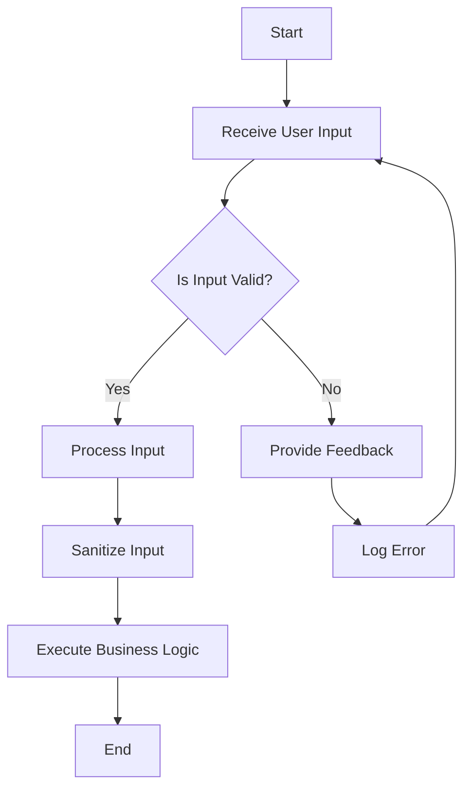

## 15.4 Input Validation and Data Sanitization

In the realm of software development, especially when working with Swift for iOS, macOS, and server-side applications, input validation and data sanitization are critical components in ensuring the security and robustness of your applications. This section will delve into the importance of these practices, explore various techniques, and provide practical examples to help you implement them effectively in your Swift projects.

### Understanding Input Validation and Data Sanitization

Input validation is the process of ensuring that the data provided by users or external systems is correct, complete, and secure before it is processed by your application. Data sanitization, on the other hand, involves cleaning or filtering input to prevent malicious data from causing harm. Together, these practices help prevent common security vulnerabilities such as SQL Injection and Cross-Site Scripting (XSS).

#### Preventing Attacks

1. **SQL Injection**: This occurs when an attacker is able to manipulate a SQL query by injecting malicious SQL code through user input. To prevent SQL Injection, always use parameterized queries or prepared statements.

2. **Cross-Site Scripting (XSS)**: XSS attacks involve injecting malicious scripts into web pages viewed by other users. Sanitizing user input is crucial to prevent XSS by removing or escaping potentially harmful characters.

### Validation Techniques

#### Whitelist Validation

Whitelist validation involves specifying a set of acceptable inputs and rejecting anything that does not conform to this list. This approach is generally more secure than blacklist validation, which attempts to block known bad inputs.

```swift
func isValidUsername(_ username: String) -> Bool {
    let allowedCharacters = CharacterSet.alphanumerics
    return username.rangeOfCharacter(from: allowedCharacters.inverted) == nil
}

let username = "JohnDoe123"
if isValidUsername(username) {
    print("Username is valid.")
} else {
    print("Invalid username.")
}
```

In the example above, we define a function `isValidUsername` that checks if the input contains only alphanumeric characters, effectively whitelisting acceptable characters.

#### Regular Expressions

Regular expressions are powerful tools for defining patterns that input must match. They are particularly useful for validating complex input formats, such as email addresses or phone numbers.

```swift
func isValidEmail(_ email: String) -> Bool {
    let emailRegex = "[A-Z0-9a-z._%+-]+@[A-Za-z0-9.-]+\\.[A-Za-z]{2,}"
    let emailPredicate = NSPredicate(format: "SELF MATCHES %@", emailRegex)
    return emailPredicate.evaluate(with: email)
}

let email = "example@example.com"
if isValidEmail(email) {
    print("Email is valid.")
} else {
    print("Invalid email address.")
}
```

This code snippet uses a regular expression to validate email addresses, ensuring they follow a standard format.

### Error Handling

Effective error handling is essential in input validation and data sanitization. It not only helps in providing feedback to users but also aids in logging and monitoring suspicious activities.

#### User Feedback

Providing clear and informative error messages can enhance user experience and guide users in correcting their input.

```swift
func validatePassword(_ password: String) -> String {
    if password.count < 8 {
        return "Password must be at least 8 characters long."
    }
    return "Password is valid."
}

let password = "pass"
let feedback = validatePassword(password)
print(feedback)
```

In this example, the function `validatePassword` provides feedback on whether the password meets the minimum length requirement.

#### Logging

Logging plays a crucial role in monitoring application security. By recording suspicious activities, developers can identify and address potential threats proactively.

```swift
func logSuspiciousActivity(_ activity: String) {
    // Log the activity to a file or monitoring system
    print("Suspicious activity detected: \\(activity)")
}

let input = "<script>alert('XSS')</script>"
if input.contains("<script>") {
    logSuspiciousActivity("Potential XSS attempt with input: \\(input)")
}
```

Here, we log a potential XSS attempt, which can be useful for security audits and incident response.

### Try It Yourself

Experiment with the code examples provided by making the following modifications:

- Extend the `isValidUsername` function to allow underscores and hyphens.
- Modify the `isValidEmail` function to include domain-specific rules.
- Enhance the `validatePassword` function to check for a mix of uppercase, lowercase, numbers, and special characters.

### Visualizing Input Validation and Data Sanitization

To better understand the process of input validation and data sanitization, let's visualize the workflow using a flowchart.



This flowchart illustrates the typical flow of input validation and data sanitization, highlighting the decision points and actions taken based on input validity.

### References and Links

For further reading on input validation and data sanitization, consider the following resources:

- [OWASP Input Validation Cheat Sheet](https://owasp.org/www-project-cheat-sheets/cheatsheets/Input_Validation_Cheat_Sheet.html)
- [Apple's Security Documentation](https://developer.apple.com/documentation/security)
- [Swift.org](https://swift.org/documentation/)

### Knowledge Check

To reinforce your understanding of input validation and data sanitization, consider the following questions:

- What is the difference between input validation and data sanitization?
- Why is whitelist validation generally preferred over blacklist validation?
- How can regular expressions be used to validate user input?
- What are the benefits of providing clear user feedback during input validation?
- How does logging contribute to application security?

### Embrace the Journey

Remember, mastering input validation and data sanitization is a crucial step in building secure and robust applications. As you continue to develop your skills, keep experimenting with different techniques, stay curious, and enjoy the journey of learning and growth in Swift development.

## Quiz Time!



### What is the primary goal of input validation?

- [x] To ensure that input data is correct and secure before processing
- [ ] To enhance the user interface
- [ ] To improve application performance
- [ ] To reduce code complexity

> **Explanation:** Input validation ensures that the data provided by users or external systems is correct, complete, and secure before it is processed by the application.

### Which of the following is a common technique for preventing SQL Injection?

- [x] Using parameterized queries
- [ ] Using inline SQL queries
- [ ] Using dynamic SQL
- [ ] Using string concatenation for SQL queries

> **Explanation:** Parameterized queries or prepared statements are used to prevent SQL Injection by separating SQL code from data.

### What is the purpose of data sanitization?

- [x] To clean or filter input to prevent malicious data from causing harm
- [ ] To format data for display
- [ ] To compress data for storage
- [ ] To encrypt data for security

> **Explanation:** Data sanitization involves cleaning or filtering input to prevent malicious data from causing harm, such as XSS attacks.

### Which validation technique involves specifying a set of acceptable inputs?

- [x] Whitelist validation
- [ ] Blacklist validation
- [ ] Range validation
- [ ] Type validation

> **Explanation:** Whitelist validation involves specifying a set of acceptable inputs and rejecting anything that does not conform to this list.

### How can regular expressions be used in input validation?

- [x] By defining patterns that input must match
- [ ] By encrypting input data
- [ ] By compressing input data
- [ ] By formatting input data

> **Explanation:** Regular expressions are used to define patterns that input must match, making them useful for validating complex input formats.

### What is a key benefit of providing clear user feedback during input validation?

- [x] It enhances user experience by guiding users in correcting their input
- [ ] It reduces application performance
- [ ] It increases code complexity
- [ ] It decreases application security

> **Explanation:** Providing clear and informative error messages can enhance user experience and guide users in correcting their input.

### How does logging contribute to application security?

- [x] By recording suspicious activities for monitoring and auditing
- [ ] By encrypting user data
- [ ] By compressing log files
- [ ] By formatting error messages

> **Explanation:** Logging plays a crucial role in monitoring application security by recording suspicious activities, which can help identify and address potential threats.

### What is a common vulnerability that input validation aims to prevent?

- [x] SQL Injection
- [ ] Buffer Overflow
- [ ] Denial of Service
- [ ] Man-in-the-Middle

> **Explanation:** Input validation aims to prevent vulnerabilities such as SQL Injection by ensuring that input data is correct and secure.

### True or False: Blacklist validation is generally more secure than whitelist validation.

- [ ] True
- [x] False

> **Explanation:** Whitelist validation is generally more secure than blacklist validation because it specifies a set of acceptable inputs, reducing the risk of overlooking malicious inputs.

### What is an effective way to validate email addresses in Swift?

- [x] Using regular expressions
- [ ] Using string concatenation
- [ ] Using inline SQL queries
- [ ] Using dynamic SQL

> **Explanation:** Regular expressions are effective for validating email addresses by ensuring they follow a standard format.




