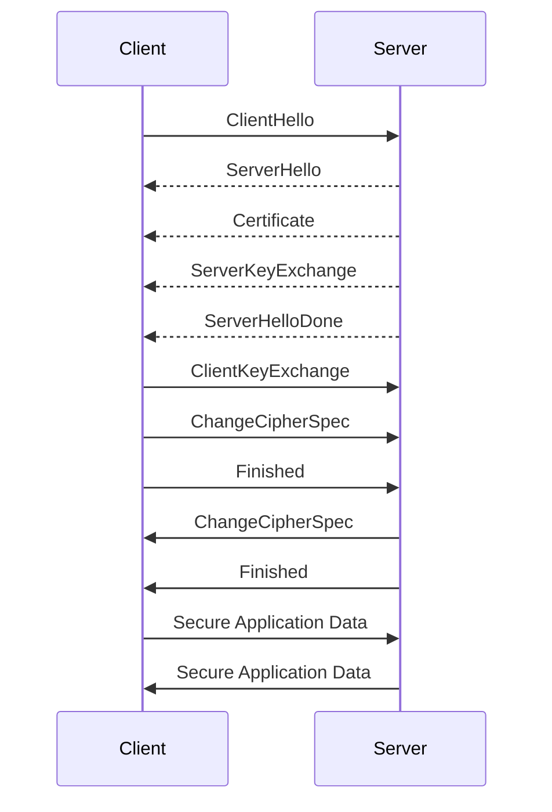

## 15.5 Secure Networking with SSL/TLS

In today's digital landscape, ensuring the security of data transmitted over networks is paramount. SSL (Secure Sockets Layer) and its successor, TLS (Transport Layer Security), are cryptographic protocols designed to provide secure communication over a computer network. As Swift developers, understanding and implementing these protocols is crucial for building secure iOS and macOS applications. This section will guide you through the essentials of secure networking with SSL/TLS, covering certificates, certificate authorities, network security protocols, and testing and verification techniques.

### Implementing HTTPS

#### Certificates: Obtaining and Configuring SSL Certificates

SSL certificates are digital certificates that authenticate the identity of a website and enable an encrypted connection. They are essential for implementing HTTPS, the secure version of HTTP. Here's how you can obtain and configure SSL certificates:

1. **Obtaining an SSL Certificate**:
   - **Choose a Certificate Authority (CA)**: A CA is a trusted entity that issues digital certificates. Popular CAs include Let's Encrypt, DigiCert, and Comodo.
   - **Generate a Certificate Signing Request (CSR)**: A CSR is a block of encoded text submitted to a CA to apply for an SSL certificate. It includes information such as your domain name and organization details.
   - **Submit the CSR to the CA**: The CA will verify your information and issue an SSL certificate.

2. **Configuring SSL Certificates**:
   - **Install the Certificate on Your Server**: Follow the server's documentation to install the SSL certificate. This typically involves uploading the certificate files and configuring the server to use them.
   - **Update Your Application's Configuration**: Ensure your application is configured to use HTTPS for all network requests. This may involve updating URLs and network settings.

3. **Code Example**: Configuring an SSL certificate in a Swift application.

```swift
import Foundation

let url = URL(string: "https://your-secure-domain.com")!
var request = URLRequest(url: url)
request.httpMethod = "GET"

// Configure URLSession with SSL pinning
let session = URLSession(configuration: .default, delegate: self, delegateQueue: nil)

let task = session.dataTask(with: request) { data, response, error in
    if let error = error {
        print("Error: \\(error)")
        return
    }
    if let data = data {
        print("Data received: \\(data)")
    }
}

task.resume()

// URLSessionDelegate method for SSL pinning
extension YourClass: URLSessionDelegate {
    func urlSession(_ session: URLSession, didReceive challenge: URLAuthenticationChallenge, completionHandler: @escaping (URLSession.AuthChallengeDisposition, URLCredential?) -> Void) {
        if challenge.protectionSpace.authenticationMethod == NSURLAuthenticationMethodServerTrust {
            if let serverTrust = challenge.protectionSpace.serverTrust {
                let credential = URLCredential(trust: serverTrust)
                completionHandler(.useCredential, credential)
            } else {
                completionHandler(.cancelAuthenticationChallenge, nil)
            }
        }
    }
}
```

#### Certificate Authorities: Trusting Reputable CAs

A Certificate Authority (CA) is a trusted entity that issues digital certificates. Trusting reputable CAs is crucial for ensuring the security of SSL/TLS connections. Here are some key points to consider:

- **Reputation and Trust**: Choose CAs with a strong reputation and track record. Reputable CAs undergo rigorous audits and adhere to industry standards.
- **Root Certificates**: Ensure your application's trust store includes the root certificates of trusted CAs. This allows your app to verify the authenticity of SSL certificates issued by these CAs.
- **Certificate Validation**: Implement certificate validation in your application to verify the authenticity of SSL certificates. This involves checking the certificate's signature, expiration date, and revocation status.

### Network Security Protocols

#### TLS Versions: Using Up-to-Date Protocols

TLS is the successor to SSL and provides enhanced security features. It's important to use up-to-date TLS versions to protect against vulnerabilities:

- **TLS 1.2 and 1.3**: These are the most secure and widely supported versions of TLS. TLS 1.3 offers improved performance and security features, such as reduced handshake latency and stronger encryption algorithms.
- **Deprecating Older Versions**: Avoid using older versions of TLS (such as TLS 1.0 and 1.1) as they are vulnerable to attacks. Ensure your server and application configuration support only TLS 1.2 and 1.3.

#### Cipher Suites: Selecting Secure Encryption Algorithms

Cipher suites are sets of algorithms that determine the security settings for a TLS connection. Selecting secure cipher suites is crucial for protecting data:

- **Strong Encryption**: Choose cipher suites that offer strong encryption algorithms, such as AES (Advanced Encryption Standard) with 256-bit keys.
- **Perfect Forward Secrecy (PFS)**: Use cipher suites that support PFS, which ensures that session keys cannot be compromised even if the server's private key is compromised.
- **Elliptic Curve Cryptography (ECC)**: ECC offers strong security with smaller key sizes, making it a preferred choice for modern applications.

### Testing and Verification

#### SSL Labs Tools: Analyzing SSL Configurations

SSL Labs offers tools for analyzing SSL configurations and identifying potential vulnerabilities. Here's how you can use these tools:

- **SSL Server Test**: This tool analyzes your server's SSL configuration and provides a detailed report on its security features, including supported protocols, cipher suites, and certificate validity.
- **SSL Client Test**: This tool evaluates your application's SSL configuration and provides recommendations for improving security.

#### Continuous Monitoring: Keeping Security Measures Updated

Continuous monitoring is essential for maintaining the security of your SSL/TLS configurations. Here are some best practices:

- **Regular Audits**: Conduct regular audits of your SSL/TLS configurations to ensure they comply with industry standards and best practices.
- **Automated Alerts**: Set up automated alerts to notify you of any changes or vulnerabilities in your SSL/TLS configurations.
- **Security Updates**: Keep your server and application software up-to-date with the latest security patches and updates.

### Visualizing SSL/TLS Handshake

To better understand the SSL/TLS handshake process, let's visualize it using a sequence diagram:



**Caption**: The SSL/TLS handshake process involves a series of exchanges between the client and server to establish a secure connection.

### Try It Yourself

Experiment with the provided code example by modifying the URL to point to a different secure domain. Observe how the SSL/TLS handshake process works and how the application handles secure connections. Consider implementing additional security measures, such as certificate pinning, to enhance the security of your application.

### Knowledge Check

- **What is the role of a Certificate Authority (CA) in SSL/TLS?**
- **Why is it important to use up-to-date TLS versions?**
- **What are cipher suites, and why are they important for secure networking?**
- **How can SSL Labs tools help improve your application's security?**

### Summary

In this section, we've explored the essentials of secure networking with SSL/TLS in Swift. We've discussed the importance of obtaining and configuring SSL certificates, trusting reputable CAs, using up-to-date TLS versions, selecting secure cipher suites, and conducting testing and verification. By implementing these practices, you can enhance the security of your Swift applications and protect sensitive data transmitted over networks.

Remember, mastering secure networking with SSL/TLS is an ongoing journey. Stay informed about the latest security trends and best practices, and continue to refine your skills to build robust and secure applications.

## Quiz Time!



### What is the primary purpose of SSL/TLS?

- [x] To provide secure communication over a network
- [ ] To increase the speed of data transmission
- [ ] To reduce the cost of network infrastructure
- [ ] To enable peer-to-peer file sharing

> **Explanation:** SSL/TLS is designed to provide secure communication over a network by encrypting data and authenticating the identities of the communicating parties.

### Which entity issues SSL certificates?

- [x] Certificate Authority (CA)
- [ ] Internet Service Provider (ISP)
- [ ] Domain Registrar
- [ ] Network Administrator

> **Explanation:** A Certificate Authority (CA) is a trusted entity that issues SSL certificates after verifying the identity of the applicant.

### What is a Certificate Signing Request (CSR)?

- [x] A block of encoded text submitted to a CA to apply for an SSL certificate
- [ ] A request sent by the client to initiate an SSL handshake
- [ ] A document that outlines the terms and conditions of an SSL certificate
- [ ] A request for renewing an expired SSL certificate

> **Explanation:** A CSR is a block of encoded text containing information about the applicant, submitted to a CA to apply for an SSL certificate.

### Why is it important to use up-to-date TLS versions?

- [x] To protect against known vulnerabilities
- [ ] To improve server performance
- [ ] To reduce the cost of SSL certificates
- [ ] To enable faster data transmission

> **Explanation:** Using up-to-date TLS versions helps protect against known vulnerabilities and ensures the security of network communications.

### What is Perfect Forward Secrecy (PFS)?

- [x] A feature that ensures session keys cannot be compromised even if the server's private key is compromised
- [ ] A method for compressing data before transmission
- [ ] A protocol for establishing peer-to-peer connections
- [ ] A technique for optimizing server performance

> **Explanation:** PFS is a feature that ensures session keys remain secure even if the server's private key is compromised, enhancing the security of encrypted communications.

### Which tool can be used to analyze SSL configurations?

- [x] SSL Labs
- [ ] Wireshark
- [ ] Apache Benchmark
- [ ] Nmap

> **Explanation:** SSL Labs provides tools for analyzing SSL configurations and identifying potential vulnerabilities.

### What is the role of cipher suites in SSL/TLS?

- [x] They determine the security settings for a TLS connection
- [ ] They manage the allocation of IP addresses
- [ ] They optimize the speed of data transmission
- [ ] They provide a backup for SSL certificates

> **Explanation:** Cipher suites are sets of algorithms that determine the security settings for a TLS connection, including encryption and authentication methods.

### Why is continuous monitoring important for SSL/TLS configurations?

- [x] To ensure security measures remain effective and up-to-date
- [ ] To increase the speed of data transmission
- [ ] To reduce the cost of SSL certificates
- [ ] To enable peer-to-peer file sharing

> **Explanation:** Continuous monitoring helps ensure that SSL/TLS configurations remain secure and up-to-date with the latest security patches and best practices.

### What is the benefit of using Elliptic Curve Cryptography (ECC) in SSL/TLS?

- [x] It offers strong security with smaller key sizes
- [ ] It reduces the cost of SSL certificates
- [ ] It increases the speed of data transmission
- [ ] It simplifies the SSL handshake process

> **Explanation:** ECC offers strong security with smaller key sizes, making it an efficient choice for modern applications.

### True or False: SSL/TLS is only used for securing web applications.

- [ ] True
- [x] False

> **Explanation:** SSL/TLS is used for securing various types of network communications, not just web applications. It can be applied to email, file transfers, and more.



By mastering SSL/TLS in Swift, you're taking a significant step towards building secure and robust applications. Keep exploring, stay curious, and continue enhancing your skills in secure networking.


