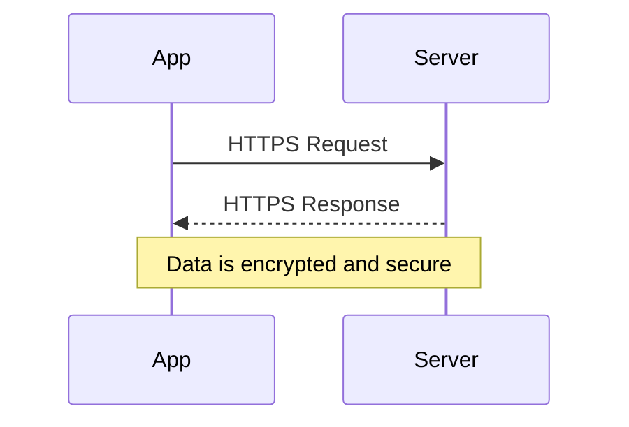

## 15.6 App Transport Security (ATS) and Network Security

In today's digital landscape, ensuring the security of data in transit is a fundamental aspect of app development. App Transport Security (ATS) is a feature introduced by Apple to enhance the security of network connections in iOS and macOS apps. This section delves into the intricacies of ATS, its requirements, how to manage exceptions, and the broader implications for network security.

### Understanding App Transport Security (ATS)

App Transport Security (ATS) is a set of default security policies that Apple introduced with iOS 9 and OS X 10.11. The primary goal of ATS is to enforce secure connections between apps and web services, thereby protecting user data from interception and tampering.

#### ATS Requirements

ATS mandates that all HTTP connections use HTTPS, ensuring that data is encrypted in transit. Here are the key requirements:

- **HTTPS Connections**: ATS requires apps to connect to servers using HTTPS rather than HTTP. This ensures that all data transmitted between the app and the server is encrypted using Transport Layer Security (TLS).
- **TLS Configurations**: ATS enforces the use of strong TLS configurations. This includes requiring TLS version 1.2 or later and disallowing weak cryptographic algorithms and ciphers.

#### Implementing ATS in Your App

To comply with ATS, developers must ensure that their apps only make network requests to servers that support HTTPS with strong TLS configurations. Here's how you can enforce ATS in your Swift app:

```swift
import Foundation

let url = URL(string: "https://example.com/api/data")!
let task = URLSession.shared.dataTask(with: url) { data, response, error in
    if let error = error {
        print("Error: \\(error)")
        return
    }
    if let data = data {
        print("Data received: \\(data)")
    }
}
task.resume()
```

In this example, we create a URL session that connects to a secure HTTPS endpoint. This is a fundamental step in adhering to ATS policies.

### Managing Exceptions

While ATS provides a robust framework for securing network communications, there are scenarios where exceptions are necessary. Understanding when and how to manage these exceptions is crucial for maintaining security without compromising functionality.

#### Permitted Exceptions

There are legitimate cases where ATS exceptions might be justified, such as:

- **Legacy Systems**: Some older systems may not support the required TLS configurations.
- **Third-Party Services**: Certain third-party services might not offer HTTPS endpoints.

#### Configuring Info.plist

To configure ATS exceptions, you need to modify your app's `Info.plist` file. Here's an example of how to allow an exception for a specific domain:

```xml
<key>NSAppTransportSecurity</key>
<dict>
    <key>NSExceptionDomains</key>
    <dict>
        <key>example.com</key>
        <dict>
            <key>NSTemporaryExceptionAllowsInsecureHTTPLoads</key>
            <true/>
            <key>NSTemporaryExceptionMinimumTLSVersion</key>
            <string>TLSv1.0</string>
        </dict>
    </dict>
</dict>
```

In this configuration, we allow insecure HTTP loads for `example.com` and specify a minimum TLS version of 1.0. It's important to use such exceptions sparingly and only when absolutely necessary.

### Security Implications

Managing ATS and network security effectively requires a thorough understanding of the potential risks and the importance of maintaining user trust.

#### Risk Assessment

Before implementing ATS exceptions, conduct a risk assessment to evaluate the potential security implications. Consider the following:

- **Data Sensitivity**: Assess the sensitivity of the data being transmitted. Sensitive data warrants stricter security measures.
- **Server Security**: Evaluate the security posture of the servers you are connecting to. Ensure they are regularly updated and patched.

#### User Trust

Maintaining user trust is paramount. Users expect their data to be handled securely, and any breach of this trust can have significant repercussions. Here are some best practices to uphold user trust:

- **Transparency**: Clearly communicate your app's security measures to users.
- **Regular Updates**: Keep your app and its dependencies up to date with the latest security patches.
- **User Education**: Educate users about the importance of using secure connections and the potential risks of insecure networks.

### Visualizing ATS and Network Security

To better understand how ATS fits into the broader context of network security, let's visualize the flow of data in a secure network connection.



This diagram illustrates the secure exchange of data between an app and a server using HTTPS, as enforced by ATS.

### Try It Yourself

To deepen your understanding of ATS, try modifying the code example to connect to a non-HTTPS endpoint and observe the behavior. Then, add an exception in the `Info.plist` file and see how it affects the connection. Remember, experimenting is a great way to learn and solidify your understanding.

### References and Further Reading

For more information on ATS and network security, consider the following resources:

- [Apple's App Transport Security Documentation](https://developer.apple.com/documentation/bundleresources/information_property_list/nsapptransportsecurity)
- [OWASP Secure Coding Practices](https://owasp.org/www-project-secure-coding-practices-quick-reference-guide/)
- [TLS Best Practices from Mozilla](https://wiki.mozilla.org/Security/Server_Side_TLS)

### Knowledge Check

1. Explain the primary purpose of App Transport Security (ATS).
2. Describe a scenario where an ATS exception might be necessary.
3. What are the potential risks of allowing ATS exceptions?

### Embrace the Journey

As we continue to explore the world of network security in Swift development, remember that security is an ongoing process. Stay curious, keep learning, and always strive to enhance the security of your applications.

## Quiz Time!



### What is the primary purpose of App Transport Security (ATS)?

- [x] To enforce secure connections between apps and web services.
- [ ] To allow apps to connect to any server without restrictions.
- [ ] To improve app performance by reducing encryption overhead.
- [ ] To simplify network configuration for developers.

> **Explanation:** ATS is designed to enforce secure connections, ensuring data is encrypted and protected from interception.

### Which of the following is a requirement of ATS?

- [x] Use of HTTPS connections.
- [ ] Use of HTTP connections.
- [ ] Allowing weak cryptographic algorithms.
- [ ] Disabling TLS.

> **Explanation:** ATS requires the use of HTTPS to ensure secure data transmission.

### When might an ATS exception be justified?

- [x] When connecting to a legacy system that does not support HTTPS.
- [ ] When the app is in development and not yet released.
- [ ] When the app needs to improve performance.
- [ ] When the developer prefers HTTP for simplicity.

> **Explanation:** Exceptions may be necessary for legacy systems that cannot support the required security protocols.

### How can ATS exceptions be configured in a Swift app?

- [x] By modifying the Info.plist file.
- [ ] By changing the app's source code.
- [ ] By disabling ATS in Xcode settings.
- [ ] By using a third-party library.

> **Explanation:** ATS exceptions are configured in the Info.plist file.

### What should be considered before implementing an ATS exception?

- [x] The sensitivity of the data being transmitted.
- [x] The security posture of the server.
- [ ] The app's user interface design.
- [ ] The app's color scheme.

> **Explanation:** It's important to assess data sensitivity and server security before allowing exceptions.

### Why is it important to maintain user trust in app security?

- [x] To ensure users feel confident in using the app.
- [ ] To reduce the app's development time.
- [ ] To increase the app's download size.
- [ ] To simplify the app's user interface.

> **Explanation:** User trust is crucial for the app's reputation and user retention.

### What is a potential risk of allowing ATS exceptions?

- [x] Increased vulnerability to data interception.
- [ ] Improved app performance.
- [ ] Enhanced user experience.
- [ ] Simplified network configuration.

> **Explanation:** Allowing exceptions can expose data to interception and compromise security.

### What does the sequence diagram illustrate?

- [x] The secure exchange of data between an app and a server using HTTPS.
- [ ] The process of configuring ATS exceptions.
- [ ] The flow of data in an insecure connection.
- [ ] The steps to disable ATS in an app.

> **Explanation:** The diagram shows how data is securely exchanged using HTTPS.

### True or False: ATS allows the use of weak cryptographic algorithms.

- [ ] True
- [x] False

> **Explanation:** ATS does not allow weak cryptographic algorithms; it requires strong encryption.



Remember, mastering network security is a journey. Keep exploring, stay informed, and apply what you've learned to build robust and secure Swift applications.


