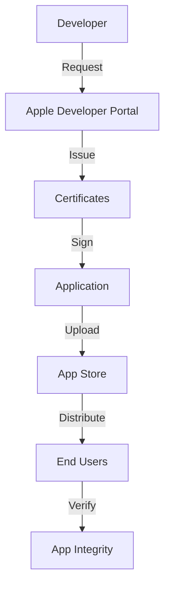
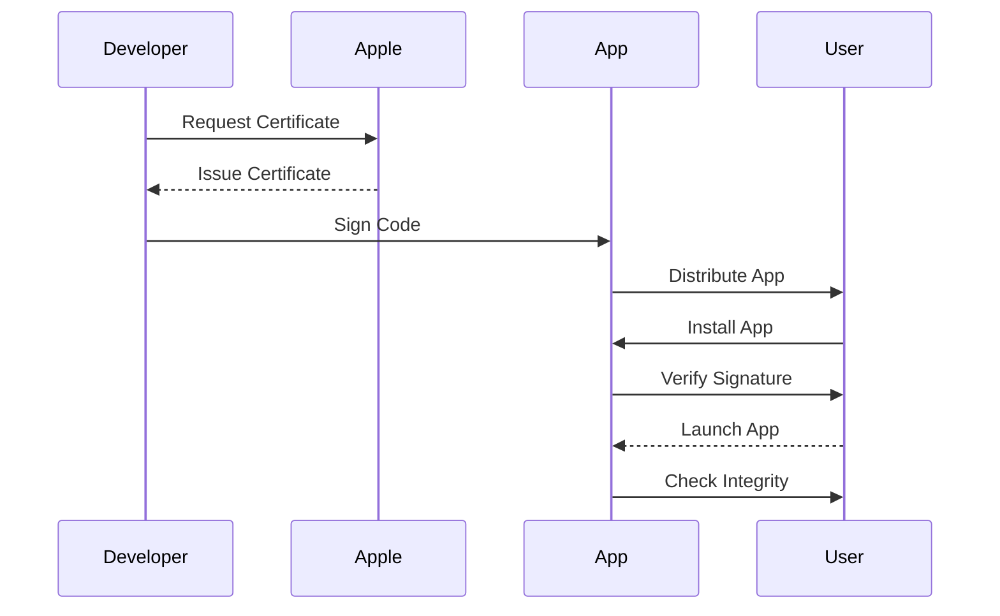

## 15.7 Code Signing and Integrity Checks

In the realm of Swift development, ensuring the security and integrity of your applications is paramount. This involves a multi-faceted approach that includes code signing, runtime integrity checks, and protecting your intellectual property. Let's delve into each of these aspects to understand how they contribute to building robust and secure Swift applications.

### Code Signing Process

Code signing is a critical process that ensures the authenticity and integrity of your application. It involves using cryptographic techniques to sign your code, allowing users and the operating system to verify that the code has not been tampered with.

#### Certificates and Profiles

To begin with, code signing requires the use of certificates and provisioning profiles. These are issued by Apple and serve as a digital identity for your application.

- **Development Certificates**: These are used during the development phase to test your application on real devices. They ensure that only authorized developers can run the app on their devices.

- **Distribution Certificates**: These are used when you are ready to distribute your app to the App Store or for enterprise distribution. They verify that the app is from a trusted source and has not been altered since it was signed.

- **Provisioning Profiles**: These profiles link your app to a specific set of devices and a particular certificate. They define the app's entitlements and are essential for both development and distribution.

Here's a simple diagram illustrating the code signing process:



#### Signature Verification

Once your app is signed, the signature verification process ensures that the app's code has not been altered since it was signed. This verification happens both when the app is installed and each time it is launched.

- **Installation Verification**: When a user installs your app, the operating system checks the digital signature to ensure it matches the one on file with Apple. If the signature is invalid, the installation is aborted.

- **Launch Verification**: Every time your app is launched, the system verifies its signature to ensure no unauthorized changes have been made. This prevents malicious code injections and ensures the app's integrity.

### Runtime Integrity

Ensuring the integrity of your app at runtime is crucial to prevent unauthorized modifications and ensure it operates as intended.

#### Jailbreak Detection

Jailbreaking a device removes the security restrictions imposed by the operating system, potentially exposing your app to various threats. Implementing jailbreak detection can help you identify compromised devices and take appropriate actions.

- **Detection Techniques**: Use system APIs to check for common signs of jailbreaking, such as the presence of unauthorized files or directories, or the ability to write to restricted areas of the file system.

- **Response Strategies**: Decide on a course of action if a jailbreak is detected, such as disabling certain features, logging the event, or even refusing to run the app.

#### Tampering Detection

Tampering detection involves checking your app for unauthorized code changes or modifications.

- **Checksum Verification**: Calculate checksums for critical files or resources and verify them at runtime to detect any alterations.

- **Code Integrity Checks**: Use techniques like code signing verification and hash checks to ensure that the code running on the device is exactly what you intended.

### Protecting Intellectual Property

Your app's code is a valuable asset, and protecting it from reverse engineering and unauthorized use is essential.

#### Obfuscation

Obfuscation involves making your code harder to understand and reverse-engineer. This can deter attackers from attempting to analyze or modify your code.

- **Code Obfuscation Tools**: Use tools that automatically obfuscate your code during the build process, renaming variables and methods to non-meaningful names and removing unnecessary metadata.

- **Data Obfuscation**: Protect sensitive data by encrypting it and using techniques like data masking to hide its true nature.

#### Legal Measures

In addition to technical measures, legal protections are important for safeguarding your intellectual property.

- **Licensing Agreements**: Clearly define the terms of use for your app, specifying what users can and cannot do with it.

- **Copyright and Trademarks**: Register your app's code and branding to protect them under copyright and trademark laws.

- **Enforcement**: Be prepared to take legal action if your intellectual property rights are violated.

### Code Examples

Let's explore some code examples to illustrate these concepts.

#### Signature Verification Example

Here's a Swift code snippet demonstrating how you might verify a digital signature:

```swift
import Security

func verifySignature(data: Data, signature: Data, publicKey: SecKey) -> Bool {
    var error: Unmanaged<CFError>?
    
    let result = SecKeyVerifySignature(
        publicKey,
        .rsaSignatureMessagePKCS1v15SHA256,
        data as CFData,
        signature as CFData,
        &error
    )
    
    if let error = error {
        print("Error verifying signature: \\(error.takeRetainedValue())")
        return false
    }
    
    return result
}

// Example usage
let data = "Hello, world!".data(using: .utf8)!
let signature = Data() // Assume this is your signature
let publicKey = SecKey() // Assume this is your public key

if verifySignature(data: data, signature: signature, publicKey: publicKey) {
    print("Signature is valid!")
} else {
    print("Signature is invalid.")
}
```

#### Jailbreak Detection Example

Here's a simple example of how you might detect a jailbroken device:

```swift
func isJailbroken() -> Bool {
    let fileManager = FileManager.default
    if fileManager.fileExists(atPath: "/Applications/Cydia.app") ||
       fileManager.fileExists(atPath: "/usr/sbin/sshd") ||
       fileManager.fileExists(atPath: "/etc/apt") {
        return true
    }
    
    if canOpen(path: "/private/jailbreak.txt") {
        return true
    }
    
    return false
}

func canOpen(path: String) -> Bool {
    let file = fopen(path, "r")
    if file != nil {
        fclose(file)
        return true
    }
    return false
}

// Example usage
if isJailbroken() {
    print("Device is jailbroken.")
} else {
    print("Device is not jailbroken.")
}
```

### Try It Yourself

Experiment with the code examples provided. Try modifying the signature verification code to handle different types of signatures or explore additional jailbreak detection techniques. This hands-on practice will deepen your understanding of these security concepts.

### Visualizing Code Signing and Integrity

To better understand the flow of code signing and integrity checks, let's visualize the process:



### References and Links

- [Apple's Code Signing Guide](https://developer.apple.com/library/archive/documentation/Security/Conceptual/CodeSigningGuide/Introduction/Introduction.html)
- [Security Framework Reference](https://developer.apple.com/documentation/security)
- [Understanding Code Signing](https://www.digicert.com/blog/understanding-code-signing)

### Knowledge Check

- What is the purpose of code signing in Swift development?
- How do provisioning profiles relate to code signing?
- What are some common techniques for detecting a jailbroken device?
- Why is obfuscation important for protecting intellectual property?

### Embrace the Journey

Remember, mastering code signing and integrity checks is a journey. As you progress, you'll gain a deeper understanding of these security measures and how they contribute to building secure and robust applications. Keep experimenting, stay curious, and enjoy the journey!

## Quiz Time!



### What is the primary purpose of code signing?

- [x] To verify the authenticity and integrity of the application
- [ ] To improve the performance of the application
- [ ] To enhance the user interface of the application
- [ ] To reduce the size of the application

> **Explanation:** Code signing ensures that the application is from a trusted source and has not been altered since it was signed.

### Which of the following is used during the development phase to test apps on real devices?

- [ ] Distribution Certificates
- [x] Development Certificates
- [ ] Provisioning Profiles
- [ ] Jailbreak Detection

> **Explanation:** Development certificates are used to test applications on real devices during the development phase.

### What is a common sign of a jailbroken device?

- [x] Presence of unauthorized files or directories
- [ ] Faster app launch times
- [ ] Enhanced graphics performance
- [ ] Increased battery life

> **Explanation:** Unauthorized files or directories are common indicators of a jailbroken device.

### What technique is used to make code harder to reverse-engineer?

- [ ] Code Signing
- [x] Obfuscation
- [ ] Jailbreak Detection
- [ ] Signature Verification

> **Explanation:** Obfuscation involves making code harder to understand and reverse-engineer.

### What is the role of provisioning profiles?

- [x] To link the app to a specific set of devices and a particular certificate
- [ ] To enhance the user interface of the app
- [ ] To improve app performance
- [ ] To reduce app size

> **Explanation:** Provisioning profiles link the app to specific devices and certificates, defining the app's entitlements.

### What should you do if a jailbreak is detected?

- [x] Disable certain features or refuse to run the app
- [ ] Enhance the graphics performance
- [ ] Increase the app's battery consumption
- [ ] Reduce the app's size

> **Explanation:** Disabling features or refusing to run the app is a common response to detecting a jailbreak.

### Which of the following is NOT a method of protecting intellectual property?

- [ ] Code Obfuscation
- [ ] Licensing Agreements
- [x] Signature Verification
- [ ] Copyright and Trademarks

> **Explanation:** Signature verification is not a method of protecting intellectual property; it's used to verify code integrity.

### What is the purpose of checksum verification?

- [x] To detect alterations in critical files or resources
- [ ] To enhance the app's graphics performance
- [ ] To improve app launch times
- [ ] To reduce the app's size

> **Explanation:** Checksum verification detects unauthorized changes in critical files or resources.

### Which of the following is a legal measure to protect intellectual property?

- [x] Licensing Agreements
- [ ] Code Obfuscation
- [ ] Jailbreak Detection
- [ ] Signature Verification

> **Explanation:** Licensing agreements are legal measures to protect intellectual property.

### True or False: Code signing is only necessary for apps distributed through the App Store.

- [ ] True
- [x] False

> **Explanation:** Code signing is necessary for both development and distribution, including enterprise distribution.



By understanding and implementing code signing and integrity checks, you're taking essential steps toward building secure and trustworthy applications. Keep exploring and applying these concepts to enhance your Swift development skills!


