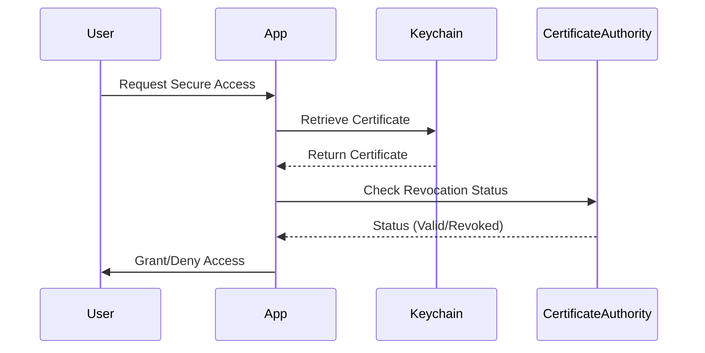

## 15.8 Handling Security Certificates

In the realm of Swift development, especially for iOS and macOS applications, handling security certificates is a critical aspect of ensuring secure communication and data integrity. Certificates are used to establish trust between entities, encrypt data, and verify identities. In this section, we will delve into the intricacies of managing security certificates, including their lifecycle, storage, and access control, to build a robust security infrastructure for your Swift applications.

### Certificate Management

Managing security certificates involves several key activities that ensure certificates are valid, trusted, and secure. Let's explore the essential components of certificate management.

#### Expiration and Renewal

Certificates have a finite validity period, after which they expire and need renewal. Expiration is a security feature that ensures outdated certificates, which might be compromised, are not used indefinitely.

- **Tracking Certificate Lifecycles**: Implement a system to monitor the expiration dates of certificates. This can be achieved by maintaining a database or using automated tools that alert you before a certificate expires.

- **Automating Renewal Processes**: Use tools like Let's Encrypt for automated certificate renewal. This reduces the risk of downtime due to expired certificates.

```swift
import Foundation

// Example function to check certificate expiration
func checkCertificateExpiration(certificate: SecCertificate) -> Bool {
    guard let values = SecCertificateCopyValues(certificate, nil, nil) as? [String: Any],
          let notAfter = values[kSecOIDX509V1ValidityNotAfter as String] as? Date else {
        return false
    }
    let currentDate = Date()
    return currentDate < notAfter
}

// Example usage
let certificate: SecCertificate = // Obtain your certificate
if checkCertificateExpiration(certificate: certificate) {
    print("Certificate is valid.")
} else {
    print("Certificate has expired.")
}
```

#### Revocation Checking

Revocation is the process of invalidating a certificate before its expiration date, typically due to a security compromise.

- **Online Certificate Status Protocol (OCSP)**: Use OCSP to check the revocation status of a certificate in real-time. This is more efficient than downloading Certificate Revocation Lists (CRLs).

```swift
import Security

// Example function to check certificate revocation using OCSP
func checkCertificateRevocation(certificate: SecCertificate) -> Bool {
    // Implement OCSP checking logic here
    // This is a simplified example and should be expanded for real-world use
    return true // Assume certificate is not revoked
}

// Example usage
if checkCertificateRevocation(certificate: certificate) {
    print("Certificate is not revoked.")
} else {
    print("Certificate is revoked.")
}
```

### Securing Certificates

Securing certificates involves protecting the private keys and ensuring that only authorized entities can access them.

#### Storage

The storage of certificates, especially private keys, must be secure to prevent unauthorized access and misuse.

- **Keychain Services**: Use the iOS Keychain to securely store certificates and private keys. The Keychain provides a secure storage mechanism that is encrypted and protected by the device's security features.

```swift
import Security

// Example function to store a certificate in the Keychain
func storeCertificateInKeychain(certificate: SecCertificate) -> Bool {
    let addQuery: [String: Any] = [
        kSecClass as String: kSecClassCertificate,
        kSecValueRef as String: certificate,
        kSecAttrLabel as String: "com.example.myCertificate"
    ]
    let status = SecItemAdd(addQuery as CFDictionary, nil)
    return status == errSecSuccess
}

// Example usage
if storeCertificateInKeychain(certificate: certificate) {
    print("Certificate stored successfully.")
} else {
    print("Failed to store certificate.")
}
```

#### Access Control

Access control ensures that only authorized users or processes can access the stored certificates.

- **Access Control Lists (ACLs)**: Define ACLs to specify which applications or processes can access the certificates in the Keychain.

- **Biometric Authentication**: Use Touch ID or Face ID to add an additional layer of security when accessing sensitive certificates.

```swift
import LocalAuthentication

// Example function to authenticate using biometrics
func authenticateWithBiometrics(completion: @escaping (Bool) -> Void) {
    let context = LAContext()
    var error: NSError?
    
    if context.canEvaluatePolicy(.deviceOwnerAuthenticationWithBiometrics, error: &error) {
        context.evaluatePolicy(.deviceOwnerAuthenticationWithBiometrics, localizedReason: "Access your certificates") { success, error in
            completion(success)
        }
    } else {
        completion(false)
    }
}

// Example usage
authenticateWithBiometrics { success in
    if success {
        print("Authentication successful.")
    } else {
        print("Authentication failed.")
    }
}
```

### Visualizing Security Certificate Handling

To better understand the process of handling security certificates in Swift, let's visualize the workflow using a sequence diagram.



**Diagram Description**: This sequence diagram illustrates the process of handling security certificates in a Swift application. The user requests secure access, prompting the app to retrieve the certificate from the Keychain. The app then checks the revocation status with the Certificate Authority before granting or denying access to the user.

### Knowledge Check

- **Question**: Why is it important to track the expiration and renewal of certificates?

- **Answer**: Tracking expiration and renewal is crucial to prevent service disruptions and maintain secure communications. Expired certificates can lead to security vulnerabilities and loss of trust.

- **Question**: What is the role of OCSP in certificate management?

- **Answer**: OCSP provides a real-time mechanism to check the revocation status of a certificate, ensuring that compromised certificates are not used.

### Try It Yourself

Experiment with the provided code examples by modifying the certificate handling logic. For instance, try implementing a complete OCSP check or integrate biometric authentication for accessing certificates. This hands-on practice will deepen your understanding of security certificate management in Swift.

### References and Further Reading

- [Apple's Keychain Services Documentation](https://developer.apple.com/documentation/security/keychain_services)
- [Let's Encrypt](https://letsencrypt.org/)
- [Online Certificate Status Protocol (OCSP)](https://en.wikipedia.org/wiki/Online_Certificate_Status_Protocol)

### Embrace the Journey

Handling security certificates is a fundamental skill for Swift developers aiming to build secure applications. As you continue to explore this topic, remember that security is an ongoing process. Stay curious, keep learning, and embrace the journey of mastering security in Swift development.

## Quiz Time!



### What is the primary purpose of a security certificate?

- [x] To establish trust and secure communications
- [ ] To store user credentials
- [ ] To manage app permissions
- [ ] To track user behavior

> **Explanation:** Security certificates are used to establish trust between entities and secure communications by encrypting data and verifying identities.

### How can you automate the renewal of certificates?

- [x] Use tools like Let's Encrypt
- [ ] Manually update them every year
- [ ] Store them in the Keychain
- [ ] Use biometric authentication

> **Explanation:** Tools like Let's Encrypt automate the renewal process, reducing the risk of downtime due to expired certificates.

### What is OCSP used for?

- [x] Checking the revocation status of a certificate
- [ ] Encrypting data
- [ ] Storing certificates
- [ ] Authenticating users

> **Explanation:** OCSP is used to check the revocation status of a certificate in real-time.

### Which Swift service is recommended for storing certificates securely?

- [x] Keychain Services
- [ ] UserDefaults
- [ ] FileManager
- [ ] CoreData

> **Explanation:** Keychain Services provide a secure storage mechanism for certificates and private keys.

### What additional security can be added when accessing certificates?

- [x] Biometric Authentication
- [ ] Using UserDefaults
- [ ] Disabling network access
- [ ] Storing in plain text

> **Explanation:** Biometric authentication adds an additional layer of security when accessing sensitive certificates.

### What is the consequence of an expired certificate?

- [x] Potential service disruption and security vulnerabilities
- [ ] Faster application performance
- [ ] Reduced security risks
- [ ] Increased user engagement

> **Explanation:** Expired certificates can lead to service disruptions and security vulnerabilities, as they may no longer be trusted.

### What does an Access Control List (ACL) specify?

- [x] Which applications or processes can access the certificates
- [ ] The expiration date of a certificate
- [ ] The encryption algorithm used
- [ ] The certificate's issuer

> **Explanation:** ACLs define which applications or processes are authorized to access the certificates.

### What does the Keychain provide for certificate storage?

- [x] Secure and encrypted storage
- [ ] Open and accessible storage
- [ ] Temporary storage
- [ ] Cloud-based storage

> **Explanation:** The Keychain provides secure and encrypted storage for certificates and private keys.

### True or False: OCSP is more efficient than downloading CRLs for revocation checking.

- [x] True
- [ ] False

> **Explanation:** OCSP provides a real-time mechanism for checking revocation status, making it more efficient than downloading CRLs.

### Which of the following is NOT a benefit of using certificates?

- [ ] Establishing trust
- [ ] Encrypting data
- [x] Improving app performance
- [ ] Verifying identities

> **Explanation:** While certificates are crucial for establishing trust, encrypting data, and verifying identities, they do not directly improve app performance.



---
