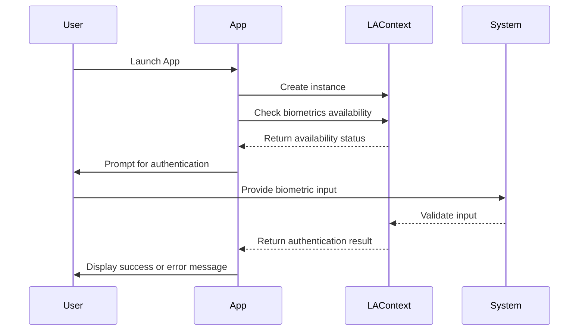

## 15.9 Implementing Biometrics (Face ID, Touch ID)

Biometric authentication has become a cornerstone of modern mobile security, offering a seamless and secure way for users to access their devices and applications. In this section, we will delve into implementing biometrics in Swift, focusing on Face ID and Touch ID. We'll explore the Local Authentication Framework, discuss privacy considerations, and provide code examples to help you integrate these features into your iOS applications.

### Local Authentication Framework

The Local Authentication Framework is Apple's solution for implementing biometric authentication on iOS devices. It provides a simple and secure way to authenticate users using Face ID, Touch ID, or passcode as a fallback. Let's explore how to use this framework to implement biometrics in your Swift applications.

#### Using Biometrics: Implementing Face ID and Touch ID

To begin implementing biometric authentication, you need to import the Local Authentication framework. Here's a step-by-step guide on how to set up and use Face ID and Touch ID in your app:

1. **Import the Framework**

   First, import the Local Authentication framework into your Swift file:

   ```swift
   import LocalAuthentication
   ```

2. **Create an Authentication Context**

   The `LAContext` class is the primary interface for interacting with the Local Authentication framework. Create an instance of `LAContext` to start the authentication process:

   ```swift
   let context = LAContext()
   ```

3. **Check Biometric Availability**

   Before attempting authentication, check if biometric authentication is available on the device:

   ```swift
   var error: NSError?
   if context.canEvaluatePolicy(.deviceOwnerAuthenticationWithBiometrics, error: &error) {
       // Biometrics are available
   } else {
       // Biometrics are not available
       // Handle the error
       print(error?.localizedDescription ?? "Unknown error")
   }
   ```

4. **Evaluate the Authentication Policy**

   Use the `evaluatePolicy(_:localizedReason:reply:)` method to prompt the user for biometric authentication. Provide a reason for the authentication request, which will be displayed to the user:

   ```swift
   context.evaluatePolicy(.deviceOwnerAuthenticationWithBiometrics, localizedReason: "Authenticate to access your account") { success, authenticationError in
       DispatchQueue.main.async {
           if success {
               // Authentication was successful
               print("Authentication successful")
           } else {
               // Authentication failed
               print(authenticationError?.localizedDescription ?? "Failed to authenticate")
           }
       }
   }
   ```

5. **Handle Authentication Results**

   Handle the result of the authentication attempt in the completion handler. If authentication is successful, proceed with granting access. Otherwise, handle the error appropriately.

#### Fallback Mechanisms: Providing Alternatives for Unsupported Devices

Not all devices support Face ID or Touch ID, and some users may prefer not to use biometrics. Therefore, it's essential to provide fallback mechanisms, such as a passcode or password, to ensure accessibility.

1. **Check for Biometric Support**

   Use the `canEvaluatePolicy(_:error:)` method to determine if biometrics are supported. If not, fall back to a passcode:

   ```swift
   if context.canEvaluatePolicy(.deviceOwnerAuthentication, error: &error) {
       // Use passcode as a fallback
       context.evaluatePolicy(.deviceOwnerAuthentication, localizedReason: "Authenticate to access your account") { success, authenticationError in
           DispatchQueue.main.async {
               if success {
                   // Authentication was successful
                   print("Authentication successful with passcode")
               } else {
                   // Authentication failed
                   print(authenticationError?.localizedDescription ?? "Failed to authenticate with passcode")
               }
           }
       }
   }
   ```

2. **Provide User Interface for Fallback**

   Design your app's UI to accommodate fallback authentication methods. Ensure that users can easily switch to using a passcode if biometrics are unavailable or if they choose not to use them.

### Privacy Considerations

When implementing biometric authentication, privacy is a critical concern. Users trust that their biometric data will be handled securely and respectfully. Here are some best practices for ensuring privacy:

#### Data Handling: Ensuring Biometric Data Isn't Stored or Transmitted

1. **No Storage of Biometric Data**

   Biometric data, such as fingerprints or facial scans, should never be stored or transmitted by your app. The Local Authentication framework handles biometric data securely and ensures it remains on the device.

2. **Use Secure Enclaves**

   Trust the Secure Enclave, a hardware-based security feature in iOS devices, to manage biometric data. The Secure Enclave ensures that biometric data is processed securely and never leaves the device.

#### User Consent: Obtaining Permission for Biometric Use

1. **Inform Users**

   Clearly inform users why biometric authentication is being requested and how it will be used. Use the `localizedReason` parameter in the `evaluatePolicy` method to provide a concise explanation.

2. **Respect User Preferences**

   Allow users to opt-out of biometric authentication if they prefer not to use it. Provide alternative authentication methods, such as a passcode or password, to ensure accessibility.

### Code Example: Implementing Biometrics in a Swift App

Let's put everything together in a complete example. We'll create a simple Swift app that uses Face ID or Touch ID for authentication, with a passcode as a fallback.

```swift
import UIKit
import LocalAuthentication

class ViewController: UIViewController {

    override func viewDidLoad() {
        super.viewDidLoad()
        authenticateUser()
    }

    func authenticateUser() {
        let context = LAContext()
        var error: NSError?

        if context.canEvaluatePolicy(.deviceOwnerAuthenticationWithBiometrics, error: &error) {
            context.evaluatePolicy(.deviceOwnerAuthenticationWithBiometrics, localizedReason: "Log in to your account") { success, authenticationError in
                DispatchQueue.main.async {
                    if success {
                        self.showAlert(title: "Success", message: "You have successfully logged in.")
                    } else {
                        self.showAlert(title: "Error", message: authenticationError?.localizedDescription ?? "Failed to authenticate")
                    }
                }
            }
        } else {
            // Fallback to passcode
            if context.canEvaluatePolicy(.deviceOwnerAuthentication, error: &error) {
                context.evaluatePolicy(.deviceOwnerAuthentication, localizedReason: "Log in to your account") { success, authenticationError in
                    DispatchQueue.main.async {
                        if success {
                            self.showAlert(title: "Success", message: "You have successfully logged in with passcode.")
                        } else {
                            self.showAlert(title: "Error", message: authenticationError?.localizedDescription ?? "Failed to authenticate with passcode")
                        }
                    }
                }
            } else {
                showAlert(title: "Error", message: error?.localizedDescription ?? "Biometrics and passcode are not available.")
            }
        }
    }

    func showAlert(title: String, message: String) {
        let alert = UIAlertController(title: title, message: message, preferredStyle: .alert)
        alert.addAction(UIAlertAction(title: "OK", style: .default, handler: nil))
        present(alert, animated: true, completion: nil)
    }
}
```

### Try It Yourself

To experiment with the code, try modifying the `localizedReason` parameter to see how different messages are presented to the user. Additionally, you can simulate different scenarios by testing on devices with and without biometric capabilities.

### Visualizing Biometric Authentication Flow

To better understand the flow of biometric authentication, let's visualize the process using a sequence diagram.



This diagram outlines the interaction between the user, the app, and the system during the biometric authentication process.

### Key Takeaways

- **Biometric authentication** using Face ID and Touch ID provides a secure and user-friendly way to authenticate users.
- **Fallback mechanisms** are essential for ensuring accessibility on devices without biometric capabilities.
- **Privacy considerations** are crucial; biometric data should never be stored or transmitted by your app.
- **User consent** is important; always inform users why biometrics are being used and allow them to opt-out if desired.

### References and Further Reading

- [Apple Developer Documentation: Local Authentication](https://developer.apple.com/documentation/localauthentication)
- [Human Interface Guidelines: Face ID and Touch ID](https://developer.apple.com/design/human-interface-guidelines/ios/user-interaction/authentication/)

## Quiz Time!



### What is the primary framework used for implementing biometric authentication in iOS?

- [x] Local Authentication
- [ ] Core Data
- [ ] UIKit
- [ ] SwiftUI

> **Explanation:** The Local Authentication framework is used for implementing biometric authentication in iOS.

### Which class in the Local Authentication framework is used to interact with biometric authentication?

- [x] LAContext
- [ ] UIViewController
- [ ] URLSession
- [ ] AVPlayer

> **Explanation:** The LAContext class is the primary interface for interacting with the Local Authentication framework.

### What should you do if biometric authentication is unavailable on a device?

- [x] Provide a fallback mechanism, such as a passcode
- [ ] Store biometric data locally
- [ ] Disable authentication entirely
- [ ] Use a third-party library

> **Explanation:** If biometric authentication is unavailable, you should provide a fallback mechanism like a passcode.

### What is a key privacy consideration when implementing biometrics?

- [x] Ensure biometric data isn't stored or transmitted
- [ ] Use third-party libraries for biometric processing
- [ ] Store biometric data in the cloud
- [ ] Share biometric data with other apps

> **Explanation:** A key privacy consideration is ensuring that biometric data isn't stored or transmitted by the app.

### How can you inform users about the reason for biometric authentication?

- [x] Use the localizedReason parameter in the evaluatePolicy method
- [ ] Send an email notification
- [ ] Display a pop-up ad
- [ ] Use a third-party notification service

> **Explanation:** The localizedReason parameter in the evaluatePolicy method is used to inform users about the reason for biometric authentication.

### Which of the following is a fallback mechanism for biometric authentication?

- [x] Passcode
- [ ] Fingerprint
- [ ] Retina scan
- [ ] Voice recognition

> **Explanation:** A passcode is a common fallback mechanism for biometric authentication.

### What is the role of the Secure Enclave in biometric authentication?

- [x] It ensures biometric data is processed securely and never leaves the device
- [ ] It stores biometric data in the cloud
- [ ] It transmits biometric data to third-party services
- [ ] It displays biometric data to the user

> **Explanation:** The Secure Enclave ensures that biometric data is processed securely and never leaves the device.

### What should be done if a user opts out of biometric authentication?

- [x] Provide alternative authentication methods, such as a passcode
- [ ] Disable the app
- [ ] Store their biometric data for future use
- [ ] Force them to use biometrics

> **Explanation:** If a user opts out of biometric authentication, provide alternative methods like a passcode.

### What is the purpose of the evaluatePolicy method in the Local Authentication framework?

- [x] To prompt the user for biometric authentication
- [ ] To store biometric data
- [ ] To delete biometric data
- [ ] To send biometric data to the server

> **Explanation:** The evaluatePolicy method is used to prompt the user for biometric authentication.

### True or False: Biometric data should be stored locally for future use.

- [ ] True
- [x] False

> **Explanation:** Biometric data should never be stored locally or transmitted; it should be processed securely by the system.



Remember, implementing biometrics in your app not only enhances security but also improves user experience. Stay informed about best practices and privacy considerations to ensure your app remains secure and user-friendly.
