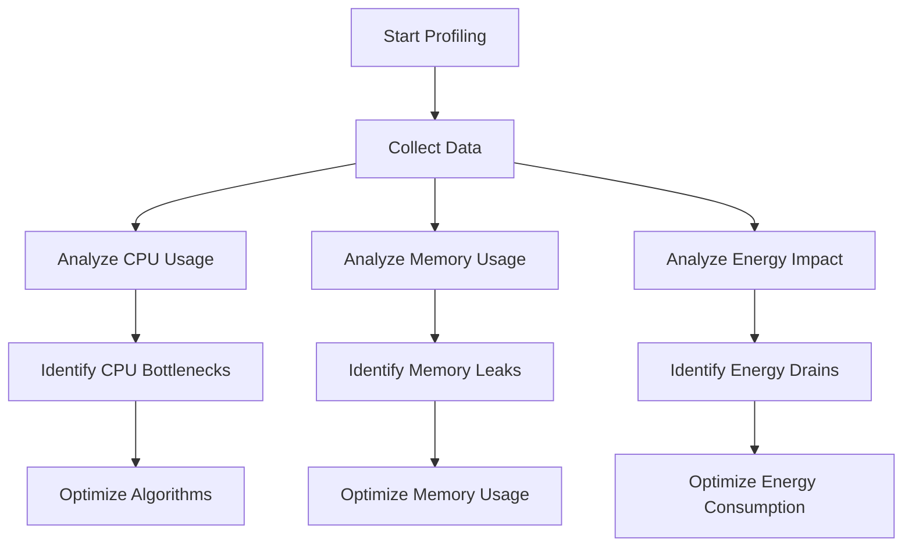

## 16.1 Profiling and Performance Measurement Tools

In the fast-paced world of software development, optimizing the performance of your Swift applications is crucial. Profiling and performance measurement tools help you understand the behavior of your code, identify bottlenecks, and enhance the overall efficiency of your applications. In this section, we will explore the tools and techniques available for profiling Swift applications, with a focus on Xcode Instruments.

### Understanding Performance Profiling

Performance profiling involves monitoring various aspects of your application to ensure it runs efficiently. This includes analyzing CPU usage, memory consumption, energy impact, and more. By using profiling tools, developers can gain insights into how their code performs and make informed decisions to optimize it.

Profiling is not just about finding and fixing performance issues; it's about understanding how your application behaves under different conditions. This understanding allows you to make strategic decisions that improve user experience and resource management.

### Using Xcode Instruments for Profiling

Xcode Instruments is a powerful toolset provided by Apple for profiling iOS, macOS, watchOS, and tvOS applications. It offers a wide range of instruments that can be used to collect data about your application's performance.

#### Key Instruments in Xcode

1. **Time Profiler**: Measures CPU usage and helps identify which parts of your code are consuming the most processing time.
2. **Allocations**: Tracks memory usage and identifies memory leaks and excessive memory allocations.
3. **Leaks**: Detects memory leaks in your application.
4. **Energy Log**: Monitors energy usage and helps optimize battery consumption.
5. **Network**: Analyzes network activity and helps optimize data transfer.
6. **System Trace**: Provides a comprehensive view of system activity, including CPU, memory, and disk usage.

#### Setting Up a Profiling Session

To start profiling your application with Xcode Instruments, follow these steps:

1. **Open Xcode** and build your project.
2. **Select Product > Profile** from the menu or press `Command + I`.
3. **Choose an Instrument** from the template chooser. For example, select "Time Profiler" to analyze CPU usage.
4. **Run the Instrument** by clicking the record button. Interact with your application to simulate real-world usage.
5. **Stop the Instrument** when you have collected enough data.

#### Interpreting Performance Metrics

Once you have collected data, it's time to analyze it. Here are some key metrics to focus on:

- **CPU Usage**: High CPU usage can indicate inefficient algorithms or excessive processing. Use the Time Profiler to identify which functions are consuming the most CPU time.
- **Memory Usage**: Monitor memory allocations to ensure your application is not consuming more memory than necessary. The Allocations instrument helps track memory usage over time.
- **Energy Impact**: High energy usage can drain the battery quickly. Use the Energy Log to identify energy-intensive operations and optimize them.
- **Network Activity**: Excessive network requests can slow down your application. Use the Network instrument to analyze network traffic and optimize data transfer.

### Code Example: Profiling a Swift Application

Let's explore a simple Swift application and demonstrate how to profile it using Xcode Instruments.

```swift
import Foundation

class DataProcessor {
    func processData(_ data: [Int]) -> Int {
        // Simulate a CPU-intensive operation
        return data.reduce(0, +)
    }
}

let processor = DataProcessor()
let data = Array(1...1000000)
let result = processor.processData(data)
print("Result: \\(result)")
```

In this example, we have a `DataProcessor` class with a `processData` method that simulates a CPU-intensive operation by summing up an array of integers.

#### Profiling the Example

1. **Profile the Application**: Use Xcode Instruments to profile the application and select the "Time Profiler" instrument.
2. **Analyze CPU Usage**: Observe the CPU usage during the execution of the `processData` method. Look for any unexpected spikes or inefficiencies.
3. **Optimize the Code**: If the `reduce` operation is consuming too much CPU time, consider optimizing it by using more efficient algorithms or data structures.

### Optimizing Performance Based on Profiling

Once you've identified performance bottlenecks, it's time to optimize your code. Here are some strategies:

- **Optimize Algorithms**: Replace inefficient algorithms with more efficient ones. For example, use a binary search instead of a linear search.
- **Reduce Memory Usage**: Minimize memory allocations by reusing objects and using value types where appropriate.
- **Batch Network Requests**: Reduce the number of network requests by batching them together.
- **Use Background Threads**: Offload CPU-intensive tasks to background threads to keep the main thread responsive.

### Visualizing Performance Data

Visualizing performance data can help you better understand the behavior of your application. Xcode Instruments provides various visualization tools, such as graphs and timelines, to help you interpret the data.



*Figure: Profiling and Optimizing Workflow*

### Try It Yourself

Experiment with the provided code example and try the following modifications:

- **Increase the Data Size**: Increase the size of the data array and observe how it affects CPU usage.
- **Introduce a Memory Leak**: Modify the code to introduce a memory leak and use the Leaks instrument to detect it.
- **Simulate Network Activity**: Add network requests to the code and use the Network instrument to analyze the traffic.

### References and Links

For further reading and resources on profiling and performance measurement in Swift, consider the following links:

- [Apple's Xcode Instruments Documentation](https://developer.apple.com/documentation/xcode/instruments)
- [Swift Performance Best Practices](https://developer.apple.com/swift/blog/?id=27)
- [Understanding Energy Usage in iOS Apps](https://developer.apple.com/videos/play/wwdc2016/409/)

### Knowledge Check

- What are the key instruments available in Xcode for profiling Swift applications?
- How can you interpret CPU usage data to identify performance bottlenecks?
- What strategies can be used to optimize memory usage in Swift applications?

### Embrace the Journey

Remember, profiling and performance optimization is an ongoing process. As you continue to develop your Swift applications, regularly profile your code to ensure it remains efficient and responsive. Keep experimenting, stay curious, and enjoy the journey of mastering Swift performance optimization!

## Quiz Time!



### What is the primary purpose of profiling in software development?

- [x] To identify performance bottlenecks and optimize code
- [ ] To add new features to an application
- [ ] To improve the user interface design
- [ ] To increase the application's file size

> **Explanation:** Profiling is used to identify performance bottlenecks and optimize code for better efficiency.

### Which Xcode instrument is used to analyze CPU usage?

- [x] Time Profiler
- [ ] Allocations
- [ ] Leaks
- [ ] Energy Log

> **Explanation:** The Time Profiler instrument is used to analyze CPU usage in an application.

### What does the Allocations instrument track?

- [x] Memory usage
- [ ] CPU usage
- [ ] Network activity
- [ ] Energy impact

> **Explanation:** The Allocations instrument tracks memory usage and helps identify memory leaks.

### How can you reduce memory usage in a Swift application?

- [x] Reuse objects and use value types
- [ ] Increase the number of network requests
- [ ] Use more complex algorithms
- [ ] Increase the data size

> **Explanation:** Reusing objects and using value types can help reduce memory usage in a Swift application.

### What is a common strategy to optimize network activity?

- [x] Batch network requests
- [ ] Use more memory
- [ ] Increase CPU usage
- [ ] Decrease the application's file size

> **Explanation:** Batching network requests can help optimize network activity by reducing the number of requests.

### Which instrument would you use to detect memory leaks?

- [x] Leaks
- [ ] Time Profiler
- [ ] Energy Log
- [ ] Network

> **Explanation:** The Leaks instrument is used to detect memory leaks in an application.

### What is the benefit of using background threads?

- [x] To keep the main thread responsive
- [ ] To increase memory usage
- [ ] To decrease CPU usage
- [ ] To reduce network activity

> **Explanation:** Using background threads helps keep the main thread responsive by offloading CPU-intensive tasks.

### What should you do after identifying a performance bottleneck?

- [x] Optimize the code
- [ ] Ignore it
- [ ] Add more features
- [ ] Increase the application's file size

> **Explanation:** After identifying a performance bottleneck, you should optimize the code to improve efficiency.

### Which instrument helps monitor energy usage?

- [x] Energy Log
- [ ] Allocations
- [ ] Leaks
- [ ] Time Profiler

> **Explanation:** The Energy Log instrument helps monitor energy usage and optimize battery consumption.

### True or False: Profiling is only necessary during the final stages of development.

- [ ] True
- [x] False

> **Explanation:** Profiling should be done throughout the development process to ensure optimal performance.




