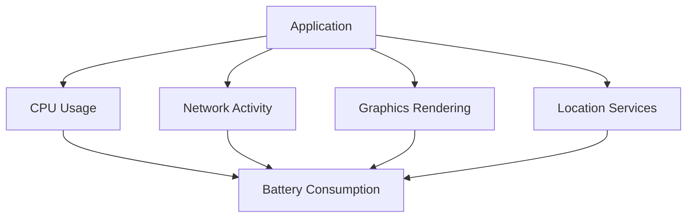

## 16.10 Battery Consumption and Resource Management

In the realm of Swift development, especially for iOS and macOS applications, understanding and optimizing battery consumption is crucial. With mobile devices being an integral part of our daily lives, users demand applications that are not only functional but also energy-efficient. This section delves into the intricacies of battery consumption and resource management, providing you with the knowledge to build applications that are both performant and considerate of battery life.

### Understanding Battery Consumption

Battery consumption in applications can be influenced by several factors, including CPU usage, network activity, screen brightness, and more. As developers, it's essential to be mindful of these factors and implement strategies to minimize unnecessary energy drain.

#### Key Factors Affecting Battery Life

1. **CPU Usage**: High CPU usage can quickly drain the battery. Optimize algorithms and avoid unnecessary computations.
2. **Network Activity**: Frequent network requests can be costly in terms of energy. Batch requests and use background modes wisely.
3. **Graphics and Animations**: Intensive graphics rendering and animations can consume significant power. Optimize rendering paths and use hardware acceleration where possible.
4. **Location Services**: GPS and location services are notorious for draining battery. Use them judiciously and prefer lower accuracy when high precision is not required.
5. **Background Tasks**: Tasks running in the background can impact battery life. Ensure they are necessary and efficiently managed.

### Minimizing Background Activity

Background activity can be a significant drain on battery life if not managed properly. Swift provides several tools and best practices to help you minimize unnecessary background activity.

#### Using Background Modes

iOS provides specific background modes for tasks like audio playback, location updates, and more. Use these modes only when necessary and ensure that tasks are completed promptly.

```swift
import UIKit
import CoreLocation

class LocationManager: NSObject, CLLocationManagerDelegate {
    private var locationManager: CLLocationManager?

    func startTracking() {
        locationManager = CLLocationManager()
        locationManager?.delegate = self
        locationManager?.requestWhenInUseAuthorization()
        locationManager?.startUpdatingLocation()
    }

    func locationManager(_ manager: CLLocationManager, didUpdateLocations locations: [CLLocation]) {
        // Process location updates
    }

    func locationManager(_ manager: CLLocationManager, didFailWithError error: Error) {
        // Handle error
    }
}
```

### Employing Energy-Efficient Coding Practices

Energy-efficient coding practices are essential for optimizing battery consumption. Here are some strategies to consider:

#### Optimize Algorithms

Efficient algorithms reduce CPU usage and, consequently, battery consumption. Consider using lazy evaluation and avoid premature optimizations.

#### Use Throttling and Debouncing

Throttling and debouncing are techniques used to limit the rate of function execution. They are particularly useful in scenarios like handling user input or network requests, where frequent triggering can lead to excessive resource usage.

```swift
import Foundation

class Throttler {
    private var workItem: DispatchWorkItem?
    private var lastFire: Date = .distantPast
    private let queue: DispatchQueue
    private let interval: TimeInterval

    init(interval: TimeInterval, queue: DispatchQueue = .main) {
        self.interval = interval
        self.queue = queue
    }

    func throttle(action: @escaping () -> Void) {
        workItem?.cancel()
        workItem = DispatchWorkItem { [weak self] in
            self?.lastFire = Date()
            action()
        }
        if let workItem = workItem {
            let delay = lastFire.timeIntervalSinceNow > interval ? 0 : interval
            queue.asyncAfter(deadline: .now() + delay, execute: workItem)
        }
    }
}
```

#### Reduce Network Calls

Network calls can be energy-intensive. Batch requests when possible and use background fetch to update data periodically.

```swift
import UIKit

class NetworkManager {
    static let shared = NetworkManager()

    func fetchData(completion: @escaping (Data?) -> Void) {
        let url = URL(string: "https://api.example.com/data")!
        let task = URLSession.shared.dataTask(with: url) { data, response, error in
            guard error == nil else {
                completion(nil)
                return
            }
            completion(data)
        }
        task.resume()
    }
}
```

### Visualizing Resource Management

To better understand resource management, let's visualize how different components interact and affect battery consumption. The following diagram illustrates the interaction between CPU, network, graphics, and location services.



### Best Practices for Resource Management

1. **Profile and Monitor**: Use tools like Xcode Instruments to profile your application and monitor battery usage.
2. **Efficient Resource Use**: Optimize the use of resources like CPU, memory, and network to reduce battery consumption.
3. **User Awareness**: Inform users about battery-intensive features and provide options to disable them.
4. **Adopt New Technologies**: Stay updated with the latest Swift features and iOS updates that offer more efficient ways to manage resources.

### Swift Unique Features for Battery Optimization

Swift offers several unique features that can aid in battery optimization:

- **Swift Concurrency**: Use async/await to manage asynchronous tasks efficiently, reducing CPU load.
- **Combine Framework**: Handle asynchronous data streams with Combine to optimize resource management.
- **SwiftUI**: Leverage SwiftUI's declarative syntax to build efficient UIs that minimize unnecessary updates.

### Differences and Similarities with Other Patterns

Resource management in Swift shares similarities with other optimization patterns but focuses specifically on battery and energy efficiency. While performance optimization targets overall application speed and responsiveness, battery optimization zeroes in on reducing energy consumption without sacrificing functionality.

### Try It Yourself

Experiment with the provided code examples by modifying parameters like update intervals in location services or throttling intervals. Observe how these changes impact battery consumption and application performance.

### Knowledge Check

- How can you minimize CPU usage in your Swift application?
- What are some strategies to reduce network-related battery consumption?
- How does Swift's async/await feature contribute to battery optimization?

### Embrace the Journey

Remember, optimizing battery consumption is an ongoing process. As you continue to develop applications, keep experimenting with new techniques and stay curious about emerging technologies. Your efforts will lead to applications that not only perform well but also respect the battery life of users' devices.

## Quiz Time!



### What is a key factor affecting battery life in mobile applications?

- [x] CPU Usage
- [ ] Screen Resolution
- [ ] File Size
- [ ] App Icon Design

> **Explanation:** CPU usage is a significant factor affecting battery life as it involves processing power, which consumes energy.

### Which technique can help limit the rate of function execution to save energy?

- [x] Throttling
- [ ] Looping
- [ ] Recursion
- [ ] Inheritance

> **Explanation:** Throttling is used to limit the frequency of function execution, reducing unnecessary CPU usage and saving energy.

### How can network calls be optimized to reduce battery consumption?

- [x] Batch requests
- [ ] Increase request frequency
- [ ] Use larger payloads
- [ ] Disable caching

> **Explanation:** Batching requests reduces the number of network calls, conserving energy by minimizing radio usage.

### What tool can be used to profile and monitor battery usage in iOS applications?

- [x] Xcode Instruments
- [ ] Terminal
- [ ] Safari
- [ ] TextEdit

> **Explanation:** Xcode Instruments is a powerful tool for profiling and monitoring various aspects of iOS applications, including battery usage.

### Which Swift feature aids in managing asynchronous tasks efficiently?

- [x] Async/Await
- [ ] Synchronous Functions
- [ ] Manual Threading
- [ ] Static Functions

> **Explanation:** Async/await in Swift allows for efficient management of asynchronous tasks, reducing CPU load and improving battery efficiency.

### How can graphics rendering be optimized to conserve battery?

- [x] Use hardware acceleration
- [ ] Increase frame rate
- [ ] Use complex shaders
- [ ] Disable caching

> **Explanation:** Hardware acceleration optimizes graphics rendering by offloading tasks to the GPU, conserving CPU usage and battery.

### What is a benefit of using SwiftUI for UI development in terms of battery consumption?

- [x] Minimizes unnecessary updates
- [ ] Increases animation complexity
- [ ] Requires more memory
- [ ] Uses more CPU cycles

> **Explanation:** SwiftUI's declarative syntax helps minimize unnecessary UI updates, reducing CPU usage and conserving battery.

### What should developers do to inform users about battery-intensive features?

- [x] Provide options to disable them
- [ ] Hide them
- [ ] Force enable them
- [ ] Ignore them

> **Explanation:** Informing users and providing options to disable battery-intensive features helps manage expectations and conserve battery.

### True or False: Location services should always use high accuracy to ensure precision.

- [ ] True
- [x] False

> **Explanation:** High accuracy in location services consumes more battery. Use lower accuracy when high precision is not necessary to conserve energy.

### What is an effective strategy for managing background tasks to optimize battery usage?

- [x] Ensure tasks are necessary and efficiently managed
- [ ] Run all tasks continuously
- [ ] Use high-priority threads
- [ ] Ignore task completion

> **Explanation:** Efficient management of background tasks ensures that only necessary tasks run, conserving battery life.


