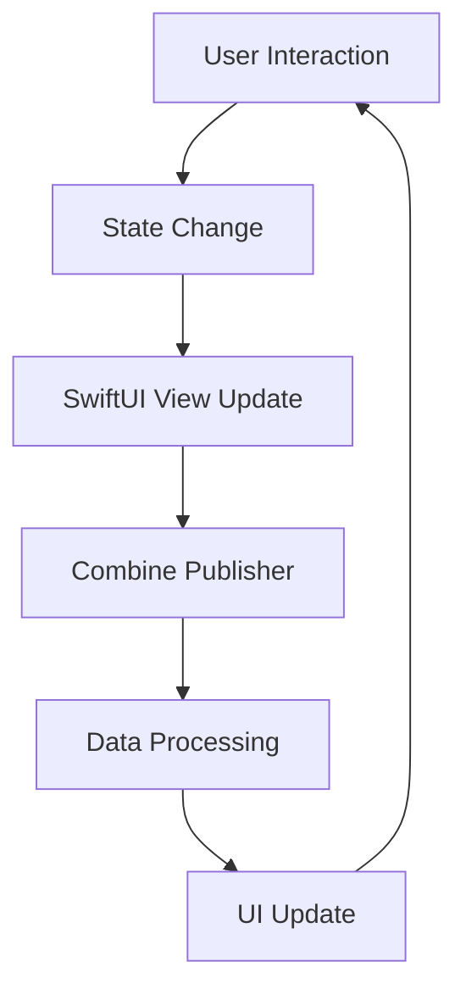

## 16.11 Optimizing SwiftUI and Combine

In the world of iOS development, SwiftUI and Combine have emerged as powerful tools for building modern, responsive applications. However, with great power comes the responsibility of ensuring that your applications remain performant and efficient. In this section, we will explore various techniques and best practices for optimizing SwiftUI and Combine to build applications that are not only functional but also fast and responsive.

### Understanding SwiftUI and Combine

Before diving into optimization strategies, it's important to understand the fundamental concepts of SwiftUI and Combine.

**SwiftUI** is a declarative framework for building user interfaces across all Apple platforms. It allows developers to describe the UI's state and behavior using Swift code, which is then translated into the visual elements of the app.

**Combine** is a reactive programming framework that provides a declarative Swift API for processing values over time. It allows developers to work with asynchronous data streams and handle events in a unified manner.

### Performance Considerations in SwiftUI

SwiftUI, being a declarative framework, offers a different approach to building UIs compared to UIKit. While it provides many advantages, such as ease of use and code readability, it also requires careful consideration of performance aspects.

#### Reducing View Hierarchy Complexity

One of the key factors affecting SwiftUI performance is the complexity of the view hierarchy. A deep or complex hierarchy can lead to increased rendering time and memory usage. To optimize this:

- **Flatten the View Hierarchy**: Use fewer nested views by combining them into a single view when possible.
- **Use Conditional Views Wisely**: Avoid unnecessary conditional views that can lead to a bloated hierarchy. Use `.hidden()` to hide views instead of conditionally removing them.

```swift
struct ContentView: View {
    var body: some View {
        VStack {
            Text("Hello, World!")
            if showDetails {
                Text("Details")
            }
        }
    }
}
```

In the example above, consider using `.hidden()` to toggle the visibility of the "Details" text instead of conditionally adding or removing it.

#### Efficient State Management

State management is crucial for performance in SwiftUI. Inefficient state updates can lead to unnecessary re-renders and slow down your app.

- **Use `@State` and `@Binding` Appropriately**: Ensure that state changes are minimal and only trigger updates when necessary.
- **Leverage `@ObservedObject` and `@EnvironmentObject`**: For more complex state management, use these property wrappers to manage shared state efficiently.

```swift
class ViewModel: ObservableObject {
    @Published var counter = 0
}

struct ContentView: View {
    @ObservedObject var viewModel = ViewModel()

    var body: some View {
        VStack {
            Text("Counter: \\(viewModel.counter)")
            Button("Increment") {
                viewModel.counter += 1
            }
        }
    }
}
```

In this example, using `@ObservedObject` ensures that only the necessary parts of the view are updated when the state changes.

#### Optimizing Layout Calculations

SwiftUI performs layout calculations to determine the size and position of views. Optimizing these calculations can significantly improve performance.

- **Use Lazy Containers**: For lists and grids, use `LazyVStack` and `LazyHStack` to defer the creation of views until they are needed.
- **Avoid Expensive Calculations in `body`**: Keep the `body` property simple and avoid performing complex calculations within it.

```swift
struct LazyListView: View {
    var body: some View {
        LazyVStack {
            ForEach(0..<1000) { index in
                Text("Item \\(index)")
            }
        }
    }
}
```

Using `LazyVStack` in the example above ensures that only the visible items are created, improving performance for large lists.

### Reducing the Overhead of Combine Subscriptions

Combine is a powerful tool for handling asynchronous data, but improper use can lead to performance bottlenecks. Here are some strategies to optimize Combine subscriptions:

#### Minimize Subscription Count

Each subscription in Combine introduces overhead. To minimize this:

- **Combine Publishers**: Use operators like `merge`, `combineLatest`, and `zip` to combine multiple publishers into a single stream.
- **Use `share()` Operator**: Share a single subscription among multiple subscribers to reduce the number of active subscriptions.

```swift
let publisher1 = Just(1)
let publisher2 = Just(2)

let combinedPublisher = Publishers.CombineLatest(publisher1, publisher2)
    .map { $0 + $1 }
    .sink { print($0) }
```

In this example, `CombineLatest` combines two publishers into a single stream, reducing the need for multiple subscriptions.

#### Manage Subscription Lifecycles

Properly managing the lifecycle of subscriptions is crucial to avoid memory leaks and unnecessary resource usage.

- **Use `Cancellable`**: Store subscriptions in a `Set<AnyCancellable>` to automatically cancel them when no longer needed.
- **Use `sink(receiveCompletion:receiveValue:)`**: Handle completion events to clean up resources when a publisher completes.

```swift
var cancellables = Set<AnyCancellable>()

publisher
    .sink(receiveCompletion: { completion in
        switch completion {
        case .finished:
            print("Completed")
        case .failure(let error):
            print("Error: \\(error)")
        }
    }, receiveValue: { value in
        print("Received value: \\(value)")
    })
    .store(in: &cancellables)
```

In this example, the subscription is stored in a `Set<AnyCancellable>`, ensuring that it is automatically canceled when no longer needed.

### Best Practices for Building Performant Declarative UIs

Building performant declarative UIs requires a combination of best practices and careful consideration of design patterns.

#### Use View Modifiers Effectively

View modifiers in SwiftUI allow you to apply changes to views in a declarative manner. However, excessive use of modifiers can lead to performance issues.

- **Chain Modifiers Efficiently**: Combine multiple modifiers into a single chain to minimize the number of view updates.
- **Avoid Redundant Modifiers**: Ensure that modifiers are applied only when necessary to prevent unnecessary view updates.

```swift
Text("Hello, World!")
    .font(.headline)
    .foregroundColor(.blue)
    .padding()
    .background(Color.yellow)
```

In this example, modifiers are chained efficiently to apply multiple changes to the `Text` view.

#### Leverage SwiftUI Previews

SwiftUI Previews provide a powerful way to test and optimize your views in real-time.

- **Use Previews for Performance Testing**: Test different configurations and states of your views to identify performance bottlenecks.
- **Optimize Previews for Faster Iteration**: Use the `previewDevice` and `previewLayout` modifiers to test your views on different devices and orientations.

```swift
struct ContentView_Previews: PreviewProvider {
    static var previews: some View {
        ContentView()
            .previewDevice("iPhone 12")
            .previewLayout(.sizeThatFits)
    }
}
```

Using previews in the example above allows you to test the `ContentView` on an iPhone 12 and optimize its layout for different screen sizes.

### Visualizing SwiftUI and Combine Performance

To better understand the performance considerations in SwiftUI and Combine, let's visualize the flow of data and view updates using a Mermaid.js diagram.



**Diagram Description**: This diagram illustrates the flow of data and view updates in a SwiftUI and Combine application. User interactions lead to state changes, triggering SwiftUI view updates. Combine publishers process data, leading to further UI updates.

### Try It Yourself

To reinforce your understanding of SwiftUI and Combine optimization, try modifying the code examples provided. Experiment with different state management techniques, view hierarchies, and Combine subscriptions to see how they affect performance.

### Key Takeaways

- **Optimize View Hierarchies**: Simplify and flatten view hierarchies to reduce rendering time and memory usage.
- **Efficient State Management**: Use `@State`, `@Binding`, `@ObservedObject`, and `@EnvironmentObject` appropriately to manage state changes efficiently.
- **Optimize Combine Subscriptions**: Minimize the number of subscriptions and manage their lifecycles to avoid memory leaks and resource wastage.
- **Use View Modifiers Wisely**: Chain modifiers efficiently and avoid redundant applications to improve performance.
- **Leverage SwiftUI Previews**: Use previews to test and optimize your views in real-time.

### References and Further Reading

- [SwiftUI Documentation](https://developer.apple.com/documentation/swiftui)
- [Combine Documentation](https://developer.apple.com/documentation/combine)
- [SwiftUI Performance Tips](https://developer.apple.com/videos/play/wwdc2020/10041/)
- [Optimizing SwiftUI Views](https://swiftwithmajid.com/2020/02/05/optimizing-swiftui-views/)

### Embrace the Journey

Remember, optimizing SwiftUI and Combine is a continuous journey. As you gain experience, you'll develop a deeper understanding of how to build performant applications. Keep experimenting, stay curious, and enjoy the process of mastering Swift development.

## Quiz Time!



### What is a key factor affecting SwiftUI performance?

- [x] Complexity of the view hierarchy
- [ ] Number of animations
- [ ] Use of color schemes
- [ ] Device orientation

> **Explanation:** The complexity of the view hierarchy can significantly impact SwiftUI performance by increasing rendering time and memory usage.

### How can you minimize the number of Combine subscriptions?

- [x] Use operators like `merge` and `combineLatest`
- [ ] Use more `@State` properties
- [ ] Increase the number of publishers
- [ ] Avoid using `Cancellable`

> **Explanation:** Operators like `merge` and `combineLatest` allow you to combine multiple publishers into a single stream, reducing the need for multiple subscriptions.

### What is the purpose of `LazyVStack` in SwiftUI?

- [x] To defer the creation of views until they are needed
- [ ] To increase the number of views in the hierarchy
- [ ] To improve the color scheme of the app
- [ ] To manage state changes more efficiently

> **Explanation:** `LazyVStack` defers the creation of views until they are needed, improving performance for large lists by only creating visible items.

### How can you manage the lifecycle of Combine subscriptions?

- [x] Store subscriptions in a `Set<AnyCancellable>`
- [ ] Use more `@Binding` properties
- [ ] Increase the number of publishers
- [ ] Avoid using `sink(receiveCompletion:receiveValue:)`

> **Explanation:** Storing subscriptions in a `Set<AnyCancellable>` ensures that they are automatically canceled when no longer needed, managing their lifecycle effectively.

### What is a best practice for using view modifiers in SwiftUI?

- [x] Chain modifiers efficiently
- [ ] Use as many modifiers as possible
- [ ] Apply modifiers conditionally
- [ ] Avoid using modifiers altogether

> **Explanation:** Chaining modifiers efficiently minimizes the number of view updates, improving performance.

### What is the benefit of using SwiftUI Previews?

- [x] To test and optimize views in real-time
- [ ] To increase the number of views in the hierarchy
- [ ] To improve the color scheme of the app
- [ ] To manage state changes more efficiently

> **Explanation:** SwiftUI Previews allow you to test and optimize your views in real-time, identifying performance bottlenecks and improving layout.

### Which property wrapper should you use for complex state management?

- [x] `@ObservedObject`
- [ ] `@State`
- [ ] `@Binding`
- [ ] `@Published`

> **Explanation:** `@ObservedObject` is used for managing complex state shared across multiple views, ensuring efficient updates.

### What is a common cause of performance bottlenecks in SwiftUI?

- [x] Inefficient state updates
- [ ] Use of color schemes
- [ ] Device orientation
- [ ] Number of animations

> **Explanation:** Inefficient state updates can lead to unnecessary re-renders, causing performance bottlenecks in SwiftUI applications.

### How can you optimize layout calculations in SwiftUI?

- [x] Use lazy containers like `LazyVStack`
- [ ] Increase the number of views in the hierarchy
- [ ] Use more `@State` properties
- [ ] Avoid using view modifiers

> **Explanation:** Using lazy containers like `LazyVStack` optimizes layout calculations by deferring the creation of views until they are needed.

### True or False: Combine subscriptions should be managed manually to avoid memory leaks.

- [x] True
- [ ] False

> **Explanation:** Managing Combine subscriptions manually, such as storing them in a `Set<AnyCancellable>`, helps avoid memory leaks and unnecessary resource usage.






