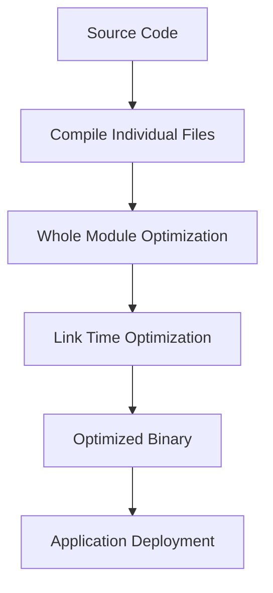

## 16.12 Fine-Tuning Swift Compiler Settings

In the world of software development, performance is key. For Swift developers, understanding and fine-tuning the compiler settings can lead to significant improvements in application performance. This section will guide you through the intricacies of Swift compiler settings, helping you to optimize your builds for both speed and efficiency.

### Understanding Build Configurations and Optimization Levels

Before diving into specific compiler settings, it's crucial to understand the build configurations and optimization levels available in Swift.

#### Build Configurations

Build configurations in Xcode typically include Debug and Release, but you can create custom configurations to suit your needs.

- **Debug Configuration**: This is used during development. It prioritizes fast compile times and ease of debugging over performance. Debug builds include symbols for debugging and do not perform aggressive optimizations.
  
- **Release Configuration**: This is used for production. It focuses on performance optimizations and smaller binary size. Release builds are optimized for speed and may strip out debugging symbols.

#### Optimization Levels

Swift provides several optimization levels that you can set for your build configurations:

- **-Onone**: No optimization. This level is used in Debug builds to ensure fast compile times and ease of debugging.
  
- **-O**: This is the default optimization level for Release builds. It enables basic optimizations that improve performance without significantly increasing compile times.
  
- **-Ounchecked**: This level includes all the optimizations of -O, but it also removes runtime checks for overflow and array bounds. Use with caution, as it can lead to undefined behavior if your code has bugs.
  
- **-Os**: Optimize for size. This level reduces the binary size, which can be useful for apps with limited storage or when download size is a concern.

### Whole Module Optimization (WMO)

Whole Module Optimization is a powerful feature that allows the Swift compiler to optimize across the entire module rather than just individual files. This can lead to significant performance improvements.

#### Benefits of WMO

- **Cross-File Optimization**: By analyzing the entire module, the compiler can perform optimizations that are not possible when compiling files individually.
- **Reduced Binary Size**: WMO can eliminate redundant code and inline functions across file boundaries, leading to smaller binaries.
- **Improved Performance**: By optimizing the entire module, WMO can lead to faster execution times.

#### Enabling WMO

To enable Whole Module Optimization in Xcode:

1. Open your project in Xcode.
2. Navigate to the **Build Settings** tab.
3. Find the **Swift Compiler - Code Generation** section.
4. Set **Whole Module Optimization** to **Yes** for your desired build configuration.

### Link Time Optimization (LTO)

Link Time Optimization is another powerful technique that optimizes the final binary after all the code has been compiled.

#### Benefits of LTO

- **Cross-Module Optimization**: LTO allows the linker to optimize across module boundaries, which can lead to further performance improvements.
- **Dead Code Elimination**: LTO can remove unused code, reducing the binary size and improving load times.
- **Function Inlining**: It can inline functions across module boundaries, leading to faster execution.

#### Enabling LTO

To enable Link Time Optimization in Xcode:

1. Open your project in Xcode.
2. Navigate to the **Build Settings** tab.
3. Find the **Linking** section.
4. Set **Link Time Optimization** to **Yes** for your desired build configuration.

### Code Examples

Let's look at a simple Swift code example and see how different optimization levels can impact performance.

```swift
// A simple function to calculate the factorial of a number
func factorial(_ n: Int) -> Int {
    return (1...n).reduce(1, *)
}

// Measure the time taken to calculate factorial of 20
let startTime = CFAbsoluteTimeGetCurrent()
let result = factorial(20)
let timeElapsed = CFAbsoluteTimeGetCurrent() - startTime

print("Factorial of 20 is \\(result)")
print("Time elapsed: \\(timeElapsed) seconds")
```

#### Experimenting with Optimization Levels

1. **Compile with -Onone**: This will provide the slowest performance but is easiest to debug.
2. **Compile with -O**: Notice the performance improvement due to basic optimizations.
3. **Compile with -Ounchecked**: Observe the fastest performance, but be cautious of potential undefined behavior.

### Try It Yourself

Try modifying the code to calculate the factorial of larger numbers and observe how different optimization levels affect performance. Experiment with enabling Whole Module Optimization and Link Time Optimization to see their impact.

### Visualizing Compiler Optimization

To better understand how Whole Module Optimization and Link Time Optimization work, let's visualize the process using a flowchart.



**Description**: This flowchart illustrates the process of compiling Swift code with Whole Module Optimization and Link Time Optimization, resulting in an optimized binary ready for deployment.

### References and Links

For further reading on Swift compiler optimizations, consider the following resources:

- [Swift.org Compiler Documentation](https://swift.org/documentation/)
- [Xcode Build Settings Reference](https://developer.apple.com/documentation/xcode/build-settings-reference)
- [LLVM Link Time Optimization](https://llvm.org/docs/LinkTimeOptimization.html)

### Knowledge Check

To reinforce your understanding of Swift compiler settings, consider the following questions:

1. What are the main differences between Debug and Release build configurations?
2. How does Whole Module Optimization improve performance?
3. What are the risks associated with using the -Ounchecked optimization level?
4. How can Link Time Optimization reduce binary size?

### Embrace the Journey

Remember, fine-tuning compiler settings is an iterative process. As you experiment with different settings, you'll gain a deeper understanding of how they impact your application's performance. Keep exploring, stay curious, and enjoy the journey!

## Quiz Time!



### What is the primary purpose of the Release build configuration in Swift?

- [x] To optimize performance and reduce binary size
- [ ] To enable fast compile times and ease of debugging
- [ ] To include debugging symbols for error tracking
- [ ] To disable all optimizations for testing

> **Explanation:** The Release build configuration is used to optimize performance and reduce binary size, making it suitable for production environments.

### Which optimization level should be used to ensure fast compile times and ease of debugging?

- [x] -Onone
- [ ] -O
- [ ] -Ounchecked
- [ ] -Os

> **Explanation:** The -Onone optimization level is used in Debug builds to ensure fast compile times and ease of debugging.

### What is a potential risk of using the -Ounchecked optimization level?

- [x] It can lead to undefined behavior if the code has bugs
- [ ] It increases binary size significantly
- [ ] It slows down compile times
- [ ] It disables all optimizations

> **Explanation:** The -Ounchecked level removes runtime checks, which can lead to undefined behavior if the code contains bugs.

### How does Whole Module Optimization (WMO) improve performance?

- [x] By optimizing across the entire module rather than individual files
- [ ] By reducing compile times in Debug builds
- [ ] By increasing binary size for better performance
- [ ] By disabling runtime checks

> **Explanation:** WMO allows the compiler to optimize across the entire module, leading to better performance.

### What is the benefit of enabling Link Time Optimization (LTO)?

- [x] Cross-module optimization for improved performance
- [ ] Faster compile times in Debug builds
- [ ] Larger binary size for better performance
- [ ] Disabling all runtime checks

> **Explanation:** LTO allows for cross-module optimization, which can lead to improved performance and reduced binary size.

### How can Whole Module Optimization be enabled in Xcode?

- [x] By setting Whole Module Optimization to Yes in the Build Settings
- [ ] By selecting the Debug build configuration
- [ ] By using the -Ounchecked optimization level
- [ ] By disabling Link Time Optimization

> **Explanation:** Whole Module Optimization can be enabled in Xcode by setting it to Yes in the Build Settings.

### What is the impact of Link Time Optimization on binary size?

- [x] It can reduce binary size by eliminating unused code
- [ ] It increases binary size for better performance
- [ ] It has no impact on binary size
- [ ] It only affects compile times

> **Explanation:** LTO can reduce binary size by eliminating unused code and performing optimizations across module boundaries.

### What is the default optimization level for Release builds in Swift?

- [x] -O
- [ ] -Onone
- [ ] -Ounchecked
- [ ] -Os

> **Explanation:** The default optimization level for Release builds in Swift is -O, which provides basic optimizations for performance.

### True or False: Whole Module Optimization can lead to faster execution times.

- [x] True
- [ ] False

> **Explanation:** True. Whole Module Optimization can lead to faster execution times by allowing the compiler to optimize across the entire module.

### True or False: Link Time Optimization is only beneficial for Debug builds.

- [ ] True
- [x] False

> **Explanation:** False. Link Time Optimization is beneficial for Release builds as it allows for cross-module optimization and can reduce binary size.




