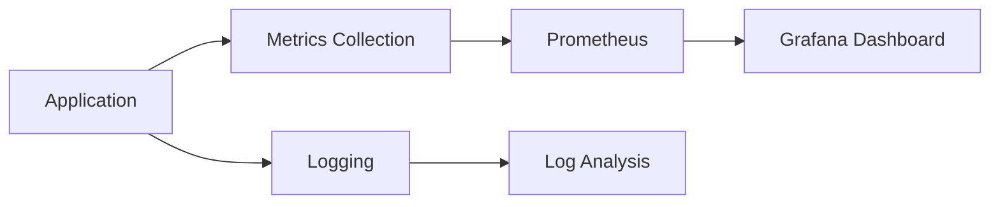

## 16.13 Performance Testing and Continuous Monitoring

In the fast-paced world of software development, ensuring that your applications perform efficiently and reliably is paramount. Performance testing and continuous monitoring are two critical practices that help developers maintain and improve the performance of their applications. In this section, we will delve into the intricacies of performance testing and continuous monitoring in Swift, providing you with the knowledge and tools to implement these practices effectively.

### Introduction to Performance Testing

Performance testing is a process of evaluating the speed, responsiveness, and stability of an application under a particular workload. It helps identify bottlenecks and areas for improvement, ensuring that your application meets performance expectations.

#### Types of Performance Testing

1. **Load Testing**: Evaluate the application's ability to handle expected user load.
2. **Stress Testing**: Determine the application's breaking point by pushing it beyond normal operational capacity.
3. **Endurance Testing**: Assess the application's performance over an extended period.
4. **Spike Testing**: Analyze the application's response to sudden increases in load.
5. **Volume Testing**: Examine the application's performance with varying volumes of data.

### Implementing Performance Tests in Swift

To effectively implement performance tests in Swift, you need to integrate them into your test suite using tools and frameworks that support performance testing.

#### XCTest for Performance Testing

XCTest, the native testing framework for Swift, provides built-in support for performance testing. Here's how you can use XCTest to measure the performance of your Swift code:

```swift
import XCTest

class PerformanceTests: XCTestCase {
    func testPerformanceExample() {
        self.measure {
            // Code to measure the time of
            let result = performComplexCalculation()
            XCTAssertNotNil(result)
        }
    }
    
    func performComplexCalculation() -> Int {
        // Simulate a complex calculation
        return (1...1000).reduce(0, +)
    }
}
```

In this example, the `measure` block is used to evaluate the performance of the `performComplexCalculation` method. XCTest will run the code multiple times to provide an average execution time, helping you identify performance issues.

#### Advanced Performance Testing Tools

While XCTest is a great starting point, you might need more advanced tools for comprehensive performance testing. Consider the following:

- **Instruments**: Part of Xcode, Instruments provides a suite of tools for profiling and analyzing your application. Use it to identify performance bottlenecks, memory leaks, and energy usage.
- **Xcode Performance Tests**: Beyond unit tests, Xcode allows you to create performance tests that measure the time taken by specific code paths.

### Setting Up Continuous Monitoring

Continuous monitoring involves tracking the performance of your application in real-time, even after it has been deployed to production. This practice helps you detect and address performance issues proactively.

#### Key Components of Continuous Monitoring

1. **Metrics Collection**: Gather data on application performance, such as response times, error rates, and resource utilization.
2. **Logging**: Record detailed logs of application behavior to diagnose issues.
3. **Alerting**: Set up alerts to notify you of performance anomalies or failures.
4. **Visualization**: Use dashboards to visualize performance data and trends.

#### Tools for Continuous Monitoring

Several tools can help you implement continuous monitoring for your Swift applications:

- **Prometheus**: An open-source monitoring solution that collects metrics and provides powerful querying capabilities.
- **Grafana**: A visualization tool that integrates with Prometheus to create dashboards for monitoring performance metrics.
- **New Relic**: A comprehensive monitoring platform that offers real-time insights into application performance.
- **Datadog**: A cloud-based monitoring service that provides metrics, logs, and traces for full-stack observability.

### Using Metrics and Logging

Metrics and logging are essential components of both performance testing and continuous monitoring. They provide the data needed to understand and improve application performance.

#### Implementing Metrics in Swift

To collect metrics in your Swift application, you can use libraries like SwiftMetrics or create custom solutions using Swift's native capabilities.

```swift
import Foundation

class MetricsManager {
    private var metrics: [String: Int] = [:]
    
    func incrementCounter(for key: String) {
        metrics[key, default: 0] += 1
    }
    
    func getMetric(for key: String) -> Int {
        return metrics[key, default: 0]
    }
}

let metricsManager = MetricsManager()
metricsManager.incrementCounter(for: "api_call")
print(metricsManager.getMetric(for: "api_call")) // Output: 1
```

This simple example demonstrates how to track a metric (in this case, an API call count) using a dictionary. In a real-world scenario, you would integrate with a metrics collection tool to store and analyze this data.

#### Logging in Swift

Logging is crucial for understanding application behavior and diagnosing issues. Swift provides several options for logging, including the `os` framework for system logging.

```swift
import os

let logger = Logger(subsystem: "com.example.app", category: "network")

logger.info("Network request started")
logger.error("Network request failed with error: \\(error.localizedDescription)")
```

In this example, the `os` framework is used to log network-related events. The logs can be viewed using the Console app on macOS, providing insights into the application's runtime behavior.

### Proactively Addressing Performance Issues

By combining performance testing and continuous monitoring, you can proactively address performance issues before they impact users.

#### Best Practices for Proactive Performance Management

1. **Automate Performance Tests**: Integrate performance tests into your CI/CD pipeline to catch issues early.
2. **Monitor Key Metrics**: Focus on metrics that directly impact user experience, such as response time and error rate.
3. **Set Alerts for Anomalies**: Configure alerts to notify you of performance deviations, allowing you to respond quickly.
4. **Regularly Review Logs**: Analyze logs to identify patterns or recurring issues that may indicate underlying problems.
5. **Continuously Optimize Code**: Use insights from performance testing and monitoring to make data-driven optimizations.

### Visualizing Performance Data

Visualizing performance data helps you understand trends and make informed decisions. Tools like Grafana and Datadog offer powerful visualization capabilities.



*Diagram: Visualizing the flow of performance data from the application to monitoring and visualization tools.*

### Try It Yourself

To deepen your understanding of performance testing and continuous monitoring, try implementing the following:

- **Modify the XCTest example** to test different code paths and compare their performance.
- **Set up a simple monitoring stack** using Prometheus and Grafana to visualize metrics from a sample Swift application.
- **Experiment with logging** by adding different log levels and categories to your application.

### Conclusion

Performance testing and continuous monitoring are essential practices for maintaining high-quality Swift applications. By implementing these practices, you can ensure that your applications perform optimally, providing a seamless experience for users. Remember, the journey to mastering performance optimization is ongoing. Keep experimenting, stay curious, and continue to refine your skills.

## Quiz Time!



### What is the primary purpose of performance testing?

- [x] To evaluate the speed, responsiveness, and stability of an application
- [ ] To test the security features of an application
- [ ] To ensure the application has no bugs
- [ ] To check the application's user interface design

> **Explanation:** Performance testing focuses on assessing the application's speed, responsiveness, and stability under various conditions.

### Which XCTest method is used to measure the performance of Swift code?

- [x] measure
- [ ] assert
- [ ] test
- [ ] evaluate

> **Explanation:** The `measure` method in XCTest is specifically designed to evaluate the performance of Swift code.

### What is continuous monitoring?

- [x] Tracking the performance of an application in real-time
- [ ] Testing an application continuously
- [ ] Monitoring the application's security
- [ ] Checking the application's user interface

> **Explanation:** Continuous monitoring involves tracking the application's performance in real-time, even after deployment.

### Which tool is part of Xcode and provides profiling and analysis capabilities?

- [x] Instruments
- [ ] Prometheus
- [ ] Grafana
- [ ] New Relic

> **Explanation:** Instruments is a tool within Xcode that provides profiling and analysis capabilities for applications.

### What is the role of metrics in performance testing?

- [x] To provide data on application performance
- [ ] To log errors in the application
- [ ] To visualize application design
- [ ] To secure the application

> **Explanation:** Metrics provide data on application performance, helping identify areas for improvement.

### What is the purpose of logging in Swift applications?

- [x] To record detailed logs of application behavior
- [ ] To measure the application's performance
- [ ] To visualize application metrics
- [ ] To secure the application

> **Explanation:** Logging records detailed logs of application behavior, aiding in diagnosing issues.

### Which framework in Swift is used for system logging?

- [x] os
- [ ] XCTest
- [ ] Prometheus
- [ ] Grafana

> **Explanation:** The `os` framework in Swift is used for system logging.

### What is a key benefit of continuous monitoring?

- [x] Proactively addressing performance issues
- [ ] Automatically fixing application bugs
- [ ] Enhancing application security
- [ ] Improving user interface design

> **Explanation:** Continuous monitoring allows for proactive addressing of performance issues before they impact users.

### Which tool is used for visualizing performance data in dashboards?

- [x] Grafana
- [ ] Prometheus
- [ ] Instruments
- [ ] XCTest

> **Explanation:** Grafana is a tool used for creating dashboards to visualize performance data.

### True or False: Performance testing should only be done after application deployment.

- [ ] True
- [x] False

> **Explanation:** Performance testing should be integrated into the development process and done continuously, not just after deployment.




