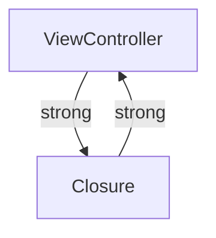

## 16.14 Handling Memory Leaks and Retain Cycles

In Swift, effective memory management is crucial for creating robust and efficient applications. Memory leaks and retain cycles can lead to increased memory usage, degraded performance, and even app crashes. In this section, we will explore how to detect and prevent these issues, ensuring your Swift applications remain performant and reliable.

### Understanding Memory Leaks and Retain Cycles

Before diving into detection and prevention strategies, let's clarify what memory leaks and retain cycles are.

- **Memory Leaks** occur when allocated memory is no longer needed but is not released back to the system. This can lead to increased memory usage and, eventually, application crashes if the memory is exhausted.
- **Retain Cycles** happen when two or more objects hold strong references to each other, preventing them from being deallocated. This is a common cause of memory leaks in Swift.

### Automatic Reference Counting (ARC)

Swift uses Automatic Reference Counting (ARC) to manage memory. ARC automatically tracks and manages the memory usage of your app by keeping track of the number of references to each class instance. When the reference count of an instance drops to zero, ARC automatically deallocates the instance.

However, ARC cannot handle retain cycles on its own, which is why understanding and managing references is crucial.

### Detecting Memory Leaks

#### Using Instruments

Xcode provides a powerful tool called **Instruments** to help detect memory leaks and analyze memory usage. Here's how to use it:

1. **Open Instruments**: In Xcode, go to `Product > Profile` or use the shortcut `Command + I`.
2. **Select the Leaks Template**: Choose the "Leaks" template to start analyzing your app.
3. **Run Your App**: Instruments will launch your app and begin monitoring memory usage.
4. **Analyze Results**: Look for leaks in the timeline and inspect the call stack to identify where the leaks are occurring.

#### Example: Detecting a Memory Leak

Consider the following code snippet that contains a potential memory leak:

```swift
class LeakyClass {
    var closure: (() -> Void)?
    
    func setupClosure() {
        closure = {
            print("Closure called")
        }
    }
}

var leakyInstance: LeakyClass? = LeakyClass()
leakyInstance?.setupClosure()
leakyInstance = nil
```

In this example, the closure captures `self` strongly, leading to a retain cycle. Using Instruments, you can detect this leak and take corrective action.

### Understanding Common Causes of Retain Cycles

#### Closures and Strong References

Closures are a common source of retain cycles because they capture variables from their surrounding context by default. If a closure captures `self` strongly, it can create a retain cycle.

#### Example: Retain Cycle with Closures

```swift
class ViewController: UIViewController {
    var completionHandler: (() -> Void)?
    
    func loadData() {
        completionHandler = {
            self.updateUI()
        }
    }
    
    func updateUI() {
        print("UI updated")
    }
}
```

In this example, `self` is captured strongly by the closure, creating a retain cycle between the `ViewController` instance and the closure.

### Preventing Memory Leaks and Retain Cycles

#### Using Weak and Unowned References

To prevent retain cycles, use `weak` or `unowned` references. A `weak` reference does not increase the reference count, and it becomes `nil` when the referenced object is deallocated. An `unowned` reference assumes the referenced object will always be in memory.

#### Example: Breaking Retain Cycle with Weak Reference

```swift
class ViewController: UIViewController {
    var completionHandler: (() -> Void)?
    
    func loadData() {
        completionHandler = { [weak self] in
            self?.updateUI()
        }
    }
    
    func updateUI() {
        print("UI updated")
    }
}
```

By capturing `self` as `weak`, we prevent the retain cycle. The closure does not increase the reference count of `self`, allowing it to be deallocated when no longer needed.

#### Using Unowned References

Use `unowned` references when you are certain that the referenced object will not be deallocated before the reference is accessed.

```swift
class ViewController: UIViewController {
    var completionHandler: (() -> Void)?
    
    func loadData() {
        completionHandler = { [unowned self] in
            self.updateUI()
        }
    }
    
    func updateUI() {
        print("UI updated")
    }
}
```

In this example, `self` is captured as `unowned`, which is safe if `self` is guaranteed to outlive the closure.

### Visualizing Retain Cycles

To better understand how retain cycles occur, let's visualize it using a Mermaid.js diagram:



In this diagram, the `ViewController` holds a strong reference to the closure, and the closure holds a strong reference back to the `ViewController`, creating a retain cycle.

### Best Practices for Memory Management

1. **Analyze and Profile Regularly**: Use Instruments to regularly check for memory leaks and optimize memory usage.
2. **Use `weak` and `unowned` Wisely**: Understand when to use `weak` and `unowned` references to break retain cycles.
3. **Avoid Strong References in Closures**: Be cautious when capturing `self` in closures. Use capture lists to specify the reference type.
4. **Review Code for Retain Cycles**: Regularly review your codebase to identify potential retain cycles, especially in complex object graphs.

### Try It Yourself

Experiment with the provided code examples by modifying the reference types and observing the impact on memory management. Use Instruments to detect any leaks and practice resolving them.

### Further Reading

For more information on memory management in Swift, consider the following resources:

- [Apple's Swift Programming Language Guide](https://developer.apple.com/documentation/swift)
- [Swift.org](https://swift.org/documentation/)
- [Ray Wenderlich's Swift Memory Management Guide](https://www.raywenderlich.com/)

### Knowledge Check

- Explain the difference between `weak` and `unowned` references.
- How can you detect a memory leak using Instruments?
- What is a retain cycle, and how can it be resolved?
- Why is it important to manage memory effectively in Swift applications?

### Embrace the Journey

Remember, mastering memory management in Swift is an ongoing journey. As you continue to develop your skills, you'll become more adept at identifying and resolving memory issues. Keep experimenting, stay curious, and enjoy the process of becoming a more proficient Swift developer!

## Quiz Time!



### What is a memory leak?

- [x] When allocated memory is not released back to the system
- [ ] When memory is allocated dynamically
- [ ] When memory is released prematurely
- [ ] When memory is shared between objects

> **Explanation:** A memory leak occurs when allocated memory is no longer needed but is not released back to the system, leading to increased memory usage.

### What is a retain cycle?

- [x] When two or more objects hold strong references to each other
- [ ] When an object is referenced by a weak reference
- [ ] When an object is deallocated prematurely
- [ ] When an object is referenced by multiple objects

> **Explanation:** A retain cycle occurs when two or more objects hold strong references to each other, preventing them from being deallocated.

### How can you detect memory leaks in Swift?

- [x] Using Instruments in Xcode
- [ ] By manually checking code
- [ ] By using print statements
- [ ] By using breakpoints

> **Explanation:** Instruments in Xcode is a powerful tool for detecting memory leaks and analyzing memory usage.

### What is the purpose of using a weak reference?

- [x] To prevent increasing the reference count and avoid retain cycles
- [ ] To increase the reference count of an object
- [ ] To ensure an object is never deallocated
- [ ] To create a strong reference to an object

> **Explanation:** A weak reference does not increase the reference count, helping to prevent retain cycles.

### When should you use an unowned reference?

- [x] When you are certain the referenced object will not be deallocated before the reference is accessed
- [ ] When you want to increase the reference count
- [ ] When you want to create a strong reference
- [ ] When you want to ensure an object is always in memory

> **Explanation:** An unowned reference assumes the referenced object will always be in memory and is safe to use when you are certain the object will not be deallocated before the reference is accessed.

### What is the default behavior of closures in Swift regarding captured variables?

- [x] They capture variables from their surrounding context strongly
- [ ] They capture variables weakly
- [ ] They do not capture any variables
- [ ] They capture variables unowned

> **Explanation:** Closures in Swift capture variables from their surrounding context strongly by default, which can lead to retain cycles if not managed properly.

### How can you break a retain cycle caused by a closure?

- [x] By using a capture list with weak or unowned references
- [ ] By increasing the reference count
- [ ] By using a strong reference
- [ ] By not using closures

> **Explanation:** A capture list with weak or unowned references can break a retain cycle caused by a closure by not increasing the reference count of the captured variables.

### What tool in Xcode helps analyze memory usage?

- [x] Instruments
- [ ] Debugger
- [ ] Console
- [ ] Simulator

> **Explanation:** Instruments in Xcode is used to analyze memory usage and detect memory leaks.

### What is the main cause of retain cycles in Swift?

- [x] Strong references in closures
- [ ] Weak references in closures
- [ ] Unowned references in closures
- [ ] No references in closures

> **Explanation:** Strong references in closures are a common cause of retain cycles in Swift, as they capture variables from their surrounding context strongly.

### True or False: A weak reference can become nil if the referenced object is deallocated.

- [x] True
- [ ] False

> **Explanation:** A weak reference does not increase the reference count, and it becomes nil when the referenced object is deallocated.


