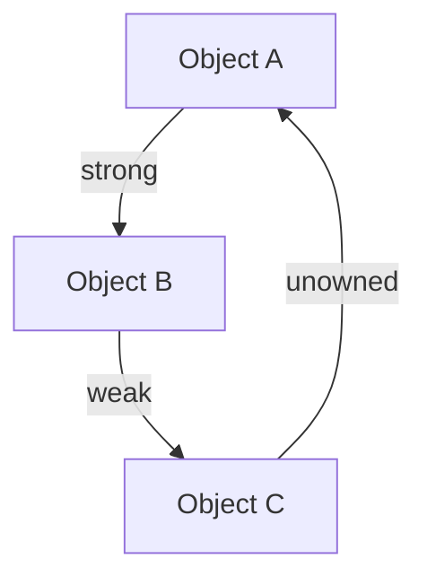

## 16.15 Best Practices for High-Performance Swift Code

In this section, we delve into the best practices for writing high-performance Swift code. Swift, as a language, offers numerous features that can be leveraged for optimization. However, without careful consideration, it's easy to fall into anti-patterns that degrade performance. Let's explore how to avoid these pitfalls and embrace Swift's strengths for optimal efficiency.

### Introduction to Performance Optimization

Performance optimization in Swift involves writing code that executes efficiently, uses minimal resources, and maintains responsiveness. This is crucial for developing applications that provide a seamless user experience. We will cover strategies to optimize CPU usage, memory management, and responsiveness.

### Avoiding Anti-Patterns

Anti-patterns are common practices that may seem beneficial but result in inefficient code. Recognizing and avoiding these patterns is key to maintaining high performance.

#### 1. Massive View Controllers

The Massive View Controller anti-pattern occurs when a single view controller handles too much responsibility, leading to bloated and inefficient code. To avoid this:

- **Use MVC Properly**: Separate concerns by using the Model-View-Controller pattern correctly. The view controller should only handle view-related logic.
- **Delegate Tasks**: Use delegation to offload tasks to other objects.

#### 2. Retain Cycles and Memory Leaks

Retain cycles occur when two objects hold strong references to each other, preventing deallocation and causing memory leaks.

- **Use Weak References**: Use `weak` or `unowned` references to break retain cycles.
  
```swift
class Parent {
    var child: Child?
}

class Child {
    weak var parent: Parent?
}
```

#### 3. Force Unwrapping Optionals

Force unwrapping can lead to runtime crashes if the optional is `nil`. Instead:

- **Use Optional Binding**: Safely unwrap optionals using `if let` or `guard let`.

```swift
if let value = optionalValue {
    // Use value safely
}
```

### Embracing Swift Language Features

Swift offers several features that, when used correctly, can significantly enhance performance.

#### 1. Value Types and Structs

Swift's preference for value types (structs and enums) over reference types (classes) can lead to more efficient memory management.

- **Use Structs for Simple Data**: Structs are stack-allocated and can be more performant for simple data structures.

```swift
struct Point {
    var x: Double
    var y: Double
}
```

#### 2. Protocol-Oriented Programming

Swift's protocol-oriented programming encourages the use of protocols and protocol extensions, promoting code reuse and flexibility.

- **Use Protocols for Abstraction**: Define protocols for shared behavior and use protocol extensions to provide default implementations.

```swift
protocol Drawable {
    func draw()
}

extension Drawable {
    func draw() {
        print("Drawing a shape")
    }
}
```

#### 3. Generics

Generics allow you to write flexible and reusable functions and types that can work with any type.

- **Use Generics for Reusability**: Avoid code duplication by using generics to write type-agnostic code.

```swift
func swapValues<T>(_ a: inout T, _ b: inout T) {
    let temp = a
    a = b
    b = temp
}
```

### Code Examples and Optimization Techniques

Let's explore some code examples that demonstrate performance optimization techniques in Swift.

#### Using Lazy Initialization

Lazy initialization delays the creation of an object until it is needed, saving resources.

```swift
class DataLoader {
    lazy var data: [String] = {
        // Expensive operation
        return loadData()
    }()
    
    func loadData() -> [String] {
        // Load data from a source
        return ["Data1", "Data2"]
    }
}
```

#### Efficient Looping

Use Swift's high-level functions like `map`, `filter`, and `reduce` for efficient looping.

```swift
let numbers = [1, 2, 3, 4, 5]
let squaredNumbers = numbers.map { $0 * $0 }
```

#### Memory Management with ARC

Swift uses Automatic Reference Counting (ARC) to manage memory. Understanding ARC is crucial for writing efficient Swift code.

- **Avoid Strong Reference Cycles**: Use `weak` and `unowned` to prevent memory leaks.
- **Profile Memory Usage**: Use Xcode's Instruments to profile and optimize memory usage.

### Visualizing Swift's Memory Management

Below is a diagram illustrating how ARC manages memory in Swift, with objects and their reference counts.



**Diagram Description:** This diagram shows a strong reference from Object A to Object B, a weak reference from Object B to Object C, and an unowned reference from Object C back to Object A, preventing a retain cycle.

### Leveraging Concurrency

Concurrency allows you to perform multiple tasks simultaneously, improving responsiveness.

#### Grand Central Dispatch (GCD)

GCD is a powerful tool for managing concurrent tasks in Swift.

- **Use Dispatch Queues**: Perform tasks asynchronously to keep the UI responsive.

```swift
DispatchQueue.global(qos: .background).async {
    // Perform background task
    DispatchQueue.main.async {
        // Update UI
    }
}
```

#### Swift Concurrency with Async/Await

Swift's async/await syntax simplifies writing asynchronous code.

```swift
func fetchData() async throws -> Data {
    let url = URL(string: "https://api.example.com/data")!
    let (data, _) = try await URLSession.shared.data(from: url)
    return data
}
```

### Try It Yourself

Experiment with the provided code examples by modifying them to suit different scenarios. For instance, try changing the data source in the lazy initialization example or implement a custom protocol and use protocol extensions to add functionality.

### References and Further Reading

For more information on Swift performance optimization, consider exploring the following resources:

- [Swift.org Documentation](https://swift.org/documentation/)
- [Apple Developer Documentation](https://developer.apple.com/documentation/)
- [Swift Performance Optimization Techniques](https://developer.apple.com/videos/play/wwdc2020/10168/)

### Knowledge Check

Before we conclude, let's summarize the key takeaways:

- Recognize and avoid common anti-patterns like Massive View Controllers and retain cycles.
- Leverage Swift's language features such as value types, protocol-oriented programming, and generics for efficient code.
- Utilize concurrency tools like GCD and async/await to improve responsiveness.
- Profile and optimize memory usage with ARC and Xcode's Instruments.

Remember, this is just the beginning. As you continue to develop in Swift, keep experimenting, stay curious, and embrace the journey of learning and optimization.

## Quiz Time!



### What is a common anti-pattern in Swift that leads to inefficient code?

- [x] Massive View Controller
- [ ] Protocol-Oriented Programming
- [ ] Using Generics
- [ ] Lazy Initialization

> **Explanation:** Massive View Controller is an anti-pattern where a single view controller handles too much responsibility, leading to inefficient code.

### How can retain cycles be prevented in Swift?

- [x] Using weak references
- [ ] Using strong references
- [ ] Using force unwrapping
- [ ] Using lazy initialization

> **Explanation:** Weak references can be used to prevent retain cycles by not increasing the reference count of an object.

### What Swift feature allows for writing flexible and reusable functions?

- [x] Generics
- [ ] Closures
- [ ] Optionals
- [ ] Structs

> **Explanation:** Generics allow you to write flexible and reusable functions and types that can work with any type.

### Which tool in Swift helps manage concurrent tasks?

- [x] Grand Central Dispatch (GCD)
- [ ] Protocol Extensions
- [ ] Automatic Reference Counting (ARC)
- [ ] Lazy Initialization

> **Explanation:** Grand Central Dispatch (GCD) is a tool for managing concurrent tasks in Swift.

### What is the main benefit of using value types in Swift?

- [x] Efficient memory management
- [ ] Easier debugging
- [ ] Better compatibility with Objective-C
- [ ] Simplified syntax

> **Explanation:** Value types, such as structs, are stack-allocated and can lead to more efficient memory management.

### How does Swift's async/await syntax help with concurrency?

- [x] Simplifies writing asynchronous code
- [ ] Increases the speed of synchronous code
- [ ] Reduces the need for error handling
- [ ] Eliminates the need for dispatch queues

> **Explanation:** Async/await syntax simplifies writing asynchronous code by allowing you to write async code that looks like synchronous code.

### What should you use to safely unwrap optionals in Swift?

- [x] Optional Binding
- [ ] Force Unwrapping
- [ ] Strong References
- [ ] Protocol Extensions

> **Explanation:** Optional Binding, using `if let` or `guard let`, safely unwraps optionals in Swift.

### Which Swift feature promotes code reuse and flexibility?

- [x] Protocol-Oriented Programming
- [ ] Massive View Controller
- [ ] Force Unwrapping
- [ ] Singleton Pattern

> **Explanation:** Protocol-Oriented Programming promotes code reuse and flexibility by using protocols and protocol extensions.

### What is a benefit of using lazy initialization?

- [x] Saves resources by delaying object creation
- [ ] Increases the speed of object creation
- [ ] Simplifies code syntax
- [ ] Reduces the need for protocols

> **Explanation:** Lazy initialization saves resources by delaying the creation of an object until it is needed.

### True or False: Swift's Automatic Reference Counting (ARC) requires manual memory management.

- [ ] True
- [x] False

> **Explanation:** False. Swift's ARC automatically manages memory by keeping track of references to objects, eliminating the need for manual memory management.


