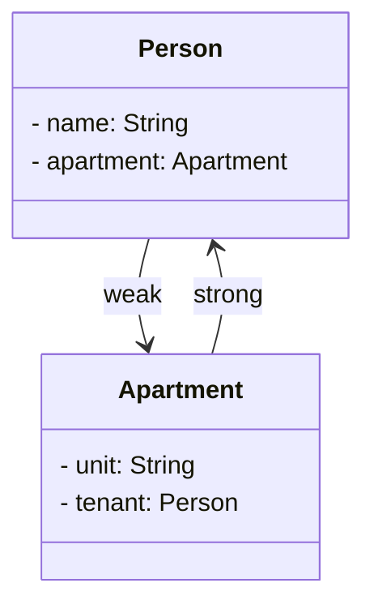

## 16.2 Memory Management and ARC Optimization

Memory management is a crucial aspect of software development, especially in environments like iOS and macOS where resource constraints are a reality. Swift, with its Automatic Reference Counting (ARC) system, provides developers with a powerful tool to manage memory efficiently. In this section, we will delve into the intricacies of ARC, explore techniques for efficient memory management, and learn how to avoid common pitfalls such as memory leaks and retain cycles. Let's embark on this journey to master memory management in Swift!

### Understanding Automatic Reference Counting (ARC)

Automatic Reference Counting (ARC) is a memory management feature in Swift that automatically keeps track of and manages your app's memory usage. Unlike garbage collection, ARC works by counting the number of references to each object and deallocating objects when their reference count drops to zero.

#### How ARC Works

When you create an instance of a class, ARC allocates a chunk of memory to store information about that instance. This includes the instance's type information, its properties, and any other associated data. ARC then manages the memory for that instance by tracking the number of active references to it:

- **Strong References**: By default, every reference to an instance is a strong reference. ARC increases the reference count by one each time a strong reference is created and decreases it by one when a strong reference is destroyed.
- **Deallocation**: When the reference count of an instance reaches zero, ARC automatically deallocates the memory used by that instance.

### Techniques for Efficient Memory Management

Efficient memory management is key to ensuring that your application runs smoothly and does not consume more resources than necessary. Here are some techniques to optimize memory usage in Swift:

#### 1. Use Value Types When Appropriate

Swift offers both value types (structs, enums) and reference types (classes). Value types are copied when they are assigned or passed around, which can be more memory-efficient in certain scenarios. Use value types when:

- You need a simple data structure with no inheritance.
- You want to ensure immutability.
- You want to avoid the overhead of reference counting.

#### 2. Minimize Retain Cycles

Retain cycles occur when two or more objects hold strong references to each other, preventing ARC from deallocating them. To avoid retain cycles:

- Use **weak** references when one object should not prevent another from being deallocated.
- Use **unowned** references when one object should not prevent another from being deallocated and you are certain the reference will never be nil during its lifetime.

#### 3. Utilize `weak` and `unowned` References Appropriately

- **Weak References**: A weak reference does not increase the reference count of an instance. It is declared with the `weak` keyword and is always optional (`nil` if the instance is deallocated).

  ```swift
  class Person {
      var name: String
      init(name: String) {
          self.name = name
      }
  }

  class Apartment {
      var unit: String
      weak var tenant: Person?
      init(unit: String) {
          self.unit = unit
      }
  }

  var john: Person? = Person(name: "John")
  var unit4A: Apartment? = Apartment(unit: "4A")

  unit4A?.tenant = john
  john = nil  // John's instance is deallocated because there are no strong references
  ```

- **Unowned References**: An unowned reference does not increase the reference count and is declared with the `unowned` keyword. It is non-optional and assumes the referenced instance will never be nil.

  ```swift
  class Customer {
      var name: String
      var card: CreditCard?
      init(name: String) {
          self.name = name
      }
  }

  class CreditCard {
      let number: String
      unowned let customer: Customer
      init(number: String, customer: Customer) {
          self.number = number
          self.customer = customer
      }
  }

  let customer = Customer(name: "Alice")
  customer.card = CreditCard(number: "1234-5678-9012-3456", customer: customer)
  ```

### Avoiding Memory Leaks and Retain Cycles

Memory leaks occur when objects are not properly deallocated, leading to wasted memory. Retain cycles are a common cause of memory leaks in Swift. Here are strategies to avoid them:

#### 1. Break Strong Reference Cycles

Identify and break strong reference cycles by introducing weak or unowned references where appropriate. Use weak references for optional relationships and unowned references for non-optional ones.

#### 2. Use Capture Lists in Closures

Closures in Swift can capture and store references to variables and instances from their surrounding context. This can lead to retain cycles if the closure is stored in a property of an instance that it captures. Use capture lists to define the capture behavior explicitly:

```swift
class HTMLElement {
    let name: String
    let text: String?

    lazy var asHTML: () -> String = { [unowned self] in
        if let text = self.text {
            return "<\\(self.name)>\\(text)</\\(self.name)>"
        } else {
            return "<\\(self.name) />"
        }
    }

    init(name: String, text: String? = nil) {
        self.name = name
        self.text = text
    }
}

let heading = HTMLElement(name: "h1", text: "Welcome")
print(heading.asHTML())
```

In this example, the closure captures `self` as an unowned reference, preventing a strong reference cycle.

### Visualizing ARC and Memory Management

To better understand how ARC manages memory and prevents leaks, let's visualize the process using a class diagram.



In this diagram, the `Person` class has a weak reference to `Apartment`, while `Apartment` has a strong reference to `Person`. This setup prevents a retain cycle, allowing ARC to deallocate objects when they are no longer needed.

### Swift's Unique Features for Memory Management

Swift offers unique features that enhance memory management and ARC optimization:

- **Value Semantics**: Swift's value types (structs, enums) inherently avoid retain cycles, as they are copied rather than referenced.
- **ARC in Protocols**: Swift allows ARC to be applied to protocol types, ensuring efficient memory management even when using polymorphism.
- **Memory Safety**: Swift's type system and ARC work together to provide memory safety, reducing the risk of memory-related errors.

### Try It Yourself

Experiment with the code examples provided in this section. Try modifying the relationships between objects, introducing weak or unowned references, and observing how ARC manages memory. This hands-on approach will deepen your understanding of memory management in Swift.

### Knowledge Check

Before we wrap up, let's reinforce our learning with some questions and exercises:

- What is the main difference between weak and unowned references?
- How can capture lists in closures help prevent retain cycles?
- Experiment by creating a retain cycle and then breaking it using weak references. Observe the behavior of ARC.

### Summary

In this section, we explored the intricacies of memory management in Swift through ARC. We learned about strong, weak, and unowned references and how they impact memory management. By understanding and applying these concepts, you can optimize your Swift applications for efficient memory usage, avoiding common pitfalls like memory leaks and retain cycles.

Remember, mastering memory management is a continuous journey. As you progress, keep experimenting, stay curious, and enjoy the process of building robust and efficient Swift applications!

## Quiz Time!



### What is Automatic Reference Counting (ARC) in Swift?

- [x] A memory management feature that automatically keeps track of and manages your app's memory usage.
- [ ] A manual memory management technique where developers are responsible for allocating and deallocating memory.
- [ ] A garbage collection system similar to Java's.
- [ ] A feature that only applies to value types in Swift.

> **Explanation:** ARC is a memory management feature in Swift that automatically keeps track of and manages your app's memory usage by counting references to objects.

### What is a retain cycle?

- [x] A situation where two or more objects hold strong references to each other, preventing ARC from deallocating them.
- [ ] A feature that allows objects to be retained in memory indefinitely.
- [ ] A cycle that occurs when objects are deallocated prematurely.
- [ ] A method for optimizing memory usage in Swift.

> **Explanation:** A retain cycle occurs when two or more objects hold strong references to each other, preventing ARC from deallocating them, leading to memory leaks.

### How can you prevent retain cycles in Swift?

- [x] Use weak or unowned references where appropriate.
- [ ] Use only strong references.
- [ ] Avoid using closures.
- [ ] Use only value types.

> **Explanation:** Prevent retain cycles by using weak or unowned references where appropriate, especially in closures and delegate patterns.

### What is the difference between weak and unowned references?

- [x] Weak references do not increase the reference count and are optional; unowned references do not increase the reference count and are non-optional.
- [ ] Weak references increase the reference count; unowned references do not.
- [ ] Weak references are non-optional; unowned references are optional.
- [ ] Weak references are used for value types; unowned references are used for reference types.

> **Explanation:** Weak references do not increase the reference count and are optional, while unowned references do not increase the reference count and are non-optional.

### When should you use an unowned reference?

- [x] When you are certain that the reference will never be nil during its lifetime.
- [ ] When you want to allow the reference to become nil.
- [ ] When you want to increase the reference count.
- [ ] When you are using value types.

> **Explanation:** Use unowned references when you are certain that the reference will never be nil during its lifetime, ensuring non-optional behavior.

### How does ARC handle memory deallocation?

- [x] ARC deallocates memory when an object's reference count drops to zero.
- [ ] ARC deallocates memory at regular intervals.
- [ ] ARC requires manual intervention to deallocate memory.
- [ ] ARC deallocates memory based on the size of the object.

> **Explanation:** ARC automatically deallocates memory when an object's reference count drops to zero, freeing up resources.

### What is a capture list in a closure?

- [x] A way to define how captured variables are treated within a closure.
- [ ] A list of variables that cannot be captured by a closure.
- [ ] A method for increasing the reference count of captured variables.
- [ ] A feature that prevents closures from capturing variables.

> **Explanation:** A capture list in a closure defines how captured variables are treated, helping to prevent retain cycles by specifying weak or unowned references.

### What is the primary benefit of using value types in Swift?

- [x] They avoid retain cycles as they are copied rather than referenced.
- [ ] They increase the reference count of objects.
- [ ] They allow for more complex inheritance hierarchies.
- [ ] They automatically manage memory for reference types.

> **Explanation:** Value types avoid retain cycles because they are copied rather than referenced, which can lead to more efficient memory management.

### How can you test for memory leaks in a Swift application?

- [x] Use Xcode's Instruments tool to track memory usage and identify leaks.
- [ ] Manually count references to objects.
- [ ] Use print statements to log memory allocation.
- [ ] Avoid using closures and delegates.

> **Explanation:** Xcode's Instruments tool provides a way to track memory usage and identify leaks, helping developers optimize memory management.

### True or False: ARC is only applicable to reference types in Swift.

- [x] True
- [ ] False

> **Explanation:** ARC is only applicable to reference types (classes) in Swift, as value types (structs, enums) do not require reference counting.




