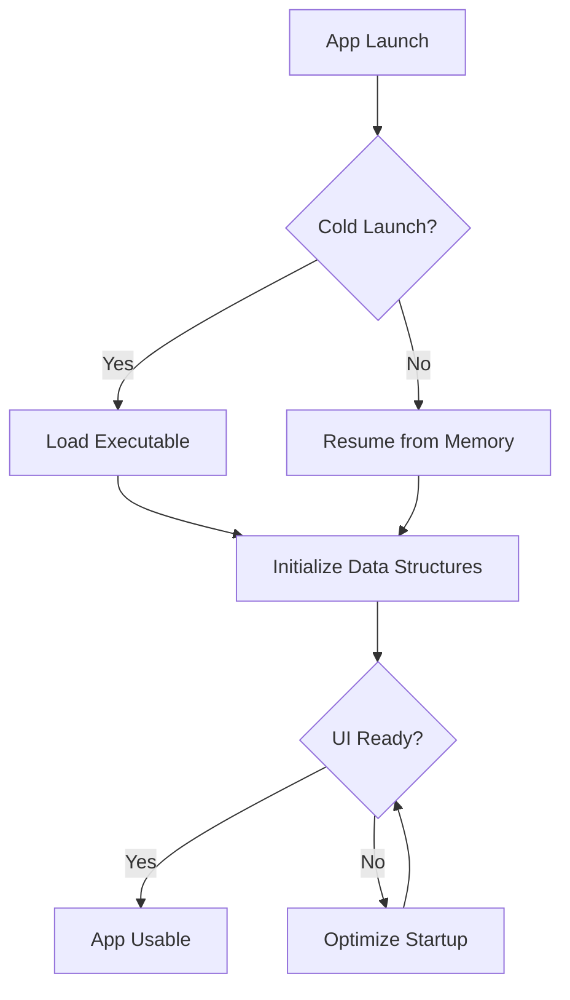

## 16.3 Reducing App Launch Time

In today's fast-paced digital world, users expect apps to launch swiftly and become usable almost instantaneously. A sluggish app launch can lead to user frustration and abandonment, making it crucial for developers to focus on optimizing app launch times. In this section, we will delve into various strategies to minimize the time it takes for a Swift app to become usable, emphasizing lazy loading, deferred initialization, and optimized startup routines.

### Understanding App Launch Time

App launch time is the period from when a user taps the app icon to when the app becomes fully interactive. It can be divided into two phases:

1. **Cold Launch**: Occurs when the app is launched for the first time after a device restart or when it has been terminated. This phase involves loading the app's executable and initializing its data structures.

2. **Warm Launch**: Happens when the app is already in memory, either in the background or recently used. This phase is generally faster as it skips some initializations.

### Key Strategies for Reducing App Launch Time

#### 1. Lazy Loading of Resources

Lazy loading is a design pattern that delays the initialization of an object until it is needed. This can significantly reduce the initial workload during app launch.

**Implement Lazy Loading in Swift:**

```swift
class ImageLoader {
    private var image: UIImage?

    var loadedImage: UIImage {
        if image == nil {
            image = loadImageFromDisk()
        }
        return image!
    }

    private func loadImageFromDisk() -> UIImage {
        // Simulate a disk load
        return UIImage(named: "example.png")!
    }
}
```

In this example, the image is only loaded when `loadedImage` is accessed, deferring the resource-intensive operation until necessary.

#### 2. Deferring Heavy Initialization

Defer the initialization of heavy components or data that are not immediately required. This can be achieved by moving such initializations to background threads or delaying them until the app is idle.

**Example of Deferred Initialization:**

```swift
class DataManager {
    private var data: [String]?

    init() {
        DispatchQueue.global(qos: .background).async {
            self.data = self.loadData()
        }
    }

    private func loadData() -> [String] {
        // Simulate data loading
        return ["Data1", "Data2", "Data3"]
    }
}
```

By loading data on a background thread, the app's main thread remains responsive during launch.

#### 3. Optimizing Startup Routines

Examine and streamline the code executed during app startup. Remove unnecessary operations and ensure that only essential tasks are performed.

**Steps for Optimizing Startup Routines:**

- **Profile Startup Time**: Use Xcode's Instruments to profile and identify bottlenecks in the startup sequence.
- **Minimize Main Thread Work**: Offload non-essential tasks to background threads.
- **Use Efficient Data Structures**: Choose data structures that offer optimal performance for the operations being performed.

#### 4. Minimizing Initial Workload

Reduce the amount of work done during the app's initial launch by loading only what is necessary for the first screen to appear.

**Example of Minimizing Initial Workload:**

```swift
class InitialViewController: UIViewController {
    override func viewDidLoad() {
        super.viewDidLoad()
        
        // Load only essential UI components
        setupUI()
        
        // Defer non-essential setup
        DispatchQueue.global(qos: .background).async {
            self.performDeferredSetup()
        }
    }

    private func setupUI() {
        // Setup essential UI components
    }

    private func performDeferredSetup() {
        // Perform non-essential setup tasks
    }
}
```

By deferring non-essential setup tasks, the app becomes usable more quickly.

### Visualizing the App Launch Process

To better understand the app launch process and where optimizations can be applied, let's visualize it using a flowchart.



**Diagram Description:** This flowchart illustrates the app launch process, highlighting the decision points between cold and warm launches and the steps leading to the app becoming usable.

### Best Practices for Reducing App Launch Time

- **Profile Regularly**: Continuously profile your app to identify new bottlenecks as features are added.
- **Use Instruments**: Leverage Xcode's Instruments for detailed insights into app performance.
- **Optimize Asset Loading**: Compress images and use appropriate formats to reduce loading times.
- **Avoid Synchronous Calls**: Use asynchronous calls to keep the main thread responsive.
- **Limit Third-Party Libraries**: Only include necessary libraries, as each one adds to the startup time.

### Swift-Specific Considerations

Swift offers unique features that can aid in reducing app launch time:

- **Value Types**: Use structs instead of classes where possible to reduce memory overhead.
- **Protocol-Oriented Programming**: Leverage protocols to define flexible and reusable components.
- **Swift Concurrency**: Utilize async/await and actors to manage concurrent tasks efficiently.

### Try It Yourself

Experiment with the code examples provided by modifying them to suit your app's needs. Try deferring different types of initializations and observe the impact on launch time. Use Xcode's Instruments to measure performance improvements.

### Knowledge Check

- **Question**: What is the difference between a cold launch and a warm launch?
- **Exercise**: Profile an existing app and identify at least two areas where launch time can be optimized.

### Conclusion

Reducing app launch time is a crucial aspect of performance optimization in Swift development. By implementing strategies such as lazy loading, deferred initialization, and optimized startup routines, you can significantly enhance the user experience. Remember, this is just the beginning. As you progress, you'll discover more techniques to refine your app's performance. Keep experimenting, stay curious, and enjoy the journey!

## Quiz Time!



### What is the primary benefit of lazy loading resources in an app?

- [x] It defers the initialization of objects until they are needed.
- [ ] It loads all resources at once to improve performance.
- [ ] It increases the app's memory usage.
- [ ] It makes the app launch slower.

> **Explanation:** Lazy loading defers the initialization of objects until they are needed, reducing the initial workload during app launch.

### Which phase of app launch involves loading the app's executable and initializing data structures?

- [x] Cold Launch
- [ ] Warm Launch
- [ ] Background Launch
- [ ] Hot Launch

> **Explanation:** A cold launch involves loading the app's executable and initializing its data structures.

### How can deferred initialization improve app launch time?

- [x] By moving heavy initializations to background threads.
- [ ] By performing all initializations on the main thread.
- [ ] By loading all data at once.
- [ ] By increasing the app's memory usage.

> **Explanation:** Deferred initialization improves app launch time by moving heavy initializations to background threads, keeping the main thread responsive.

### What tool can you use to profile and identify bottlenecks in the app startup sequence?

- [x] Xcode's Instruments
- [ ] Swift Playgrounds
- [ ] Terminal
- [ ] Safari

> **Explanation:** Xcode's Instruments is a powerful tool for profiling and identifying bottlenecks in the app startup sequence.

### Which of the following is a best practice for reducing app launch time?

- [x] Use asynchronous calls to keep the main thread responsive.
- [ ] Load all assets synchronously.
- [ ] Use as many third-party libraries as possible.
- [ ] Perform all setup tasks on the main thread.

> **Explanation:** Using asynchronous calls helps keep the main thread responsive, reducing app launch time.

### What is the difference between a cold launch and a warm launch?

- [x] A cold launch occurs when the app is launched for the first time after a device restart, while a warm launch happens when the app is already in memory.
- [ ] A cold launch is faster than a warm launch.
- [ ] A warm launch involves loading the app's executable.
- [ ] A cold launch skips some initializations.

> **Explanation:** A cold launch occurs when the app is launched for the first time after a device restart, while a warm launch happens when the app is already in memory.

### How can you minimize the initial workload during app launch?

- [x] Load only what is necessary for the first screen to appear.
- [ ] Load all resources immediately.
- [ ] Perform all initializations on the main thread.
- [ ] Increase the app's memory usage.

> **Explanation:** Minimizing the initial workload involves loading only what is necessary for the first screen to appear.

### What is a key feature of Swift that can aid in reducing app launch time?

- [x] Value Types
- [ ] Synchronous Calls
- [ ] Heavy Initializations
- [ ] Third-Party Libraries

> **Explanation:** Using value types like structs instead of classes can reduce memory overhead, aiding in reducing app launch time.

### True or False: Lazy loading increases the app's memory usage.

- [ ] True
- [x] False

> **Explanation:** Lazy loading does not increase the app's memory usage; it defers the initialization of objects until they are needed.

### Which strategy involves delaying the initialization of an object until it is needed?

- [x] Lazy Loading
- [ ] Immediate Loading
- [ ] Synchronous Initialization
- [ ] Preloading

> **Explanation:** Lazy loading involves delaying the initialization of an object until it is needed, reducing the initial workload during app launch.


