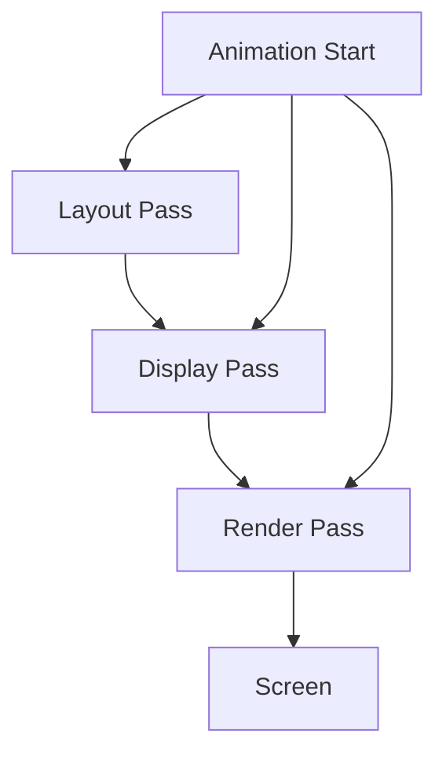

## 16.4 Optimizing Rendering and Animations

In the realm of modern app development, rendering and animations play a pivotal role in delivering a seamless user experience. As developers, our goal is to ensure that these elements are not only visually appealing but also performant. This section will guide you through optimizing rendering and animations in Swift, focusing on both UIKit and SwiftUI frameworks. We will explore techniques to enhance UI rendering performance, ensure smooth animations, and identify issues that cause dropped frames.

### Understanding Rendering and Animations in Swift

Before diving into optimization techniques, it's crucial to understand how rendering and animations work in Swift. Rendering refers to the process of drawing the UI elements on the screen, while animations involve changing properties of these elements over time to create motion.

#### Rendering Pipeline

The rendering pipeline is a sequence of steps that the system follows to display content on the screen. In iOS, this pipeline involves:

1. **Layout Pass**: Determines the size and position of each view.
2. **Display Pass**: Prepares the views for rendering by creating a backing store.
3. **Render Pass**: Composites the views into a final image that can be displayed.

#### Animation Basics

Animations in Swift can be achieved using UIKit's `UIView` animations or SwiftUI's declarative syntax. They involve:

- **Interpolation**: Calculating intermediate frames between the start and end states.
- **Timing Functions**: Controlling the speed of the animation over time.
- **Layer Backing**: Using Core Animation layers for efficient rendering.

### Techniques for Smooth Animations

Creating smooth animations requires careful consideration of several factors. Let's explore some techniques to achieve this:

#### 1. Use Core Animation

Core Animation is a powerful framework that allows you to perform animations at the layer level, providing better performance. By animating `CALayer` properties directly, you can offload work to the GPU, reducing CPU load.

```swift
let animation = CABasicAnimation(keyPath: "position")
animation.fromValue = CGPoint(x: 0, y: 0)
animation.toValue = CGPoint(x: 100, y: 100)
animation.duration = 1.0
view.layer.add(animation, forKey: "position")
```

#### 2. Leverage UIView Animations

UIKit provides a straightforward way to animate views using `UIView` animations. Ensure animations are performed on the main thread and avoid complex calculations during animations.

```swift
UIView.animate(withDuration: 0.5) {
    view.alpha = 0.0
}
```

#### 3. Optimize SwiftUI Animations

SwiftUI offers declarative animations that are easy to implement. Use `withAnimation` to animate state changes and prefer implicit animations for simplicity.

```swift
withAnimation {
    self.isVisible.toggle()
}
```

#### 4. Reduce Overdraw

Overdraw occurs when multiple layers are drawn on top of each other unnecessarily. Use Xcode's Debug View Hierarchy tool to identify and minimize overdraw.

#### 5. Avoid Layout Thrashing

Layout thrashing happens when layout calculations are repeatedly triggered, causing performance issues. Batch updates to avoid multiple layout passes.

```swift
view.setNeedsLayout()
view.layoutIfNeeded()
```

### Identifying and Fixing Dropped Frames

Dropped frames occur when the rendering pipeline cannot keep up with the screen's refresh rate, leading to choppy animations. Here are some strategies to identify and fix these issues:

#### 1. Use Instruments

Xcode Instruments provides tools like Time Profiler and Core Animation to profile your app and identify bottlenecks in rendering and animations.

#### 2. Profile with FPS Counters

Use FPS counters to monitor the frame rate of your app. Aim for 60 FPS for smooth animations.

#### 3. Optimize Image Loading

Large images can slow down rendering. Use image caching and lazy loading to improve performance.

#### 4. Minimize Main Thread Work

Keep the main thread free of heavy computations during animations. Offload tasks to background threads whenever possible.

### Best Practices for Rendering and Animations

To ensure optimal performance, follow these best practices:

- **Use Vector Graphics**: Prefer vector images over raster images for scalability and performance.
- **Cache Calculations**: Cache expensive calculations and reuse them to avoid redundant work.
- **Avoid Blocking the Main Thread**: Keep animations smooth by ensuring the main thread is not blocked by heavy tasks.
- **Test on Real Devices**: Always test animations on physical devices, as simulators may not accurately reflect performance.

### Visualizing Rendering and Animation Flow

To better understand the rendering and animation process, let's visualize the flow using a Mermaid.js diagram:



**Diagram Description**: This diagram illustrates the rendering pipeline flow from the layout pass to the final render on the screen. Animations interact with each stage to ensure smooth transitions.

### Try It Yourself

To solidify your understanding, try modifying the code examples provided. Experiment with different animation durations, timing functions, and properties to see how they affect performance.

### References and Further Reading

- [Apple's Core Animation Documentation](https://developer.apple.com/documentation/quartzcore/core_animation)
- [SwiftUI Animations Guide](https://developer.apple.com/documentation/swiftui/animation)
- [Xcode Instruments User Guide](https://developer.apple.com/library/archive/documentation/DeveloperTools/Conceptual/InstrumentsUserGuide/index.html)

### Knowledge Check

1. What is the rendering pipeline, and why is it important for animations?
2. How can Core Animation improve animation performance?
3. What are some common causes of dropped frames in animations?

### Embrace the Journey

Remember, mastering rendering and animations is an ongoing journey. As you continue to explore these concepts, you'll discover new ways to enhance your app's performance and user experience. Stay curious, keep experimenting, and enjoy the process!

## Quiz Time!



### What is the primary benefit of using Core Animation for animations?

- [x] Offloads animation calculations to the GPU
- [ ] Provides more customization options
- [ ] Simplifies the animation code
- [ ] Increases code readability

> **Explanation:** Core Animation offloads animation calculations to the GPU, reducing CPU load and improving performance.

### Which tool can be used to identify bottlenecks in rendering and animations?

- [x] Xcode Instruments
- [ ] SwiftLint
- [ ] CocoaPods
- [ ] Carthage

> **Explanation:** Xcode Instruments provides tools like Time Profiler and Core Animation to profile apps and identify performance bottlenecks.

### How can you minimize overdraw in your app?

- [x] Use Xcode's Debug View Hierarchy tool
- [ ] Increase the frame rate
- [ ] Add more layers to the view
- [ ] Use larger images

> **Explanation:** The Debug View Hierarchy tool helps identify and minimize overdraw by showing how layers are composited.

### What is layout thrashing, and how can it be avoided?

- [x] Repeatedly triggering layout calculations; batch updates to avoid multiple layout passes
- [ ] Overloading the GPU; reduce image sizes
- [ ] Blocking the main thread; use background threads
- [ ] Using too many animations; limit animation usage

> **Explanation:** Layout thrashing occurs when layout calculations are repeatedly triggered. Batch updates to avoid multiple layout passes.

### What is the recommended frame rate for smooth animations?

- [x] 60 FPS
- [ ] 30 FPS
- [ ] 45 FPS
- [ ] 120 FPS

> **Explanation:** 60 FPS is the standard frame rate for smooth animations on most devices.

### Why is it important to test animations on real devices?

- [x] Simulators may not accurately reflect performance
- [ ] Real devices have better graphics
- [ ] Simulators are slower
- [ ] Real devices are more common

> **Explanation:** Testing on real devices is crucial because simulators may not accurately reflect the performance characteristics of physical hardware.

### What is the purpose of using vector graphics in animations?

- [x] Scalability and performance
- [ ] Better color representation
- [ ] Easier to code
- [ ] Supports more file formats

> **Explanation:** Vector graphics are scalable and generally offer better performance than raster images, which can be resource-intensive.

### What is the role of timing functions in animations?

- [x] Control the speed of the animation over time
- [ ] Determine the animation's color
- [ ] Set the animation's duration
- [ ] Define the animation's start position

> **Explanation:** Timing functions control how the speed of an animation changes over time, affecting its overall feel.

### How can image caching improve rendering performance?

- [x] Reduces the need to reload images from disk
- [ ] Increases image quality
- [ ] Makes images load faster
- [ ] Simplifies image code

> **Explanation:** Image caching reduces the need to reload images from disk, thus improving rendering performance by minimizing I/O operations.

### True or False: Overdraw is beneficial for rendering performance.

- [ ] True
- [x] False

> **Explanation:** Overdraw is detrimental to rendering performance as it involves unnecessary drawing of layers, which can slow down the rendering process.


