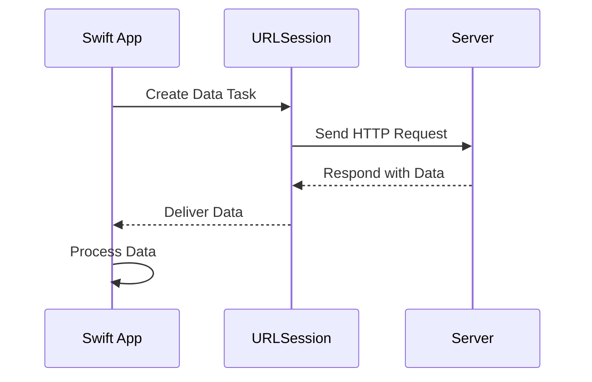

## 16.5 Efficient Networking and Data Loading

In the world of iOS and macOS development, efficient networking and data loading are crucial for creating responsive applications that provide seamless user experiences. This section will guide you through the best practices for making network requests and handling data efficiently in Swift. We will explore background data loading, optimizing parsing and processing of network responses, and more. Let's dive in!

### Understanding Networking in Swift

Swift provides robust tools for networking, including `URLSession`, which is a flexible API for making HTTP requests. Before we delve into optimization, let's review some core concepts:

- **URLSession**: The primary class for managing HTTP requests, supporting tasks like data, download, and upload.
- **Data Task**: Used for fetching data from a network service.
- **Download Task**: Used for downloading files.
- **Upload Task**: Used for uploading files to a server.

### Best Practices for Network Requests

#### 1. Use URLSession for Networking

`URLSession` is the workhorse for networking in Swift. It provides a powerful and flexible API for making HTTP requests. Here’s how you can create a simple data task:

```swift
let url = URL(string: "https://api.example.com/data")!
let task = URLSession.shared.dataTask(with: url) { data, response, error in
    if let error = error {
        print("Error: \\(error)")
        return
    }
    guard let data = data else {
        print("No data received")
        return
    }
    // Process the data
    print("Data received: \\(data)")
}
task.resume()
```

**Key Points:**
- Always handle errors gracefully.
- Ensure you check for `nil` data and handle it appropriately.

#### 2. Optimize Network Requests

- **Use `URLComponents` for Query Parameters**: Construct URLs safely using `URLComponents` to avoid errors in query parameters.

```swift
var components = URLComponents(string: "https://api.example.com/search")!
components.queryItems = [
    URLQueryItem(name: "query", value: "swift"),
    URLQueryItem(name: "page", value: "1")
]
let url = components.url!
```

- **Leverage HTTP Headers**: Set appropriate headers for content types and authentication.

```swift
var request = URLRequest(url: url)
request.setValue("application/json", forHTTPHeaderField: "Content-Type")
request.setValue("Bearer token", forHTTPHeaderField: "Authorization")
```

- **Cache Responses**: Use caching strategies to reduce redundant network calls.

#### 3. Implement Background Data Loading

Background data loading is essential for tasks that require fetching data without blocking the main thread. This is particularly important for maintaining a smooth user interface.

- **Use Background URLSession**: Configure `URLSession` for background tasks.

```swift
let configuration = URLSessionConfiguration.background(withIdentifier: "com.example.app.background")
let session = URLSession(configuration: configuration)
```

- **Handle Background Fetching**: Implement the delegate methods to handle events like completion or errors in background fetching.

```swift
class BackgroundSessionDelegate: NSObject, URLSessionDelegate {
    func urlSession(_ session: URLSession, task: URLSessionTask, didCompleteWithError error: Error?) {
        if let error = error {
            print("Background task error: \\(error)")
        } else {
            print("Background task completed successfully")
        }
    }
}
```

### Optimizing Parsing and Processing of Network Responses

Efficient parsing and processing of network responses are vital for performance. Here are some strategies:

#### 1. Use Codable for JSON Parsing

Swift's `Codable` protocol provides a simple and efficient way to parse JSON data.

```swift
struct User: Codable {
    let id: Int
    let name: String
    let email: String
}

let jsonData = """
{
    "id": 1,
    "name": "John Doe",
    "email": "john@example.com"
}
""".data(using: .utf8)!

do {
    let user = try JSONDecoder().decode(User.self, from: jsonData)
    print("User: \\(user)")
} catch {
    print("Failed to decode JSON: \\(error)")
}
```

**Key Points:**
- Ensure your model conforms to `Codable`.
- Handle decoding errors gracefully.

#### 2. Optimize JSON Parsing

- **Use Background Threads**: Perform parsing on a background thread to keep the UI responsive.

```swift
DispatchQueue.global(qos: .background).async {
    do {
        let user = try JSONDecoder().decode(User.self, from: jsonData)
        DispatchQueue.main.async {
            // Update UI with parsed data
        }
    } catch {
        print("Failed to decode JSON: \\(error)")
    }
}
```

- **Use Streaming for Large Data**: For large JSON responses, consider using streaming parsers to process data incrementally.

#### 3. Efficient Data Processing

- **Batch Processing**: Process data in batches to reduce memory consumption and improve performance.
- **Lazy Loading**: Load data lazily to defer processing until necessary.

### Advanced Techniques for Efficient Networking

#### 1. Combine Framework for Networking

The Combine framework provides a declarative Swift API for processing values over time, which can be used for networking.

```swift
import Combine

let url = URL(string: "https://api.example.com/data")!
let publisher = URLSession.shared.dataTaskPublisher(for: url)
    .map(\.data)
    .decode(type: User.self, decoder: JSONDecoder())
    .receive(on: DispatchQueue.main)
    .sink(receiveCompletion: { completion in
        switch completion {
        case .finished:
            print("Finished")
        case .failure(let error):
            print("Error: \\(error)")
        }
    }, receiveValue: { user in
        print("User: \\(user)")
    })
```

**Key Points:**
- Use `dataTaskPublisher` for network requests.
- Use `map` and `decode` for processing data.

#### 2. Handling Network Errors

Efficient error handling is crucial for a robust networking layer.

- **Retry Logic**: Implement retry logic for transient errors.

```swift
func fetchData(withRetry retryCount: Int = 3) {
    URLSession.shared.dataTask(with: url) { data, response, error in
        if let error = error {
            if retryCount > 0 {
                print("Retrying... (\\(retryCount) attempts left)")
                fetchData(withRetry: retryCount - 1)
            } else {
                print("Error: \\(error)")
            }
            return
        }
        // Process data
    }.resume()
}
```

- **Timeouts and Cancellation**: Set appropriate timeouts and allow users to cancel requests if needed.

#### 3. Network Reachability

Monitor network reachability to handle connectivity changes gracefully.

```swift
import Network

let monitor = NWPathMonitor()
monitor.pathUpdateHandler = { path in
    if path.status == .satisfied {
        print("Connected")
    } else {
        print("No connection")
    }
}
let queue = DispatchQueue(label: "Monitor")
monitor.start(queue: queue)
```

### Visualizing Networking and Data Flow

To better understand the flow of data in a network request, let's visualize the process using a sequence diagram.



**Diagram Explanation:**
- The app creates a data task using `URLSession`.
- `URLSession` sends an HTTP request to the server.
- The server responds with data.
- `URLSession` delivers the data back to the app.
- The app processes the data accordingly.

### Try It Yourself

Experiment with the provided code examples by modifying the URL to fetch different data, adding error handling, or integrating Combine for a more declarative approach. This hands-on practice will help solidify your understanding of efficient networking in Swift.

### Knowledge Check

- What is the primary class for managing HTTP requests in Swift?
- How can you optimize JSON parsing in Swift?
- What is the purpose of using `URLComponents`?
- How can you handle network errors effectively?

### Summary

Efficient networking and data loading are crucial for developing high-performance Swift applications. By leveraging `URLSession`, optimizing JSON parsing, and using advanced techniques like Combine, you can ensure your app remains responsive and efficient. Remember, this is just the beginning. As you progress, you'll build more complex and interactive applications. Keep experimenting, stay curious, and enjoy the journey!

## Quiz Time!



### What is the primary class for managing HTTP requests in Swift?

- [x] URLSession
- [ ] URLConnection
- [ ] HTTPClient
- [ ] NetworkManager

> **Explanation:** `URLSession` is the primary class for managing HTTP requests in Swift, providing a flexible API for making network requests.

### How can you optimize JSON parsing in Swift?

- [x] Use Codable and perform parsing on a background thread
- [ ] Use XMLParser
- [ ] Parse JSON on the main thread
- [ ] Avoid using Codable

> **Explanation:** Using `Codable` for JSON parsing and performing the parsing on a background thread helps keep the UI responsive and optimizes performance.

### What is the purpose of using URLComponents?

- [x] To safely construct URLs with query parameters
- [ ] To parse XML data
- [ ] To manage HTTP headers
- [ ] To create JSON objects

> **Explanation:** `URLComponents` is used to safely construct URLs with query parameters, ensuring that the URL is correctly formatted.

### How can you handle network errors effectively?

- [x] Implement retry logic and handle errors gracefully
- [ ] Ignore errors
- [ ] Use print statements
- [ ] Terminate the app

> **Explanation:** Implementing retry logic and handling errors gracefully ensures that your app can recover from transient network issues.

### What is the benefit of using Combine for networking?

- [x] It provides a declarative API for processing values over time
- [ ] It replaces URLSession
- [ ] It simplifies UI development
- [ ] It is only for handling errors

> **Explanation:** Combine provides a declarative Swift API for processing values over time, which can be used for networking to handle asynchronous data streams efficiently.

### What is the role of NWPathMonitor in Swift?

- [x] To monitor network reachability and connectivity changes
- [ ] To manage HTTP requests
- [ ] To decode JSON data
- [ ] To handle UI updates

> **Explanation:** NWPathMonitor is used to monitor network reachability and handle connectivity changes gracefully in Swift applications.

### How can you perform background data loading in Swift?

- [x] Use a background URLSession configuration
- [ ] Use the main thread for network requests
- [ ] Use synchronous requests
- [ ] Use XML parsing

> **Explanation:** Using a background URLSession configuration allows for background data loading, ensuring that network tasks do not block the main thread.

### What is the advantage of using dataTaskPublisher in Combine?

- [x] It provides a declarative way to handle network requests
- [ ] It simplifies JSON parsing
- [ ] It replaces URLSession
- [ ] It is only for handling errors

> **Explanation:** dataTaskPublisher in Combine provides a declarative way to handle network requests, making it easier to process asynchronous data streams.

### What is the significance of caching in network requests?

- [x] To reduce redundant network calls and improve performance
- [ ] To increase network traffic
- [ ] To simplify error handling
- [ ] To replace JSON parsing

> **Explanation:** Caching reduces redundant network calls, improving performance by storing previously fetched data for quicker access.

### True or False: Performing JSON parsing on the main thread is recommended for optimal performance.

- [ ] True
- [x] False

> **Explanation:** Performing JSON parsing on the main thread is not recommended as it can block the UI and degrade performance. It is better to parse JSON on a background thread.






