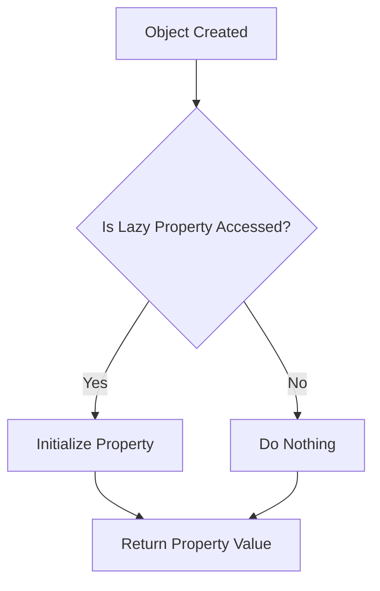

## 16.6 Lazy Loading and Initialization

In the world of software development, efficient resource management is crucial for building high-performance applications. One effective strategy to achieve this is through lazy loading and initialization. In this section, we will delve into the concept of lazy loading, explore its implementation in Swift, and understand how it can help balance resource usage with performance needs.

### Understanding Lazy Loading

Lazy loading is a design pattern that defers the creation or initialization of an object until it is actually needed. This approach can lead to significant performance improvements, especially in applications where certain resources are expensive to initialize or may not be used at all during the application's lifecycle.

#### Key Benefits of Lazy Loading

- **Reduced Memory Usage**: By delaying the initialization of objects, you can reduce the application's memory footprint, as only necessary objects are loaded into memory.
- **Improved Performance**: Applications can start faster because they don't need to initialize all objects upfront. This is particularly beneficial in scenarios where some objects are rarely used.
- **Resource Efficiency**: Lazy loading ensures that resources are consumed only when needed, leading to more efficient resource management.

### Implementing Lazy Properties in Swift

Swift provides a built-in mechanism to implement lazy loading through the `lazy` keyword. Lazy properties are initialized only when they are accessed for the first time. This makes them ideal for properties that are computationally expensive to create or that depend on external resources.

#### Syntax and Usage

The syntax for declaring a lazy property in Swift is straightforward:

```swift
class DataManager {
    lazy var data: [String] = {
        // Simulate an expensive operation
        print("Loading data...")
        return ["Item1", "Item2", "Item3"]
    }()
}

let manager = DataManager()
// The data is not loaded yet
print("DataManager created")
// Accessing the lazy property for the first time
print(manager.data)
```

**Output:**

```
DataManager created
Loading data...
["Item1", "Item2", "Item3"]
```

In this example, the `data` property is marked as `lazy`, meaning it won't be initialized until it is accessed. This is evident from the output, where "Loading data..." is printed only when `manager.data` is accessed.

### Lazy Initialization in Practice

Lazy loading can be particularly useful in scenarios such as:

- **Loading Large Data Sets**: When dealing with large data sets, loading the entire data set into memory at once can be inefficient. Lazy loading allows you to load data incrementally, as needed.
- **Network Requests**: Deferring network requests until the data is actually required can save bandwidth and reduce latency.
- **Complex Calculations**: For properties that require complex calculations, lazy initialization ensures that these calculations are performed only when necessary.

### Balancing Resource Usage with Performance Needs

While lazy loading offers numerous benefits, it's essential to strike a balance between resource usage and performance needs. Here are some considerations to keep in mind:

- **Access Frequency**: If a lazy property is accessed frequently, the overhead of checking whether it has been initialized may outweigh the benefits. In such cases, eager initialization might be more appropriate.
- **Thread Safety**: Lazy properties are not thread-safe by default. If multiple threads might access a lazy property simultaneously, you need to ensure thread safety.
- **Memory Management**: Consider the lifecycle of your objects. Lazy loading can help manage memory usage, but it's crucial to ensure that objects are deallocated when no longer needed.

### Advanced Lazy Loading Techniques

#### Lazy Collections

Swift's standard library provides lazy collections, which allow you to perform operations on collections without immediately evaluating them. This can lead to performance improvements when working with large data sets.

```swift
let numbers = [1, 2, 3, 4, 5]
let lazyNumbers = numbers.lazy.map { $0 * 2 }
// The map operation is not performed until the result is accessed
print(lazyNumbers[0]) // Output: 2
```

In this example, the `map` operation is applied lazily, meaning it is not executed until the result is accessed.

#### Lazy Initialization with Closures

You can also use closures to implement lazy initialization for properties that require more complex setup logic:

```swift
class Configuration {
    lazy var settings: [String: Any] = {
        // Perform complex setup
        print("Initializing settings...")
        return ["Theme": "Dark", "FontSize": 12]
    }()
}

let config = Configuration()
// Settings are not initialized yet
print("Configuration created")
// Accessing the lazy property
print(config.settings)
```

**Output:**

```
Configuration created
Initializing settings...
["Theme": "Dark", "FontSize": 12]
```

### Visualizing Lazy Loading

To better understand the concept of lazy loading, let's visualize the process using a flowchart:



**Description**: This flowchart illustrates the decision-making process involved in lazy loading. When an object is created, it checks if the lazy property has been accessed. If yes, the property is initialized; otherwise, no action is taken.

### Swift Unique Features for Lazy Loading

Swift's unique features, such as type inference and protocol extensions, can further enhance lazy loading implementations:

- **Type Inference**: Swift's type inference allows you to write cleaner and more concise code when declaring lazy properties.
- **Protocol Extensions**: You can extend protocols to provide default lazy implementations for certain properties, promoting code reuse.

### Common Pitfalls and Considerations

While lazy loading is a powerful pattern, there are some common pitfalls to be aware of:

- **Overuse**: Not all properties benefit from lazy loading. Overusing lazy properties can lead to unnecessary complexity.
- **Circular References**: Be cautious of circular references when using lazy properties, as they can lead to memory leaks.
- **Performance Overhead**: The overhead of lazy loading can sometimes negate its benefits, particularly in high-performance applications.

### Try It Yourself

To gain a deeper understanding of lazy loading, try modifying the code examples provided. Experiment with different scenarios, such as:

- Adding more properties to the `DataManager` class and observing the initialization behavior.
- Implementing lazy loading for a network request and measuring the impact on performance.
- Creating a lazy collection and applying multiple operations to see how they are evaluated.

### Knowledge Check

- **Question**: What are the key benefits of lazy loading?
- **Exercise**: Implement a lazy property in a class and test its initialization behavior.
- **Challenge**: Identify a scenario in your current project where lazy loading could improve performance.

### Conclusion

Lazy loading and initialization are powerful tools in a Swift developer's arsenal. By deferring the creation of objects until they are needed, you can optimize performance, reduce memory usage, and manage resources more efficiently. Remember, this is just the beginning. As you progress, you'll discover more advanced techniques and patterns to further enhance your Swift applications. Keep experimenting, stay curious, and enjoy the journey!

## Quiz Time!



### What is lazy loading?

- [x] Deferring the creation of objects until they are needed.
- [ ] Initializing all objects at the start of the application.
- [ ] Loading all resources into memory at once.
- [ ] A method to speed up the application startup time.

> **Explanation:** Lazy loading defers the creation or initialization of an object until it is actually needed, optimizing resource usage and performance.

### Which keyword is used to declare a lazy property in Swift?

- [x] lazy
- [ ] defer
- [ ] optional
- [ ] weak

> **Explanation:** The `lazy` keyword is used in Swift to declare a property that is initialized only when it is accessed for the first time.

### What is a potential drawback of using lazy properties?

- [x] They are not thread-safe by default.
- [ ] They increase memory usage.
- [ ] They slow down application startup.
- [ ] They require manual memory management.

> **Explanation:** Lazy properties are not thread-safe by default, which can be a drawback if multiple threads might access the property simultaneously.

### In which scenario is lazy loading particularly beneficial?

- [x] Loading large data sets incrementally.
- [ ] Initializing configuration settings at startup.
- [ ] Performing quick calculations.
- [ ] Accessing frequently used properties.

> **Explanation:** Lazy loading is beneficial when loading large data sets incrementally, as it reduces memory usage and improves performance.

### What does the following Swift code do?

```swift
lazy var data: [String] = {
    print("Loading data...")
    return ["Item1", "Item2", "Item3"]
}()
```

- [x] Initializes the `data` property only when it is accessed.
- [ ] Initializes the `data` property immediately.
- [ ] Throws an error if accessed before initialization.
- [ ] Requires manual initialization in the initializer.

> **Explanation:** The `data` property is declared as `lazy`, so it is initialized only when it is accessed for the first time.

### How can you ensure thread safety for a lazy property?

- [x] Use synchronization mechanisms like locks.
- [ ] Avoid using lazy properties in multi-threaded environments.
- [ ] Initialize the property eagerly.
- [ ] Use weak references.

> **Explanation:** To ensure thread safety for a lazy property, you can use synchronization mechanisms like locks to control access.

### What is a lazy collection in Swift?

- [x] A collection that performs operations without immediately evaluating them.
- [ ] A collection that is initialized only when accessed.
- [ ] A collection that uses less memory.
- [ ] A collection that is thread-safe by default.

> **Explanation:** A lazy collection performs operations on its elements without immediately evaluating them, which can improve performance.

### Which of the following is a common pitfall of lazy loading?

- [x] Circular references leading to memory leaks.
- [ ] Increased memory usage.
- [ ] Slower application startup.
- [ ] Manual memory management.

> **Explanation:** Circular references in lazy loading can lead to memory leaks, which is a common pitfall.

### What is the primary goal of lazy loading?

- [x] Optimize resource usage and performance.
- [ ] Simplify code structure.
- [ ] Increase application startup time.
- [ ] Reduce code complexity.

> **Explanation:** The primary goal of lazy loading is to optimize resource usage and performance by deferring object creation until necessary.

### True or False: Lazy properties in Swift are initialized at the time of object creation.

- [ ] True
- [x] False

> **Explanation:** False. Lazy properties in Swift are initialized only when they are accessed for the first time, not at the time of object creation.


