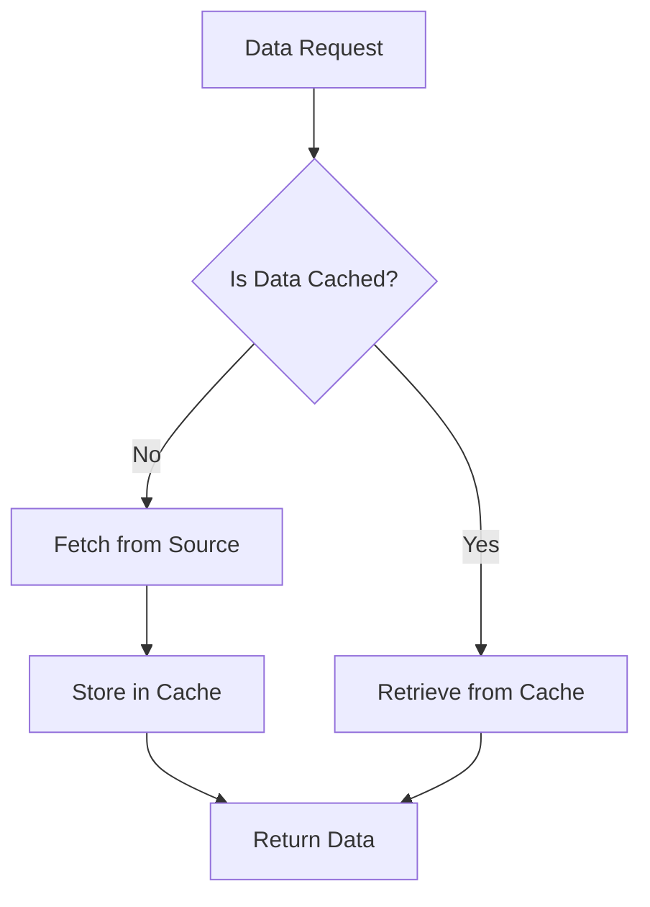

## 16.7 Caching Strategies and Data Persistence

In the realm of Swift development, caching and data persistence are pivotal in crafting applications that are not only responsive but also efficient in handling data. This section delves into the intricacies of caching mechanisms and data persistence strategies, offering a comprehensive guide to implementing these techniques effectively in your Swift applications.

### Understanding Caching and Data Persistence

Before we dive into the specifics, let's clarify the concepts of caching and data persistence:

- **Caching**: Caching is a technique used to store copies of data in a temporary storage location, allowing for faster data retrieval. It helps reduce the time and resources needed to access frequently used data.

- **Data Persistence**: Data persistence involves storing data in a way that it remains available even after the application has been closed. This ensures that the data can be retrieved and used in future sessions.

### In-Memory Caching vs. Persistent Storage

In-memory caching and persistent storage are two primary approaches to managing data in applications. Understanding their differences and use cases is crucial for effective implementation.

#### In-Memory Caching

In-memory caching involves storing data in the device's RAM, allowing for rapid access and retrieval. This approach is ideal for data that is frequently accessed and can be regenerated or re-fetched if lost.

- **Pros**:
  - Fast access speed.
  - Reduces load on data sources.
  - Simple to implement using Swift's built-in data structures.

- **Cons**:
  - Limited by device memory.
  - Data is lost when the application is closed or crashes.

#### Persistent Storage

Persistent storage, on the other hand, involves saving data to a non-volatile storage medium, such as a file system or database. This ensures data is retained across application sessions.

- **Pros**:
  - Data longevity across sessions.
  - Suitable for large datasets.

- **Cons**:
  - Slower access speed compared to in-memory caching.
  - Requires more complex implementation and management.

### Utilizing `NSCache` for In-Memory Caching

`NSCache` is a powerful class in Swift that provides a mutable collection for temporarily storing key-value pairs. It is designed to handle memory management automatically, making it an excellent choice for in-memory caching.

#### Key Features of `NSCache`

- **Automatic Eviction**: `NSCache` automatically removes objects when memory is low, preventing memory-related crashes.
- **Thread Safety**: It is thread-safe, allowing concurrent access from multiple threads.
- **Configurable**: You can set limits on the total cost and count of cached objects.

#### Implementing `NSCache`

Let's explore a basic implementation of `NSCache` in Swift:

```swift
import Foundation

class ImageCache {
    private let cache = NSCache<NSString, UIImage>()
    
    func setImage(_ image: UIImage, forKey key: String) {
        cache.setObject(image, forKey: key as NSString)
    }
    
    func getImage(forKey key: String) -> UIImage? {
        return cache.object(forKey: key as NSString)
    }
}

// Usage
let imageCache = ImageCache()
let image = UIImage(named: "example")
imageCache.setImage(image!, forKey: "exampleKey")

if let cachedImage = imageCache.getImage(forKey: "exampleKey") {
    print("Image retrieved from cache")
} else {
    print("Image not found in cache")
}
```

In this example, we create a simple image cache using `NSCache`. We can store and retrieve images using keys, and `NSCache` will handle memory management for us.

### Persistent Storage: File Systems and Databases

For data that needs to persist across application sessions, we can use file systems or databases. Let's explore these options in more detail.

#### File Systems

The file system is a straightforward method for storing data persistently. You can write data to files and read it back when needed.

##### Using FileManager

Swift's `FileManager` class provides an interface for interacting with the file system. Here's a basic example of writing and reading data using `FileManager`:

```swift
import Foundation

class FileStorage {
    let fileManager = FileManager.default
    let directory: URL
    
    init() {
        directory = fileManager.urls(for: .documentDirectory, in: .userDomainMask)[0]
    }
    
    func saveData(_ data: Data, withFileName fileName: String) {
        let fileURL = directory.appendingPathComponent(fileName)
        do {
            try data.write(to: fileURL)
            print("Data saved successfully")
        } catch {
            print("Error saving data: \\(error)")
        }
    }
    
    func loadData(fromFileName fileName: String) -> Data? {
        let fileURL = directory.appendingPathComponent(fileName)
        do {
            let data = try Data(contentsOf: fileURL)
            print("Data loaded successfully")
            return data
        } catch {
            print("Error loading data: \\(error)")
            return nil
        }
    }
}

// Usage
let fileStorage = FileStorage()
let dataToSave = "Hello, World!".data(using: .utf8)!
fileStorage.saveData(dataToSave, withFileName: "example.txt")

if let loadedData = fileStorage.loadData(fromFileName: "example.txt") {
    print("Loaded data: \\(String(data: loadedData, encoding: .utf8)!)")
}
```

In this example, we create a `FileStorage` class that saves and loads data to and from the documents directory using `FileManager`.

#### Databases

For more complex data structures and larger datasets, using a database is often more efficient. Core Data and SQLite are popular choices for database storage in Swift.

##### Core Data

Core Data is a powerful framework for managing object graphs and data persistence. It provides a high-level abstraction over SQLite and handles many aspects of data management for you.

###### Setting Up Core Data

To use Core Data in your project, you need to set up a Core Data stack. Here's a basic setup:

```swift
import CoreData

class CoreDataStack {
    static let shared = CoreDataStack()
    private init() {}
    
    lazy var persistentContainer: NSPersistentContainer = {
        let container = NSPersistentContainer(name: "Model")
        container.loadPersistentStores { (storeDescription, error) in
            if let error = error as NSError? {
                fatalError("Unresolved error \\(error), \\(error.userInfo)")
            }
        }
        return container
    }()
    
    var context: NSManagedObjectContext {
        return persistentContainer.viewContext
    }
}
```

###### Creating and Fetching Data

Once the Core Data stack is set up, you can create and fetch data using `NSManagedObject` subclasses:

```swift
import CoreData

// Assuming you have an entity named "Person" with attributes "name" and "age"
class Person: NSManagedObject {
    @NSManaged var name: String
    @NSManaged var age: Int16
}

// Creating a new person
let context = CoreDataStack.shared.context
let newPerson = Person(context: context)
newPerson.name = "John Doe"
newPerson.age = 30

do {
    try context.save()
    print("Person saved successfully")
} catch {
    print("Failed to save person: \\(error)")
}

// Fetching persons
let fetchRequest: NSFetchRequest<Person> = Person.fetchRequest()
do {
    let persons = try context.fetch(fetchRequest)
    for person in persons {
        print("Name: \\(person.name), Age: \\(person.age)")
    }
} catch {
    print("Failed to fetch persons: \\(error)")
}
```

In this example, we demonstrate how to create and fetch data using Core Data. We define a `Person` entity and use the Core Data stack to manage the data.

##### SQLite

SQLite is a lightweight, file-based database that can be used directly or through a wrapper library like `SQLite.swift`.

###### Using SQLite.swift

Here's an example of using `SQLite.swift` to interact with an SQLite database:

```swift
import SQLite

class SQLiteStorage {
    var db: Connection?
    
    init() {
        do {
            let path = NSSearchPathForDirectoriesInDomains(.documentDirectory, .userDomainMask, true).first!
            db = try Connection("\\(path)/db.sqlite3")
            try createTable()
        } catch {
            print("Failed to connect to database: \\(error)")
        }
    }
    
    func createTable() throws {
        let users = Table("users")
        let id = Expression<Int64>("id")
        let name = Expression<String>("name")
        
        try db?.run(users.create { t in
            t.column(id, primaryKey: true)
            t.column(name)
        })
    }
    
    func insertUser(name: String) throws {
        let users = Table("users")
        let nameExp = Expression<String>("name")
        
        let insert = users.insert(nameExp <- name)
        try db?.run(insert)
    }
    
    func fetchUsers() throws {
        let users = Table("users")
        for user in try db!.prepare(users) {
            print("id: \\(user[Expression<Int64>("id")]), name: \\(user[Expression<String>("name")])")
        }
    }
}

// Usage
let sqliteStorage = SQLiteStorage()
do {
    try sqliteStorage.insertUser(name: "Alice")
    try sqliteStorage.fetchUsers()
} catch {
    print("Database error: \\(error)")
}
```

In this example, we set up an SQLite database using `SQLite.swift`, create a table, insert data, and fetch data.

### Choosing Between Caching and Persistence

Deciding whether to use in-memory caching or persistent storage depends on your application's requirements. Here are some considerations to help you choose:

- **Frequency of Access**: Use caching for data that is accessed frequently and can be regenerated if lost. Use persistence for data that needs to be retained across sessions.

- **Data Size**: Large datasets are better suited for persistent storage, while smaller, frequently accessed data can be cached.

- **Data Volatility**: If the data changes often, caching can help reduce the load on your data source by storing temporary copies.

### Best Practices for Caching and Data Persistence

To effectively implement caching and data persistence, consider the following best practices:

- **Cache Invalidation**: Implement strategies to invalidate or refresh cached data when it becomes stale. This can be done using time-based expiration or event-based triggers.

- **Memory Management**: Monitor memory usage and adjust cache limits to prevent memory-related issues.

- **Concurrency**: Ensure thread safety when accessing cached or persisted data from multiple threads.

- **Data Security**: Encrypt sensitive data before storing it persistently to protect against unauthorized access.

- **Testing**: Test caching and persistence mechanisms thoroughly to ensure data integrity and performance.

### Try It Yourself

To reinforce your understanding, try modifying the code examples provided:

- Experiment with different cache limits in `NSCache` and observe the impact on memory usage.
- Extend the `FileStorage` class to handle different file formats, such as JSON or XML.
- Implement a Core Data entity with relationships and test fetching related data.
- Use `SQLite.swift` to create a more complex database schema and perform queries.

### Visualizing Caching and Persistence

To better understand the relationship between caching and persistence, let's visualize these concepts using a flowchart:



**Figure 1**: This flowchart illustrates the process of checking for cached data and fetching from the source if not available, then storing it in the cache for future requests.

### References and Further Reading

- [Apple Developer Documentation: NSCache](https://developer.apple.com/documentation/foundation/nscache)
- [Apple Developer Documentation: Core Data](https://developer.apple.com/documentation/coredata)
- [SQLite.swift GitHub Repository](https://github.com/stephencelis/SQLite.swift)
- [Swift.org Documentation](https://swift.org/documentation/)

### Knowledge Check

To ensure you've grasped the concepts covered, here are some questions and exercises:

- What are the main differences between in-memory caching and persistent storage?
- Implement a simple caching mechanism for a network request.
- Create a Core Data model with multiple entities and relationships.
- Experiment with different caching strategies and measure their impact on performance.

### Embrace the Journey

Remember, mastering caching and data persistence in Swift is a journey. As you continue to explore and experiment with these concepts, you'll gain deeper insights into optimizing your applications for performance and responsiveness. Keep pushing the boundaries, stay curious, and enjoy the process!

## Quiz Time!



### What is the primary advantage of using in-memory caching?

- [x] Faster data retrieval
- [ ] Data longevity across sessions
- [ ] Reduced complexity
- [ ] Lower memory usage

> **Explanation:** In-memory caching allows for faster data retrieval because the data is stored in RAM, which is much quicker to access than persistent storage.

### Which class in Swift is commonly used for in-memory caching?

- [x] NSCache
- [ ] FileManager
- [ ] CoreData
- [ ] UserDefaults

> **Explanation:** `NSCache` is a class in Swift that provides a mutable collection for temporarily storing key-value pairs, making it ideal for in-memory caching.

### What is a key feature of `NSCache`?

- [x] Automatic eviction of objects when memory is low
- [ ] Persistent storage across sessions
- [ ] Built-in encryption
- [ ] Direct interaction with databases

> **Explanation:** `NSCache` automatically removes objects when memory is low, preventing memory-related crashes and optimizing memory usage.

### What is the main benefit of persistent storage?

- [ ] Faster data retrieval
- [x] Data retention across sessions
- [ ] Simplicity of implementation
- [ ] Automatic data encryption

> **Explanation:** Persistent storage ensures that data is retained across application sessions, making it available for future use.

### Which framework provides a high-level abstraction over SQLite in Swift?

- [ ] NSCache
- [x] Core Data
- [ ] FileManager
- [ ] UserDefaults

> **Explanation:** Core Data is a powerful framework that provides a high-level abstraction over SQLite, managing object graphs and data persistence in Swift.

### What is a common use case for using `FileManager` in Swift?

- [ ] Managing in-memory caches
- [x] Interacting with the file system
- [ ] Creating Core Data models
- [ ] Handling network requests

> **Explanation:** `FileManager` is used for interacting with the file system, allowing you to read and write data to files.

### Which library can be used to interact with SQLite databases in Swift?

- [ ] NSCache
- [ ] Core Data
- [ ] FileManager
- [x] SQLite.swift

> **Explanation:** `SQLite.swift` is a library that provides a simple interface for interacting with SQLite databases in Swift.

### What should be considered when choosing between caching and persistence?

- [x] Frequency of data access
- [ ] Color of the user interface
- [ ] Number of app users
- [ ] Type of device

> **Explanation:** When choosing between caching and persistence, consider the frequency of data access, as caching is suitable for frequently accessed data.

### What is a best practice for managing cached data?

- [x] Implementing cache invalidation strategies
- [ ] Storing all data in cache indefinitely
- [ ] Using only persistent storage
- [ ] Avoiding memory management

> **Explanation:** Implementing cache invalidation strategies ensures that cached data is refreshed or removed when it becomes stale, maintaining data accuracy and performance.

### True or False: Persistent storage is always faster than in-memory caching.

- [ ] True
- [x] False

> **Explanation:** False. In-memory caching is generally faster than persistent storage because it stores data in RAM, which is quicker to access than non-volatile storage.




