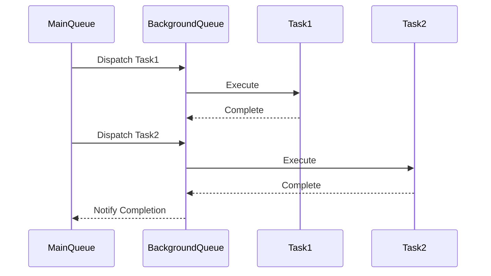

## 16.9 Concurrency for Performance

In the world of modern software development, particularly in iOS and macOS applications, concurrency is a crucial aspect that can significantly enhance performance and responsiveness. Swift, as a language, provides several tools and paradigms to manage concurrency effectively. In this section, we will delve into how you can leverage concurrency for performance in Swift, focusing on Grand Central Dispatch (GCD), Operation Queues, and Swift's latest concurrency model with async/await and actors.

### Introduction to Concurrency

Concurrency is the ability of a program to perform multiple tasks simultaneously. In the context of Swift, concurrency allows your applications to handle multiple operations at once, such as downloading data from the internet while updating the user interface. This capability is essential for creating smooth and responsive applications.

#### Key Concepts

- **Parallelism**: Running multiple tasks simultaneously on multiple processors.
- **Asynchronous Execution**: Tasks that run independently of the main program flow, allowing the program to continue executing other tasks.
- **Thread Safety**: Ensuring that multiple threads can access shared data without conflicts or data corruption.

### Leveraging Grand Central Dispatch (GCD)

Grand Central Dispatch (GCD) is a low-level API provided by Apple for managing concurrent code execution on multicore hardware. It simplifies the execution of tasks by abstracting the management of threads.

#### Using GCD for Concurrency

GCD provides several key functionalities, including dispatch queues and dispatch groups. Let's explore these concepts with examples.

##### Dispatch Queues

Dispatch queues are used to execute tasks asynchronously. They can be either serial or concurrent.

- **Serial Queues**: Execute one task at a time in the order they are added.
- **Concurrent Queues**: Execute multiple tasks simultaneously.

Here's a basic example of using a dispatch queue:

```swift
import Foundation

let queue = DispatchQueue(label: "com.example.myQueue")

queue.async {
    // This code runs asynchronously on a background queue
    print("Task 1")
}

queue.async {
    // This code runs asynchronously on the same background queue
    print("Task 2")
}
```

##### Dispatch Groups

Dispatch groups allow you to aggregate multiple tasks and be notified when they have all completed.

```swift
let group = DispatchGroup()

group.enter()
DispatchQueue.global().async {
    // Task 1
    print("Task 1 started")
    sleep(2)
    print("Task 1 completed")
    group.leave()
}

group.enter()
DispatchQueue.global().async {
    // Task 2
    print("Task 2 started")
    sleep(1)
    print("Task 2 completed")
    group.leave()
}

group.notify(queue: DispatchQueue.main) {
    print("All tasks completed")
}
```

#### Advantages of GCD

- **Efficiency**: GCD efficiently manages resources by utilizing system threads.
- **Simplicity**: It provides a simple API to manage complex concurrent code.
- **Scalability**: Automatically scales with the system's available resources.

### Operation Queues

Operation Queues are a higher-level abstraction over GCD, providing more control and flexibility over task execution.

#### Using Operation Queues

Operation Queues allow you to manage dependencies between tasks, set priorities, and cancel operations. Here's how you can use them:

```swift
import Foundation

class MyOperation: Operation {
    override func main() {
        if isCancelled { return }
        print("Operation started")
        sleep(2)
        if isCancelled { return }
        print("Operation completed")
    }
}

let operationQueue = OperationQueue()
let operation1 = MyOperation()
let operation2 = MyOperation()

operationQueue.addOperation(operation1)
operationQueue.addOperation(operation2)
```

#### Key Features of Operation Queues

- **Dependencies**: You can set dependencies between operations to control the order of execution.
- **Cancellation**: Operations can be cancelled, providing more control over task execution.
- **Prioritization**: Set priorities for operations to influence their execution order.

### Swift's Async/Await

With Swift 5.5, Apple introduced a new concurrency model that includes async/await. This model simplifies asynchronous programming by allowing developers to write asynchronous code that looks like synchronous code.

#### Understanding Async/Await

Async functions are marked with the `async` keyword and can be awaited using the `await` keyword. This allows you to pause the execution of a function until the awaited task completes.

Here's an example of using async/await:

```swift
import Foundation

func fetchData() async -> String {
    // Simulate a network call
    try? await Task.sleep(nanoseconds: 2_000_000_000)
    return "Data fetched"
}

Task {
    let data = await fetchData()
    print(data)
}
```

#### Benefits of Async/Await

- **Readability**: Makes asynchronous code easier to read and understand.
- **Error Handling**: Integrates seamlessly with Swift's error handling model.
- **Structured Concurrency**: Provides a structured way to manage concurrent tasks.

### Actors for Safe Concurrency

Actors are a new type in Swift that provides a safe way to manage mutable state in a concurrent environment. They ensure that only one task can access an actor's state at a time, preventing data races.

#### Using Actors

Here's a simple example of using actors:

```swift
actor Counter {
    private var value = 0

    func increment() {
        value += 1
    }

    func getValue() -> Int {
        return value
    }
}

let counter = Counter()

Task {
    await counter.increment()
    print(await counter.getValue())
}
```

#### Advantages of Actors

- **Isolation**: Actors provide data isolation, ensuring thread safety.
- **Concurrency Control**: Only one task can access an actor's state at a time.
- **Integration with Async/Await**: Actors work seamlessly with Swift's async/await model.

### Visualizing Concurrency in Swift

To better understand how concurrency works in Swift, let's visualize the flow of tasks using a Mermaid.js diagram.



### Best Practices for Concurrency

- **Avoid Shared State**: Minimize shared mutable state to prevent race conditions.
- **Use Actors for State Management**: Leverage actors to manage state safely in concurrent environments.
- **Test Concurrent Code**: Thoroughly test concurrent code to ensure correctness and performance.
- **Profile and Optimize**: Use profiling tools to identify bottlenecks and optimize performance.

### Try It Yourself

Experiment with the provided code examples by modifying the sleep durations or adding more tasks. Observe how the execution order changes and how GCD and Operation Queues manage the tasks.

### References and Further Reading

- [Apple's Concurrency Programming Guide](https://developer.apple.com/library/archive/documentation/General/Conceptual/ConcurrencyProgrammingGuide/Introduction/Introduction.html)
- [Swift.org: Concurrency](https://swift.org/blog/swift-concurrency/)
- [Ray Wenderlich's GCD Tutorial](https://www.raywenderlich.com/148513/grand-central-dispatch-tutorial-swift-3-part-1)

### Knowledge Check

Let's reinforce what we've learned with a few questions and exercises.

## Quiz Time!



### Which of the following is a feature of Grand Central Dispatch (GCD)?

- [x] Dispatch queues
- [ ] Operation dependencies
- [ ] Async/await
- [ ] Actors

> **Explanation:** GCD provides dispatch queues for managing concurrent tasks.

### What is the primary advantage of using async/await in Swift?

- [x] Improved readability of asynchronous code
- [ ] Faster execution of tasks
- [ ] Reduced memory usage
- [ ] Easier debugging

> **Explanation:** Async/await improves the readability of asynchronous code by making it look like synchronous code.

### How do actors ensure thread safety in Swift?

- [x] By isolating state so only one task can access it at a time
- [ ] By using locks and semaphores
- [ ] By running tasks in parallel
- [ ] By using synchronous execution

> **Explanation:** Actors isolate state, ensuring that only one task can access it at a time, which prevents data races.

### What is the purpose of dispatch groups in GCD?

- [x] To aggregate multiple tasks and notify when they are all completed
- [ ] To manage dependencies between tasks
- [ ] To prioritize tasks
- [ ] To cancel tasks

> **Explanation:** Dispatch groups allow you to aggregate multiple tasks and be notified when they have all completed.

### Which keyword is used to mark a function as asynchronous in Swift?

- [x] async
- [ ] await
- [ ] actor
- [ ] dispatch

> **Explanation:** The `async` keyword is used to mark a function as asynchronous in Swift.

### What is a key feature of Operation Queues?

- [x] Ability to set dependencies between operations
- [ ] Use of async/await
- [ ] Isolation of state
- [ ] Dispatch queues

> **Explanation:** Operation Queues allow you to set dependencies between operations, providing more control over task execution.

### Which Swift feature provides a structured way to manage concurrent tasks?

- [x] Async/await
- [ ] Dispatch groups
- [ ] Serial queues
- [ ] Operation dependencies

> **Explanation:** Async/await provides a structured way to manage concurrent tasks in Swift.

### What is the benefit of using actors in Swift's concurrency model?

- [x] They provide data isolation and ensure thread safety
- [ ] They improve the speed of task execution
- [ ] They reduce memory usage
- [ ] They simplify error handling

> **Explanation:** Actors provide data isolation, ensuring thread safety by allowing only one task to access an actor's state at a time.

### Which of the following is a best practice for concurrency in Swift?

- [x] Avoid shared mutable state
- [ ] Use global variables for state management
- [ ] Prioritize synchronous execution
- [ ] Minimize the use of actors

> **Explanation:** Avoiding shared mutable state is a best practice to prevent race conditions in concurrent programming.

### True or False: Operation Queues are a lower-level abstraction than GCD.

- [ ] True
- [x] False

> **Explanation:** Operation Queues are a higher-level abstraction over GCD, providing more control and flexibility.



Remember, mastering concurrency is a journey. As you explore these concepts, you'll gain the skills to build more efficient and responsive applications. Keep experimenting, stay curious, and enjoy the journey!
