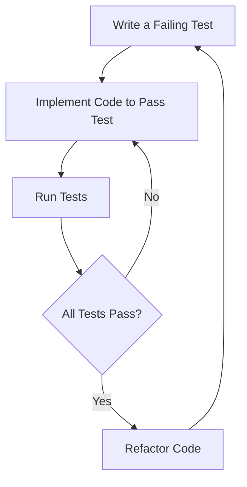

## 17.1 Test-Driven Development (TDD) with Swift

Test-Driven Development (TDD) is a software development process that emphasizes writing tests before writing the actual code. This approach ensures that the code meets the specified requirements and functions as expected. In Swift, adopting TDD methodologies can significantly enhance code quality, reduce bugs, and provide a clear guide for design and implementation.

### Understanding Test-Driven Development

TDD follows a simple cycle known as **Red-Green-Refactor**:

1. **Red**: Write a test that defines a function or improvement, which initially fails because the feature is not implemented yet.
2. **Green**: Write the minimum amount of code necessary to pass the test.
3. **Refactor**: Clean up the code while ensuring that all tests still pass.

This cycle is repeated for each new feature or improvement.

#### Benefits of TDD

- **Improved Code Quality**: By writing tests first, developers are forced to consider the requirements and design before implementation.
- **Reduced Bugs**: Tests catch errors early in the development process, reducing the likelihood of bugs in production.
- **Better Design**: TDD encourages writing modular and testable code, leading to better software architecture.
- **Documentation**: Tests serve as documentation for the code, explaining what the code is supposed to do.
- **Confidence in Changes**: With a comprehensive test suite, developers can refactor and improve code with confidence.

### Setting Up TDD in Swift

To get started with TDD in Swift, you'll need to set up a testing environment using XCTest, which is the standard testing framework provided by Apple.

#### Creating a Test Target

1. Open your Xcode project.
2. Go to `File > New > Target`.
3. Select `Unit Testing Bundle` and click `Next`.
4. Name your test target and ensure it is added to your project.

#### Writing Your First Test

Let's write a simple test for a `Calculator` class that adds two numbers.

```swift
import XCTest
@testable import YourProjectName

class CalculatorTests: XCTestCase {

    func testAddition() {
        let calculator = Calculator()
        let result = calculator.add(2, 3)
        XCTAssertEqual(result, 5, "Expected 2 + 3 to equal 5")
    }
}
```

In the above code:

- We import `XCTest` and our project module using `@testable import`.
- We define a test case class `CalculatorTests` that inherits from `XCTestCase`.
- We write a test method `testAddition` that checks if the `add` method of `Calculator` returns the correct result.

#### Implementing the Code to Pass the Test

Now, let's implement the `Calculator` class to pass the test.

```swift
class Calculator {
    func add(_ a: Int, _ b: Int) -> Int {
        return a + b
    }
}
```

Run the test by selecting `Product > Test` from the Xcode menu or using the shortcut `Cmd + U`. The test should pass, turning the cycle from red to green.

### Refactoring

Once the test passes, it's time to refactor. Ensure that the code is clean and maintainable without breaking the test.

```swift
class Calculator {
    func add(_ a: Int, _ b: Int) -> Int {
        // Simple addition logic
        return a + b
    }
}
```

### Expanding Test Coverage

With TDD, it's crucial to cover all possible scenarios. Let's add more tests to cover subtraction, multiplication, and division.

```swift
class CalculatorTests: XCTestCase {

    func testSubtraction() {
        let calculator = Calculator()
        let result = calculator.subtract(5, 3)
        XCTAssertEqual(result, 2, "Expected 5 - 3 to equal 2")
    }

    func testMultiplication() {
        let calculator = Calculator()
        let result = calculator.multiply(2, 3)
        XCTAssertEqual(result, 6, "Expected 2 * 3 to equal 6")
    }

    func testDivision() {
        let calculator = Calculator()
        let result = calculator.divide(6, 3)
        XCTAssertEqual(result, 2, "Expected 6 / 3 to equal 2")
    }
}
```

Implement the methods in the `Calculator` class to pass these tests.

```swift
class Calculator {
    func add(_ a: Int, _ b: Int) -> Int {
        return a + b
    }

    func subtract(_ a: Int, _ b: Int) -> Int {
        return a - b
    }

    func multiply(_ a: Int, _ b: Int) -> Int {
        return a * b
    }

    func divide(_ a: Int, _ b: Int) -> Int {
        return a / b
    }
}
```

### Handling Edge Cases

It's important to handle edge cases, such as division by zero. Let's add a test for this scenario.

```swift
class CalculatorTests: XCTestCase {

    func testDivisionByZero() {
        let calculator = Calculator()
        XCTAssertThrowsError(try calculator.divide(6, 0), "Division by zero should throw an error")
    }
}
```

Modify the `divide` method to throw an error when dividing by zero.

```swift
enum CalculatorError: Error {
    case divisionByZero
}

class Calculator {
    func add(_ a: Int, _ b: Int) -> Int {
        return a + b
    }

    func subtract(_ a: Int, _ b: Int) -> Int {
        return a - b
    }

    func multiply(_ a: Int, _ b: Int) -> Int {
        return a * b
    }

    func divide(_ a: Int, _ b: Int) throws -> Int {
        guard b != 0 else {
            throw CalculatorError.divisionByZero
        }
        return a / b
    }
}
```

### Best Practices for TDD in Swift

- **Write Small Tests**: Focus on one functionality per test to make them easier to understand and maintain.
- **Test Public Interfaces**: Avoid testing private methods directly; instead, test through public interfaces.
- **Use Descriptive Test Names**: Clearly describe what the test is verifying.
- **Keep Tests Independent**: Ensure tests do not depend on each other to prevent cascading failures.
- **Run Tests Frequently**: Integrate tests into your development workflow to catch issues early.

### Visualizing TDD Workflow



**Figure 1**: TDD Workflow - A cycle of writing a failing test, implementing code to pass the test, running tests, and refactoring.

### Try It Yourself

Experiment with the following exercises to deepen your understanding of TDD in Swift:

1. **Extend the Calculator**: Add tests and implement methods for additional operations like modulus and exponentiation.
2. **Refactor the Calculator**: Improve the code structure without altering its functionality. Ensure all tests still pass.
3. **Create a New Class**: Develop a `TemperatureConverter` class using TDD to convert between Celsius and Fahrenheit.

### References and Further Reading

- [Apple's XCTest Documentation](https://developer.apple.com/documentation/xctest)
- [Test-Driven Development by Example by Kent Beck](https://www.amazon.com/Test-Driven-Development-Kent-Beck/dp/0321146530)
- [Swift.org](https://swift.org/)

### Knowledge Check

- What are the steps in the TDD cycle?
- How does TDD improve code quality?
- Why should tests be independent of each other?
- How can TDD help in reducing bugs?

### Embrace the Journey

Remember, TDD is not just about testing; it's about improving the design and quality of your code. As you practice TDD, you'll find yourself writing cleaner, more maintainable code. Keep experimenting, stay curious, and enjoy the journey!

## Quiz Time!



### What is the first step in the TDD cycle?

- [x] Write a failing test
- [ ] Implement the feature
- [ ] Refactor the code
- [ ] Run all tests

> **Explanation:** The first step in the TDD cycle is to write a failing test to define the desired functionality.

### What is a key benefit of TDD?

- [x] Improved code quality
- [ ] Faster development
- [ ] Less documentation
- [ ] More complex code

> **Explanation:** TDD improves code quality by ensuring that code meets requirements and functions as expected.

### How should tests be written in TDD?

- [x] Independently and focused on one functionality
- [ ] To cover multiple functionalities at once
- [ ] After the code is written
- [ ] Only for public methods

> **Explanation:** Tests should be independent and focused on one functionality to ensure clarity and maintainability.

### What does the "Red" phase in TDD signify?

- [x] A test that fails
- [ ] A test that passes
- [ ] Refactoring code
- [ ] Implementing code

> **Explanation:** The "Red" phase signifies writing a test that initially fails because the feature is not yet implemented.

### Why is refactoring important in TDD?

- [x] It cleans up the code while ensuring tests pass
- [ ] It adds new features
- [ ] It speeds up development
- [ ] It documents the code

> **Explanation:** Refactoring is important to clean up the code and improve its structure while ensuring all tests still pass.

### What should tests in TDD focus on?

- [x] Public interfaces
- [ ] Private methods
- [ ] Implementation details
- [ ] User interface

> **Explanation:** Tests should focus on public interfaces to ensure the functionality is correct from an external perspective.

### How does TDD help with bug reduction?

- [x] By catching errors early in the development process
- [ ] By making code more complex
- [ ] By delaying testing until the end
- [ ] By requiring less documentation

> **Explanation:** TDD helps reduce bugs by catching errors early in the development process through continuous testing.

### What is the role of tests in TDD?

- [x] Serve as documentation for the code
- [ ] Replace the need for documentation
- [ ] Slow down development
- [ ] Increase code complexity

> **Explanation:** Tests in TDD serve as documentation by explaining what the code is supposed to do.

### Can TDD be used for UI testing?

- [x] True
- [ ] False

> **Explanation:** TDD can be used for UI testing, although it is more commonly used for unit and integration tests.

### What is the main purpose of TDD?

- [x] To guide design and ensure code meets requirements
- [ ] To speed up development
- [ ] To eliminate the need for testing
- [ ] To increase code complexity

> **Explanation:** The main purpose of TDD is to guide design and ensure that code meets specified requirements and functions as expected.


