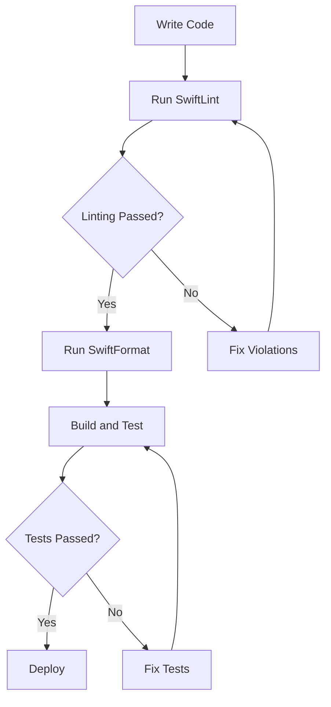

## 17.10 Static Code Analysis and Linting

In the realm of software development, maintaining high code quality is paramount to ensuring robust, scalable, and maintainable applications. Static code analysis and linting play a crucial role in this process by helping developers identify potential issues and enforce coding standards early in the development cycle. In this section, we will delve into the concepts of static code analysis and linting, explore the tools available for Swift development, and provide practical guidance on integrating these tools into your workflow.

### Understanding Static Code Analysis

Static code analysis involves examining the source code of a program without executing it. This process aims to identify potential errors, code smells, and violations of coding standards. By catching these issues early, developers can prevent bugs from reaching production, reduce technical debt, and improve the overall quality of the codebase.

#### Key Benefits of Static Code Analysis

1. **Early Bug Detection**: Identify potential bugs and vulnerabilities before they manifest at runtime.
2. **Consistency**: Enforce coding standards and style guides across the team, ensuring a uniform codebase.
3. **Efficiency**: Automate code reviews and reduce the manual effort required for code quality checks.
4. **Maintainability**: Improve the readability and maintainability of the code by adhering to best practices.

### Linting: Enforcing Coding Standards

Linting is a subset of static code analysis focused on enforcing coding standards and style guidelines. Linters analyze the source code to detect deviations from predefined rules, such as naming conventions, indentation, and code structure. By integrating linting tools into the development workflow, teams can ensure that their code adheres to agreed-upon standards, making it easier to read and maintain.

### Incorporating SwiftLint into Your Workflow

SwiftLint is a popular tool for linting Swift code. It helps enforce Swift style and conventions by analyzing your code and providing feedback on violations. SwiftLint can be easily integrated into your development environment, whether you're using Xcode, a continuous integration server, or a command-line interface.

#### Installing SwiftLint

To get started with SwiftLint, you can install it using Homebrew, a package manager for macOS:

```bash
brew install swiftlint
```

Once installed, you can run SwiftLint in your project's directory to analyze your code:

```bash
swiftlint
```

#### Configuring SwiftLint

SwiftLint is highly configurable, allowing you to tailor its rules to suit your project's needs. You can create a `.swiftlint.yml` configuration file in the root of your project to customize the rules:

```yaml
opt_in_rules:
  - empty_count
  - first_where
  - force_unwrapping

disabled_rules:
  - line_length
  - trailing_whitespace

included:
  - Source
  - Tests

excluded:
  - Pods
```

In this configuration, we enable specific opt-in rules, disable certain rules, and specify directories to include or exclude from linting.

#### Integrating SwiftLint with Xcode

To integrate SwiftLint with Xcode, you can add a new "Run Script Phase" in your Xcode project's build settings. This script will automatically run SwiftLint every time you build your project:

```bash
if which swiftlint > /dev/null; then
  swiftlint
else
  echo "warning: SwiftLint not installed, download from https://github.com/realm/SwiftLint"
fi
```

By incorporating SwiftLint into your build process, you ensure that code quality checks are performed consistently.

### Utilizing SwiftFormat for Code Formatting

SwiftFormat is another valuable tool that focuses on code formatting rather than linting. It automatically formats your Swift code according to a set of predefined rules, ensuring consistency across your codebase.

#### Installing SwiftFormat

Like SwiftLint, SwiftFormat can be installed using Homebrew:

```bash
brew install swiftformat
```

To format your code, simply run SwiftFormat in your project's directory:

```bash
swiftformat .
```

#### Configuring SwiftFormat

SwiftFormat offers a variety of options to customize the formatting rules. You can create a `.swiftformat` configuration file to specify your preferences:

```yaml
--indent 4
--allman false
--wraparguments beforefirst
--wrapcollections beforefirst
```

These settings control indentation, brace style, and argument wrapping, among other formatting options.

### Catching Potential Bugs Before Runtime

Static code analysis and linting tools are invaluable for catching potential bugs before they reach runtime. By analyzing code for common pitfalls, such as force unwrapping optionals or using deprecated APIs, these tools help developers address issues early in the development cycle.

#### Example: Detecting Force Unwrapping

Consider the following Swift code snippet:

```swift
let value: String? = nil
let unwrappedValue = value!
```

SwiftLint can detect the force unwrapping of an optional and warn you about the potential risk:

```
warning: Force Unwrapping Violation: Force unwrapping should be avoided. (force_unwrapping)
```

By addressing such warnings, you can improve the safety and reliability of your code.

### Visualizing the Workflow

To better understand how static code analysis and linting fit into the development workflow, let's visualize the process using a flowchart:



This flowchart illustrates the integration of SwiftLint and SwiftFormat into the development cycle, highlighting the iterative nature of code quality checks.

### Best Practices for Static Code Analysis and Linting

1. **Automate Checks**: Integrate static code analysis and linting into your CI/CD pipeline to ensure consistent enforcement of coding standards.
2. **Customize Rules**: Tailor the configuration of tools like SwiftLint and SwiftFormat to match your project's specific needs and style guide.
3. **Educate Your Team**: Ensure that all team members understand the importance of static code analysis and are familiar with the tools and rules in use.
4. **Review and Update**: Regularly review and update your linting rules and configurations to adapt to evolving project requirements and best practices.

### Try It Yourself

To truly grasp the power of static code analysis and linting, try incorporating SwiftLint and SwiftFormat into a sample Swift project. Experiment with different configurations and observe how they impact your codebase. Consider modifying the rules to better suit your team's coding style and preferences.

### References and Further Reading

- [SwiftLint GitHub Repository](https://github.com/realm/SwiftLint)
- [SwiftFormat GitHub Repository](https://github.com/nicklockwood/SwiftFormat)
- [Apple's Swift Programming Language Guide](https://developer.apple.com/documentation/swift)

### Knowledge Check

To reinforce your understanding of static code analysis and linting, consider the following questions and exercises:

1. What are the primary benefits of using static code analysis in Swift development?
2. How can SwiftLint help enforce coding standards in a Swift project?
3. Describe how to integrate SwiftLint into an Xcode project.
4. What is the difference between SwiftLint and SwiftFormat?
5. How can you customize the rules used by SwiftLint and SwiftFormat?
6. Why is it important to catch potential bugs before runtime?
7. How can you automate static code analysis in a CI/CD pipeline?
8. What are some common pitfalls that static code analysis tools can help identify?
9. Experiment with creating a custom rule for SwiftLint. What challenges did you encounter?
10. Reflect on how static code analysis and linting have improved your development workflow.

### Embrace the Journey

Remember, mastering static code analysis and linting is just one step on your journey to becoming a more proficient Swift developer. As you continue to explore and experiment with these tools, you'll discover new ways to enhance code quality and streamline your development process. Keep learning, stay curious, and enjoy the journey!

## Quiz Time!



### What is the primary purpose of static code analysis?

- [x] To identify potential errors and enforce coding standards without executing the code
- [ ] To execute the code and find runtime errors
- [ ] To compile the code into machine language
- [ ] To test the user interface

> **Explanation:** Static code analysis examines source code without executing it to identify potential errors and enforce coding standards.

### Which tool is commonly used for linting Swift code?

- [x] SwiftLint
- [ ] SwiftFormat
- [ ] Homebrew
- [ ] Xcode

> **Explanation:** SwiftLint is a popular tool for linting Swift code, enforcing style and conventions.

### How can SwiftLint be integrated into an Xcode project?

- [x] By adding a "Run Script Phase" in the build settings
- [ ] By installing a plugin from the App Store
- [ ] By modifying the Info.plist file
- [ ] By using the Xcode debugger

> **Explanation:** SwiftLint can be integrated into an Xcode project by adding a "Run Script Phase" in the build settings to run SwiftLint during the build process.

### What is the main focus of SwiftFormat?

- [x] Code formatting
- [ ] Code linting
- [ ] Code compilation
- [ ] Code execution

> **Explanation:** SwiftFormat focuses on automatically formatting Swift code according to a set of predefined rules.

### What is a benefit of catching potential bugs before runtime?

- [x] It prevents bugs from reaching production
- [ ] It increases the execution speed of the code
- [ ] It reduces the size of the compiled binary
- [ ] It enhances the graphical user interface

> **Explanation:** Catching potential bugs before runtime prevents them from reaching production, improving code reliability.

### Which file is used to configure SwiftLint rules?

- [x] .swiftlint.yml
- [ ] .swiftformat
- [ ] Info.plist
- [ ] config.json

> **Explanation:** The `.swiftlint.yml` file is used to configure SwiftLint rules.

### What command is used to install SwiftLint using Homebrew?

- [x] brew install swiftlint
- [ ] swiftlint install
- [ ] xcode-select --install swiftlint
- [ ] sudo apt-get install swiftlint

> **Explanation:** The command `brew install swiftlint` is used to install SwiftLint using Homebrew.

### Which of the following is an advantage of using linting tools?

- [x] Enforcing coding standards across the team
- [ ] Reducing the need for version control
- [ ] Increasing the complexity of the codebase
- [ ] Compiling the code into machine language

> **Explanation:** Linting tools help enforce coding standards across the team, ensuring a consistent codebase.

### What does the "Run Script Phase" in Xcode do when integrating SwiftLint?

- [x] It runs SwiftLint every time the project is built
- [ ] It compiles the Swift code into machine code
- [ ] It executes unit tests
- [ ] It generates documentation

> **Explanation:** The "Run Script Phase" in Xcode runs SwiftLint every time the project is built, ensuring consistent code quality checks.

### True or False: SwiftFormat is used to detect code smells and potential bugs.

- [ ] True
- [x] False

> **Explanation:** False. SwiftFormat is used for code formatting, not for detecting code smells and potential bugs.


