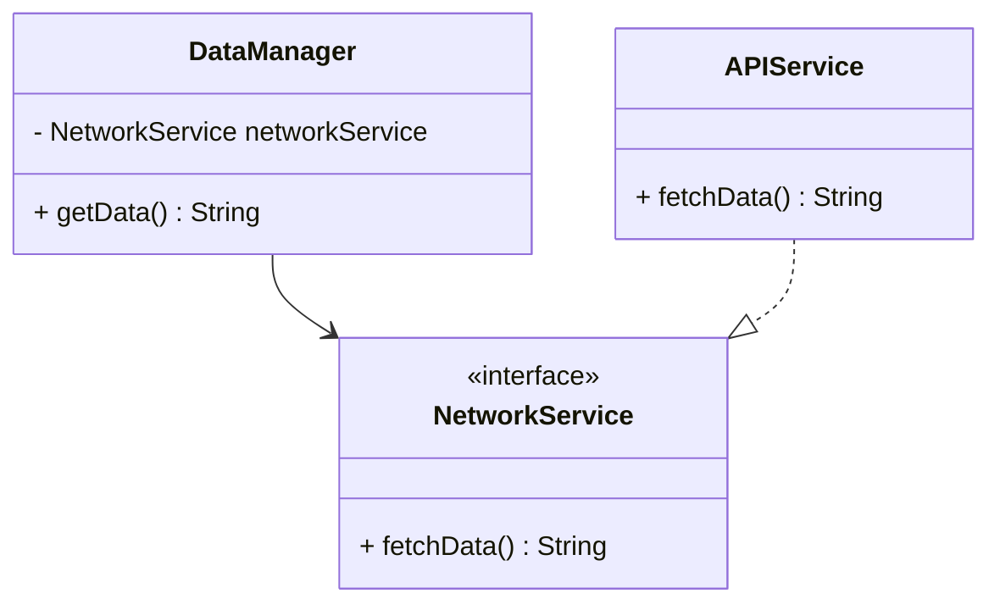

## 17.11 Dependency Injection for Testing

In the realm of software development, testing is paramount to ensure the reliability and maintainability of code. One of the key practices to facilitate effective testing is Dependency Injection (DI). In this section, we will delve into the concept of Dependency Injection for Testing in Swift, exploring its benefits, implementation techniques, and how it can be leveraged to decouple components for more robust testing.

### Understanding Dependency Injection

Dependency Injection is a design pattern used to achieve Inversion of Control (IoC) between classes and their dependencies. Instead of a class creating its dependencies internally, they are provided externally, typically through constructors or properties. This approach enhances flexibility, testability, and maintainability.

#### Key Concepts

- **Inversion of Control (IoC):** A principle where the control of object creation and management is transferred from the class itself to an external entity.
- **Dependency:** Any object or service that a class requires to function.
- **Injection:** The process of providing dependencies to a class from the outside.

### Benefits of Dependency Injection for Testing

1. **Decoupling:** By injecting dependencies, classes become less dependent on specific implementations, allowing for easier swapping of components.
2. **Testability:** Dependencies can be mocked or stubbed during testing, enabling isolated unit tests.
3. **Flexibility:** DI allows for different configurations and behaviors without modifying the class code.
4. **Maintainability:** With clear separation of concerns, code becomes easier to maintain and extend.

### Implementing Dependency Injection in Swift

Swift offers several ways to implement Dependency Injection, including constructor injection, property injection, and method injection. Let's explore each of these techniques with practical examples.

#### Constructor Injection

Constructor injection involves passing dependencies through a class's initializer. This method ensures that dependencies are available as soon as the object is created.

```swift
protocol NetworkService {
    func fetchData() -> String
}

class APIService: NetworkService {
    func fetchData() -> String {
        return "Data from API"
    }
}

class DataManager {
    private let networkService: NetworkService

    init(networkService: NetworkService) {
        self.networkService = networkService
    }

    func getData() -> String {
        return networkService.fetchData()
    }
}

// Usage
let apiService = APIService()
let dataManager = DataManager(networkService: apiService)
```

**Key Points:**
- The `DataManager` class depends on a `NetworkService`.
- The dependency is injected through the initializer, promoting decoupling and testability.

#### Property Injection

Property injection involves setting dependencies through properties, often after the object is created. This technique provides more flexibility but requires careful handling to ensure dependencies are set before use.

```swift
class DataManager {
    var networkService: NetworkService?

    func getData() -> String {
        return networkService?.fetchData() ?? "No data"
    }
}

// Usage
let dataManager = DataManager()
dataManager.networkService = APIService()
```

**Key Points:**
- Dependencies are set after object creation.
- Ensure dependencies are assigned before use to avoid runtime errors.

#### Method Injection

Method injection involves passing dependencies as parameters to methods. This approach is suitable for dependencies needed only during specific operations.

```swift
class DataManager {
    func getData(using networkService: NetworkService) -> String {
        return networkService.fetchData()
    }
}

// Usage
let dataManager = DataManager()
let data = dataManager.getData(using: APIService())
```

**Key Points:**
- Dependencies are provided at the method call time.
- Useful for temporary or optional dependencies.

### Using Dependency Injection Frameworks

While manual DI is straightforward, larger projects can benefit from DI frameworks that automate dependency management. Swift frameworks like Swinject and Needle provide advanced features for managing dependencies.

#### Swinject Example

Swinject is a popular DI framework for Swift that simplifies dependency management.

```swift
import Swinject

let container = Container()

container.register(NetworkService.self) { _ in APIService() }
container.register(DataManager.self) { r in
    DataManager(networkService: r.resolve(NetworkService.self)!)
}

let dataManager = container.resolve(DataManager.self)!
```

**Key Points:**
- Swinject uses a container to manage dependencies.
- Dependencies are registered and resolved through the container.

### Visualizing Dependency Injection

To better understand how Dependency Injection decouples components, let's visualize the process using a class diagram.



**Diagram Description:**
- `DataManager` depends on `NetworkService`, which is an interface.
- `APIService` implements `NetworkService`, demonstrating how different implementations can be injected.

### Advantages of Dependency Injection for Testing

1. **Isolated Testing:** By injecting mock dependencies, classes can be tested in isolation without relying on real implementations.
2. **Controlled Environment:** Test cases can control the behavior of dependencies, allowing for predictable and repeatable tests.
3. **Simplified Setup:** DI reduces the need for complex setup and teardown processes in tests.

### Example: Testing with Dependency Injection

Let's see how Dependency Injection can be used to facilitate testing with a mock implementation.

```swift
class MockNetworkService: NetworkService {
    func fetchData() -> String {
        return "Mock data"
    }
}

// Test Case
func testGetData() {
    let mockService = MockNetworkService()
    let dataManager = DataManager(networkService: mockService)

    let data = dataManager.getData()
    assert(data == "Mock data", "Data should match mock data")
}
```

**Key Points:**
- A `MockNetworkService` is used to simulate the behavior of `NetworkService`.
- The test verifies that `DataManager` correctly interacts with the mock dependency.

### Try It Yourself

Experiment with the code examples by modifying the dependencies. Try creating different mock implementations or using property injection instead of constructor injection. Observe how these changes affect the testability and flexibility of your code.

### Knowledge Check

- Explain the difference between constructor and property injection.
- Describe a scenario where method injection would be more appropriate than constructor injection.
- How does Dependency Injection enhance testability?

### Conclusion

Dependency Injection is a powerful design pattern that enhances the flexibility and testability of Swift applications. By decoupling components and injecting dependencies, we can create more maintainable and robust codebases. Whether using manual DI or leveraging frameworks like Swinject, understanding and implementing DI is crucial for effective testing and software design.

### References and Further Reading

- [Swinject Documentation](https://github.com/Swinject/Swinject)
- [Apple's Swift Programming Language Guide](https://developer.apple.com/documentation/swift)
- [Martin Fowler's Inversion of Control Containers and the Dependency Injection pattern](https://martinfowler.com/articles/injection.html)

## Quiz Time!



### What is Dependency Injection?

- [x] A design pattern to provide dependencies from outside a class.
- [ ] A method to create dependencies within a class.
- [ ] A way to hide dependencies.
- [ ] A pattern to increase coupling between classes.

> **Explanation:** Dependency Injection is a design pattern that provides dependencies from outside a class, enhancing decoupling and testability.

### Which of the following is a type of Dependency Injection?

- [x] Constructor Injection
- [x] Property Injection
- [x] Method Injection
- [ ] Interface Injection

> **Explanation:** Constructor, Property, and Method Injection are common types of Dependency Injection. Interface Injection is not a standard DI type.

### How does Dependency Injection improve testability?

- [x] By allowing mock dependencies to be injected.
- [ ] By increasing the number of dependencies.
- [ ] By making classes dependent on specific implementations.
- [ ] By reducing the number of test cases.

> **Explanation:** Dependency Injection allows mock dependencies to be injected, enabling isolated and controlled testing environments.

### What is the role of a DI container?

- [x] To manage and resolve dependencies.
- [ ] To create dependencies within a class.
- [ ] To hide dependencies from the developer.
- [ ] To increase the complexity of dependency management.

> **Explanation:** A DI container manages and resolves dependencies, simplifying dependency management in complex applications.

### In which scenario is method injection most appropriate?

- [x] When a dependency is needed only during specific operations.
- [ ] When a dependency is required throughout the object's lifecycle.
- [ ] When dependencies should be created internally.
- [ ] When dependencies are optional.

> **Explanation:** Method injection is suitable when a dependency is needed only during specific operations, providing flexibility.

### What is the primary benefit of constructor injection?

- [x] Ensures dependencies are available at object creation.
- [ ] Allows dependencies to be set at any time.
- [ ] Reduces the number of dependencies.
- [ ] Increases coupling between classes.

> **Explanation:** Constructor injection ensures dependencies are available at object creation, promoting consistent and reliable initialization.

### Which DI framework is popular in Swift?

- [x] Swinject
- [ ] Dagger
- [ ] Spring
- [ ] Guice

> **Explanation:** Swinject is a popular DI framework for Swift, offering advanced features for dependency management.

### What is the main advantage of using a DI framework?

- [x] Automates dependency management.
- [ ] Increases the number of dependencies.
- [ ] Hides dependencies from developers.
- [ ] Reduces code readability.

> **Explanation:** A DI framework automates dependency management, simplifying the process and reducing manual setup.

### True or False: Dependency Injection can only be used in testing.

- [ ] True
- [x] False

> **Explanation:** Dependency Injection is not limited to testing; it is used in general software design to enhance decoupling and flexibility.

### What is the result of decoupling components using Dependency Injection?

- [x] Increased flexibility and maintainability.
- [ ] Increased complexity and coupling.
- [ ] Reduced testability.
- [ ] Decreased code readability.

> **Explanation:** Decoupling components using Dependency Injection results in increased flexibility and maintainability, making the codebase easier to manage and extend.



Remember, mastering Dependency Injection is a journey. As you continue to explore and experiment, you'll discover new ways to enhance your Swift applications' design and testability. Keep pushing the boundaries, stay curious, and enjoy the process!
