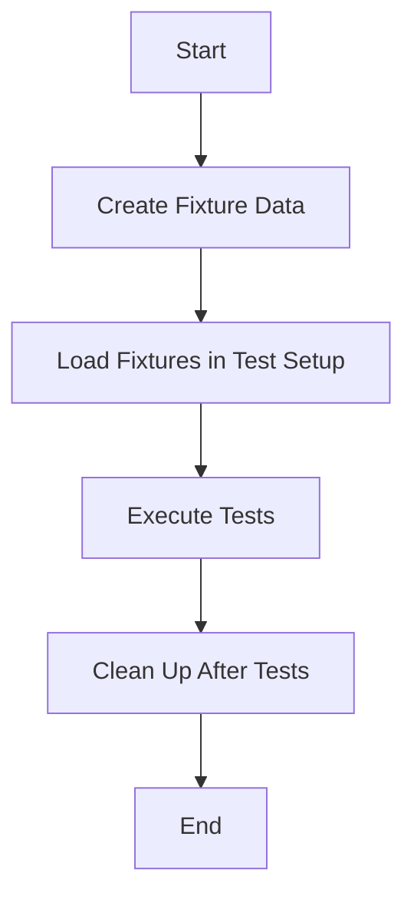

## 17.12 Test Data Management and Fixtures

In the realm of software development, testing is a critical phase that ensures the reliability and robustness of applications. In Swift, as in other programming languages, managing test data effectively is crucial for maintaining consistent and repeatable test environments. This section delves into the intricacies of test data management and the use of fixtures, providing you with the knowledge to enhance your testing strategy in Swift development.

### Introduction to Test Data Management

Test data management involves the processes and methodologies used to create, maintain, and use data for testing purposes. Effective test data management ensures that tests are reliable, repeatable, and provide accurate results. This is particularly important in Swift development, where applications often interact with complex data models, databases, and APIs.

#### Key Concepts in Test Data Management

- **Consistency**: Ensuring that test data remains consistent across different test runs.
- **Reusability**: Creating data sets that can be reused across multiple tests.
- **Scalability**: Managing data efficiently as the application grows in complexity.
- **Security**: Protecting sensitive data during testing.

### Using Fixtures in Swift Testing

Fixtures are predefined sets of data used to set up the conditions for tests. They help maintain consistent test environments by providing a known state before tests are executed. In Swift, fixtures can be implemented using various strategies, such as static data files, in-memory data structures, or database snapshots.

#### Benefits of Using Fixtures

- **Reproducibility**: Tests can be run multiple times with the same initial conditions.
- **Isolation**: Each test can start with a clean state, reducing dependencies between tests.
- **Efficiency**: Reduces the time needed to set up test data for each test case.

### Strategies for Handling Complex Data Models

Swift applications often involve complex data models that need to be tested thoroughly. Handling these models requires careful planning and execution of test data management strategies.

#### Creating and Managing Fixtures

1. **Static Data Files**: Use JSON, XML, or other formats to store fixture data. Load these files during test setup to populate the necessary data structures.

    ```swift
    struct User: Codable {
        let id: Int
        let name: String
        let email: String
    }

    func loadFixtureData() -> [User] {
        guard let url = Bundle.main.url(forResource: "UserFixture", withExtension: "json"),
              let data = try? Data(contentsOf: url),
              let users = try? JSONDecoder().decode([User].self, from: data) else {
            return []
        }
        return users
    }
    ```

2. **In-Memory Data Structures**: Use Swift's powerful data structures to create fixtures directly in code. This approach is useful for simple or dynamic data sets.

    ```swift
    func createInMemoryFixture() -> [User] {
        return [
            User(id: 1, name: "Alice", email: "alice@example.com"),
            User(id: 2, name: "Bob", email: "bob@example.com")
        ]
    }
    ```

3. **Database Snapshots**: For applications that interact with databases, use snapshots to capture the state of the database at a specific point in time. Restore these snapshots before running tests to ensure consistency.

#### Managing Complex Data Dependencies

- **Data Builders**: Use builder patterns to create complex data objects. This approach allows for flexible and reusable data creation.

    ```swift
    class UserBuilder {
        private var id: Int = 0
        private var name: String = "Default"
        private var email: String = "default@example.com"

        func withId(_ id: Int) -> UserBuilder {
            self.id = id
            return self
        }

        func withName(_ name: String) -> UserBuilder {
            self.name = name
            return self
        }

        func withEmail(_ email: String) -> UserBuilder {
            self.email = email
            return self
        }

        func build() -> User {
            return User(id: id, name: name, email: email)
        }
    }
    ```

- **Mocking and Stubbing**: Use mocks and stubs to simulate complex data interactions, such as network requests or database queries.

#### Ensuring Data Security

- **Anonymization**: Replace sensitive data with anonymized values in test data sets.
- **Encryption**: Use encryption techniques to protect sensitive data used in tests.

### Implementing Fixtures in Swift

Implementing fixtures in Swift involves integrating them into your testing framework, such as XCTest. This section provides a step-by-step guide to using fixtures with XCTest.

#### Setting Up Fixtures with XCTest

1. **Create Fixture Data**: Define your fixture data in a format suitable for your application, such as JSON or in-memory structures.

2. **Load Fixtures in Test Setup**: Use XCTest's setup methods to load and initialize fixture data before each test case.

    ```swift
    class UserTests: XCTestCase {
        var users: [User]!

        override func setUp() {
            super.setUp()
            users = loadFixtureData()
        }

        func testUserCount() {
            XCTAssertEqual(users.count, 2)
        }
    }
    ```

3. **Clean Up After Tests**: Use XCTest's teardown methods to clean up any resources or reset states after tests are executed.

    ```swift
    override func tearDown() {
        users = nil
        super.tearDown()
    }
    ```

### Best Practices for Test Data Management

- **Version Control for Fixtures**: Store fixture data in version control to track changes and ensure consistency across test environments.
- **Automated Data Generation**: Use scripts or tools to automate the generation of test data, reducing manual effort and errors.
- **Environment-Specific Fixtures**: Create different sets of fixtures for different environments, such as development, testing, and production.

### Visualizing Test Data Management

To better understand the flow of test data management, let's visualize the process using a Mermaid.js diagram.



**Diagram Description**: This flowchart illustrates the process of managing test data using fixtures. It begins with creating fixture data, followed by loading it during test setup, executing tests, cleaning up after tests, and finally ending the process.

### Try It Yourself

Experiment with the provided code examples by modifying the fixture data or adding new test cases. Try creating a new fixture for a different data model and integrate it into your test suite.

### Knowledge Check

- **Question**: What are the benefits of using fixtures in testing?
- **Challenge**: Implement a fixture for a complex data model in your Swift application.

### Conclusion

Effective test data management and the use of fixtures are essential for maintaining robust and reliable testing environments in Swift development. By following best practices and leveraging the power of Swift's data structures and testing frameworks, you can enhance the quality of your tests and ensure consistent results.

Remember, this is just the beginning. As you progress, you'll build more complex test environments and data management strategies. Keep experimenting, stay curious, and enjoy the journey!

## Quiz Time!



### What is a key benefit of using fixtures in testing?

- [x] Reproducibility of tests
- [ ] Increased test execution time
- [ ] More complex test setup
- [ ] Reduced test coverage

> **Explanation:** Fixtures provide a consistent starting point for tests, ensuring reproducibility.

### Which format is commonly used for storing static fixture data?

- [x] JSON
- [ ] CSV
- [ ] HTML
- [ ] XML

> **Explanation:** JSON is a widely used format for storing structured data, making it ideal for fixtures.

### What is the purpose of using a builder pattern in test data management?

- [x] To create complex data objects flexibly
- [ ] To simplify test teardown
- [ ] To increase test execution speed
- [ ] To reduce code readability

> **Explanation:** The builder pattern allows for flexible and reusable creation of complex data objects.

### How can sensitive data be protected in test data sets?

- [x] Anonymization
- [ ] Duplication
- [ ] Compression
- [ ] Obfuscation

> **Explanation:** Anonymization replaces sensitive data with non-identifiable values.

### What is a common method for loading fixture data in XCTest?

- [x] Using setup methods
- [ ] Using teardown methods
- [ ] Using main methods
- [ ] Using init methods

> **Explanation:** Setup methods are used to initialize fixture data before each test case.

### Why is version control important for fixture data?

- [x] To track changes and ensure consistency
- [ ] To increase test execution speed
- [ ] To reduce test coverage
- [ ] To simplify test teardown

> **Explanation:** Version control helps track changes and maintain consistency across test environments.

### What is the role of teardown methods in XCTest?

- [x] To clean up resources after tests
- [ ] To initialize test data
- [ ] To execute test cases
- [ ] To increase test coverage

> **Explanation:** Teardown methods clean up resources and reset states after tests are executed.

### Which strategy is used for managing complex data dependencies?

- [x] Data Builders
- [ ] Data Simplifiers
- [ ] Data Reducers
- [ ] Data Aggregators

> **Explanation:** Data builders help create complex data objects in a flexible and reusable manner.

### What is a key consideration when handling sensitive data in tests?

- [x] Data Security
- [ ] Data Duplication
- [ ] Data Compression
- [ ] Data Obfuscation

> **Explanation:** Ensuring data security is crucial when handling sensitive data in tests.

### True or False: Automated data generation reduces manual effort in test data management.

- [x] True
- [ ] False

> **Explanation:** Automated data generation reduces manual effort and errors in creating test data.




