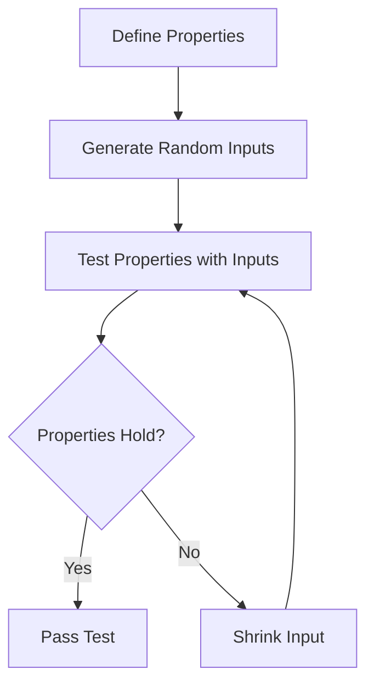

## 17.13 Property-Based Testing

In the realm of software development, ensuring the robustness and reliability of your code is paramount. Traditional testing methods, such as unit testing, often involve writing specific test cases to check individual functionalities. However, these methods can sometimes fall short in uncovering edge cases or unexpected behaviors. This is where property-based testing comes into play, offering a powerful approach to testing by focusing on the properties that should always hold true for your code.

### What is Property-Based Testing?

Property-based testing is a testing paradigm where you define properties or invariants that your code should satisfy. Instead of writing individual test cases, you specify general properties, and the testing framework automatically generates a wide range of inputs to verify these properties. This approach can uncover edge cases that you might not have considered when writing traditional tests.

#### Key Concepts

- **Properties**: Statements or conditions that should always be true for a given function or system.
- **Randomized Inputs**: The testing framework generates random inputs to test the defined properties.
- **Shrinking**: When a test fails, the framework attempts to find the smallest input that causes the failure, making it easier to identify the root cause.

### Benefits of Property-Based Testing

1. **Comprehensive Testing**: By generating a wide range of inputs, property-based testing can uncover edge cases that are often missed by traditional testing methods.
2. **Reduced Test Maintenance**: Instead of writing numerous specific test cases, you define general properties, reducing the need for maintaining a large test suite.
3. **Enhanced Understanding**: Defining properties encourages a deeper understanding of the system's expected behavior.

### Utilizing SwiftCheck for Property-Based Testing in Swift

SwiftCheck is a popular framework for property-based testing in Swift. It allows you to define properties and automatically generates test cases to verify them. Let's explore how to use SwiftCheck to enhance your testing strategy.

#### Setting Up SwiftCheck

To get started with SwiftCheck, you need to add it to your project. You can do this using Swift Package Manager by adding the following dependency to your `Package.swift` file:

```swift
dependencies: [
    .package(url: "https://github.com/typelift/SwiftCheck.git", from: "0.12.0")
]
```

#### Defining Properties

When defining properties, think about the invariants that should always hold true for your code. Let's consider a simple example: testing a function that reverses a string.

```swift
import SwiftCheck

// Function to reverse a string
func reverse(_ str: String) -> String {
    return String(str.reversed())
}

// Property: Reversing a string twice should return the original string
property("Reversing a string twice returns the original string") <- forAll { (str: String) in
    return reverse(reverse(str)) == str
}
```

In this example, we define a property stating that reversing a string twice should yield the original string. SwiftCheck will generate a variety of strings to test this property.

#### Running Tests

To run property-based tests, you can use SwiftCheck's `quickCheck` function, which will execute the tests and report any failures.

```swift
quickCheck {
    property("Reversing a string twice returns the original string") <- forAll { (str: String) in
        return reverse(reverse(str)) == str
    }
}
```

### Advanced Property Definitions

As you become more comfortable with property-based testing, you can define more complex properties. Consider a function that sorts an array of integers. We can define several properties to test this function:

```swift
import SwiftCheck

// Function to sort an array of integers
func sort(_ array: [Int]) -> [Int] {
    return array.sorted()
}

// Property 1: The sorted array should have the same length as the original
property("Sorted array has the same length") <- forAll { (array: [Int]) in
    return sort(array).count == array.count
}

// Property 2: The sorted array should be in non-decreasing order
property("Sorted array is in non-decreasing order") <- forAll { (array: [Int]) in
    let sortedArray = sort(array)
    return sortedArray == sortedArray.sorted()
}

// Property 3: The sorted array should contain the same elements as the original
property("Sorted array contains the same elements") <- forAll { (array: [Int]) in
    return sort(array).sorted() == array.sorted()
}
```

### Visualizing the Testing Process

To better understand how property-based testing works, let's visualize the process using a flowchart.



**Figure 1**: Visualizing the Property-Based Testing Process

### Try It Yourself

Experiment with the code examples provided. Try modifying the properties or the functions being tested to see how SwiftCheck responds. For instance, change the sorting function to introduce a bug and observe how the tests catch the error.

### Common Pitfalls and Considerations

- **Complex Properties**: Defining overly complex properties can make tests difficult to understand and maintain. Aim for simplicity and clarity.
- **Performance**: Generating a large number of inputs can be computationally expensive. Balance thoroughness with performance considerations.
- **Randomness**: While randomness is a strength, it can also lead to non-deterministic test results. Use seeds to reproduce test failures consistently.

### Knowledge Check

- **What are the benefits of using property-based testing over traditional unit testing?**
- **How does SwiftCheck help in uncovering edge cases?**
- **What is the role of shrinking in property-based testing?**

### Conclusion

Property-based testing is a powerful tool in a developer's testing arsenal. By focusing on properties and generating a wide range of inputs, you can uncover edge cases and ensure the robustness of your code. SwiftCheck provides an excellent framework for implementing property-based testing in Swift, helping you build more reliable and resilient software.

Remember, this is just the beginning. As you progress, you'll discover more ways to leverage property-based testing to enhance your development process. Keep experimenting, stay curious, and enjoy the journey!

## Quiz Time!



### What is the primary focus of property-based testing?

- [x] Testing properties or invariants that should always hold true.
- [ ] Testing individual test cases.
- [ ] Testing only edge cases.
- [ ] Testing performance metrics.

> **Explanation:** Property-based testing focuses on defining properties or invariants that should always hold true, rather than individual test cases.

### Which framework is commonly used for property-based testing in Swift?

- [x] SwiftCheck
- [ ] XCTest
- [ ] Quick
- [ ] Nimble

> **Explanation:** SwiftCheck is a popular framework for property-based testing in Swift.

### What is the purpose of shrinking in property-based testing?

- [x] To find the smallest input that causes a test to fail.
- [ ] To increase the size of the input for more thorough testing.
- [ ] To reduce the number of test cases.
- [ ] To improve test performance.

> **Explanation:** Shrinking is used to find the smallest input that causes a test to fail, making it easier to identify the root cause of the failure.

### How does property-based testing uncover edge cases?

- [x] By generating a wide range of random inputs.
- [ ] By focusing on specific test cases.
- [ ] By analyzing code coverage.
- [ ] By increasing test execution speed.

> **Explanation:** Property-based testing uncovers edge cases by generating a wide range of random inputs to test the defined properties.

### What is a potential drawback of property-based testing?

- [x] It can be computationally expensive.
- [ ] It requires writing numerous specific test cases.
- [ ] It does not uncover edge cases.
- [ ] It is not suitable for testing properties.

> **Explanation:** Generating a large number of inputs can be computationally expensive, which is a potential drawback of property-based testing.

### Which of the following is a benefit of property-based testing?

- [x] Comprehensive testing through randomized inputs.
- [ ] Reduced need for defining properties.
- [ ] Increased test maintenance.
- [ ] Focus on specific test cases.

> **Explanation:** Property-based testing provides comprehensive testing through randomized inputs, reducing the need for specific test cases.

### What is the role of properties in property-based testing?

- [x] They define conditions that should always hold true.
- [ ] They specify individual test cases.
- [ ] They determine the performance of the code.
- [ ] They are used for code coverage analysis.

> **Explanation:** Properties define conditions or invariants that should always hold true in property-based testing.

### How can you ensure consistent test results in property-based testing?

- [x] Use seeds to reproduce test failures.
- [ ] Increase the number of random inputs.
- [ ] Focus on specific test cases.
- [ ] Avoid defining complex properties.

> **Explanation:** Using seeds allows you to reproduce test failures consistently, ensuring consistent test results in property-based testing.

### True or False: Property-based testing is only suitable for testing simple functions.

- [ ] True
- [x] False

> **Explanation:** False. Property-based testing is suitable for testing a wide range of functions, from simple to complex, by focusing on properties and invariants.




