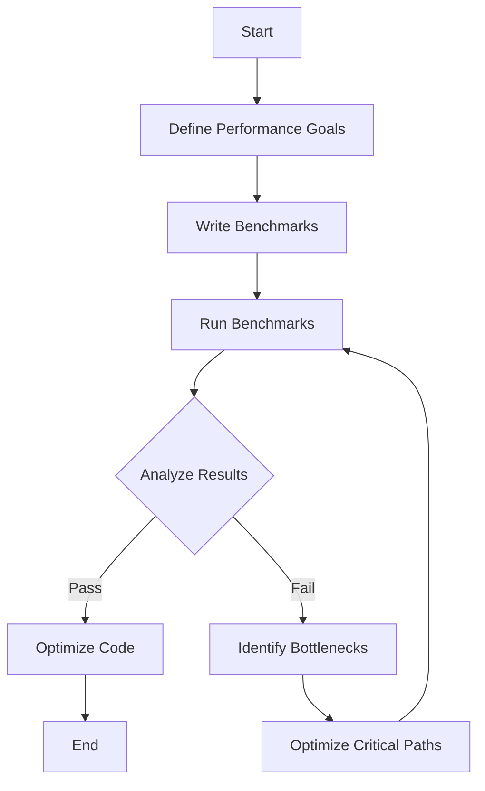

## 17.14 Performance Testing and Benchmarking

In the world of software development, performance is key. As developers, we aim to create applications that are not only functional but also efficient and responsive. Performance testing and benchmarking are essential practices in achieving this goal. In this section, we will explore how to effectively conduct performance testing and benchmarking in Swift, ensuring your applications run smoothly and meet performance requirements.

### Understanding Performance Testing

Performance testing is the process of evaluating the speed, responsiveness, and stability of a software application under a particular workload. It helps identify bottlenecks and areas for improvement, ensuring that the application can handle expected user interactions and data processing efficiently.

#### Types of Performance Testing

1. **Load Testing**: Assess how the application performs under expected user loads. The goal is to identify performance bottlenecks before the software goes live.
2. **Stress Testing**: Determine the application's robustness by testing it beyond normal operational capacity, often to a breaking point.
3. **Endurance Testing**: Evaluate the application's performance over an extended period to check for memory leaks or other issues that could degrade performance.
4. **Spike Testing**: Test the application's response to sudden, large spikes in load.
5. **Volume Testing**: Analyze how the application handles a large volume of data.

### Benchmarking in Swift

Benchmarking is the process of measuring the performance of a piece of code by executing it repeatedly and comparing the results. In Swift, benchmarking helps developers compare different implementations and choose the most efficient one.

#### Why Benchmarking Matters

- **Identify Performance Bottlenecks**: Benchmarking helps pinpoint areas in your code that are slow or inefficient.
- **Compare Implementations**: It allows you to test different approaches to a problem and choose the best one.
- **Ensure Performance Standards**: Benchmarking ensures your code meets the required performance standards.

### Tools for Performance Testing and Benchmarking in Swift

1. **Xcode Instruments**: A powerful tool that provides a suite of performance analysis tools, including Time Profiler, Allocations, and more.
2. **Swift Benchmarking Library**: A library to help you write micro-benchmarks in Swift.
3. **Third-Party Tools**: Tools like `Google Benchmark` or `Benchmark.swift` can be used for more advanced benchmarking needs.

### Writing Benchmarks in Swift

Let's dive into writing benchmarks in Swift. We'll start with a simple example and gradually build on it.

```swift
import Foundation

// Function to measure execution time of a block of code
func measureExecutionTime(for description: String, block: () -> Void) {
    let start = CFAbsoluteTimeGetCurrent()
    block()
    let end = CFAbsoluteTimeGetCurrent()
    let executionTime = end - start
    print("\\(description): \\(executionTime) seconds")
}

// Example function to benchmark
func exampleFunction() {
    var sum = 0
    for i in 0..<1000000 {
        sum += i
    }
}

// Benchmark the example function
measureExecutionTime(for: "Example Function") {
    exampleFunction()
}
```

#### Key Points

- **Measure Execution Time**: Use `CFAbsoluteTimeGetCurrent()` to measure the execution time of a block of code.
- **Repeat Measurements**: Run the benchmark multiple times to get an average execution time, reducing the impact of outliers.

### Comparing Implementations

Benchmarking is not just about measuring performance; it's also about comparing different implementations to find the most efficient one.

#### Example: Sorting Algorithms

Let's compare the performance of different sorting algorithms in Swift.

```swift
import Foundation

// Bubble Sort
func bubbleSort(_ array: inout [Int]) {
    for i in 0..<array.count {
        for j in 1..<array.count - i {
            if array[j] < array[j - 1] {
                array.swapAt(j, j - 1)
            }
        }
    }
}

// Quick Sort
func quickSort(_ array: inout [Int], low: Int, high: Int) {
    if low < high {
        let pi = partition(&array, low: low, high: high)
        quickSort(&array, low: low, high: pi - 1)
        quickSort(&array, low: pi + 1, high: high)
    }
}

func partition(_ array: inout [Int], low: Int, high: Int) -> Int {
    let pivot = array[high]
    var i = low - 1
    for j in low..<high {
        if array[j] < pivot {
            i += 1
            array.swapAt(i, j)
        }
    }
    array.swapAt(i + 1, high)
    return i + 1
}

// Benchmarking the sorting algorithms
var array = (1...1000).map { _ in Int.random(in: 1...1000) }

measureExecutionTime(for: "Bubble Sort") {
    var arrayCopy = array
    bubbleSort(&arrayCopy)
}

measureExecutionTime(for: "Quick Sort") {
    var arrayCopy = array
    quickSort(&arrayCopy, low: 0, high: array.count - 1)
}
```

#### Key Points

- **Use Realistic Data**: Benchmark with data that resembles real-world usage.
- **Compare Results**: Analyze the execution times to determine which implementation is more efficient.

### Ensuring Code Meets Performance Requirements

Performance testing and benchmarking are not just about measuring speed; they are about ensuring your code meets performance requirements.

#### Setting Performance Goals

- **Define Acceptable Performance**: Determine what performance metrics are acceptable for your application.
- **Monitor Performance**: Continuously monitor the application's performance to ensure it meets the defined goals.

#### Performance Optimization

- **Identify Bottlenecks**: Use profiling tools to identify performance bottlenecks in your code.
- **Optimize Critical Paths**: Focus on optimizing the parts of your code that have the most significant impact on performance.

### Visualizing Performance Data

Visualizing performance data can help you understand the performance characteristics of your application. Let's use a simple flowchart to illustrate the performance testing process.



#### Diagram Explanation

- **Define Performance Goals**: Start by defining what performance means for your application.
- **Write Benchmarks**: Write benchmarks to measure the performance of your code.
- **Run Benchmarks**: Execute the benchmarks to gather performance data.
- **Analyze Results**: Analyze the results to determine if the code meets performance requirements.
- **Optimize Code**: If the code meets the requirements, optimize it further if possible.
- **Identify Bottlenecks**: If the code does not meet the requirements, identify bottlenecks and optimize critical paths.

### Try It Yourself

To get hands-on experience with performance testing and benchmarking, try modifying the code examples provided. Experiment with different sorting algorithms or data structures and measure their performance. Consider the following challenges:

- Implement and benchmark a different sorting algorithm, such as Merge Sort.
- Modify the `measureExecutionTime` function to return the execution time and use it to log results to a file.
- Experiment with different data sizes and analyze how the performance scales.

### References and Further Reading

- [Apple's Instruments User Guide](https://developer.apple.com/library/archive/documentation/DeveloperTools/Conceptual/InstrumentsUserGuide/index.html)
- [Swift Benchmarking Library](https://github.com/google/swift-benchmark)
- [Performance Testing in Xcode](https://developer.apple.com/documentation/xcode/performance_testing)

### Knowledge Check

Let's reinforce what we've learned with a few questions and exercises:

- What are the different types of performance testing, and when should each be used?
- Write a benchmark for a function that calculates the factorial of a number.
- How can you use Xcode Instruments to identify performance bottlenecks in your application?

### Embrace the Journey

Remember, mastering performance testing and benchmarking is a journey. As you continue to develop your skills, you'll become more adept at identifying and resolving performance issues, leading to more efficient and responsive applications. Keep experimenting, stay curious, and enjoy the process!

## Quiz Time!



### What is the primary goal of performance testing?

- [x] To evaluate the speed, responsiveness, and stability of an application.
- [ ] To ensure the application is free of bugs.
- [ ] To test the application's user interface design.
- [ ] To validate the application's security features.

> **Explanation:** Performance testing focuses on evaluating the speed, responsiveness, and stability of an application under a particular workload.

### Which type of performance testing checks the application's robustness by testing it beyond normal operational capacity?

- [ ] Load Testing
- [x] Stress Testing
- [ ] Endurance Testing
- [ ] Spike Testing

> **Explanation:** Stress Testing determines the application's robustness by testing it beyond normal operational capacity.

### What is benchmarking primarily used for in Swift development?

- [ ] To fix bugs in the code.
- [x] To measure and compare the performance of different code implementations.
- [ ] To improve the user interface of an application.
- [ ] To ensure code security.

> **Explanation:** Benchmarking is used to measure and compare the performance of different code implementations to find the most efficient one.

### Which tool is commonly used in Swift for performance analysis?

- [ ] Android Studio
- [ ] Visual Studio
- [x] Xcode Instruments
- [ ] Eclipse

> **Explanation:** Xcode Instruments is a powerful tool that provides a suite of performance analysis tools for Swift development.

### What is the purpose of the `measureExecutionTime` function in the provided code examples?

- [x] To measure the execution time of a block of code.
- [ ] To execute a block of code multiple times.
- [ ] To optimize the code for better performance.
- [ ] To log errors in the code.

> **Explanation:** The `measureExecutionTime` function is designed to measure the execution time of a block of code.

### Which sorting algorithm is generally more efficient for large datasets?

- [ ] Bubble Sort
- [x] Quick Sort
- [ ] Selection Sort
- [ ] Insertion Sort

> **Explanation:** Quick Sort is generally more efficient for large datasets compared to Bubble Sort.

### What should you do if your code does not meet performance requirements after benchmarking?

- [ ] Ignore the results and proceed with deployment.
- [ ] Rewrite the entire application.
- [x] Identify bottlenecks and optimize critical paths.
- [ ] Increase the hardware resources.

> **Explanation:** If the code does not meet performance requirements, identify bottlenecks and optimize critical paths to improve performance.

### What is the first step in the performance testing process according to the flowchart?

- [x] Define Performance Goals
- [ ] Write Benchmarks
- [ ] Run Benchmarks
- [ ] Analyze Results

> **Explanation:** The first step in the performance testing process is to define performance goals for the application.

### True or False: Benchmarking is only useful for identifying bugs in the code.

- [ ] True
- [x] False

> **Explanation:** Benchmarking is not primarily used for identifying bugs; it is used to measure and compare the performance of different code implementations.

### Which of the following is NOT a type of performance testing?

- [ ] Load Testing
- [ ] Stress Testing
- [ ] Endurance Testing
- [x] Functional Testing

> **Explanation:** Functional Testing is not a type of performance testing; it focuses on verifying that the application functions as expected.




