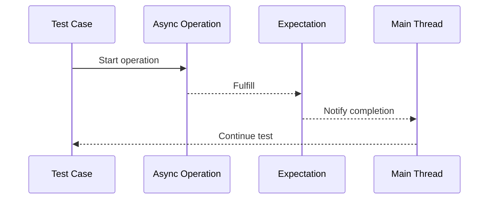

## 17.15 Handling Asynchronous and Concurrent Tests

In modern Swift development, handling asynchronous and concurrent operations is crucial, especially when developing robust iOS, macOS, and server-side applications. Testing these operations is equally important to ensure reliability and performance. This section will guide you through the intricacies of testing asynchronous and concurrent code in Swift, using `async/await`, managing threading issues, and ensuring that your tests are reliable and not dependent on timing.

### Understanding Asynchronous and Concurrent Testing

Asynchronous programming allows tasks to run independently of the main program flow, enabling non-blocking operations such as network requests, file I/O, and more. Concurrent programming, on the other hand, involves executing multiple tasks at the same time, which can lead to complex threading issues. Testing these aspects requires a deep understanding of Swift's concurrency model and testing frameworks.

#### Key Concepts

- **Asynchronous Code**: Code that performs operations without blocking the main thread, using callbacks, promises, or `async/await`.
- **Concurrent Code**: Code that runs multiple tasks simultaneously, often using multiple threads.
- **Thread Safety**: Ensuring that concurrent operations do not lead to race conditions or data corruption.

### Testing Asynchronous Code with XCTest

XCTest is Apple's testing framework for Swift, providing tools to test both synchronous and asynchronous code. When testing asynchronous code, we often use expectations to wait for operations to complete.

#### Using Expectations

Expectations allow you to pause a test until a specific condition is met or a timeout occurs. Here's a basic example of using expectations in XCTest:

```swift
import XCTest

class AsyncTests: XCTestCase {
    func testAsyncOperation() {
        // Create an expectation
        let expectation = self.expectation(description: "Async operation completes")

        // Simulate an asynchronous operation
        performAsyncOperation { result in
            XCTAssertEqual(result, "Success")
            // Fulfill the expectation
            expectation.fulfill()
        }

        // Wait for expectations with a timeout
        waitForExpectations(timeout: 5) { error in
            if let error = error {
                XCTFail("Timeout error: \\(error.localizedDescription)")
            }
        }
    }

    func performAsyncOperation(completion: @escaping (String) -> Void) {
        DispatchQueue.global().asyncAfter(deadline: .now() + 2) {
            completion("Success")
        }
    }
}
```

In this example, `performAsyncOperation` simulates an asynchronous task. The test waits for the expectation to be fulfilled, ensuring the operation completes before asserting the result.

### Async/Await in Swift

Swift's `async/await` syntax simplifies asynchronous programming by allowing you to write asynchronous code in a synchronous style. This makes testing more straightforward and less error-prone.

#### Testing with Async/Await

When testing `async` functions, XCTest provides support for `async/await`, allowing you to write cleaner and more readable tests.

```swift
import XCTest

class AsyncAwaitTests: XCTestCase {
    func testAsyncFunction() async {
        let result = await performAsyncTask()
        XCTAssertEqual(result, "Success")
    }

    func performAsyncTask() async -> String {
        await Task.sleep(2 * 1_000_000_000) // Simulate delay
        return "Success"
    }
}
```

In this example, the test function itself is marked as `async`, and it awaits the result of `performAsyncTask`. This eliminates the need for expectations and makes the test easier to read.

### Managing Threading Issues in Tests

Concurrency introduces challenges such as race conditions, deadlocks, and data corruption. Ensuring thread safety in tests is crucial for reliable results.

#### Strategies for Managing Threading Issues

1. **Use Serial Queues**: Ensure that shared resources are accessed serially to prevent race conditions.
2. **Employ Locks and Semaphores**: Use locks or semaphores to synchronize access to shared resources.
3. **Leverage Actors**: Swift's actor model provides a safe way to manage state in concurrent environments.

#### Example: Using Actors for Thread Safety

Actors in Swift help manage state in concurrent code by ensuring that only one task can access an actor's state at a time.

```swift
actor Counter {
    private var count = 0

    func increment() {
        count += 1
    }

    func getCount() -> Int {
        return count
    }
}

class ActorTests: XCTestCase {
    func testActorConcurrency() async {
        let counter = Counter()

        await withTaskGroup(of: Void.self) { group in
            for _ in 0..<1000 {
                group.addTask {
                    await counter.increment()
                }
            }
        }

        let finalCount = await counter.getCount()
        XCTAssertEqual(finalCount, 1000)
    }
}
```

In this example, the `Counter` actor safely manages concurrent increments, ensuring the final count is accurate.

### Ensuring Reliable and Timing-Independent Tests

Tests should be deterministic, providing consistent results regardless of timing variations. This is especially important for asynchronous and concurrent tests.

#### Techniques for Reliable Tests

- **Avoid Hard-Coded Delays**: Use expectations or `async/await` instead of fixed delays to wait for operations.
- **Mock Dependencies**: Use mock objects to simulate external dependencies, ensuring tests are isolated and repeatable.
- **Use Dependency Injection**: Inject dependencies to control and isolate the test environment.

#### Example: Mocking Network Requests

Mocking allows you to simulate network responses, ensuring tests do not depend on actual network conditions.

```swift
import XCTest

class NetworkTests: XCTestCase {
    var networkManager: NetworkManager!

    override func setUp() {
        super.setUp()
        networkManager = NetworkManager(session: MockURLSession())
    }

    func testNetworkRequest() async {
        let data = await networkManager.fetchData()
        XCTAssertEqual(data, "Mock Data")
    }
}

class MockURLSession: URLSessionProtocol {
    func data(for request: URLRequest) async throws -> (Data, URLResponse) {
        let mockData = "Mock Data".data(using: .utf8)!
        let response = HTTPURLResponse(url: request.url!, statusCode: 200, httpVersion: nil, headerFields: nil)!
        return (mockData, response)
    }
}
```

In this example, `MockURLSession` simulates network responses, allowing the test to verify the behavior of `NetworkManager` without real network calls.

### Visualizing Asynchronous and Concurrent Testing

To better understand the flow of asynchronous and concurrent tests, let's visualize the process using a sequence diagram.



This diagram illustrates how a test case initiates an asynchronous operation, waits for an expectation to be fulfilled, and resumes once the operation completes.

### Best Practices for Asynchronous and Concurrent Testing

1. **Keep Tests Atomic**: Ensure each test case is independent and tests a single aspect of the code.
2. **Use Descriptive Test Names**: Clearly describe what each test verifies.
3. **Leverage Swift's Concurrency Features**: Use `async/await` and actors to simplify concurrent code and tests.
4. **Isolate Tests from External Dependencies**: Use mocks and stubs to isolate tests from network, database, and other external systems.

### Try It Yourself

Experiment with the provided code examples by modifying the delay times, adding more concurrent tasks, or introducing additional mock dependencies. Observe how these changes affect the test outcomes and reliability.

### Conclusion

Handling asynchronous and concurrent tests in Swift requires a solid understanding of Swift's concurrency model, XCTest framework, and best practices for reliable testing. By leveraging `async/await`, actors, and proper test isolation techniques, you can ensure your tests are robust, reliable, and maintainable.

## Quiz Time!



### What is the primary purpose of using expectations in XCTest?

- [x] To wait for asynchronous operations to complete before proceeding with assertions.
- [ ] To ensure synchronous code executes faster.
- [ ] To manage memory usage during tests.
- [ ] To automatically retry failed tests.

> **Explanation:** Expectations in XCTest allow tests to wait for asynchronous operations to complete, ensuring that assertions are made only after the operation has finished.

### How does Swift's `async/await` syntax benefit asynchronous testing?

- [x] It simplifies the code by allowing asynchronous code to be written in a synchronous style.
- [ ] It automatically handles all threading issues.
- [ ] It eliminates the need for any error handling.
- [ ] It increases the speed of asynchronous operations.

> **Explanation:** `async/await` allows asynchronous code to be written in a more readable and maintainable synchronous style, simplifying testing and reducing errors.

### What is a common issue when testing concurrent code?

- [x] Race conditions
- [ ] Syntax errors
- [ ] Compilation errors
- [ ] Logical errors

> **Explanation:** Race conditions occur when concurrent tasks access shared resources without proper synchronization, leading to unpredictable results.

### How can actors help in managing concurrent state in Swift?

- [x] By ensuring that only one task can access an actor's state at a time.
- [ ] By automatically parallelizing code execution.
- [ ] By providing faster execution of tasks.
- [ ] By eliminating the need for error handling.

> **Explanation:** Actors in Swift ensure that only one task can access an actor's state at a time, providing a safe way to manage concurrent state.

### Which technique is NOT recommended for reliable asynchronous tests?

- [ ] Using expectations
- [ ] Mocking dependencies
- [x] Hard-coded delays
- [ ] Dependency injection

> **Explanation:** Hard-coded delays can lead to unreliable tests due to timing variations, whereas expectations, mocking, and dependency injection provide more reliable alternatives.

### What is the role of a mock object in testing?

- [x] To simulate external dependencies and isolate the code under test.
- [ ] To increase the speed of test execution.
- [ ] To automatically generate test data.
- [ ] To replace the need for assertions in tests.

> **Explanation:** Mock objects simulate external dependencies, allowing tests to focus on the code under test without relying on actual external systems.

### Why is it important to isolate tests from external dependencies?

- [x] To ensure tests are repeatable and not affected by external factors.
- [ ] To increase the complexity of test cases.
- [ ] To reduce the number of test cases.
- [ ] To automatically fix bugs in the code.

> **Explanation:** Isolating tests from external dependencies ensures they are repeatable and not affected by changes or failures in external systems.

### What is a benefit of using `async/await` over traditional callback-based asynchronous code?

- [x] Improved readability and maintainability
- [ ] Faster execution speed
- [ ] Automatic error handling
- [ ] Reduced memory usage

> **Explanation:** `async/await` improves the readability and maintainability of asynchronous code by allowing it to be written in a synchronous style.

### What is a race condition?

- [x] A situation where the outcome depends on the sequence or timing of uncontrollable events.
- [ ] A type of syntax error in concurrent code.
- [ ] A method to speed up concurrent execution.
- [ ] A tool for measuring test performance.

> **Explanation:** A race condition occurs when the outcome of a concurrent operation depends on the sequence or timing of events, leading to unpredictable results.

### True or False: Actors in Swift eliminate the need for all other concurrency control mechanisms.

- [ ] True
- [x] False

> **Explanation:** While actors provide a safe way to manage concurrent state, other concurrency control mechanisms may still be necessary for different scenarios or performance optimizations.



Remember, mastering asynchronous and concurrent testing in Swift is an ongoing journey. Keep experimenting, stay curious, and enjoy the process of building robust and reliable applications!


