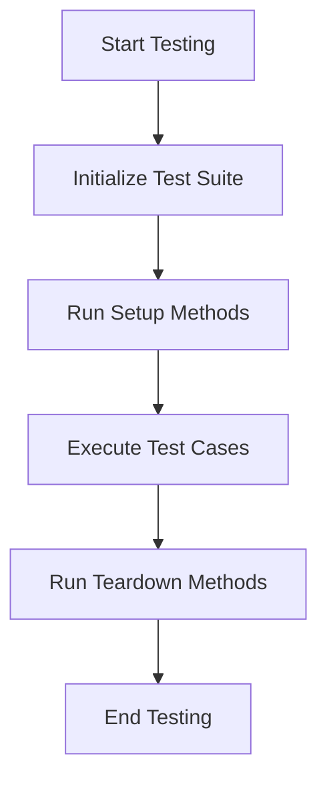

## 17.16 Best Practices for Maintainable Tests

In the world of software development, testing is not just an afterthought but a crucial component of the development process. Writing maintainable tests is essential for ensuring that your codebase remains robust, reliable, and easy to modify over time. In this section, we'll explore best practices for writing maintainable tests in Swift, focusing on organization, readability, and keeping tests up-to-date with code changes.

### The Importance of Maintainable Tests

Maintainable tests are essential for several reasons:

- **Reliability**: Tests provide confidence that your code works as expected.
- **Refactoring**: Well-maintained tests make it easier to refactor code without introducing bugs.
- **Documentation**: Tests serve as a form of documentation, illustrating how your code is intended to be used.
- **Collaboration**: Clear and organized tests facilitate collaboration among team members.

### Organizing Tests Logically

Logical organization of tests is the foundation of maintainability. Here are some strategies to consider:

#### Group Tests by Functionality

Organize your tests by the functionality they cover. This makes it easier to locate tests related to specific features or components.

```swift
// Example of organizing tests by functionality
class UserAuthenticationTests: XCTestCase {
    func testValidLogin() {
        // Test code for valid login
    }

    func testInvalidLogin() {
        // Test code for invalid login
    }
}

class UserProfileTests: XCTestCase {
    func testProfileUpdate() {
        // Test code for profile update
    }

    func testProfilePictureUpload() {
        // Test code for profile picture upload
    }
}
```

#### Use Descriptive Test Names

Descriptive test names help convey the purpose of each test, making it easier for others to understand what is being tested.

```swift
// Example of descriptive test names
func testUserCanLoginWithValidCredentials() {
    // Test code
}

func testUserCannotLoginWithInvalidCredentials() {
    // Test code
}
```

#### Avoid Test Duplication

Duplicate tests can lead to maintenance headaches. Ensure that each test case is unique and covers a specific aspect of functionality.

```swift
// Avoid duplication by extracting common setup code
class UserTests: XCTestCase {
    var user: User!

    override func setUp() {
        super.setUp()
        user = User(name: "Test User", age: 30)
    }

    func testUserInitialization() {
        XCTAssertEqual(user.name, "Test User")
        XCTAssertEqual(user.age, 30)
    }

    func testUserAgeUpdate() {
        user.updateAge(to: 31)
        XCTAssertEqual(user.age, 31)
    }
}
```

### Writing Clean and Readable Test Code

Readable test code is easier to maintain and understand. Follow these practices to enhance readability:

#### Use Setup and Teardown Methods

Setup and teardown methods help eliminate redundancy by initializing and cleaning up resources before and after each test.

```swift
// Using setup and teardown methods
class DatabaseTests: XCTestCase {
    var database: Database!

    override func setUp() {
        super.setUp()
        database = Database()
        database.connect()
    }

    override func tearDown() {
        database.disconnect()
        database = nil
        super.tearDown()
    }

    func testDatabaseConnection() {
        XCTAssertTrue(database.isConnected)
    }
}
```

#### Keep Tests Focused

Each test should focus on a single aspect of functionality. This makes it easier to identify the cause of a test failure.

```swift
// Focused test example
func testAddingItemToCartIncreasesItemCount() {
    let cart = ShoppingCart()
    cart.addItem(Item(name: "Laptop", price: 999.99))
    XCTAssertEqual(cart.itemCount, 1)
}
```

#### Use Assertions Effectively

Choose assertions that clearly express the intent of the test. This improves readability and makes it easier to diagnose test failures.

```swift
// Effective use of assertions
func testUserBalanceAfterDeposit() {
    let account = BankAccount(balance: 100)
    account.deposit(50)
    XCTAssertEqual(account.balance, 150, "Balance should be updated after deposit")
}
```

### Keeping Tests Up-to-Date with Code Changes

As your code evolves, so too must your tests. Here are some strategies to ensure your tests remain relevant:

#### Refactor Tests Alongside Code

When refactoring code, update your tests to reflect any changes in functionality or design.

```swift
// Refactoring tests alongside code changes
func testUserEmailUpdate() {
    let user = User(email: "old@example.com")
    user.updateEmail(to: "new@example.com")
    XCTAssertEqual(user.email, "new@example.com", "Email should be updated")
}
```

#### Use Mocking and Stubbing

Mocking and stubbing are techniques used to isolate the code being tested from external dependencies, making tests more reliable and easier to maintain.

```swift
// Example of mocking a network request
class NetworkServiceTests: XCTestCase {
    var networkService: NetworkService!
    var mockSession: URLSessionMock!

    override func setUp() {
        super.setUp()
        mockSession = URLSessionMock()
        networkService = NetworkService(session: mockSession)
    }

    func testFetchData() {
        mockSession.data = Data("{\"key\":\"value\"}".utf8)
        networkService.fetchData { result in
            switch result {
            case .success(let data):
                XCTAssertNotNil(data)
            case .failure(let error):
                XCTFail("Expected success, got \\(error) instead")
            }
        }
    }
}
```

### Visualizing Test Organization

To better understand how tests are organized and executed, let's visualize the process using a Mermaid.js flowchart.



This flowchart illustrates the typical flow of a test suite, from initialization to execution and cleanup.

### Incorporating Continuous Integration

Continuous integration (CI) is a practice that involves automatically running tests whenever code changes are made. This ensures that tests remain up-to-date and provides immediate feedback on the impact of code changes.

#### Benefits of Continuous Integration

- **Early Detection of Issues**: CI helps detect issues early in the development process.
- **Improved Collaboration**: Automated tests facilitate collaboration by providing a shared understanding of code quality.
- **Faster Development Cycles**: CI accelerates development by reducing the time spent on manual testing.

### Knowledge Check

To reinforce your understanding of maintainable tests, consider the following questions:

- What are the benefits of organizing tests by functionality?
- How can descriptive test names improve test maintainability?
- Why is it important to avoid test duplication?
- What role do setup and teardown methods play in test organization?
- How can continuous integration enhance test maintainability?

### Try It Yourself

Experiment with the code examples provided by modifying them to test different scenarios or functionalities. Consider adding new test cases or refactoring existing ones to improve their maintainability.

### Embrace the Journey

Remember, writing maintainable tests is an ongoing process. As you gain experience, you'll develop your own strategies for organizing and maintaining tests. Keep experimenting, stay curious, and enjoy the journey of mastering Swift testing!

## Quiz Time!



### What is the primary benefit of organizing tests by functionality?

- [x] Easier to locate tests related to specific features
- [ ] Reduces the number of test cases needed
- [ ] Increases test execution speed
- [ ] Improves test readability

> **Explanation:** Organizing tests by functionality makes it easier to locate tests related to specific features or components.

### How can descriptive test names contribute to maintainability?

- [x] They convey the purpose of each test
- [ ] They reduce the number of assertions needed
- [ ] They increase test execution speed
- [ ] They eliminate the need for comments

> **Explanation:** Descriptive test names help convey the purpose of each test, making it easier to understand what is being tested.

### What is the purpose of setup and teardown methods in tests?

- [x] To initialize and clean up resources before and after each test
- [ ] To increase test execution speed
- [ ] To reduce the number of test cases needed
- [ ] To improve test readability

> **Explanation:** Setup and teardown methods help eliminate redundancy by initializing and cleaning up resources before and after each test.

### Why is it important to avoid test duplication?

- [x] It reduces maintenance headaches
- [ ] It increases test execution speed
- [ ] It improves test readability
- [ ] It eliminates the need for assertions

> **Explanation:** Duplicate tests can lead to maintenance headaches, so ensuring each test case is unique is important.

### What is the benefit of using mocking and stubbing in tests?

- [x] To isolate the code being tested from external dependencies
- [ ] To increase test execution speed
- [ ] To reduce the number of test cases needed
- [ ] To improve test readability

> **Explanation:** Mocking and stubbing are techniques used to isolate the code being tested from external dependencies, making tests more reliable and easier to maintain.

### How does continuous integration enhance test maintainability?

- [x] By providing immediate feedback on the impact of code changes
- [ ] By increasing test execution speed
- [ ] By reducing the number of test cases needed
- [ ] By eliminating the need for assertions

> **Explanation:** Continuous integration provides immediate feedback on the impact of code changes, ensuring tests remain up-to-date.

### What is a key benefit of using assertions effectively in tests?

- [x] They clearly express the intent of the test
- [ ] They increase test execution speed
- [ ] They reduce the number of test cases needed
- [ ] They eliminate the need for comments

> **Explanation:** Choosing assertions that clearly express the intent of the test improves readability and makes it easier to diagnose test failures.

### How can refactoring tests alongside code changes benefit maintainability?

- [x] It ensures tests reflect changes in functionality or design
- [ ] It increases test execution speed
- [ ] It reduces the number of test cases needed
- [ ] It eliminates the need for assertions

> **Explanation:** Refactoring tests alongside code changes ensures that tests remain relevant and accurate.

### What is the role of tests as a form of documentation?

- [x] They illustrate how code is intended to be used
- [ ] They increase test execution speed
- [ ] They reduce the number of test cases needed
- [ ] They eliminate the need for comments

> **Explanation:** Tests serve as a form of documentation by illustrating how code is intended to be used.

### True or False: Maintainable tests are less important for small projects.

- [ ] True
- [x] False

> **Explanation:** Maintainable tests are important for projects of all sizes, as they ensure code reliability and facilitate future changes.




