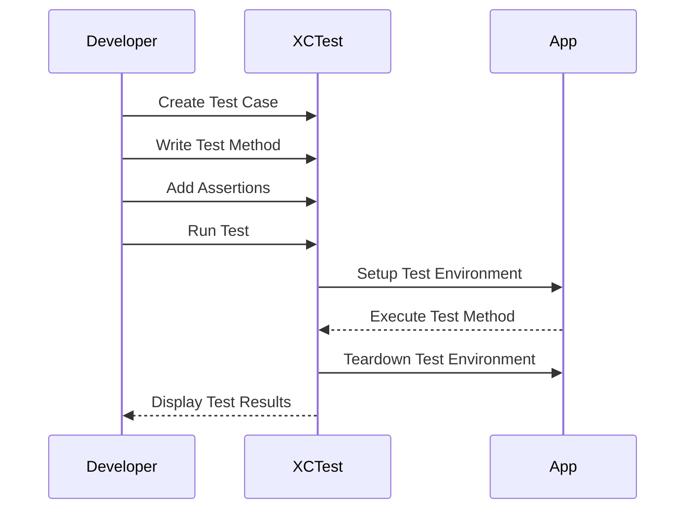

## 17.2 Unit Testing with XCTest

Unit testing is a critical aspect of software development that ensures the reliability and correctness of code. In Swift, the XCTest framework provides a powerful and flexible way to write unit tests. This section will guide you through the essentials of using XCTest for unit testing in Swift, including structuring tests, making assertions, and running and debugging tests in Xcode.

### Understanding Unit Testing

Unit testing involves testing individual components or units of code to verify that they function as expected. A unit can be a function, method, or class. The primary goal of unit testing is to isolate each part of the program and show that the individual parts are correct. Unit tests help catch bugs early, facilitate code refactoring, and improve code quality.

### Introduction to XCTest

XCTest is Apple's official framework for testing in Swift and Objective-C. It is integrated into Xcode and provides tools for creating, running, and managing tests. XCTest supports unit tests, performance tests, and UI tests, making it a comprehensive solution for testing iOS, macOS, watchOS, and tvOS applications.

#### Key Features of XCTest

- **Assertions**: XCTest provides a variety of assertions to validate conditions in your tests.
- **Test Lifecycle**: XCTest includes setup and teardown methods to prepare the test environment.
- **Performance Testing**: Measure the performance of code blocks to ensure efficiency.
- **Integration with Xcode**: Run and debug tests directly within Xcode, with results displayed in the Test Navigator.

### Setting Up XCTest in Xcode

To start using XCTest, you need to create a test target in your Xcode project. Follow these steps:

1. **Create a Test Target**: In Xcode, go to `File > New > Target`, select a test target template (e.g., Unit Testing Bundle), and add it to your project.
2. **Add Test Cases**: Create test case classes by subclassing `XCTestCase`. Each test case class can contain multiple test methods.
3. **Run Tests**: Use the Test Navigator or the Command Line to run your tests and view results.

### Structuring Tests and Assertions

A well-structured test is crucial for maintaining clarity and effectiveness. Let's explore how to structure test cases and use assertions effectively.

#### Test Case Structure

A test case in XCTest is a subclass of `XCTestCase`. Each test method within a test case class should start with the word `test` and should be annotated with the `@objc` attribute if you are using Objective-C.

```swift
import XCTest

class CalculatorTests: XCTestCase {

    override func setUp() {
        super.setUp()
        // Code to set up the test environment
    }

    override func tearDown() {
        // Code to clean up after tests
        super.tearDown()
    }

    func testAddition() {
        let result = add(2, 3)
        XCTAssertEqual(result, 5, "Expected addition of 2 and 3 to be 5")
    }

    func testSubtraction() {
        let result = subtract(5, 3)
        XCTAssertEqual(result, 2, "Expected subtraction of 3 from 5 to be 2")
    }
}
```

#### Common Assertions

XCTest provides several assertions to validate test outcomes:

- `XCTAssertTrue(expression, message)`: Asserts that the expression is true.
- `XCTAssertFalse(expression, message)`: Asserts that the expression is false.
- `XCTAssertEqual(value1, value2, message)`: Asserts that two values are equal.
- `XCTAssertNotEqual(value1, value2, message)`: Asserts that two values are not equal.
- `XCTAssertNil(expression, message)`: Asserts that an expression is nil.
- `XCTAssertNotNil(expression, message)`: Asserts that an expression is not nil.
- `XCTAssertThrowsError(expression, message)`: Asserts that an expression throws an error.

### Running and Debugging Tests in Xcode

Running and debugging tests in Xcode is straightforward. Use the Test Navigator to run tests and view results. You can also run tests from the command line using `xcodebuild`.

#### Running Tests

- **Test Navigator**: Open the Test Navigator (⌘6) in Xcode, and click the play button next to a test or test suite to run it.
- **Command Line**: Use `xcodebuild test` to run tests from the terminal.

#### Debugging Tests

Debugging tests is similar to debugging regular code. You can set breakpoints in your test methods and use the Xcode debugger to step through code and inspect variables.

### Performance Testing with XCTest

XCTest also supports performance testing, allowing you to measure the execution time of code blocks. Use the `measure` method to create performance tests.

```swift
func testPerformanceExample() {
    self.measure {
        // Code to measure the time of
        let _ = performComplexCalculation()
    }
}
```

### Visualizing the Testing Process

To better understand the testing process with XCTest, let's visualize the flow of a test case lifecycle.



### Best Practices for Unit Testing with XCTest

- **Keep Tests Independent**: Ensure that tests do not depend on each other.
- **Use Descriptive Names**: Name test methods clearly to indicate their purpose.
- **Test Edge Cases**: Include tests for edge cases and error conditions.
- **Refactor with Confidence**: Use tests to refactor code safely.
- **Automate Testing**: Integrate tests into a continuous integration pipeline.

### Try It Yourself

To get hands-on experience with XCTest, try modifying the provided code examples:

- **Add More Test Cases**: Extend the `CalculatorTests` class with additional test methods for multiplication and division.
- **Experiment with Assertions**: Use different assertions to test various conditions.
- **Measure Performance**: Create a performance test for a complex algorithm and analyze the results.

### References and Further Reading

- [Apple's XCTest Documentation](https://developer.apple.com/documentation/xctest)
- [Unit Testing in Swift with XCTest](https://www.raywenderlich.com/21020457-unit-testing-in-swift-with-xctest)
- [Test-Driven Development with Swift](https://www.swiftbysundell.com/articles/test-driven-development-in-swift/)

### Knowledge Check

- What are the benefits of unit testing with XCTest?
- How do you structure a test case in XCTest?
- What is the purpose of assertions in unit tests?
- How can you run and debug tests in Xcode?
- What is the role of performance testing in XCTest?

### Embrace the Journey

Remember, mastering unit testing with XCTest is a journey. As you continue to write and refine tests, you'll gain confidence in your code's reliability and maintainability. Keep experimenting, stay curious, and enjoy the process of building robust Swift applications.

## Quiz Time!



### What is the primary goal of unit testing?

- [x] To isolate and verify individual components of code
- [ ] To test the entire application as a whole
- [ ] To measure the performance of code
- [ ] To debug the application

> **Explanation:** Unit testing focuses on isolating and verifying individual components or units of code to ensure they function correctly.

### Which framework is used for unit testing in Swift?

- [x] XCTest
- [ ] JUnit
- [ ] Mocha
- [ ] Jasmine

> **Explanation:** XCTest is the official framework provided by Apple for unit testing in Swift and Objective-C.

### How do you create a test case in XCTest?

- [x] By subclassing XCTestCase
- [ ] By creating a new Swift file
- [ ] By writing a main function
- [ ] By using a storyboard

> **Explanation:** A test case in XCTest is created by subclassing `XCTestCase` and defining test methods within the subclass.

### What is the purpose of assertions in XCTest?

- [x] To validate test outcomes
- [ ] To run performance tests
- [ ] To debug code
- [ ] To create UI tests

> **Explanation:** Assertions are used in XCTest to validate that the code behaves as expected during tests.

### How can you run tests in Xcode?

- [x] Using the Test Navigator
- [ ] By compiling the project
- [x] Using the command line with xcodebuild
- [ ] By running the app

> **Explanation:** Tests can be run in Xcode using the Test Navigator or from the command line using `xcodebuild`.

### What method is used for performance testing in XCTest?

- [x] measure
- [ ] testPerformance
- [ ] benchmark
- [ ] profile

> **Explanation:** The `measure` method is used in XCTest to create performance tests that measure the execution time of code blocks.

### What is a best practice for naming test methods?

- [x] Use descriptive names
- [ ] Use numbers
- [ ] Use random names
- [ ] Use short names

> **Explanation:** Descriptive names for test methods help indicate their purpose and make it easier to understand what is being tested.

### What should you do to ensure tests are independent?

- [x] Avoid dependencies between tests
- [ ] Use global variables
- [ ] Run tests in sequence
- [ ] Share state between tests

> **Explanation:** Keeping tests independent ensures that they do not affect each other, leading to more reliable and maintainable tests.

### What is the benefit of integrating tests into a continuous integration pipeline?

- [x] Automates testing and improves code quality
- [ ] Increases code complexity
- [ ] Reduces test coverage
- [ ] Slows down development

> **Explanation:** Integrating tests into a continuous integration pipeline automates the testing process and helps maintain high code quality.

### True or False: XCTest can only be used for unit testing.

- [ ] True
- [x] False

> **Explanation:** XCTest supports unit tests, performance tests, and UI tests, making it a comprehensive testing framework.


