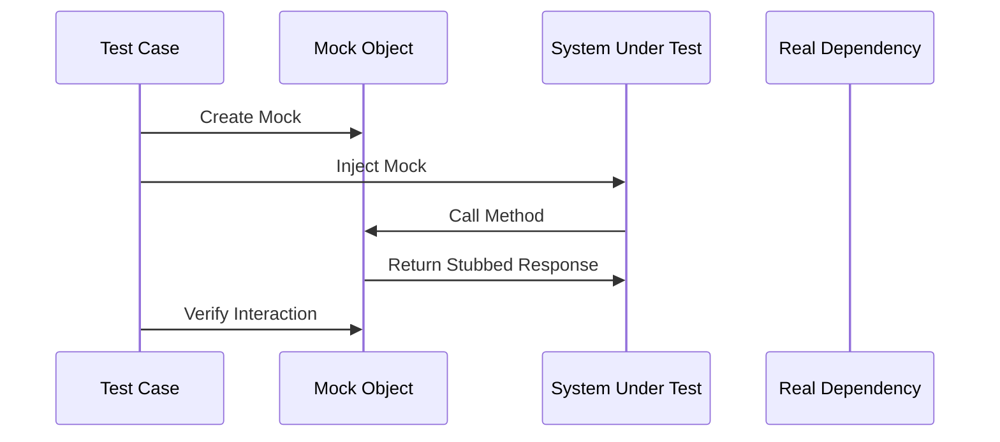

## 17.3 Mocking and Stubbing Dependencies

In the world of software development, testing is a critical component that ensures the reliability and robustness of applications. When it comes to testing in Swift, mocking and stubbing are indispensable techniques that help isolate units of code, enabling developers to test components in isolation. This section will guide you through the concepts of mocking and stubbing, demonstrate how to implement protocol-oriented mocking, and explore the use of third-party libraries like Cuckoo and Mockingbird.

### Understanding Mocking and Stubbing

Before diving into implementation, let's clarify the concepts of mocking and stubbing:

- **Mocking** involves creating objects that simulate the behavior of real objects. Mocks are used to verify interactions between objects, such as method calls and their parameters.
- **Stubbing** refers to providing predefined responses to method calls. Stubs are used to replace parts of the system that are not under test, allowing you to control the environment and test specific behaviors.

### Why Use Mocking and Stubbing?

Mocking and stubbing offer several benefits:

- **Isolation**: By isolating the unit of code under test, you can focus on testing its logic without interference from external dependencies.
- **Control**: You can control the behavior of dependencies, making it easier to test edge cases and error handling.
- **Speed**: Tests run faster because they do not rely on real implementations, such as network requests or database access.
- **Reliability**: Tests become more reliable as they are not affected by external factors, such as network latency or service availability.

### Implementing Protocol-Oriented Mocking

Swift's emphasis on protocol-oriented programming (POP) makes it an ideal language for mocking. By defining protocols for dependencies, you can easily create mock implementations for testing.

#### Step-by-Step Guide to Protocol-Oriented Mocking

1. **Define Protocols for Dependencies**

   Start by defining protocols for the dependencies you want to mock. For example, if you have a `NetworkService` class, define a `NetworkServiceProtocol`:

   ```swift
   protocol NetworkServiceProtocol {
       func fetchData(from url: URL, completion: @escaping (Result<Data, Error>) -> Void)
   }
   ```

2. **Create Mock Implementations**

   Implement mock versions of these protocols. For instance, create a `MockNetworkService`:

   ```swift
   class MockNetworkService: NetworkServiceProtocol {
       var fetchDataCalled = false
       var resultToReturn: Result<Data, Error>?

       func fetchData(from url: URL, completion: @escaping (Result<Data, Error>) -> Void) {
           fetchDataCalled = true
           if let result = resultToReturn {
               completion(result)
           }
       }
   }
   ```

   In this example, `fetchDataCalled` tracks whether the method was called, and `resultToReturn` allows you to specify the result to return.

3. **Inject Dependencies**

   Use dependency injection to provide the mock implementation to the unit under test. This can be done through initializer injection, property injection, or method injection.

   ```swift
   class DataManager {
       private let networkService: NetworkServiceProtocol

       init(networkService: NetworkServiceProtocol) {
           self.networkService = networkService
       }

       func loadData(completion: @escaping (Result<Data, Error>) -> Void) {
           let url = URL(string: "https://example.com/data")!
           networkService.fetchData(from: url, completion: completion)
       }
   }
   ```

4. **Write Tests Using Mocks**

   Now, you can write tests that use the mock implementations. For example, test that `loadData` calls `fetchData`:

   ```swift
   import XCTest

   class DataManagerTests: XCTestCase {
       func testLoadDataCallsFetchData() {
           let mockNetworkService = MockNetworkService()
           let dataManager = DataManager(networkService: mockNetworkService)

           dataManager.loadData { _ in }

           XCTAssertTrue(mockNetworkService.fetchDataCalled)
       }
   }
   ```

### Using Third-Party Libraries

While protocol-oriented mocking is powerful, third-party libraries can simplify the process, especially for more complex scenarios. Two popular libraries in the Swift ecosystem are Cuckoo and Mockingbird.

#### Cuckoo

Cuckoo is a mocking framework that generates mock classes based on your protocols and classes. It provides a simple and expressive API for defining mock behavior and verifying interactions.

1. **Setup Cuckoo**

   Add Cuckoo to your project using Swift Package Manager or CocoaPods.

   ```swift
   dependencies: [
       .package(url: "https://github.com/Brightify/Cuckoo.git", from: "1.0.0")
   ]
   ```

2. **Generate Mocks**

   Use Cuckoo's command-line tool to generate mock classes. This tool reads your source files and creates mock implementations.

   ```bash
   ./Scripts/generateMocks.sh
   ```

3. **Write Tests with Cuckoo**

   Use the generated mocks in your tests. Here's an example:

   ```swift
   import Cuckoo
   import XCTest

   class DataManagerTests: XCTestCase {
       func testLoadDataCallsFetchData() {
           let mockNetworkService = MockNetworkServiceProtocol()
           stub(mockNetworkService) { stub in
               when(stub.fetchData(from: any(), completion: any())).thenDoNothing()
           }

           let dataManager = DataManager(networkService: mockNetworkService)

           dataManager.loadData { _ in }

           verify(mockNetworkService).fetchData(from: any(), completion: any())
       }
   }
   ```

   Cuckoo's `stub` and `verify` functions make it easy to define expected behavior and verify interactions.

#### Mockingbird

Mockingbird is another powerful library for mocking in Swift. It focuses on simplicity and ease of use, providing a clean API for creating mocks and stubs.

1. **Setup Mockingbird**

   Add Mockingbird to your project using Swift Package Manager or CocoaPods.

   ```swift
   dependencies: [
       .package(url: "https://github.com/birdrides/mockingbird.git", from: "0.18.0")
   ]
   ```

2. **Generate Mocks**

   Use Mockingbird's command-line tool to generate mocks from your protocols.

   ```bash
   mockingbird generate
   ```

3. **Write Tests with Mockingbird**

   Here's an example of using Mockingbird in tests:

   ```swift
   import Mockingbird
   import XCTest

   class DataManagerTests: XCTestCase {
       func testLoadDataCallsFetchData() {
           let mockNetworkService = mock(NetworkServiceProtocol.self)
           given(mockNetworkService.fetchData(from: any(), completion: any())).willReturn()

           let dataManager = DataManager(networkService: mockNetworkService)

           dataManager.loadData { _ in }

           verify(mockNetworkService.fetchData(from: any(), completion: any())).wasCalled()
       }
   }
   ```

   Mockingbird's `given` and `verify` functions provide a straightforward way to define and verify mock behavior.

### Visualizing Mocking and Stubbing

To better understand the process of mocking and stubbing, let's visualize the flow of a typical test using these techniques.



**Diagram Explanation**: The sequence diagram illustrates the interaction between a test case, a mock object, the system under test (SUT), and the real dependency. The test case creates a mock, injects it into the SUT, and verifies the interaction.

### Best Practices for Mocking and Stubbing

- **Keep Mocks Simple**: Avoid adding unnecessary logic to mocks. They should be simple and focused on simulating behavior.
- **Use Protocols**: Define protocols for dependencies to facilitate mocking. This promotes decoupling and testability.
- **Verify Interactions**: Use mocks to verify that the SUT interacts with dependencies as expected.
- **Stub Responses**: Use stubs to control the environment and test specific scenarios.
- **Avoid Over-Mocking**: Mocking everything can lead to brittle tests. Focus on mocking external dependencies.

### Try It Yourself

Experiment with the code examples provided in this section. Try modifying the mock implementations to simulate different scenarios, such as network errors or specific data responses. This hands-on practice will deepen your understanding of mocking and stubbing in Swift.

### Knowledge Check

- **Question**: What is the primary difference between mocking and stubbing?
- **Challenge**: Implement a mock version of a database service and write a test to verify that a data retrieval method is called.

### Conclusion

Mocking and stubbing are powerful techniques that enhance the testability and reliability of Swift applications. By leveraging protocol-oriented programming and third-party libraries, you can create robust tests that isolate units of code and provide confidence in your software's behavior. Remember, this is just the beginning. As you progress, you'll build more complex and interactive test suites. Keep experimenting, stay curious, and enjoy the journey!

## Quiz Time!



### What is the primary purpose of mocking in testing?

- [x] To simulate the behavior of real objects and verify interactions.
- [ ] To provide predefined responses to method calls.
- [ ] To measure the performance of code.
- [ ] To refactor code for better readability.

> **Explanation:** Mocking is used to simulate the behavior of real objects and verify interactions between objects.

### Which Swift feature is particularly useful for creating mock implementations?

- [x] Protocols
- [ ] Structs
- [ ] Enums
- [ ] Extensions

> **Explanation:** Protocols in Swift allow you to define interfaces that can be implemented by mock classes for testing.

### What does a stub do in a test?

- [x] Provides predefined responses to method calls.
- [ ] Simulates the behavior of real objects.
- [ ] Verifies interactions between objects.
- [ ] Measures code performance.

> **Explanation:** Stubs provide predefined responses to method calls, allowing you to control the test environment.

### Which library is known for generating mock classes based on Swift protocols?

- [x] Cuckoo
- [ ] Alamofire
- [ ] SwiftLint
- [ ] CoreData

> **Explanation:** Cuckoo is a library that generates mock classes based on Swift protocols.

### What is a key benefit of using dependency injection in testing?

- [x] It allows for easy swapping of real and mock implementations.
- [ ] It improves the performance of the application.
- [ ] It simplifies the user interface design.
- [ ] It enhances the security of the application.

> **Explanation:** Dependency injection allows for easy swapping of real and mock implementations, facilitating testing.

### Which function in Cuckoo is used to define expected behavior in a mock?

- [x] `stub`
- [ ] `verify`
- [ ] `expect`
- [ ] `assert`

> **Explanation:** The `stub` function in Cuckoo is used to define expected behavior in a mock.

### In Mockingbird, which function is used to verify that a method was called?

- [x] `verify`
- [ ] `given`
- [ ] `expect`
- [ ] `assert`

> **Explanation:** The `verify` function in Mockingbird is used to verify that a method was called.

### What is a common pitfall to avoid when using mocks in tests?

- [x] Over-mocking, which can lead to brittle tests.
- [ ] Using real objects, which can slow down tests.
- [ ] Writing tests without assertions.
- [ ] Using too many assertions in a single test.

> **Explanation:** Over-mocking can lead to brittle tests that are difficult to maintain.

### Which of the following is NOT a benefit of mocking and stubbing?

- [x] It increases the complexity of the codebase.
- [ ] It isolates units of code for testing.
- [ ] It allows control over the test environment.
- [ ] It speeds up test execution.

> **Explanation:** Mocking and stubbing do not increase the complexity of the codebase; they simplify testing.

### True or False: Stubs are primarily used to verify interactions between objects.

- [ ] True
- [x] False

> **Explanation:** Stubs are used to provide predefined responses to method calls, not to verify interactions.


