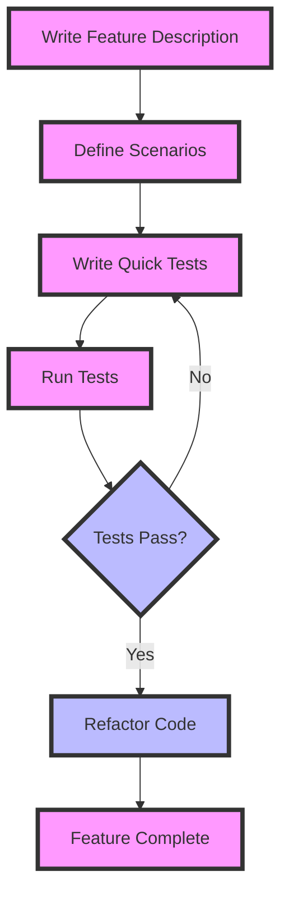

## 17.4 Behavior-Driven Development (BDD) with Quick/Nimble

Behavior-Driven Development (BDD) is a software development approach that emphasizes collaboration between developers, QA, and non-technical stakeholders. It focuses on describing the behavior of software in a language that is understandable to all parties involved. In Swift, Quick and Nimble are two powerful tools that facilitate BDD by providing a framework for writing expressive, behavior-focused tests.

### Introduction to Behavior-Driven Development (BDD)

BDD builds on Test-Driven Development (TDD) by encouraging teams to write tests that describe the behavior of the software rather than its implementation. This approach ensures that the software meets the needs of its users and stakeholders. BDD uses natural language constructs to describe the behavior of the system, often in the form of "Given-When-Then" scenarios.

#### Key Concepts of BDD

- **Given-When-Then**: This format is used to describe the context, action, and expected outcome of a behavior.
- **Collaboration**: BDD encourages collaboration between technical and non-technical team members.
- **Living Documentation**: Tests serve as documentation for the system's behavior.

### Using Quick for BDD-Style Testing

Quick is a behavior-driven development framework for Swift and Objective-C. It provides a syntax that allows you to write tests in a way that describes the behavior of your application.

#### Setting Up Quick

To get started with Quick, you need to add it to your project. You can do this using CocoaPods or Swift Package Manager.

**Using CocoaPods:**

```ruby
# Podfile
target 'YourApp' do
  use_frameworks!
  pod 'Quick'
  pod 'Nimble'
end
```

**Using Swift Package Manager:**

```swift
// swift-tools-version:5.3
import PackageDescription

let package = Package(
    name: "YourApp",
    dependencies: [
        .package(url: "https://github.com/Quick/Quick.git", from: "4.0.0"),
        .package(url: "https://github.com/Quick/Nimble.git", from: "9.0.0"),
    ],
    targets: [
        .target(name: "YourApp", dependencies: ["Quick", "Nimble"]),
    ]
)
```

#### Writing Tests with Quick

Quick provides a `describe` and `context` block to group related tests, and `it` blocks to define individual test cases.

```swift
import Quick
import Nimble

class ArithmeticSpec: QuickSpec {
    override func spec() {
        describe("addition") {
            context("when adding two numbers") {
                it("returns the sum of the numbers") {
                    let sum = 2 + 3
                    expect(sum).to(equal(5))
                }
            }
        }
    }
}
```

In this example, we describe the behavior of an addition operation. The `describe` block provides a high-level description, while the `context` block narrows down the situation under which the behavior is being tested. The `it` block contains the actual test case.

### Expressive Assertions with Nimble

Nimble is a matcher framework that works seamlessly with Quick to provide expressive assertions. It allows you to write expectations in a readable and concise manner.

#### Basic Nimble Matchers

Nimble provides a variety of matchers to assert conditions in your tests.

```swift
// Basic matchers
expect(1 + 1).to(equal(2))
expect("Hello").to(beginWith("H"))
expect([1, 2, 3]).to(contain(2))
expect(nil).to(beNil())
expect(true).to(beTrue())
```

#### Custom Matchers

You can also create custom matchers to extend Nimble's capabilities.

```swift
import Nimble

public func beEven() -> Predicate<Int> {
    return Predicate { actualExpression in
        let message = ExpectationMessage.expectedActualValueTo("be even")
        if let actualValue = try actualExpression.evaluate() {
            return PredicateResult(
                status: actualValue % 2 == 0 ? .matches : .doesNotMatch,
                message: message
            )
        }
        return PredicateResult(status: .fail, message: message)
    }
}

// Usage
expect(4).to(beEven())
```

### Visualizing BDD with Quick/Nimble

To better understand how Quick and Nimble facilitate BDD, let's visualize the process of writing behavior-driven tests using a flowchart.



### Key Participants in Quick/Nimble

- **QuickSpec**: The base class for all Quick test cases. It provides the `spec` method where you define your tests.
- **Nimble**: The matcher framework used for writing expressive assertions.
- **Matchers**: Functions provided by Nimble to assert conditions in your tests.

### Applicability of BDD with Quick/Nimble

BDD with Quick and Nimble is particularly useful in scenarios where:

- You want to ensure that your tests are understandable by non-technical stakeholders.
- You need to maintain living documentation of your application's behavior.
- You want to encourage collaboration between developers, testers, and product owners.

### Sample Code Snippet

Let's consider a simple example of testing a calculator's addition functionality using Quick and Nimble.

```swift
import Quick
import Nimble

class CalculatorSpec: QuickSpec {
    override func spec() {
        describe("Calculator") {
            var calculator: Calculator!

            beforeEach {
                calculator = Calculator()
            }

            context("when performing addition") {
                it("returns the correct sum") {
                    let result = calculator.add(2, 3)
                    expect(result).to(equal(5))
                }
            }
        }
    }
}

class Calculator {
    func add(_ a: Int, _ b: Int) -> Int {
        return a + b
    }
}
```

### Design Considerations

When using BDD with Quick and Nimble, consider the following:

- **Test Readability**: Ensure that your tests are written in a way that is easy to understand for all stakeholders.
- **Test Maintenance**: Keep your tests organized and maintainable by grouping related tests and using setup/teardown hooks.
- **Performance**: Be mindful of test execution time, especially in large projects.

### Swift Unique Features

Swift's type safety and powerful language features make it an excellent choice for BDD. Leverage Swift's optionals, error handling, and protocol-oriented programming to write robust tests.

### Differences and Similarities

Quick and Nimble are often compared to other testing frameworks like XCTest. While XCTest is more focused on unit testing, Quick and Nimble provide a higher level of abstraction for behavior-driven testing.

### Try It Yourself

Experiment with the following modifications to the sample code:

- Add a new method to the `Calculator` class for subtraction and write corresponding tests.
- Create a custom Nimble matcher to verify if a number is prime.
- Refactor the `CalculatorSpec` to use a `context` block for testing edge cases, such as adding negative numbers.

### Knowledge Check

Before we conclude, let's reinforce what we've learned with a few questions:

- What is the primary goal of BDD?
- How does Quick differ from XCTest?
- What are the benefits of using Nimble for assertions?

### Summary

In this section, we've explored the fundamentals of Behavior-Driven Development (BDD) and how Quick and Nimble facilitate this approach in Swift. By writing tests that describe behavior rather than implementation, you can create more maintainable and understandable test suites. Remember, this is just the beginning. As you progress, you'll build more complex and robust applications. Keep experimenting, stay curious, and enjoy the journey!

## Quiz Time!



### What is the primary purpose of BDD?

- [x] To describe the behavior of software in a language understandable to all stakeholders
- [ ] To replace TDD with a more advanced methodology
- [ ] To automate all aspects of software development
- [ ] To focus solely on UI testing

> **Explanation:** BDD aims to describe software behavior in a language that all stakeholders can understand, facilitating collaboration and ensuring the software meets user needs.

### Which framework is used for BDD-style testing in Swift?

- [x] Quick
- [ ] XCTest
- [ ] JUnit
- [ ] Mocha

> **Explanation:** Quick is a behavior-driven development framework for Swift, designed to facilitate BDD-style testing.

### What does Nimble provide in conjunction with Quick?

- [x] Expressive matchers for assertions
- [ ] A replacement for XCTest
- [ ] A UI testing framework
- [ ] A code coverage tool

> **Explanation:** Nimble provides expressive matchers that work with Quick to make assertions more readable and concise.

### How do you define a test case in Quick?

- [x] Using the `it` block
- [ ] Using the `test` block
- [ ] Using the `case` block
- [ ] Using the `check` block

> **Explanation:** In Quick, individual test cases are defined using the `it` block within a `describe` or `context` block.

### What is the role of the `describe` block in Quick?

- [x] To provide a high-level description of the behavior being tested
- [ ] To execute setup and teardown code
- [ ] To define assertions
- [ ] To handle asynchronous tests

> **Explanation:** The `describe` block in Quick is used to group related test cases and provide a high-level description of the behavior being tested.

### What is a custom matcher in Nimble?

- [x] A function that extends Nimble's capabilities for specific assertions
- [ ] A built-in matcher provided by Nimble
- [ ] A replacement for the `expect` function
- [ ] A tool for measuring code coverage

> **Explanation:** Custom matchers in Nimble are functions that allow you to define specific assertions not covered by the built-in matchers.

### What is the benefit of using BDD?

- [x] It encourages collaboration and ensures software meets user needs
- [ ] It eliminates the need for unit testing
- [ ] It focuses on performance optimization
- [ ] It automates deployment processes

> **Explanation:** BDD encourages collaboration between technical and non-technical stakeholders, ensuring the software meets user needs and expectations.

### What is the purpose of the `context` block in Quick?

- [x] To narrow down the situation under which a behavior is being tested
- [ ] To define the expected outcome of a test
- [ ] To execute asynchronous code
- [ ] To handle errors in tests

> **Explanation:** The `context` block in Quick is used to narrow down the situation or conditions under which a specific behavior is being tested.

### How can you run Quick tests in a Swift project?

- [x] By using the `Command-U` shortcut in Xcode
- [ ] By running a shell script
- [ ] By using the `swift test` command
- [ ] By executing the binary directly

> **Explanation:** Quick tests can be run in Xcode using the `Command-U` shortcut, which executes all tests in the project.

### True or False: BDD tests serve as living documentation for the system's behavior.

- [x] True
- [ ] False

> **Explanation:** BDD tests are written in a way that describes the behavior of the system, serving as living documentation that is understandable by all stakeholders.


