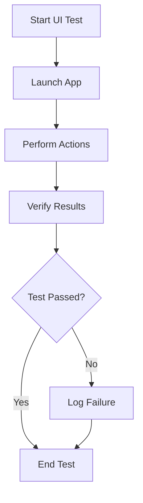

## 17.5 UI Testing and Automation

In the ever-evolving landscape of iOS development, ensuring that your application's user interface (UI) functions as intended is crucial. UI testing and automation play a pivotal role in this process by verifying that your app's UI behaves correctly under various conditions. In this section, we will delve into the world of UI testing and automation using Swift, focusing on the XCUITest framework. This comprehensive guide will equip you with the knowledge and tools needed to master UI testing and automation in your Swift applications.

### Introduction to XCUITest

XCUITest is Apple's official UI testing framework for iOS applications. It is built on top of XCTest, the unit testing framework for Swift and Objective-C. XCUITest allows you to write automated tests that simulate user interactions with your app's UI, ensuring that your app responds correctly to user input.

#### Key Features of XCUITest

- **UI Recording**: XCUITest provides a UI recording feature that allows you to record user interactions and generate test code automatically.
- **Accessibility Testing**: It supports testing for accessibility features, ensuring that your app is usable by everyone, including those with disabilities.
- **User Flow Testing**: XCUITest enables you to test entire user flows, verifying that your app behaves correctly from start to finish.

### Setting Up XCUITest

Before we dive into writing tests, let's set up our environment for XCUITest.

1. **Create a New Test Target**: In Xcode, create a new test target specifically for UI tests. This will separate your UI tests from your unit tests.
2. **Import XCUITest**: Ensure that your test files import the XCUITest framework.

```swift
import XCTest
```

3. **Launch the Application**: Use the `XCUIApplication` class to launch your app in the test environment.

```swift
let app = XCUIApplication()
app.launch()
```

### Recording UI Tests

One of the standout features of XCUITest is its ability to record UI tests. This feature allows you to interact with your app while XCUITest records your actions and generates test code. Let's walk through the process of recording a UI test.

1. **Start Recording**: In Xcode, select the test target and click the record button. This will launch your app in the simulator.
2. **Perform Actions**: Interact with your app as a user would. For example, tap buttons, enter text, and navigate through screens.
3. **Stop Recording**: Once you have completed the desired interactions, stop the recording. XCUITest will generate the corresponding code.

#### Example: Recording a Simple Login Test

Let's say we want to test a login screen. Here's how the recorded code might look:

```swift
func testLogin() {
    let app = XCUIApplication()
    app.launch()

    let usernameTextField = app.textFields["username"]
    usernameTextField.tap()
    usernameTextField.typeText("testuser")

    let passwordSecureTextField = app.secureTextFields["password"]
    passwordSecureTextField.tap()
    passwordSecureTextField.typeText("password123")

    app.buttons["loginButton"].tap()

    XCTAssertTrue(app.staticTexts["Welcome"].exists)
}
```

### Writing UI Tests

While recording tests is a great starting point, writing tests manually gives you more control and flexibility. Let's explore how to write UI tests in XCUITest.

#### Understanding the XCUITest API

- **XCUIApplication**: Represents the app being tested. Use this to launch the app and access its UI elements.
- **XCUIElement**: Represents a UI element in the app, such as a button or text field.
- **XCUIElementQuery**: Allows you to query the app's UI hierarchy to find elements.

#### Example: Writing a Test for a Signup Flow

Suppose we want to test a signup flow. Here's how we might write the test:

```swift
func testSignup() {
    let app = XCUIApplication()
    app.launch()

    let signupButton = app.buttons["signupButton"]
    signupButton.tap()

    let emailTextField = app.textFields["email"]
    emailTextField.tap()
    emailTextField.typeText("test@example.com")

    let passwordSecureTextField = app.secureTextFields["password"]
    passwordSecureTextField.tap()
    passwordSecureTextField.typeText("securePassword")

    let confirmPasswordSecureTextField = app.secureTextFields["confirmPassword"]
    confirmPasswordSecureTextField.tap()
    confirmPasswordSecureTextField.typeText("securePassword")

    app.buttons["submitSignup"].tap()

    XCTAssertTrue(app.staticTexts["Signup Successful"].exists)
}
```

### Testing Accessibility

Accessibility is a crucial aspect of app development. XCUITest allows you to test your app's accessibility features, ensuring that it is usable by everyone, including those with disabilities.

#### Verifying Accessibility Labels

Ensure that all UI elements have appropriate accessibility labels. This helps assistive technologies like VoiceOver describe the elements to users.

```swift
func testAccessibilityLabels() {
    let app = XCUIApplication()
    app.launch()

    let loginButton = app.buttons["loginButton"]
    XCTAssertEqual(loginButton.label, "Login")
}
```

#### Testing Dynamic Type

Verify that your app's UI adapts to different text sizes, as users may adjust the text size for better readability.

```swift
func testDynamicType() {
    let app = XCUIApplication()
    app.launchArguments.append("UI_TEST_DYNAMIC_TYPE")
    app.launch()

    // Verify that the UI adapts to the dynamic type setting
    XCTAssertTrue(app.staticTexts["DynamicTypeLabel"].exists)
}
```

### Best Practices for UI Testing

To ensure effective UI testing, follow these best practices:

- **Keep Tests Independent**: Ensure that each test can run independently of others. This prevents failures in one test from affecting others.
- **Use Accessibility Identifiers**: Assign accessibility identifiers to UI elements for reliable element selection.
- **Avoid Hardcoding Delays**: Instead of hardcoding delays, use expectations to wait for elements to appear.
- **Test on Multiple Devices**: Run tests on different devices and screen sizes to ensure compatibility.

### Automating User Flows

Automating user flows involves testing entire sequences of interactions, verifying that your app behaves correctly from start to finish.

#### Example: Automating a Purchase Flow

Let's automate a purchase flow in an e-commerce app:

```swift
func testPurchaseFlow() {
    let app = XCUIApplication()
    app.launch()

    let productCell = app.cells["ProductCell_0"]
    productCell.tap()

    let addToCartButton = app.buttons["AddToCart"]
    addToCartButton.tap()

    let cartButton = app.buttons["Cart"]
    cartButton.tap()

    let checkoutButton = app.buttons["Checkout"]
    checkoutButton.tap()

    XCTAssertTrue(app.staticTexts["Order Confirmed"].exists)
}
```

### Continuous Integration and UI Testing

Integrating UI tests into your continuous integration (CI) pipeline ensures that your app's UI is tested automatically with every code change.

#### Setting Up CI for UI Testing

1. **Choose a CI Tool**: Select a CI tool that supports Xcode projects, such as Jenkins, Travis CI, or GitHub Actions.
2. **Configure Test Execution**: Set up your CI pipeline to execute UI tests on a simulator or real device.
3. **Analyze Test Results**: Review test results and logs to identify and fix any issues.

### Visualizing UI Testing Workflow

To better understand the UI testing workflow, let's visualize it using a Mermaid.js flowchart:



### Try It Yourself

Now that we've covered the basics of UI testing and automation, it's time to try it yourself. Experiment with the code examples provided, and consider making the following modifications:

- **Add More Test Cases**: Extend the existing tests to cover additional scenarios.
- **Test Edge Cases**: Consider edge cases and unexpected inputs to ensure your app handles them gracefully.
- **Explore Accessibility**: Test your app's accessibility features and make improvements where needed.

### Conclusion

UI testing and automation are essential components of a robust iOS development process. By leveraging the power of XCUITest, you can ensure that your app's UI behaves as expected, providing a seamless user experience. As you continue to explore UI testing, remember to keep experimenting, stay curious, and embrace the journey of mastering Swift development.

## Quiz Time!



### What is XCUITest primarily used for?

- [x] Automating UI tests for iOS applications
- [ ] Writing unit tests for Swift code
- [ ] Testing server-side Swift applications
- [ ] Debugging Swift code

> **Explanation:** XCUITest is primarily used for automating UI tests for iOS applications.

### Which class is used to launch the application in XCUITest?

- [x] XCUIApplication
- [ ] XCTestCase
- [ ] XCUIElement
- [ ] XCUIElementQuery

> **Explanation:** The `XCUIApplication` class is used to launch the application in XCUITest.

### What is the purpose of accessibility identifiers in UI testing?

- [x] To reliably select UI elements during testing
- [ ] To improve app performance
- [ ] To enhance app security
- [ ] To optimize memory usage

> **Explanation:** Accessibility identifiers are used to reliably select UI elements during testing.

### What should you avoid when writing UI tests?

- [x] Hardcoding delays
- [ ] Using accessibility identifiers
- [ ] Testing on multiple devices
- [ ] Keeping tests independent

> **Explanation:** You should avoid hardcoding delays in UI tests.

### What is a best practice for UI testing?

- [x] Keep tests independent
- [ ] Use hardcoded delays
- [ ] Test on a single device
- [ ] Avoid using accessibility identifiers

> **Explanation:** Keeping tests independent is a best practice for UI testing.

### How can you automate user flows in XCUITest?

- [x] By writing tests that simulate entire sequences of interactions
- [ ] By hardcoding delays between actions
- [ ] By using manual testing
- [ ] By avoiding accessibility identifiers

> **Explanation:** Automating user flows involves writing tests that simulate entire sequences of interactions.

### What is the benefit of integrating UI tests into a CI pipeline?

- [x] Ensures UI is tested automatically with every code change
- [ ] Reduces the need for unit tests
- [ ] Increases app performance
- [ ] Eliminates the need for manual testing

> **Explanation:** Integrating UI tests into a CI pipeline ensures that the UI is tested automatically with every code change.

### Which tool can be used for CI with Xcode projects?

- [x] Jenkins
- [ ] Visual Studio
- [ ] Eclipse
- [ ] NetBeans

> **Explanation:** Jenkins is one of the tools that can be used for CI with Xcode projects.

### True or False: XCUITest can only be used for testing iOS applications.

- [x] True
- [ ] False

> **Explanation:** XCUITest is specifically designed for testing iOS applications.

### What is a key feature of XCUITest?

- [x] UI Recording
- [ ] Memory Management
- [ ] Code Compilation
- [ ] Network Monitoring

> **Explanation:** UI Recording is a key feature of XCUITest.


