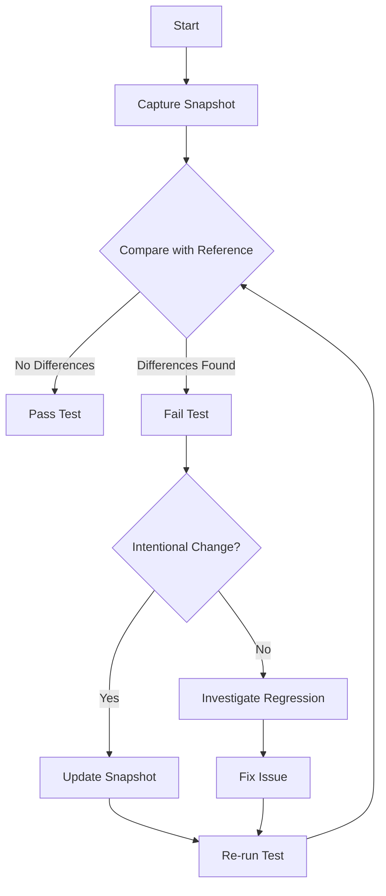

## 17.6 Snapshot Testing

In the realm of software development, particularly in iOS and macOS applications, maintaining the visual integrity of user interfaces (UI) is crucial. Snapshot testing is a powerful technique that helps developers ensure that their UI components remain consistent over time. This section delves into the intricacies of snapshot testing in Swift, providing you with the knowledge and tools to effectively implement this testing method in your projects.

### Introduction to Snapshot Testing

Snapshot testing involves capturing the visual representation of a UI component and comparing it against a previously stored snapshot. This comparison helps detect unintended changes in the UI, ensuring that updates or refactoring do not inadvertently alter the visual appearance of the application.

#### Why Use Snapshot Testing?

- **UI Consistency**: Snapshot testing ensures that the UI remains consistent across different versions of the application.
- **Regression Detection**: It helps identify visual regressions early in the development process.
- **Automated Verification**: Automates the verification of UI changes, reducing the need for manual testing.
- **Documentation**: Serves as a visual documentation of the UI components.

### Key Concepts in Snapshot Testing

Let's explore the fundamental concepts of snapshot testing that will guide you in implementing this technique effectively.

#### Capturing Snapshots

Capturing a snapshot involves rendering a UI component in a specific state and saving its visual representation. This snapshot serves as the baseline for future comparisons.

#### Comparing Snapshots

Once a snapshot is captured, it is compared against a reference snapshot. If any differences are detected, the test fails, indicating a potential unintended change in the UI.

#### Updating Snapshots

When intentional changes are made to the UI, the reference snapshots need to be updated to reflect the new design. This process should be done carefully to ensure that only intended changes are captured.

### Tools and Frameworks for Snapshot Testing in Swift

Several tools and frameworks facilitate snapshot testing in Swift. Let's explore some of the most popular ones.

#### iOSSnapshotTestCase

[iOSSnapshotTestCase](https://github.com/uber/ios-snapshot-test-case) is a popular framework for snapshot testing in iOS. It integrates seamlessly with XCTest, allowing you to write snapshot tests alongside your existing unit tests.

- **Installation**: You can integrate iOSSnapshotTestCase into your project using CocoaPods or Carthage.
- **Usage**: It provides simple APIs to capture and compare snapshots.

```swift
import XCTest
import FBSnapshotTestCase

class MyViewSnapshotTests: FBSnapshotTestCase {

    override func setUp() {
        super.setUp()
        self.recordMode = false // Set to true to record snapshots
    }

    func testMyViewSnapshot() {
        let myView = MyView()
        FBSnapshotVerifyView(myView)
    }
}
```

#### SwiftSnapshotTesting

[SwiftSnapshotTesting](https://github.com/pointfreeco/swift-snapshot-testing) is another powerful framework that supports snapshot testing for both iOS and macOS applications. It offers a flexible API and supports various snapshot formats.

- **Installation**: Available through Swift Package Manager.
- **Usage**: Provides a rich set of APIs for capturing and comparing snapshots.

```swift
import SnapshotTesting
import XCTest

class MyViewSnapshotTests: XCTestCase {

    func testMyViewSnapshot() {
        let myView = MyView()
        assertSnapshot(matching: myView, as: .image)
    }
}
```

### Implementing Snapshot Testing in Swift

Let's walk through the process of implementing snapshot testing in a Swift project, using iOSSnapshotTestCase as an example.

#### Step 1: Set Up the Testing Environment

1. **Install the Framework**: Add iOSSnapshotTestCase to your project using CocoaPods or Carthage.
2. **Configure the Test Target**: Ensure that your test target is configured to include the necessary frameworks.

#### Step 2: Write Snapshot Tests

1. **Create a Test Case**: Subclass `FBSnapshotTestCase` to create your snapshot test case.
2. **Capture Snapshots**: Use `FBSnapshotVerifyView` to capture snapshots of your UI components.

```swift
class MyViewSnapshotTests: FBSnapshotTestCase {

    override func setUp() {
        super.setUp()
        self.recordMode = false
    }

    func testMyViewSnapshot() {
        let myView = MyView()
        FBSnapshotVerifyView(myView)
    }
}
```

#### Step 3: Run and Validate Tests

1. **Run the Tests**: Execute your snapshot tests to capture and compare snapshots.
2. **Validate Results**: Review any test failures to determine if changes are intentional or if they indicate a regression.

#### Step 4: Update Snapshots

1. **Record New Snapshots**: If changes are intentional, set `recordMode` to `true` and run the tests to update the reference snapshots.
2. **Revert Record Mode**: Set `recordMode` back to `false` once snapshots are updated.

### Best Practices for Snapshot Testing

To maximize the effectiveness of snapshot testing, consider the following best practices:

- **Isolate Components**: Test individual components in isolation to ensure accurate snapshots.
- **Use Consistent Environments**: Ensure that tests run in a consistent environment to avoid false positives due to environmental differences.
- **Automate Snapshot Updates**: Use automation tools to streamline the process of updating snapshots.
- **Review Changes Thoroughly**: Carefully review snapshot changes to ensure they are intentional and correct.

### Visualizing the Snapshot Testing Process

To better understand the snapshot testing workflow, let's visualize the process using a flowchart.



**Description**: This flowchart illustrates the snapshot testing process, from capturing snapshots to handling test failures and updating snapshots.

### Try It Yourself

To gain hands-on experience with snapshot testing, try the following exercises:

1. **Modify a UI Component**: Make a small change to a UI component and observe how the snapshot test detects the change.
2. **Add a New Snapshot Test**: Create a snapshot test for a different component in your project.
3. **Experiment with Different Frameworks**: Try using both iOSSnapshotTestCase and SwiftSnapshotTesting to see which one suits your needs better.

### Knowledge Check

Before we wrap up, let's reinforce what we've learned with a few questions:

- What is the primary purpose of snapshot testing?
- How does snapshot testing help in detecting UI regressions?
- What are some popular frameworks for snapshot testing in Swift?
- How do you update snapshots when intentional changes are made to the UI?

### Conclusion

Snapshot testing is a valuable tool in the Swift developer's toolkit, offering a robust way to ensure UI consistency and stability. By capturing and comparing visual snapshots of UI components, developers can detect unintended changes and maintain the visual integrity of their applications. As you continue to explore and implement snapshot testing, remember to follow best practices and leverage the tools and frameworks available to streamline your testing process.

## Quiz Time!



### What is the primary purpose of snapshot testing?

- [x] To ensure UI consistency by capturing and comparing visual snapshots.
- [ ] To test the performance of the application.
- [ ] To validate the functionality of the backend.
- [ ] To check for memory leaks in the application.

> **Explanation:** Snapshot testing is primarily used to ensure UI consistency by capturing and comparing visual snapshots of UI components.

### How does snapshot testing help in detecting UI regressions?

- [x] By comparing current snapshots with reference snapshots to detect unintended changes.
- [ ] By analyzing code coverage metrics.
- [ ] By running performance benchmarks.
- [ ] By executing functional tests.

> **Explanation:** Snapshot testing detects UI regressions by comparing current snapshots with reference snapshots to identify unintended changes.

### Which framework is commonly used for snapshot testing in Swift?

- [x] iOSSnapshotTestCase
- [ ] XCTest
- [ ] SwiftLint
- [ ] Alamofire

> **Explanation:** iOSSnapshotTestCase is a popular framework used for snapshot testing in Swift.

### What should you do if a snapshot test fails due to an intentional UI change?

- [x] Update the reference snapshot to reflect the new design.
- [ ] Ignore the test failure.
- [ ] Revert the UI change.
- [ ] Disable the snapshot test.

> **Explanation:** If a snapshot test fails due to an intentional UI change, you should update the reference snapshot to reflect the new design.

### What is a key benefit of using snapshot testing?

- [x] It automates the verification of UI changes.
- [ ] It improves the application's performance.
- [ ] It reduces the application's memory usage.
- [ ] It enhances the application's security.

> **Explanation:** A key benefit of snapshot testing is that it automates the verification of UI changes, reducing the need for manual testing.

### What is the role of `recordMode` in snapshot testing?

- [x] It determines whether to capture new snapshots or compare against existing ones.
- [ ] It sets the logging level for the tests.
- [ ] It configures the test environment.
- [ ] It specifies the test execution order.

> **Explanation:** `recordMode` determines whether to capture new snapshots or compare against existing ones in snapshot testing.

### Which of the following is a best practice for snapshot testing?

- [x] Isolate components during testing.
- [ ] Test all components together.
- [ ] Use different environments for each test run.
- [ ] Ignore snapshot test failures.

> **Explanation:** A best practice for snapshot testing is to isolate components during testing to ensure accurate snapshots.

### What is the outcome if a snapshot test passes?

- [x] The current snapshot matches the reference snapshot.
- [ ] The application has no memory leaks.
- [ ] The code coverage is 100%.
- [ ] The application performance is optimal.

> **Explanation:** If a snapshot test passes, it means the current snapshot matches the reference snapshot, indicating no unintended UI changes.

### What should you do if a snapshot test fails unexpectedly?

- [x] Investigate the regression to determine the cause of the failure.
- [ ] Update the snapshot without reviewing the changes.
- [ ] Delete the failing test.
- [ ] Ignore the failure and proceed with development.

> **Explanation:** If a snapshot test fails unexpectedly, you should investigate the regression to determine the cause of the failure.

### True or False: Snapshot testing can be used for backend testing.

- [ ] True
- [x] False

> **Explanation:** False. Snapshot testing is primarily used for UI testing, not backend testing.



Remember, this is just the beginning. As you progress, you'll build more complex and interactive applications. Keep experimenting, stay curious, and enjoy the journey!
