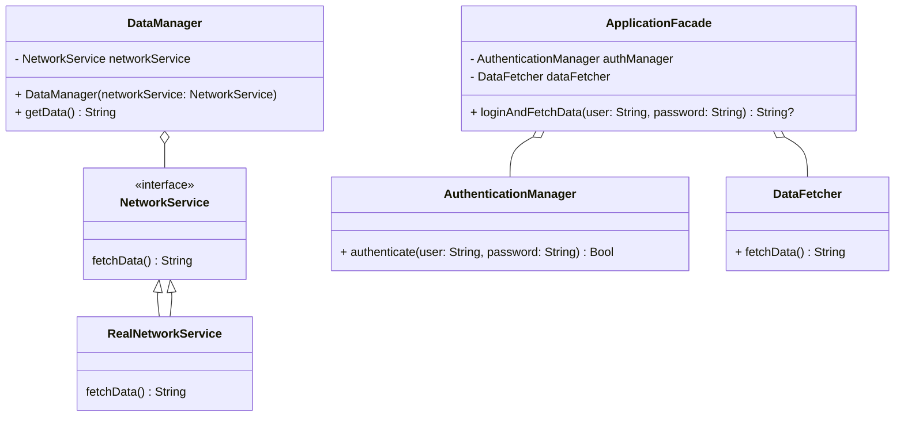

## 17.7 Design Patterns for Testability

In the realm of software development, writing testable code is as crucial as writing functional code. Testability ensures that our code can be efficiently tested to verify its correctness, performance, and reliability. In this section, we will delve into how design patterns can be leveraged to enhance the testability of Swift applications. We will explore key patterns such as Dependency Injection and Facade, and discuss the importance of separating concerns to isolate code under test.

### Understanding Testability

Before diving into specific design patterns, let's first understand what testability means. Testability refers to the ease with which software can be tested. This includes the ability to write tests that are easy to understand, maintain, and execute. Testable code often exhibits the following characteristics:

- **Modularity**: Code is divided into small, independent units that can be tested in isolation.
- **Loose Coupling**: Components are not tightly bound to each other, allowing for easy substitution and mocking.
- **High Cohesion**: Related functionalities are grouped together, making the code more understandable and testable.
- **Separation of Concerns**: Different concerns or responsibilities are separated into distinct sections of code.

### Key Design Patterns for Testability

#### 1. Dependency Injection

**Intent**: The Dependency Injection (DI) pattern involves providing a component with its dependencies from the outside rather than having it create them internally. This pattern promotes loose coupling and enhances testability by allowing dependencies to be easily swapped with mocks or stubs during testing.

**Key Participants**:
- **Service**: The component that requires certain dependencies to function.
- **Injector**: The component responsible for providing the dependencies to the service.

**Applicability**: Use Dependency Injection when you want to decouple components and make them easier to test.

**Sample Code Snippet**:

```swift
// Service protocol
protocol NetworkService {
    func fetchData() -> String
}

// Concrete implementation of NetworkService
class RealNetworkService: NetworkService {
    func fetchData() -> String {
        return "Data from network"
    }
}

// Class that depends on NetworkService
class DataManager {
    private let networkService: NetworkService
    
    // Dependency is injected via initializer
    init(networkService: NetworkService) {
        self.networkService = networkService
    }
    
    func getData() -> String {
        return networkService.fetchData()
    }
}

// Usage
let networkService = RealNetworkService()
let dataManager = DataManager(networkService: networkService)
print(dataManager.getData()) // Output: Data from network
```

**Design Considerations**: DI can be implemented using constructor injection, property injection, or method injection. Constructor injection is generally preferred as it ensures that the dependency is provided at the time of object creation.

**Swift Unique Features**: Swift protocols and generics can be effectively used to implement DI, providing flexibility and type safety.

#### 2. Facade Pattern

**Intent**: The Facade pattern provides a simplified interface to a complex subsystem. It hides the complexities of the subsystem and provides a unified interface to the client.

**Key Participants**:
- **Facade**: The class that provides a simple interface to the complex subsystem.
- **Subsystem Classes**: The classes that perform the actual work behind the scenes.

**Applicability**: Use the Facade pattern when you want to simplify interactions with a complex subsystem and make it easier to test.

**Sample Code Snippet**:

```swift
// Subsystem classes
class AuthenticationManager {
    func authenticate(user: String, password: String) -> Bool {
        // Authentication logic
        return true
    }
}

class DataFetcher {
    func fetchData() -> String {
        // Data fetching logic
        return "Fetched Data"
    }
}

// Facade
class ApplicationFacade {
    private let authManager = AuthenticationManager()
    private let dataFetcher = DataFetcher()
    
    func loginAndFetchData(user: String, password: String) -> String? {
        if authManager.authenticate(user: user, password: password) {
            return dataFetcher.fetchData()
        }
        return nil
    }
}

// Usage
let appFacade = ApplicationFacade()
if let data = appFacade.loginAndFetchData(user: "user", password: "password") {
    print(data) // Output: Fetched Data
}
```

**Design Considerations**: The Facade pattern is useful for reducing dependencies on a complex subsystem, making it easier to test individual components.

**Swift Unique Features**: Swift's extension capabilities can be used to add functionality to the Facade without modifying its source code.

### Separating Concerns for Testability

Separation of concerns is a design principle that involves dividing a program into distinct sections, each addressing a separate concern. This principle is closely related to the Single Responsibility Principle (SRP), which states that a class should have only one reason to change.

**Benefits of Separation of Concerns**:
- **Improved Testability**: Isolated components can be tested independently, leading to more reliable tests.
- **Easier Maintenance**: Changes in one part of the code have minimal impact on other parts.
- **Enhanced Reusability**: Well-separated components can be reused in different contexts.

**Example**: Consider an application that processes user data. By separating the data processing logic from the user interface logic, we can test each part independently.

**Sample Code Snippet**:

```swift
// Data processing logic
class DataProcessor {
    func process(data: String) -> String {
        // Processing logic
        return "Processed \\(data)"
    }
}

// User interface logic
class UserInterface {
    private let dataProcessor: DataProcessor
    
    init(dataProcessor: DataProcessor) {
        self.dataProcessor = dataProcessor
    }
    
    func displayProcessedData(data: String) {
        let processedData = dataProcessor.process(data: data)
        print(processedData)
    }
}

// Usage
let dataProcessor = DataProcessor()
let userInterface = UserInterface(dataProcessor: dataProcessor)
userInterface.displayProcessedData(data: "User Data") // Output: Processed User Data
```

### Visualizing Testability with Design Patterns

To better understand how design patterns enhance testability, let's visualize the interaction between components using a class diagram.



**Diagram Description**: This class diagram illustrates how the `DataManager` and `ApplicationFacade` interact with their respective components. The `DataManager` uses Dependency Injection to obtain a `NetworkService`, while the `ApplicationFacade` simplifies interactions with the `AuthenticationManager` and `DataFetcher`.

### Try It Yourself

Now that we've covered the basics of using design patterns for testability, let's experiment with the code examples provided. Try the following modifications:

- **Modify the `RealNetworkService`** to simulate network failures and observe how it affects the `DataManager`.
- **Create a mock implementation** of the `NetworkService` to test the `DataManager` without relying on actual network calls.
- **Extend the `ApplicationFacade`** to include additional functionalities, such as logging or error handling.

### Knowledge Check

To reinforce your understanding, consider the following questions:

- How does Dependency Injection improve testability?
- What are the benefits of using the Facade pattern in complex systems?
- How can separating concerns lead to more maintainable code?

### Embrace the Journey

Remember, mastering design patterns for testability is a journey. As you continue to explore and apply these patterns, you'll find new ways to enhance the quality and reliability of your Swift applications. Keep experimenting, stay curious, and enjoy the process of building robust, testable software.

## Quiz Time!



### What is the primary benefit of using Dependency Injection in Swift?

- [x] It allows for easy substitution of dependencies during testing.
- [ ] It increases the complexity of the code.
- [ ] It makes the code run faster.
- [ ] It reduces the need for documentation.

> **Explanation:** Dependency Injection allows for easy substitution of dependencies with mocks or stubs during testing, enhancing testability.

### Which pattern provides a simplified interface to a complex subsystem?

- [ ] Dependency Injection
- [x] Facade
- [ ] Singleton
- [ ] Observer

> **Explanation:** The Facade pattern provides a simplified interface to a complex subsystem, making it easier to use and test.

### What is the role of the Injector in the Dependency Injection pattern?

- [x] To provide dependencies to the service.
- [ ] To create a complex subsystem.
- [ ] To simplify user interfaces.
- [ ] To manage authentication.

> **Explanation:** The Injector is responsible for providing dependencies to the service, facilitating loose coupling and testability.

### How does separating concerns improve testability?

- [x] By allowing components to be tested independently.
- [ ] By increasing the complexity of the code.
- [ ] By reducing the number of tests needed.
- [ ] By making the code more difficult to understand.

> **Explanation:** Separating concerns allows components to be tested independently, leading to more reliable and focused tests.

### Which Swift feature is particularly useful for implementing Dependency Injection?

- [ ] Closures
- [x] Protocols
- [ ] Enums
- [ ] Extensions

> **Explanation:** Swift protocols provide flexibility and type safety, making them particularly useful for implementing Dependency Injection.

### What is a common method of implementing Dependency Injection?

- [x] Constructor injection
- [ ] Method overloading
- [ ] Singleton pattern
- [ ] Observer pattern

> **Explanation:** Constructor injection is a common method of implementing Dependency Injection, ensuring dependencies are provided at the time of object creation.

### Why is the Facade pattern useful in testing?

- [x] It reduces dependencies on a complex subsystem.
- [ ] It increases the number of tests needed.
- [ ] It makes the code less modular.
- [ ] It complicates the testing process.

> **Explanation:** The Facade pattern reduces dependencies on a complex subsystem, making it easier to test individual components.

### What does high cohesion in code imply?

- [x] Related functionalities are grouped together.
- [ ] Components are tightly coupled.
- [ ] The code is difficult to test.
- [ ] The code has many dependencies.

> **Explanation:** High cohesion implies that related functionalities are grouped together, making the code more understandable and testable.

### True or False: The Facade pattern is mainly used to increase the performance of a system.

- [ ] True
- [x] False

> **Explanation:** The Facade pattern is mainly used to simplify interactions with a complex subsystem, not to increase performance.

### What is the main purpose of the Facade class?

- [x] To provide a simple interface to a complex subsystem.
- [ ] To manage memory allocation.
- [ ] To handle network requests.
- [ ] To perform data validation.

> **Explanation:** The main purpose of the Facade class is to provide a simple interface to a complex subsystem, making it easier to use and test.




