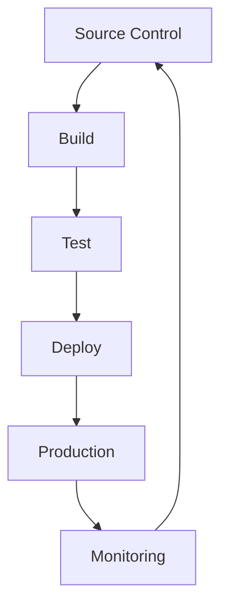

## 17.8 Continuous Integration and Delivery (CI/CD) Practices

In the fast-paced world of software development, ensuring the quality and reliability of your code is paramount. Continuous Integration (CI) and Continuous Delivery (CD) are practices that help developers automate the testing and deployment processes, allowing for faster and more reliable software releases. In this section, we will explore how to set up CI/CD pipelines specifically for Swift development, integrating with popular tools like Jenkins, Travis CI, and CircleCI. By the end of this guide, you will have a comprehensive understanding of how to automate your build processes and maintain high build quality.

### Understanding CI/CD

**Continuous Integration (CI)** is a development practice where developers integrate code into a shared repository frequently, ideally several times a day. Each integration is verified by an automated build and automated tests to detect integration errors as quickly as possible.

**Continuous Delivery (CD)** is a software engineering approach in which teams produce software in short cycles, ensuring that the software can be reliably released at any time. It aims to build, test, and release software with greater speed and frequency.

#### Why CI/CD?

- **Early Detection of Bugs**: CI/CD helps in identifying bugs early in the development cycle, reducing the cost of fixing them.
- **Faster Release Cycles**: Automating the build and deployment process allows for faster and more frequent releases.
- **Improved Collaboration**: With CI/CD, developers can work more collaboratively, as they can see the impact of their changes in real-time.
- **Consistent Builds**: Automation ensures that builds are consistent and reproducible, reducing the risk of "it works on my machine" scenarios.

### Setting Up a CI/CD Pipeline

A CI/CD pipeline is a series of steps that must be performed in order to deliver a new version of software. The pipeline's job is to automate the process of software delivery, allowing teams to focus on improving their product.

#### Key Components of a CI/CD Pipeline

1. **Source Control**: All code changes are tracked in a version control system like Git.
2. **Build**: The code is compiled, and build artifacts are generated.
3. **Test**: Automated tests are run to verify the integrity of the code.
4. **Deploy**: The application is deployed to a production-like environment.

Let's delve into how we can implement these components using popular CI/CD tools.

### Integrating with Jenkins

[Jenkins](https://www.jenkins.io/) is an open-source automation server that enables developers to build, test, and deploy their software.

#### Setting Up Jenkins for Swift

1. **Install Jenkins**: Download and install Jenkins on your server or use a cloud-based solution.
2. **Configure Jenkins**: Set up Jenkins to use your source control system (e.g., GitHub).
3. **Create a Jenkins Pipeline**: Use Jenkins Pipeline DSL to define your build, test, and deploy stages.

```groovy
pipeline {
    agent any
    stages {
        stage('Build') {
            steps {
                // Compile the Swift code
                sh 'swift build'
            }
        }
        stage('Test') {
            steps {
                // Run unit tests
                sh 'swift test'
            }
        }
        stage('Deploy') {
            steps {
                // Deploy to a test environment
                sh './deploy.sh'
            }
        }
    }
}
```

#### Automating Builds with Jenkins

- **Use Jenkinsfile**: Store your pipeline configuration in a `Jenkinsfile` within your repository.
- **Trigger Builds Automatically**: Configure Jenkins to trigger builds on code commits or pull requests.

### Integrating with Travis CI

[Travis CI](https://travis-ci.com/) is a continuous integration service used to build and test software projects hosted on GitHub.

#### Setting Up Travis CI for Swift

1. **Sign Up for Travis CI**: Connect your GitHub account with Travis CI.
2. **Create a `.travis.yml` File**: Define your build and test configurations.

```yaml
language: swift
osx_image: xcode12.5
script:
  - swift build
  - swift test
```

#### Automating Builds with Travis CI

- **Build on Pull Requests**: Travis CI can automatically build and test pull requests.
- **Notifications**: Configure Travis CI to send build notifications via email or Slack.

### Integrating with CircleCI

[CircleCI](https://circleci.com/) is another popular CI/CD tool that automates the software development process using continuous integration and continuous delivery.

#### Setting Up CircleCI for Swift

1. **Sign Up for CircleCI**: Connect your repository to CircleCI.
2. **Create a `config.yml` File**: Define your pipeline configuration.

```yaml
version: 2.1
jobs:
  build:
    macos:
      xcode: "12.5.1"
    steps:
      - checkout
      - run:
          name: Build
          command: swift build
      - run:
          name: Test
          command: swift test
```

#### Automating Builds with CircleCI

- **Parallelism**: CircleCI supports running multiple jobs in parallel, speeding up the build process.
- **Caching**: Use caching to store dependencies and reduce build times.

### Best Practices for CI/CD in Swift Development

1. **Keep Builds Fast**: Optimize your build process to keep it as fast as possible.
2. **Run Tests in Parallel**: Use parallel testing to reduce the time it takes to verify your code.
3. **Use Caching**: Cache dependencies and build artifacts to speed up subsequent builds.
4. **Monitor Build Health**: Regularly monitor your CI/CD pipeline to ensure it is functioning correctly.
5. **Secure Your Pipeline**: Implement security best practices to protect your CI/CD pipeline from unauthorized access.

### Visualizing CI/CD Workflow

Below is a mermaid diagram that illustrates a typical CI/CD workflow:



**Diagram Description**: This diagram represents a typical CI/CD workflow where code changes are pushed to source control, triggering a build. The build is followed by automated tests, and upon successful testing, the code is deployed to production. Monitoring ensures the system is running smoothly, and any issues are fed back into the development cycle.

### Try It Yourself

To get hands-on experience, try setting up a basic CI/CD pipeline for a simple Swift project using one of the tools mentioned above. Experiment by adding more stages, such as linting or security checks, to your pipeline.

### References and Links

- [Jenkins Documentation](https://www.jenkins.io/doc/)
- [Travis CI Documentation](https://docs.travis-ci.com/)
- [CircleCI Documentation](https://circleci.com/docs/)

### Knowledge Check

- What are the key benefits of using CI/CD in software development?
- How can you optimize your CI/CD pipeline for faster builds?
- What security measures should you implement in your CI/CD pipeline?

### Embrace the Journey

Remember, mastering CI/CD practices is a journey. As you progress, you'll discover more advanced techniques and tools that can further enhance your development workflow. Keep experimenting, stay curious, and enjoy the journey!

## Quiz Time!



### What is the primary goal of Continuous Integration (CI)?

- [x] To integrate code into a shared repository frequently with automated testing
- [ ] To deploy code to production automatically
- [ ] To manage project dependencies
- [ ] To write unit tests

> **Explanation:** Continuous Integration focuses on integrating code changes frequently and verifying them with automated tests.

### Which tool is not typically used for CI/CD?

- [ ] Jenkins
- [ ] Travis CI
- [x] Photoshop
- [ ] CircleCI

> **Explanation:** Photoshop is a graphic design tool and is not used for CI/CD.

### What is the purpose of a Jenkinsfile?

- [x] To define a Jenkins pipeline configuration
- [ ] To store project dependencies
- [ ] To write unit tests
- [ ] To deploy code to production

> **Explanation:** A Jenkinsfile contains the pipeline configuration for Jenkins.

### In a CI/CD pipeline, what is the primary purpose of the 'Test' stage?

- [x] To verify the integrity of the code with automated tests
- [ ] To deploy the code to a production environment
- [ ] To compile the code
- [ ] To manage source control

> **Explanation:** The 'Test' stage is used to run automated tests to ensure code quality.

### What does CD in CI/CD stand for?

- [x] Continuous Delivery
- [ ] Continuous Deployment
- [ ] Code Deployment
- [ ] Code Delivery

> **Explanation:** CD stands for Continuous Delivery, which involves automating the release process.

### Which CI/CD tool allows for parallel testing to reduce build time?

- [x] CircleCI
- [ ] Jenkins
- [ ] Travis CI
- [ ] GitHub Actions

> **Explanation:** CircleCI supports parallel testing to speed up the build process.

### What is the purpose of caching in a CI/CD pipeline?

- [x] To store dependencies and build artifacts to speed up builds
- [ ] To save test results
- [ ] To backup source code
- [ ] To deploy code to production

> **Explanation:** Caching stores dependencies and build artifacts to reduce build times.

### Which of the following is a benefit of using CI/CD?

- [x] Faster release cycles
- [ ] Increased manual testing
- [ ] Longer development cycles
- [ ] More complex deployments

> **Explanation:** CI/CD automates processes, leading to faster release cycles.

### True or False: CI/CD can help improve collaboration among developers.

- [x] True
- [ ] False

> **Explanation:** CI/CD improves collaboration by providing real-time feedback on code changes.

### What is the first step in a typical CI/CD pipeline?

- [x] Source Control
- [ ] Build
- [ ] Test
- [ ] Deploy

> **Explanation:** The first step involves tracking code changes in a version control system.


