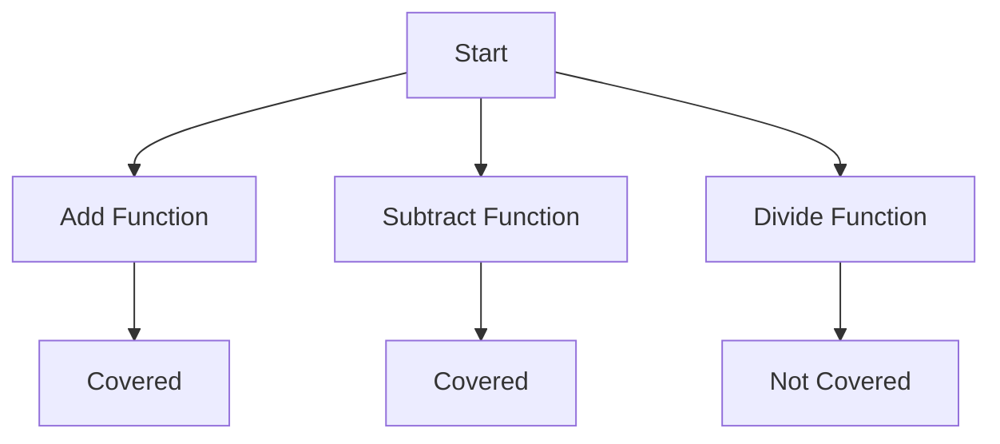

## 17.9 Code Coverage Analysis

In the world of software development, ensuring that your codebase is robust and reliable is paramount. One of the key techniques to achieve this is through effective testing. However, testing alone isn't enough; you need to ensure that your tests are comprehensive and cover all critical parts of your code. This is where **code coverage analysis** comes into play.

### Understanding Code Coverage

**Code coverage** is a metric that measures the percentage of your code that is executed during testing. It provides insights into which parts of your codebase are being tested and which are not, helping you identify gaps in your test suite.

#### Types of Code Coverage

1. **Line Coverage**: Measures the percentage of executed lines of code.
2. **Function Coverage**: Measures the percentage of functions or methods that have been called.
3. **Branch Coverage**: Measures whether each branch (e.g., `if` or `else` statements) has been executed.
4. **Path Coverage**: Measures all possible paths through the code, which is more comprehensive but often impractical for large codebases.

### Why Code Coverage Matters

Code coverage analysis is crucial for several reasons:

- **Identifying Untested Code**: It highlights parts of your code that are not covered by tests, allowing you to improve test coverage.
- **Improving Code Quality**: By ensuring that more of your code is tested, you can catch bugs earlier and improve overall code quality.
- **Facilitating Refactoring**: High code coverage provides confidence that changes won't break existing functionality.
- **Enhancing Maintainability**: Well-tested code is easier to maintain and extend.

### Tools for Code Coverage in Swift

In Swift development, especially with iOS and macOS applications, Xcode provides built-in tools for measuring code coverage. Let's explore how to leverage these tools effectively.

#### Enabling Code Coverage in Xcode

To enable code coverage in Xcode:

1. Open your Xcode project.
2. Go to the **Product** menu.
3. Select **Scheme** > **Edit Scheme**.
4. In the **Test** section, check the **Gather coverage data** option.

#### Generating Code Coverage Reports

Once code coverage is enabled, run your tests. Xcode will generate a code coverage report, which you can view in the **Report Navigator**. This report provides a detailed breakdown of coverage metrics for each file and function.

#### Interpreting Code Coverage Reports

Understanding the code coverage report is critical to identifying gaps and improving test coverage. Here are some key aspects to consider:

- **Coverage Percentage**: Aim for a high percentage, but remember that 100% coverage is not always necessary or practical.
- **Uncovered Code**: Focus on critical parts of your application that remain untested.
- **Complexity**: Pay attention to complex functions or classes with low coverage, as they are more prone to bugs.

### Increasing Code Coverage

Improving code coverage involves writing additional tests to cover untested code. Here are some strategies to achieve this:

#### 1. Write Tests for Edge Cases

Ensure that your tests cover various edge cases and not just the happy paths. This includes testing boundary conditions, error handling, and unexpected inputs.

#### 2. Use Test Doubles

Incorporate test doubles such as mocks, stubs, and fakes to isolate the code under test and focus on specific behaviors.

#### 3. Refactor for Testability

Refactor complex or tightly coupled code to make it more testable. This might involve breaking down large functions or using dependency injection.

#### 4. Prioritize Critical Code

Focus on covering critical parts of your application, such as business logic and areas prone to bugs.

### Code Example: Increasing Code Coverage

Let's consider a simple Swift class and demonstrate how to improve its code coverage.

```swift
class Calculator {
    func add(_ a: Int, _ b: Int) -> Int {
        return a + b
    }

    func subtract(_ a: Int, _ b: Int) -> Int {
        return a - b
    }

    func divide(_ a: Int, _ b: Int) -> Int? {
        guard b != 0 else { return nil }
        return a / b
    }
}
```

#### Initial Test Suite

```swift
import XCTest
@testable import MyApp

class CalculatorTests: XCTestCase {
    var calculator: Calculator!

    override func setUp() {
        super.setUp()
        calculator = Calculator()
    }

    func testAddition() {
        XCTAssertEqual(calculator.add(2, 3), 5)
    }

    func testSubtraction() {
        XCTAssertEqual(calculator.subtract(5, 3), 2)
    }
}
```

#### Improving Coverage

To improve coverage, we need to add tests for the `divide` method, including edge cases.

```swift
func testDivision() {
    XCTAssertEqual(calculator.divide(6, 2), 3)
    XCTAssertNil(calculator.divide(6, 0), "Division by zero should return nil")
}
```

### Visualizing Code Coverage

To better understand code coverage, let's visualize it using a flowchart.



**Description**: This flowchart illustrates which functions in the `Calculator` class are covered by tests and which are not. Initially, the `Divide Function` is not covered, but after adding tests, it becomes covered.

### Common Pitfalls in Code Coverage

While code coverage is a valuable metric, it's important to avoid common pitfalls:

- **Focusing Solely on Coverage Percentage**: High coverage doesn't guarantee high-quality tests. Ensure tests are meaningful and validate correct behavior.
- **Neglecting Test Quality**: Avoid writing superficial tests just to increase coverage. Tests should be comprehensive and cover various scenarios.
- **Ignoring Integration Tests**: Code coverage should include both unit and integration tests to ensure complete coverage.

### Best Practices for Code Coverage

1. **Balance Coverage and Quality**: Strive for high coverage, but prioritize test quality.
2. **Automate Coverage Reports**: Integrate coverage analysis into your CI/CD pipeline for continuous monitoring.
3. **Regularly Review Coverage**: Periodically review and update tests to cover new code and changes.

### Try It Yourself

Experiment with the `Calculator` class by adding more functions and tests. Consider edge cases and scenarios that might not be immediately obvious. For example, add a `multiply` function and test negative numbers.

### Knowledge Check

- What is the primary purpose of code coverage analysis?
- How can you enable code coverage in Xcode?
- Why is it important to focus on test quality in addition to coverage percentage?

### References and Further Reading

- [Apple Developer Documentation: Code Coverage](https://developer.apple.com/documentation/xcode/code_coverage)
- [Swift.org](https://swift.org)
- [Xcode User Guide](https://developer.apple.com/xcode/)

### Embrace the Journey

Remember, mastering code coverage is just one part of becoming a proficient Swift developer. As you continue to learn and grow, you'll find that testing and coverage are integral to building robust, high-quality applications. Keep experimenting, stay curious, and enjoy the journey!

## Quiz Time!



### What is the primary purpose of code coverage analysis?

- [x] To measure the percentage of code executed during tests
- [ ] To improve code readability
- [ ] To increase code execution speed
- [ ] To reduce code complexity

> **Explanation:** Code coverage analysis measures how much of your code is exercised by tests, helping identify untested parts.

### Which type of code coverage measures the percentage of lines executed?

- [x] Line Coverage
- [ ] Function Coverage
- [ ] Branch Coverage
- [ ] Path Coverage

> **Explanation:** Line coverage specifically measures the percentage of lines of code that have been executed during testing.

### What is a common pitfall when focusing solely on code coverage percentage?

- [x] Neglecting test quality
- [ ] Increasing code complexity
- [ ] Reducing test execution time
- [ ] Enhancing code readability

> **Explanation:** Focusing solely on coverage percentage can lead to neglecting the quality and meaningfulness of tests.

### How can you enable code coverage in Xcode?

- [x] By checking the "Gather coverage data" option in the scheme settings
- [ ] By running tests in debug mode
- [ ] By using a third-party plugin
- [ ] By editing the Info.plist file

> **Explanation:** Code coverage is enabled in Xcode by checking the "Gather coverage data" option in the scheme settings.

### What should you prioritize when increasing code coverage?

- [x] Test quality and meaningfulness
- [ ] Test execution speed
- [ ] Code readability
- [ ] Code complexity

> **Explanation:** While increasing coverage is important, ensuring that tests are meaningful and validate correct behavior is crucial.

### Which tool provides built-in support for code coverage in Swift?

- [x] Xcode
- [ ] Visual Studio Code
- [ ] Eclipse
- [ ] IntelliJ IDEA

> **Explanation:** Xcode provides built-in tools for measuring code coverage in Swift development.

### What is an effective strategy to improve code coverage?

- [x] Writing tests for edge cases
- [ ] Reducing code complexity
- [ ] Increasing code execution speed
- [ ] Enhancing code readability

> **Explanation:** Writing tests for edge cases ensures that various scenarios, including boundary conditions and error handling, are covered.

### Which type of code coverage measures all possible paths through the code?

- [x] Path Coverage
- [ ] Line Coverage
- [ ] Function Coverage
- [ ] Branch Coverage

> **Explanation:** Path coverage measures all possible paths through the code, which is more comprehensive than other types.

### Why is it important to include integration tests in code coverage?

- [x] To ensure complete coverage
- [ ] To reduce test execution time
- [ ] To increase code complexity
- [ ] To enhance code readability

> **Explanation:** Including integration tests ensures that interactions between different parts of the code are tested, leading to complete coverage.

### True or False: 100% code coverage guarantees high-quality software.

- [ ] True
- [x] False

> **Explanation:** While high code coverage is beneficial, it does not guarantee high-quality software. Test quality and meaningfulness are also crucial.


