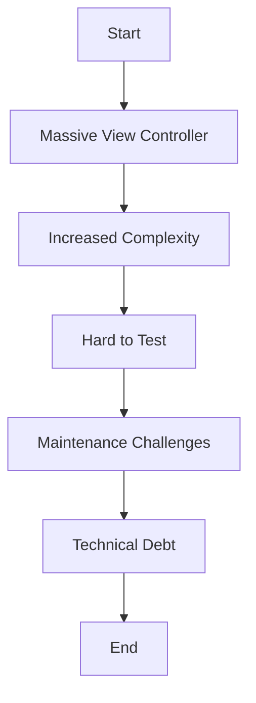

## 18.1 Definition and Impact of Anti-Patterns

In the realm of software development, the term **anti-pattern** describes a common response to a recurring problem that is usually ineffective and risks being highly counterproductive. While design patterns offer proven solutions to common design problems, anti-patterns represent the opposite—they are traps that developers can fall into, leading to code that is difficult to understand, maintain, and extend. Understanding anti-patterns is crucial for any developer aiming to write clean, efficient, and maintainable code.

### Understanding Anti-Patterns

Anti-patterns are essentially poor solutions to common problems. They often arise from a lack of understanding of the problem domain, inadequate design skills, or simply from the pressure to deliver features quickly without considering long-term consequences. Here are some key characteristics of anti-patterns:

- **Recurring Solution**: An anti-pattern is a solution that is applied repeatedly to a problem but consistently fails to produce the desired results.
- **Negative Consequences**: Anti-patterns typically lead to negative outcomes such as increased complexity, reduced performance, and higher maintenance costs.
- **Root Causes**: They often stem from a misunderstanding of the problem, lack of knowledge, or poor design decisions.

### Recognizing the Impact of Anti-Patterns

The impact of anti-patterns can be profound, affecting various aspects of software development:

1. **Maintainability**: Anti-patterns can make codebases difficult to maintain. They often lead to code that is hard to read, understand, and modify, increasing the likelihood of introducing bugs during maintenance.

2. **Scalability**: Poor design choices can hinder the scalability of an application. As the application grows, anti-patterns can lead to performance bottlenecks and make it challenging to add new features.

3. **Collaboration**: Codebases riddled with anti-patterns can be a nightmare for teams. They can lead to misunderstandings, miscommunication, and increased onboarding time for new developers.

4. **Technical Debt**: Anti-patterns contribute significantly to technical debt, which is the implied cost of future refactoring. This debt can accumulate over time, making it increasingly difficult to address without significant investment.

### Common Anti-Patterns in Swift

Let's delve into some common anti-patterns in Swift development, providing examples and explanations to help you identify and avoid them.

#### Massive View Controller

One of the most notorious anti-patterns in iOS development is the **Massive View Controller**. This occurs when a view controller is burdened with too many responsibilities, such as handling UI updates, business logic, and data management.

**Impact**: This anti-pattern leads to bloated and unmanageable view controllers, making it difficult to test and maintain the code.

**Solution**: Apply the **Single Responsibility Principle** by separating concerns. Use design patterns like **MVVM** (Model-View-ViewModel) to delegate responsibilities appropriately.

```swift
// Before: Massive View Controller
class ViewController: UIViewController {
    var data: [String] = []
    
    override func viewDidLoad() {
        super.viewDidLoad()
        fetchData()
        updateUI()
    }
    
    func fetchData() {
        // Fetch data logic
    }
    
    func updateUI() {
        // Update UI logic
    }
}

// After: Using MVVM
class ViewModel {
    var data: [String] = []
    
    func fetchData() {
        // Fetch data logic
    }
}

class ViewController: UIViewController {
    var viewModel = ViewModel()
    
    override func viewDidLoad() {
        super.viewDidLoad()
        viewModel.fetchData()
        updateUI()
    }
    
    func updateUI() {
        // Update UI logic
    }
}
```

#### Retain Cycles and Memory Leaks

Swift uses Automatic Reference Counting (ARC) for memory management. A common anti-pattern is creating retain cycles, which occur when two or more objects hold strong references to each other, preventing ARC from deallocating them.

**Impact**: Retain cycles lead to memory leaks, causing increased memory usage and potential application crashes.

**Solution**: Use **weak** or **unowned** references to break the cycle.

```swift
class Parent {
    var child: Child?
}

class Child {
    weak var parent: Parent? // Use weak to prevent retain cycle
}

let parent = Parent()
let child = Child()
parent.child = child
child.parent = parent
```

#### Force Unwrapping Optionals

Swift's optionals are a powerful feature that allows developers to handle the absence of a value. However, force unwrapping optionals without checking if they contain a value is a common anti-pattern.

**Impact**: Force unwrapping can lead to runtime crashes if the optional is nil.

**Solution**: Use optional binding or nil-coalescing to safely unwrap optionals.

```swift
// Before: Force unwrapping
let name: String? = nil
print(name!) // Runtime crash if name is nil

// After: Safe unwrapping
if let name = name {
    print(name)
} else {
    print("Name is nil")
}
```

### The Importance of Identifying and Addressing Anti-Patterns

Recognizing and addressing anti-patterns is crucial for maintaining a healthy codebase. Here are some strategies to help you tackle anti-patterns effectively:

- **Code Reviews**: Regular code reviews can help identify anti-patterns early. Encourage team members to provide constructive feedback and suggest improvements.
- **Refactoring**: Invest time in refactoring code to eliminate anti-patterns. This can involve redesigning parts of the application to follow best practices and design patterns.
- **Continuous Learning**: Stay updated with the latest Swift features and best practices. Participate in developer communities, attend conferences, and read books on software design.
- **Automated Tools**: Use tools like linters and static analyzers to detect code smells and anti-patterns automatically.
- **Documentation**: Maintain clear and comprehensive documentation to help developers understand the architecture and design decisions.

### Visualizing Anti-Patterns

To better understand the impact of anti-patterns, let's visualize a common scenario using a Mermaid.js diagram.



**Diagram Description**: This flowchart illustrates how a Massive View Controller leads to increased complexity, making it hard to test and maintain, ultimately contributing to technical debt.

### Try It Yourself

Experiment with the code examples provided. Try modifying the ViewModel to include more complex data fetching logic or refactor a sample project to eliminate retain cycles. Observe how these changes improve code readability and maintainability.

### Knowledge Check

- Can you identify an anti-pattern in your current project?
- How would you refactor a massive view controller to improve its maintainability?
- What tools can you use to detect retain cycles in your Swift code?

### Embrace the Journey

Remember, identifying and addressing anti-patterns is a continuous journey. As you gain more experience, you'll become adept at recognizing these pitfalls and implementing effective solutions. Keep experimenting, stay curious, and enjoy the process of refining your craft.

## Quiz Time!



### What is an anti-pattern?

- [x] A common but ineffective solution to a recurring problem
- [ ] A proven solution to a recurring problem
- [ ] A design pattern used in Swift
- [ ] A type of software bug

> **Explanation:** An anti-pattern is a common response to a recurring problem that is usually ineffective and risks being highly counterproductive.

### Why are anti-patterns problematic?

- [x] They lead to code that is difficult to maintain and extend
- [ ] They are always the best solution to a problem
- [ ] They improve code readability
- [ ] They enhance code performance

> **Explanation:** Anti-patterns often result in code that is hard to maintain, understand, and extend, leading to increased complexity and technical debt.

### What is a common consequence of the Massive View Controller anti-pattern?

- [x] Increased complexity and maintenance challenges
- [ ] Improved testability
- [ ] Enhanced performance
- [ ] Simplified code structure

> **Explanation:** The Massive View Controller anti-pattern leads to increased complexity, making the code harder to maintain and test.

### How can retain cycles be avoided in Swift?

- [x] By using weak or unowned references
- [ ] By using strong references
- [ ] By ignoring memory management
- [ ] By using force unwrapping

> **Explanation:** Weak or unowned references should be used to break retain cycles and prevent memory leaks.

### Which of the following is a safe way to unwrap optionals in Swift?

- [x] Optional binding
- [ ] Force unwrapping
- [x] Nil-coalescing
- [ ] Ignoring the optional

> **Explanation:** Optional binding and nil-coalescing are safe ways to unwrap optionals, preventing runtime crashes.

### What is a key strategy for identifying anti-patterns?

- [x] Regular code reviews
- [ ] Ignoring code smells
- [ ] Avoiding refactoring
- [ ] Using force unwrapping

> **Explanation:** Regular code reviews help identify anti-patterns early and provide opportunities for improvement.

### How does the Massive View Controller anti-pattern affect testability?

- [x] It makes the code harder to test
- [ ] It improves testability
- [ ] It has no impact on testability
- [ ] It simplifies testing

> **Explanation:** The Massive View Controller anti-pattern increases complexity, making the code harder to test.

### What is the impact of technical debt on a project?

- [x] It increases future refactoring costs
- [ ] It reduces maintenance costs
- [ ] It improves code quality
- [ ] It eliminates bugs

> **Explanation:** Technical debt represents the implied cost of future refactoring and can make changes more expensive over time.

### How can developers stay updated with best practices?

- [x] Participating in developer communities
- [ ] Ignoring new Swift features
- [ ] Avoiding conferences
- [ ] Disregarding documentation

> **Explanation:** Engaging with developer communities, attending conferences, and reading up-to-date resources help developers stay informed about best practices.

### True or False: Anti-patterns are beneficial for code maintainability.

- [ ] True
- [x] False

> **Explanation:** Anti-patterns negatively impact code maintainability by introducing complexity and technical debt.


