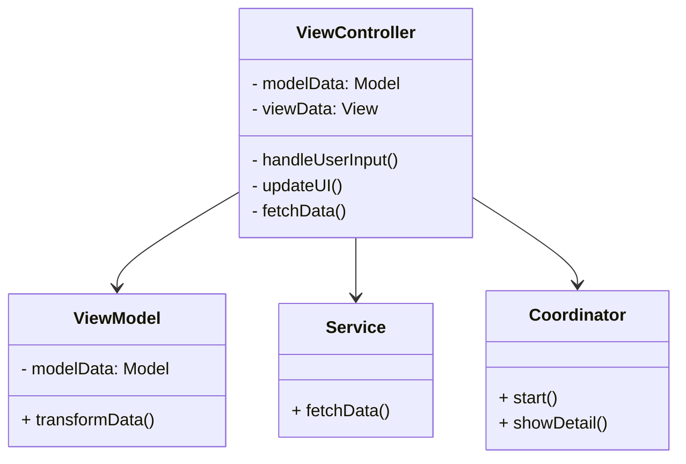

## 18.2.1 Massive View Controller

In the realm of iOS development, the Massive View Controller (MVC) anti-pattern is a common pitfall that many developers encounter. This issue arises when view controllers become bloated with too much responsibility, making the codebase difficult to maintain, test, and extend. In this section, we'll delve into the causes of the Massive View Controller anti-pattern, explore its consequences, and provide strategies to refactor and distribute responsibilities effectively.

### Understanding the Massive View Controller Anti-Pattern

The Massive View Controller problem typically emerges in iOS applications that follow the Model-View-Controller (MVC) architecture. While MVC is a powerful design pattern, it can lead to view controllers taking on too many roles, such as managing the view hierarchy, handling user interactions, performing data formatting, and even managing business logic.

#### How the Anti-Pattern Arises

1. **Over-Reliance on MVC**: Developers often rely heavily on view controllers to manage both the view and the model, leading to a lack of separation of concerns.
2. **Lack of Clear Boundaries**: Without clear boundaries between the model, view, and controller, view controllers end up doing more than they should.
3. **Rapid Prototyping**: In the rush to prototype features, it's easy to add functionality directly to view controllers, leading to clutter.
4. **Complex UI Logic**: Handling complex UI logic directly in view controllers can lead to large, unwieldy classes.
5. **Data Handling**: View controllers often manage data fetching and parsing, which should ideally be handled by separate components.

### Consequences of the Massive View Controller

- **Difficult Maintenance**: Large view controllers are hard to read, understand, and modify.
- **Poor Testability**: Testing view controllers becomes challenging due to their size and complexity.
- **Reduced Reusability**: Code within massive view controllers is often tightly coupled, reducing opportunities for reuse.
- **Slower Development**: Adding new features or fixing bugs takes longer due to the complexity of the codebase.

### Strategies for Refactoring Massive View Controllers

To combat the Massive View Controller anti-pattern, it's essential to refactor your codebase to promote separation of concerns and distribute responsibilities across different components. Here are some effective strategies:

#### 1. Use of View Models

Implementing the Model-View-ViewModel (MVVM) pattern can help separate the presentation logic from the view controller. The view model handles the business logic and data transformation, leaving the view controller to manage only the view.

```swift
// ViewModel.swift
class UserViewModel {
    private var user: User

    init(user: User) {
        self.user = user
    }

    var displayName: String {
        return "\\(user.firstName) \\(user.lastName)"
    }

    var ageText: String {
        return "Age: \\(user.age)"
    }
}

// ViewController.swift
class UserViewController: UIViewController {
    var viewModel: UserViewModel!

    override func viewDidLoad() {
        super.viewDidLoad()
        // Use viewModel to configure the view
        nameLabel.text = viewModel.displayName
        ageLabel.text = viewModel.ageText
    }
}
```

#### 2. Delegate and DataSource Patterns

Utilize delegate and data source patterns to offload responsibilities from the view controller. For example, table view data source methods can be implemented in separate classes.

```swift
// TableViewDataSource.swift
class TableViewDataSource: NSObject, UITableViewDataSource {
    var items: [String]

    init(items: [String]) {
        self.items = items
    }

    func tableView(_ tableView: UITableView, numberOfRowsInSection section: Int) -> Int {
        return items.count
    }

    func tableView(_ tableView: UITableView, cellForRowAt indexPath: IndexPath) -> UITableViewCell {
        let cell = tableView.dequeueReusableCell(withIdentifier: "Cell", for: indexPath)
        cell.textLabel?.text = items[indexPath.row]
        return cell
    }
}

// ViewController.swift
class ViewController: UIViewController {
    @IBOutlet weak var tableView: UITableView!
    var dataSource: TableViewDataSource!

    override func viewDidLoad() {
        super.viewDidLoad()
        dataSource = TableViewDataSource(items: ["Item 1", "Item 2", "Item 3"])
        tableView.dataSource = dataSource
    }
}
```

#### 3. Use of Coordinators

Coordinators manage navigation flow and can help reduce the responsibility of view controllers by handling the presentation of other view controllers.

```swift
// Coordinator.swift
protocol Coordinator {
    func start()
}

class MainCoordinator: Coordinator {
    var navigationController: UINavigationController

    init(navigationController: UINavigationController) {
        self.navigationController = navigationController
    }

    func start() {
        let viewController = ViewController()
        viewController.coordinator = self
        navigationController.pushViewController(viewController, animated: true)
    }

    func showDetail() {
        let detailViewController = DetailViewController()
        navigationController.pushViewController(detailViewController, animated: true)
    }
}

// ViewController.swift
class ViewController: UIViewController {
    weak var coordinator: MainCoordinator?

    @IBAction func showDetailTapped(_ sender: UIButton) {
        coordinator?.showDetail()
    }
}
```

#### 4. Extracting Business Logic

Move business logic to separate service or manager classes. This makes the code more modular and easier to test.

```swift
// UserService.swift
class UserService {
    func fetchUserData(completion: @escaping (User) -> Void) {
        // Fetch user data from network or database
        let user = User(firstName: "John", lastName: "Doe", age: 30)
        completion(user)
    }
}

// ViewController.swift
class ViewController: UIViewController {
    var userService: UserService!

    override func viewDidLoad() {
        super.viewDidLoad()
        userService.fetchUserData { user in
            // Update UI with user data
        }
    }
}
```

### Swift Unique Features for Refactoring

Swift offers several unique features that can aid in refactoring massive view controllers:

- **Extensions**: Use extensions to organize code into logical sections without creating additional subclasses.
- **Protocols and Protocol Extensions**: Define shared behavior across different classes without inheritance.
- **Generics**: Create reusable components that work with any type, reducing code duplication.
- **Closures**: Use closures to encapsulate functionality that can be passed around and reused.

### Differences and Similarities with Other Patterns

While the Massive View Controller anti-pattern is specific to the MVC architecture, similar issues can arise in other patterns if responsibilities are not clearly defined. For example, in MVVM, the view model can become massive if it takes on too much responsibility. The key is to maintain clear boundaries and responsibilities across all components.

### Try It Yourself

To solidify your understanding, try refactoring a simple iOS application with a massive view controller. Start by identifying sections of code that can be moved to view models, delegate classes, or service classes. Experiment with the coordinator pattern to manage navigation flow. As you refactor, consider how each change affects the maintainability and testability of your code.

### Visualizing the Problem

Below is a Mermaid.js diagram illustrating the typical structure of a Massive View Controller and how responsibilities can be distributed across different components.



### Knowledge Check

- **What are the main causes of the Massive View Controller anti-pattern?**
- **How can the MVVM pattern help in addressing the Massive View Controller problem?**
- **What role do coordinators play in managing view controllers?**
- **How can Swift's unique features aid in refactoring massive view controllers?**

### Embrace the Journey

Refactoring massive view controllers is a crucial step towards building scalable and maintainable iOS applications. Remember, this is just the beginning. As you progress, you'll develop a deeper understanding of design patterns and how they can be applied to create robust applications. Keep experimenting, stay curious, and enjoy the journey!

## Quiz Time!



### What is a primary cause of the Massive View Controller anti-pattern?

- [x] Over-reliance on MVC architecture
- [ ] Lack of UI components
- [ ] Excessive use of protocols
- [ ] Using too many view models

> **Explanation:** The Massive View Controller anti-pattern often arises due to over-reliance on the MVC architecture, where view controllers take on too many responsibilities.

### Which pattern helps separate presentation logic from the view controller?

- [x] MVVM
- [ ] Singleton
- [ ] Factory
- [ ] Observer

> **Explanation:** The MVVM pattern separates presentation logic from the view controller by using view models.

### What is a benefit of using the Coordinator pattern?

- [x] It manages navigation flow, reducing view controller responsibilities.
- [ ] It enhances data storage capabilities.
- [ ] It simplifies UI design.
- [ ] It eliminates the need for view models.

> **Explanation:** The Coordinator pattern manages navigation flow, which helps reduce the responsibilities of view controllers.

### How can business logic be extracted from a view controller?

- [x] By moving it to service or manager classes
- [ ] By embedding it in the view
- [ ] By using more view controllers
- [ ] By increasing the use of closures

> **Explanation:** Business logic can be extracted from a view controller by moving it to separate service or manager classes.

### What Swift feature can help organize code without creating subclasses?

- [x] Extensions
- [ ] Generics
- [ ] Closures
- [ ] Enums

> **Explanation:** Extensions in Swift can be used to organize code into logical sections without creating additional subclasses.

### Which of the following is NOT a consequence of the Massive View Controller?

- [x] Faster development
- [ ] Difficult maintenance
- [ ] Poor testability
- [ ] Reduced reusability

> **Explanation:** Faster development is not a consequence of the Massive View Controller; in fact, it often leads to slower development due to complexity.

### What role do protocols play in refactoring view controllers?

- [x] They define shared behavior across different classes.
- [ ] They increase the size of view controllers.
- [ ] They replace view controllers entirely.
- [ ] They are used for data storage.

> **Explanation:** Protocols define shared behavior across different classes, helping in refactoring and reducing the size of view controllers.

### Which pattern is commonly used to manage data fetching and parsing?

- [x] Service or manager classes
- [ ] Observer pattern
- [ ] Factory pattern
- [ ] Decorator pattern

> **Explanation:** Service or manager classes are commonly used to manage data fetching and parsing, keeping it separate from view controllers.

### True or False: The MVVM pattern can lead to massive view models if not properly managed.

- [x] True
- [ ] False

> **Explanation:** True. Just like view controllers, view models can become massive if they take on too much responsibility without clear boundaries.

### What is a key benefit of refactoring a massive view controller?

- [x] Improved maintainability and testability
- [ ] Increased application size
- [ ] More complex codebase
- [ ] Slower performance

> **Explanation:** Refactoring a massive view controller improves maintainability and testability, making the codebase easier to work with.




