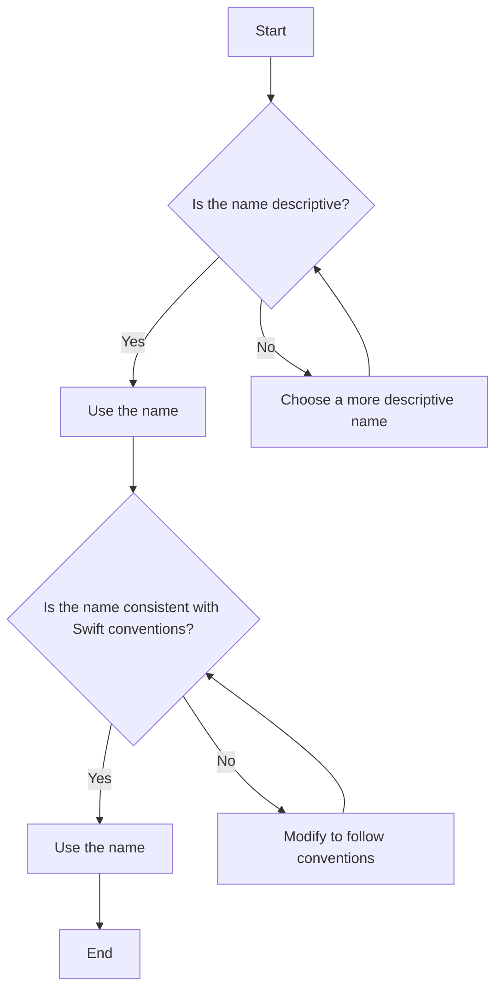

## 18.2.10 Poor Naming Conventions

In the realm of software development, naming conventions play a crucial role in ensuring code readability and maintainability. In Swift, as in any programming language, poor naming conventions can lead to confusion, errors, and increased technical debt. This section delves into the impact of poor naming conventions, the importance of adhering to Swift's naming guidelines, and best practices for naming in Swift.

### Understanding the Impact of Poor Naming Conventions

Poor naming conventions can significantly hinder a developer's ability to understand and maintain code. Let's explore some of the key impacts:

1. **Reduced Readability**: Unclear or inconsistent names make it difficult for developers to quickly understand the purpose of a variable, function, or class. This can slow down the development process and increase the likelihood of errors.

2. **Increased Maintenance Costs**: Code that is hard to read is also hard to maintain. Developers may spend more time deciphering poorly named elements, leading to increased costs in terms of time and resources.

3. **Higher Error Rates**: When names do not accurately reflect their purpose, developers are more likely to misuse them, leading to bugs and errors in the codebase.

4. **Decreased Collaboration**: In a team environment, poor naming conventions can create friction and misunderstandings among team members, making collaboration more challenging.

### Adhering to Swift Naming Conventions

Swift has a set of established naming conventions designed to promote clarity and consistency. By adhering to these conventions, developers can improve the quality of their code. Here are some key guidelines:

- **Use Descriptive Names**: Choose names that clearly describe the purpose of the variable, function, or class. For example, use `calculateTotalPrice` instead of `calcTP`.

- **Follow CamelCase for Functions and Variables**: In Swift, function and variable names should use camelCase. For example, `calculateTotalPrice` is preferred over `CalculateTotalPrice`.

- **Use PascalCase for Types and Protocols**: Class, struct, enum, and protocol names should use PascalCase. For example, `ShoppingCart` and `PaymentProcessor`.

- **Avoid Abbreviations**: While abbreviations can save time, they often reduce clarity. Use full words unless the abbreviation is widely recognized, such as `URL` or `ID`.

- **Be Consistent**: Consistency is key to maintaining readability. If you choose a naming pattern, stick with it throughout your codebase.

- **Prefix Boolean Variables with Is, Has, or Can**: This makes it clear that the variable represents a boolean value. For example, `isUserLoggedIn`, `hasAccess`, `canEdit`.

### Code Examples

Let's look at some examples to illustrate these concepts:

#### Poor Naming Example

```swift
// Poorly named variables and functions
var tp: Double = 0.0
var usr: String = "John Doe"

func calcTP(prices: [Double]) -> Double {
    var sum: Double = 0.0
    for p in prices {
        sum += p
    }
    return sum
}
```

#### Improved Naming Example

```swift
// Well-named variables and functions
var totalPrice: Double = 0.0
var userName: String = "John Doe"

func calculateTotalPrice(for prices: [Double]) -> Double {
    var sum: Double = 0.0
    for price in prices {
        sum += price
    }
    return sum
}
```

### Visualizing Naming Conventions

To better understand the impact of naming conventions, let's visualize the process of naming variables and functions in Swift:



### Key Participants in Naming Conventions

1. **Developers**: Responsible for choosing clear and consistent names.
2. **Code Reviewers**: Ensure adherence to naming conventions during code reviews.
3. **Team Leads**: Establish and enforce naming guidelines within the team.

### Applicability of Naming Conventions

Naming conventions are applicable across all areas of Swift development, including:

- **iOS and macOS Apps**: Ensuring code clarity and maintainability.
- **Server-Side Swift**: Facilitating collaboration and reducing errors.
- **SwiftUI and Combine**: Improving readability and reducing cognitive load.

### Design Considerations

When choosing names, consider the following:

- **Audience**: Who will read and maintain the code? Choose names that are intuitive for your target audience.
- **Scope**: Consider the scope of the variable or function. Use more descriptive names for global variables and less descriptive names for local variables.
- **Context**: Use the context to inform naming decisions. For example, in a networking module, use names like `fetchData` or `sendRequest`.

### Swift Unique Features

Swift's type inference and optional types can influence naming conventions. For example, when dealing with optionals, consider using names that reflect the possibility of a nil value:

```swift
var userName: String? // Indicates that userName can be nil
```

### Differences and Similarities with Other Languages

Swift naming conventions share similarities with other languages like Java and C#, but there are also differences. For instance, Swift's use of camelCase for function names is similar to Java, while its emphasis on clarity and avoiding abbreviations sets it apart from languages like C.

### Try It Yourself

To solidify your understanding of naming conventions, try modifying the following code to adhere to Swift's guidelines:

```swift
// Original code
var num: Int = 10
func fnc() {
    print("Hello, World!")
}

// Suggested modifications
// - Rename 'num' to a more descriptive name
// - Rename 'fnc' to reflect its purpose
```

### Knowledge Check

To test your understanding, consider the following questions:

1. Why is it important to use descriptive names in Swift?
2. What are the benefits of following Swift naming conventions?
3. How can poor naming conventions impact code maintainability?

### Embrace the Journey

Remember, adopting good naming conventions is a journey. As you practice and refine your skills, you'll find that your code becomes more readable, maintainable, and enjoyable to work with. Keep experimenting with different naming strategies, stay curious, and enjoy the process of becoming a more effective Swift developer!

## Quiz Time!



### Why is it important to use descriptive names in Swift?

- [x] To improve code readability and maintainability
- [ ] To make the code look more complex
- [ ] To reduce the number of lines of code
- [ ] To make the code run faster

> **Explanation:** Descriptive names improve code readability and maintainability, making it easier for developers to understand and work with the code.

### What is the recommended naming convention for functions in Swift?

- [x] camelCase
- [ ] PascalCase
- [ ] snake_case
- [ ] UPPERCASE

> **Explanation:** Functions in Swift should use camelCase, which is a common convention for function names in many programming languages.

### Which of the following is a poor naming practice?

- [x] Using abbreviations that are not widely recognized
- [ ] Using descriptive names
- [ ] Following Swift naming conventions
- [ ] Using camelCase for variables

> **Explanation:** Using abbreviations that are not widely recognized can reduce code clarity and make it harder for others to understand the code.

### What prefix is recommended for boolean variables in Swift?

- [x] is, has, or can
- [ ] do, make, or create
- [ ] get, set, or put
- [ ] run, execute, or perform

> **Explanation:** Prefixing boolean variables with is, has, or can makes it clear that the variable represents a boolean value.

### Which of the following is a benefit of adhering to Swift naming conventions?

- [x] Improved collaboration among team members
- [ ] Increased code complexity
- [x] Reduced likelihood of errors
- [ ] Faster code execution

> **Explanation:** Adhering to naming conventions improves collaboration and reduces errors by making code more understandable and consistent.

### What is a key impact of poor naming conventions?

- [x] Increased maintenance costs
- [ ] Faster development time
- [ ] Improved code readability
- [ ] Enhanced performance

> **Explanation:** Poor naming conventions can lead to increased maintenance costs due to the difficulty in understanding and maintaining the code.

### How can poor naming conventions affect collaboration?

- [x] By creating friction and misunderstandings among team members
- [ ] By making code easier to understand
- [x] By reducing code readability
- [ ] By improving code consistency

> **Explanation:** Poor naming conventions can create misunderstandings, reducing collaboration effectiveness.

### What should be considered when choosing names for variables and functions?

- [x] Audience and context
- [ ] Code length
- [ ] Execution speed
- [ ] Compiler version

> **Explanation:** Audience and context are important factors to consider to ensure names are intuitive and relevant.

### True or False: Swift's naming conventions are identical to those of Java.

- [ ] True
- [x] False

> **Explanation:** While Swift shares some similarities with Java, such as camelCase for functions, it emphasizes clarity and avoiding abbreviations, which may differ from Java conventions.

### What is a common mistake when naming variables in Swift?

- [x] Using non-descriptive names
- [ ] Using camelCase
- [ ] Using PascalCase for classes
- [ ] Using full words instead of abbreviations

> **Explanation:** Non-descriptive names make it difficult to understand the purpose of a variable, leading to reduced code readability.


