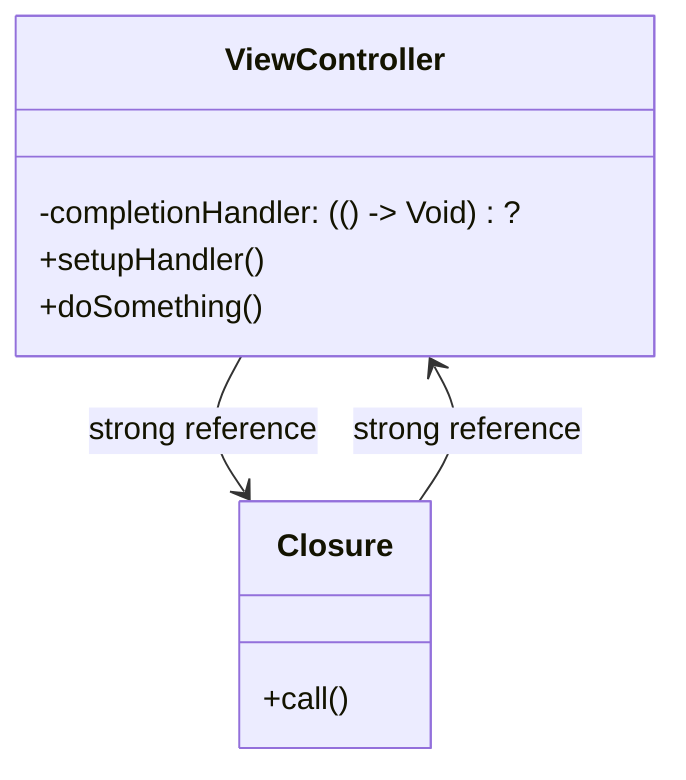

## 18.2.2 Retain Cycles and Memory Leaks

In the realm of Swift programming, understanding memory management is crucial for developing efficient and robust applications. One of the most common pitfalls developers encounter is the retain cycle, which can lead to memory leaks. In this section, we will delve into the intricacies of retain cycles and memory leaks, explore common scenarios where they occur, and provide techniques to avoid them using `weak` and `unowned` references.

### Understanding Retain Cycles

A retain cycle occurs when two or more objects hold strong references to each other, preventing them from being deallocated. This situation leads to memory leaks, as the memory occupied by these objects is never released. In Swift, Automatic Reference Counting (ARC) manages memory by automatically increasing the reference count of an object when it is referenced and decreasing it when the reference is removed. However, ARC cannot resolve retain cycles on its own.

#### How Retain Cycles Occur

Retain cycles often occur in the following scenarios:

1. **Closures**: Closures capture and store references to variables and objects from their surrounding context. If a closure captures a reference to an object that also holds a reference to the closure, a retain cycle is created.

2. **Delegation**: The delegation pattern is widely used in Swift, where one object delegates responsibility to another. If the delegate holds a strong reference back to the delegating object, a retain cycle can occur.

#### Code Example: Retain Cycle with Closures

Let's consider a simple example of a retain cycle involving a closure:

```swift
class ViewController: UIViewController {
    var completionHandler: (() -> Void)?

    func setupHandler() {
        completionHandler = {
            print("Handler called")
            // Retain cycle: self is captured strongly by the closure
            self.doSomething()
        }
    }

    func doSomething() {
        print("Doing something")
    }
}
```

In this example, the `completionHandler` closure captures `self` strongly, creating a retain cycle. As a result, the `ViewController` instance will not be deallocated, leading to a memory leak.

### Common Scenarios Leading to Retain Cycles

#### Closures and Capturing Self

Closures are a common source of retain cycles in Swift. When a closure captures `self`, it increments the reference count of the object, potentially leading to a retain cycle if `self` also holds a reference to the closure.

#### Delegation and Strong References

In the delegation pattern, a delegate object is often retained by the delegating object. If the delegate also retains the delegating object, a retain cycle is formed. This is particularly common in UI components where a view controller delegates tasks to a view or a model.

#### Strongly Retained Collections

Collections such as arrays, dictionaries, and sets can also lead to retain cycles if they hold strong references to their elements, which in turn hold strong references back to the collection.

### Techniques to Avoid Retain Cycles

To prevent retain cycles, Swift provides two types of weak references: `weak` and `unowned`.

#### Using Weak References

A `weak` reference does not increase the reference count of the object it refers to. When the object is deallocated, the `weak` reference is automatically set to `nil`. This is useful when the reference might become `nil` during its lifetime.

```swift
class ViewController: UIViewController {
    var completionHandler: (() -> Void)?

    func setupHandler() {
        // Use weak self to avoid retain cycle
        completionHandler = { [weak self] in
            guard let self = self else { return }
            print("Handler called")
            self.doSomething()
        }
    }

    func doSomething() {
        print("Doing something")
    }
}
```

In this example, `self` is captured weakly within the closure, breaking the retain cycle and allowing the `ViewController` instance to be deallocated when no longer needed.

#### Using Unowned References

An `unowned` reference also does not increase the reference count of the object. However, unlike `weak`, it assumes the object will always be valid during the reference's lifetime. Attempting to access an `unowned` reference after the object has been deallocated will result in a runtime crash.

```swift
class ViewController: UIViewController {
    var completionHandler: (() -> Void)?

    func setupHandler() {
        // Use unowned self when you are sure self will not be nil
        completionHandler = { [unowned self] in
            print("Handler called")
            self.doSomething()
        }
    }

    func doSomething() {
        print("Doing something")
    }
}
```

Use `unowned` references when you are certain that the object will outlive the reference, such as in parent-child relationships where the parent always outlives the child.

### Visualizing Retain Cycles

Let's visualize a retain cycle using a class diagram to better understand how objects are interlinked.



This diagram illustrates a retain cycle where the `ViewController` holds a strong reference to a `Closure`, and the `Closure` holds a strong reference back to the `ViewController`.

### Best Practices for Avoiding Retain Cycles

1. **Always Use `[weak self]` or `[unowned self]` in Closures**: When capturing `self` in closures, use `[weak self]` or `[unowned self]` to prevent retain cycles.

2. **Delegate with Weak References**: Always declare delegate properties as `weak` to avoid retain cycles.

3. **Avoid Strongly Retained Collections**: Be cautious with collections that hold strong references to their elements. Consider using `NSPointerArray`, `NSMapTable`, or `NSHashTable` for weakly retained collections.

4. **Regularly Profile Your Application**: Use Xcode's Instruments to profile your application and detect memory leaks. The Leaks and Allocations instruments are particularly useful for identifying retain cycles.

5. **Test and Refactor**: Regularly test your code for memory leaks and refactor as necessary to eliminate retain cycles.

### Try It Yourself

To solidify your understanding of retain cycles and memory leaks, try modifying the code examples provided:

- **Experiment with removing `[weak self]`** from the closure in the `ViewController` example and observe the behavior of the application.
- **Refactor the delegation pattern** to use a `weak` reference for the delegate property and verify that the retain cycle is resolved.
- **Profile a simple application** using Xcode's Instruments to identify any potential memory leaks.

### Conclusion

Understanding and avoiding retain cycles is crucial for developing efficient and robust Swift applications. By leveraging `weak` and `unowned` references, you can effectively manage memory and prevent leaks. Remember to regularly profile your applications and refactor code to ensure optimal memory usage.

## Quiz Time!



### What is a retain cycle?

- [x] A situation where two or more objects hold strong references to each other, preventing deallocation.
- [ ] A method for increasing the performance of Swift applications.
- [ ] A design pattern used to manage memory in Swift.
- [ ] A type of error that occurs during compilation.

> **Explanation:** A retain cycle occurs when two or more objects hold strong references to each other, preventing them from being deallocated, which leads to memory leaks.

### How can you avoid retain cycles when using closures?

- [x] By using `[weak self]` or `[unowned self]` in closures.
- [ ] By using strong references in closures.
- [ ] By avoiding the use of closures altogether.
- [ ] By using global variables instead of closures.

> **Explanation:** Using `[weak self]` or `[unowned self]` in closures helps to prevent retain cycles by not increasing the reference count of the captured object.

### What happens to a `weak` reference when the object it points to is deallocated?

- [x] It is automatically set to `nil`.
- [ ] It throws a runtime error.
- [ ] It remains pointing to the deallocated memory.
- [ ] It becomes a strong reference.

> **Explanation:** A `weak` reference is automatically set to `nil` when the object it points to is deallocated, preventing access to invalid memory.

### What is the difference between `weak` and `unowned` references?

- [x] `Weak` references can be set to `nil`, whereas `unowned` references assume the object will always be valid.
- [ ] `Unowned` references can be set to `nil`, whereas `weak` references assume the object will always be valid.
- [ ] Both `weak` and `unowned` references increase the reference count of the object.
- [ ] There is no difference between `weak` and `unowned` references.

> **Explanation:** `Weak` references can become `nil` when the object is deallocated, while `unowned` references assume the object will always be valid and can lead to a crash if accessed after deallocation.

### When should you use an `unowned` reference?

- [x] When you are certain the object will outlive the reference.
- [ ] When you want to increase the reference count of the object.
- [ ] When you are unsure about the object's lifecycle.
- [ ] When you want to prevent the object from being deallocated.

> **Explanation:** Use `unowned` references when you are certain that the object will always be valid during the reference's lifetime, such as in parent-child relationships.

### Which tool in Xcode can help you identify memory leaks?

- [x] Instruments
- [ ] Interface Builder
- [ ] Swift Compiler
- [ ] Debug Navigator

> **Explanation:** Xcode's Instruments, particularly the Leaks and Allocations instruments, can help identify memory leaks and retain cycles in your application.

### What is a common source of retain cycles in Swift?

- [x] Closures capturing `self` strongly.
- [ ] Using global variables.
- [ ] Declaring variables as `let`.
- [ ] Using primitive data types.

> **Explanation:** Closures capturing `self` strongly is a common source of retain cycles, as it increases the reference count of the object.

### How can you resolve a retain cycle caused by delegation?

- [x] By declaring the delegate property as `weak`.
- [ ] By declaring the delegate property as `strong`.
- [ ] By avoiding the use of delegation.
- [ ] By using global variables instead of delegates.

> **Explanation:** Declaring the delegate property as `weak` prevents retain cycles by not increasing the reference count of the delegate object.

### True or False: Retain cycles can lead to memory leaks.

- [x] True
- [ ] False

> **Explanation:** True. Retain cycles prevent objects from being deallocated, leading to memory leaks.

### Which of the following is a best practice for avoiding retain cycles?

- [x] Regularly profile your application for memory leaks.
- [ ] Avoid using closures and delegates.
- [ ] Use strong references everywhere.
- [ ] Never use `weak` or `unowned` references.

> **Explanation:** Regularly profiling your application for memory leaks is a best practice to identify and resolve retain cycles.


